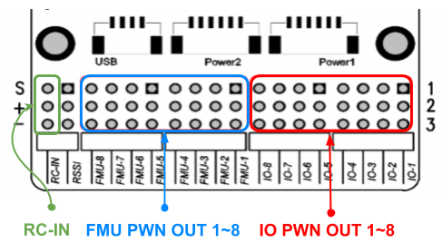

# Pix32 v5 Wiring Quick Start

> **Warning** PX4 不生产这款且也不生产任何自动驾驶仪。 若需要硬件支持或咨询合规问题，请联系 [制造商](https://shop.holybro.com/)。

This quick start guide shows how to power the [Holybro Pix32v5](../flight_controller/holybro_pix32_v5.md)&reg; flight controller and connect its most important peripherals.

## Unboxing

Pix32 v5 is sold bundled with a number of different combinations of accessories, including the *pix32 v5 Base board*, power module *PM02 V3*, and the [Pixhawk 4 GPS/Compass](https://shop.holybro.com/pixhawk-4-gps-module_p1094.html) (UBLOX NEO-M8N).

The content of the box with the *PM02 V3* power module and *Pixhawk 4 GPS/Compass* is shown below. The box also includes a pinout guide and power module instructions, and Base board (not shown on the schematic below).

## 接线图概述

下图展示了如何连接最重要的传感器和外围设备（电机和伺服舵机输出除外）。 我们将在下面各节中介绍它们的细节。

> **Tip** More information about available ports can be found [here](http://www.holybro.com/manual/Holybro_PIX32-V5_PINOUTS_V1.1.pdf).

## 飞控的安装和方向

*Pix32 v5*  should be mounted on the frame positioned as close to your vehicle’s center of gravity as possible, oriented top-side up with the arrow pointing towards the front of the vehicle.

> **Note** 如果无法以推荐/默认方向安装控制器（例如，由于空间限制），则需要以实际使用的方向配置自动驾驶仪参数：[飞控的安装方向](../config/flight_controller_orientation.md)。

> **Tip** The board has internal vibration-isolation. Do not use vibration-isolation foam to mount the controller (double sided tape is normally sufficient).

## GPS + 指南针 + 蜂鸣器 + 安全开关 + LED

Pix32 v5 is designed to work well with the [Pixhawk 4 GPS module](https://shop.holybro.com/pixhawk-4-gps-module_p1094.html), which has an integrated compass, safety switch, buzzer and LED. It connects directly to the [GPS port](../flight_controller/holybro_pix32_v5.md#gps) using the 10 pin cable.

GPS/罗盘在安装时应尽可能远离其他电子元器件，方向标记朝向飞行器前方(将罗盘和其他电子元器件分开可以减少干扰)。

> **Note** GPS模块内集成的安全开关 *默认是启用的*（当启用时，PX4将不会让您解锁飞行器）。 如需关闭安全开关，请按住安全开关1秒钟。 您可以在完成任务后再次按下安全开关以启用并锁定飞行器 （因为这是出于安全考虑的机制，无论出于何种原因，您将无法通过遥控器或地面站来远程解锁您的载具）。

## 电源

You can use a power module or power distribution board to power motors/servos and measure power consumption. The recommended power modules are shown below.

### PM02 v3 Power Module

The [Power Module (PM02 v3)](https://shop.holybro.com/power-modulepm02-v3_p1185.html) can be bundled with *pix32 v5*. It provides regulated power to flight controller and sends battery voltage/current to the flight controller.

Connect the output of the *Power Module* as shown.

- PM voltage/current port: connect to POWER1 port (or `POWER2`) using the 6-wire GH cable supplied.
- PM input (XT60 male connector): connect to the LiPo battery (2~12S).
- PM power output (XT60 female connector): wire out to any motor ESCs.

> **Note** As this power module does not include power distribution wiring, you would normally just connect all the ESCs in parallel to the power module output (the ESC must be appropriate for the supplied voltage level).

> **Note** The 8 pin power (+) rail of **MAIN/AUX** is not powered by the power module supply to the flight controller. If it will need to be separately powered in order to drive servos for rudders, elevons etc., the power rail needs to be connected to a BEC equipped ESC or a standalone 5V BEC or a 2S LiPo battery. Ensure the voltage of servo you are going to use is appropriate.

The power module has the following characteristics/limits:
- Max input voltage: 60V
- Max current sensing: 120A Voltage
- Current measurement configured for SV ADC Switching regulator outputs 5.2V and 3A max
- Weight: 20g
- Package includes:
  - PM02 board
  - 6pin MLX cable (1)
  - 6pin GH cable (1)

> **Note** See also [PM02v3 Power Module Manual](http://www.holybro.com/manual/Holybro_PM02_v3_PowerModule_Manual.pdf) (Holybro).

### Battery Configuration

The battery/power setup must be configured in [Power Settings](../config/battery.md). For either Power Module you will need to configure the *Number of Cells*.

You will not need to update the *voltage divider* unless you are using some other power module (e.g. the one from the Pixracer).

## 遥控器

如果你想*手动*控制你的飞机，你需要一个遥控器（PX4在自动飞行模式可以不需要遥控器）。

您需要 [选择一个兼容的发射/接收机](../getting_started/rc_transmitter_receiver.md) 并 *对频* 使它们能够通信 (对频方法参考发射/接收机的说明书)。

The instructions below show how to connect the different types of receivers to *Pix32 v5* with Baseboard:

- Spektrum/DSM receivers connect to the [DSM RC](../flight_controller/holybro_pix32_v5.md#dsm-rc-port) input.

  

- PPM and S.Bus receivers connect to the [SBUS_IN/PPM_IN](../flight_controller/holybro_pix32_v5.md#rc-in) input port (marked as RC IN)

  

- PPM 和 *每个通道有单独连接线* 的 PWM 接收机需要连接在 **PPM RC** 端口，PWM信号需要通过一个[类似这样的](http://www.getfpv.com/radios/radio-accessories/holybro-ppm-encoder-module.html)* PPM 编码器*（PPM-Sum 接收机只需要一根信号线就包含所有通道）。

更多有关遥控器系统选择、接收机兼容性和遥控器接收机对频绑定的详细信息，请参阅：[遥控器发射机&接收器](../getting_started/rc_transmitter_receiver.md)。

## Telemetry Radios (Optional)

遥测无线电台可用于地面站的通信和飞行控制 (例如, 您可以指定无人机飞行至特定位置, 或上传新的任务)。

机载端的无线数传模块应连接到 **TELEM1** 端口，如下所示（如果连接到此端口，则无需进一步配置）。 数传电台中的另一个应该连接到您的地面站电脑或者移动设备上（通常是通过USB接口）。

## SD 卡

SD卡通常用来 [记录并分析飞行数据](../getting_started/flight_reporting.md)。 A micro SD card should come preinstalled on the pix32 v5, if you have your own micro SD card, insert the card into *pix32 v5* as shown below.

> **Tip** The SanDisk Extreme U3 32GB is [highly recommended](../dev_log/logging.md#sd-cards).

## 电机

Motors/servos control signals are connected to the **I/O PWM OUT** (**MAIN**) and **FMU PWM OUT** (**AUX**) ports in the order specified for your vehicle in the [Airframe Reference](../airframes/airframe_reference.md).

  

The motors must be separately [powered](#power).

> **Note** If your frame is not listed in the airframe reference then use a "generic" airframe of the correct type.

## 其它外设

针对可选/非通用组件的接线与配置，在 [外围设备](../peripherals/README.md) 独立主题中有详细的内容介绍。

## 针脚定义

[Pix32 v5 Pinouts](http://www.holybro.com/manual/Holybro_PIX32-V5_PINOUTS_V1.1.pdf) (Holybro)

## 配置

一般配置信息在以下内容中介绍:
Autopilot 配置 </0 >。
 

QuadPlane的特定配置在以下内容中介绍：[QuadPlane VTOL Configuration](../config_vtol/vtol_quad_configuration.md)。

<!-- Nice to have detailed wiring infographic and instructions for different vehicle types. --> 

## 更多信息

- [Pix32 v5 Overview](../flight_controller/holybro_pix32_v5.md) (Overview page)
- [Pix32 v5 Technical Data Sheet](http://www.holybro.com/manual/Holybro_PIX32-V5_technical_data_sheet_v1.1.pdf)
- [Pix32 v5 Pinouts](http://www.holybro.com/manual/Holybro_PIX32-V5_PINOUTS_V1.1.pdf)
- [Pix32 v5 Base Schematic Diagram](http://www.holybro.com/manual/Holybro_PIX32-V5-BASE-Schematic_diagram.pdf)
- [Pix32 v5 Base Components Layout](http://www.holybro.com/manual/Holybro_PIX32-V5-BASE-ComponentsLayout.pdf)
- FMUv5参考设计</0 >。</li> </ul>
