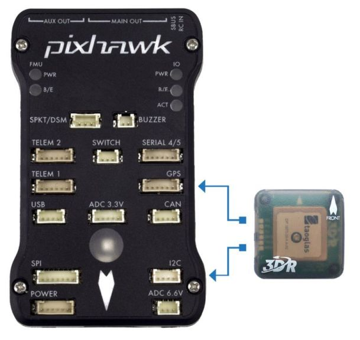

# Pixhawk快速使用指导

> **Warning** PX4 does not manufacture this (or any) autopilot. Contact the [manufacturer](https://store.mrobotics.io/) for hardware support or compliance issues.

此快速入门指南演示如何为 * 3DR Pixhawk * 飞行控制器供电并连接其最重要的外围配件设备。

> **Note** The [3DR Pixhawk](https://dev.px4.io/hardware-pixhawk.html) is no longer available from 3DR. Other flight controllers based on the [Pixhawk FMUv2 architecture](../flight_controller/pixhawk_series.md) are available from other companies (these share the same connections, outputs, functions, etc. and are wired in a similar way).

## 接线介绍

下面的图片显示标准的 Pixhawk 连接 (除了电机和控制信号输出)。 我们将在下面各节中介绍每个主要部分。

  

> **Note** More detailed wiring information is [shown below](#detailed-wiring-infographic-copter).

## 飞控的安装和方向

应使用减震泡沫垫 (包括在配件中) 将 * Pixhawk * 安装在机架上。 It should be positioned as close to your vehicle’s center of gravity as possible, oriented top-side up with the arrow points towards the front of the vehicle.

> **Note** If the controller cannot be mounted in the recommended/default orientation (e.g. due to space constraints) you will need to configure the autopilot software with the orientation that you actually used: [Flight Controller Orientation](../config/flight_controller_orientation.md).

## 蜂鸣器与安全开关

连接附带的蜂鸣器和安全开关, 如下所示 (这些都是强制性的)。

## GPS + 罗盘

使用套件中提供的6线电缆连接GPS(必须) 到GPS端口。 可以选择将使用4线电缆将罗盘连接到I2C端口(Pixhawk有外部罗盘，必要时可以使用)。

> **Note** The diagram shows a combined GPS and Compass. The GPS/Compass should be mounted on the frame as far away from other electronics as possible, with the direction marker towards the front of the vehicle (separating the compass from other electronics will reduce interference).

## 电源

使用6线电缆将连接 *Power module* (PM) 电源模块连接到 **POWER**电源接口。 PM输入连接到您的锂电池，电池输出主要为飞行器ESCs/电机供电(可能通过分线板)。

电源模块为飞行控制器提供电源，并通过模块发送电流和电压信息(包括向飞行控制器和电机等供电)。

> **Warning** The power module supplies the flight controller itself, but cannot power servos and other hardware connected to the controller's output ports (rail). For copter this does not matter because the motors are separately powered.

对于飞机和VTOL，输出电路需要单独供电为了驱动电机的方向和升降。 通常主要的推拉电机使用集成 [BEC](https://en.wikipedia.org/wiki/Battery_eliminator_circuit) 的ESC控制，ESC可以连接到Pixhawk的输出电路。 如果没有，您需要将一个5V BEC连接到Pixhawk的空闲端口(没有电源，伺服电机将不会工作)。

<!-- It would be good to have real example of this powering -->

## 无线电遥控

如果你想*手动* 控制你的飞行器，你需要一个遥控器（PX4在自动飞行模式可以不需要遥控器）。

你需要[选择一个兼容的发射机/接收机](../getting_started/rc_transmitter_receiver.md)，并*对好频* 以便它们能够正常通信（对频方法参考您的特定遥控器与接收机附带的说明书）。

下面的说明演示如何将不同类型的接收机连接到 Pixhawk:

- Spektrum and DSM 接收机连接到 **SPKT/DSM** 输入端口。 

- PPM-SUM and S.BUS 接收机连接到如图所示的 **RC** 地线、电源线和信号线。 

- PPM and PWM 接收机有 *每个通道单独的连接线* 必须连接在 **RC** 端口，*通过一个[类似这样的](http://www.getfpv.com/radios/radio-accessories/holybro-ppm-encoder-module.html) PPM 编码器* (PPM-Sum 接收机每个通道使用单独的信号线).

更多有关遥控器系统选择、接收机兼容性和遥控器接收机对频绑定的详细信息, 请参阅: 遥控器发射机&接收器 </0 >。
 

## 数传电台（可选）

数传电台可用于地面站的通信和飞行控制 (例如, 您可以指定无人机飞行至特定位置, 或上传新的任务)。 如下图所示是数传连接到飞行器的方式。 另一个数传连接到你的地面站电脑或移动设备(通常使用USB)。

<!-- what configuration is required once you've set up a radio) -->

## 电机

在[Airframe Reference](../airframes/airframe_reference.md)中列出了支持所有飞行或地面机型的MAIN/AUX 输出端口映射和电机/伺服电机。

> **Caution** The mapping is not consistent across frames (e.g. you can't rely on the throttle being on the same output for all plane frames). Make sure to use the correct mapping for your vehicle.

> **Tip** If your frame is not listed in the reference then use a "generic" airframe of the correct type.

> **Note** The output rail must be separately powered, as discussed in the [Power](#power) section above.

<!-- INSERT image of the motor AUX/MAIN ports? -->

## 其它外设

针对可选/非通用组件的接线与配置，在 [外围设备](../peripherals/README.md) 主题中有详细的内容介绍。

## 配置

一般配置信息在以下内容中介绍：[Autopilot 配置](../config/README.md)。

QuadPlane的特定配置在以下内容中介绍：[QuadPlane VTOL Configuration](../config_vtol/vtol_quad_configuration.md)

<!-- what about config of other vtol types and plane. Do the instructions in these ones above apply for tailsitters etc? -->

## 详细接线示意图(直升机)。

## 更多信息

- [Pixhawk 系列](../flight_controller/pixhawk_series.md)
- [3DR Pixhawk](../flight_controller/pixhawk.md)