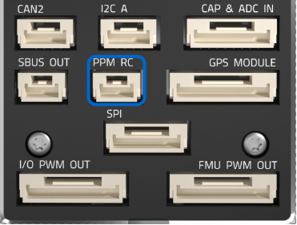

# Pixhawk 4 接线快速入门

本快速入门指南演示如何为 [Pixhawk 4](../flight_controller/pixhawk4.md) 飞行控制器供电，并连接其最重要的外围设备。

## 接线图概览

下图展示了如何连接最重要的传感器和外围设备 (电机和伺服舵机输出除外)。 我们将在下面各节中介绍它们的细节。

> **Tip** 有关更多可用端口的详细信息, 请参阅此处: Pixhawk 4 > 连接 </1 >。
 </blockquote> 
> 
> ## 飞控的安装和方向
> 
> 应使用减震泡沫垫 (包括在配件中) 将 *Pixhawk 4* 安装在机架上。 应该尽可能接近飞机的重心位置，正面朝上，方向箭头与飞机机头一致朝前
> 
> 
> 
> > **Note** 如果飞行控制器无法安装在推荐的默认方向 (例如, 由于空间限制), 则需要根据实际安装的方向来配置自动驾驶仪软件: [飞行控制器方向 ](../config/flight_controller_orientation.md)参数。
> 
> ## GPS + 指南针 + 蜂鸣器 + 安全开关 + LED
> 
> 将所提供的集成指南针、安全开关、蜂鸣器和 LED 的 GPS 模块连接到 **GPS MODULE** 接口。
> 
> GPS/指南针模块应尽可能安装在远离其他电子设备的位置上, 方向标记朝向载具的前面 (将指南针与其他电子设备分离将有助于减少干扰)。
> 
> 
> 
> > **Note** GPS模块内集成的安全开关*默认情况下 *是启用的 (启用后, PX4不会让您解锁飞控)。 如需关闭安全开关，请按住安全开关1秒钟。 你可以在完成任务后再次按下安全开关以启用并锁定载具 (因为这是处于安全考虑的机制，无论出于何种原因，您将无法通过遥控器或地面站来远程解锁您的载具。)
> 
> ## 电源
> 
> 使用6PIN线材将套件中附带的 *电源管理板* (pm板) 的输出连接到 *Pixhawk 4 * 的其中一个 **POWER** 端口。 电源管理板的 **2~12S** 输入将连接到您的锂电池。 下表解释了电源管理板的连接, 包括动力电源与 esc电调和伺服舵机的信号连接。 请注意，电源管理板不通过 **FMU PWM-OUT</0 > 的 + 和 - 引脚为伺服舵机供电。
 
> 
> 下图显示了 *Pixhawk 4* 所提供的电源管理板接线方式。
> 
> 
> 
> > **Note** 如果配置为固定翼或无人车, 飞控 **FMU MAIN OUT** 8个输出端口的 power (+) 正极线束将要进行独立供电 ，以保障方向舵、升降舵等伺服舵机的正常驱动。 为此，独立供电的正极线束需要连接到一个BEC，如具备BEC独立5V输出的ESC电调或者一个2SLiPo电池。 请注意你要在这里使用的伺服舵机的工作电压。
> 
> | 针脚&连接器      | 功能                                                                     |
> | ----------- | ---------------------------------------------------------------------- |
> | I/O PWM-IN  | 参考下面 *Pixhawk 4* 的连接                                                   |
> | M1          | I/O PWM OUT 1：将信号线连接到到电机 1 的电调信号                                       |
> | M2          | I/O PWM OUT 2: 将信号线连接到到 motor 2 的ESC电调信号                               |
> | M3          | I/O PWM OUT 3: 将信号线连接到到 motor 3 的ESC电调信号                               |
> | M4          | I/O PWM OUT 4: 将信号线连接到到 motor 4 的ESC电调信号                               |
> | M5          | I/O PWM OUT 5: 将信号线连接到到 motor 5 的ESC电调信号                               |
> | M6          | I/O PWM OUT 6: 将信号线连接到到 motor 6 的ESC电调信号                               |
> | M7          | I/O PWM OUT 7: 将信号线连接到到 motor 7 的ESC电调信号                               |
> | M8          | I/O PWM OUT 8: 将信号线连接到到 motor 8 的ESC电调信号                               |
> | FMU PWM-IN  | 参考下面 *Pixhawk 4* 的连接                                                   |
> | FMU PWM-OUT | 如果 FMU PWM-IN连接到 < 0>Pixhawk 4 </em>, 则将信号线连接到 ESC电调或将信号，+，-线路连接到伺服舵机。 |
> | CAP&ADC-OUT | 连接到*Pixhawk 4*的CAP & ADC IN端口。                                         |
> | CAP&ADC-IN  | CAP&ADC 输入: 针脚打印显示在电路板的背面                                              |
> | B+          | 连接到 ESC电调B+以为 ESC电调供电                                                  |
> | GND         | 连接到 ESC电调负极                                                            |
> | PWR1        | 5V 3A 输出，连接到 *Pixhawk 4* 的POWER 1                                      |
> | PWR2        | 5V 3A输出, 连接到 *Pixhawk 4 * 的POWER 2                                     |
> | 2~12S       | 电源输入，连接到12~S的LiPo电池                                                    |
> 
> > **Note** 根据您所使用的机身类型，参考 [Airframe Reference](../airframes/airframe_reference.md) 连接*Pixhawk 4* 的 **I/O PWM OUT** 和 **FMU PWM OUT** 接口到电源管理板。 PX4 固件中的 **MAIN** 输出映射到 *Pixhawk 4 * 的 **I/O PWM OUT </0 > 端口，而PX4 固件中的 **AUX outputs** 输出映射到*Pixhawk 4 * 的 **FMU PWM OUT </0 > 端口。 例如, **MAIN1** 映射到 **I/O PWM OUT </0 > 的IO_CH1 引脚， **AUX1** 映射到 ** FMU PWM OUT </0 > 的FMU_CH1引脚。 PMB电源管理板的 **FMU PWM-IN** 内部是连接到 **FMU PWM-OUT**的，为了独立供电方便驱动伺服舵机 (e.g. 副翼, 升降, 航向, 补助翼, 起落架, 襟翼, 云台, 转向). PMB电源管理板的 **I/O PWM-IN** 内部是连接到 **M1-8**，用于驱动电机 (e.g. Plane, VTOL 或者Rover中的油门通道).
 </blockquote> 
> > 
> > 下表总结了如何将 *Pixhawk 4* 的pwm-out 端口连接到电源管理板的 pwm-in 端口, 具体取决于机身参考。
> > 
> > | 机架参考        | *Pixhawk 4 *-> 电源管理板之间的连接  |
> > | ----------- | -------------------------- |
> > | **MAIN**：电机 | I/O PWM OUT --> I/O PWM IN |
> > | **MAIN**：舵机 | I/O PWM OUT --> FMU PWM IN |
> > | **AUX**：电机  | FMU PWM OUT --> I/O PWM IN |
> > | **AUX**：舵机  | FMU PWM OUT --> FMU PWM IN |
> > 
> > <!--In the future, when Pixhawk 4 kit is available, add wiring images/videos for different airframes.-->
> > 
> > *Pixhawk 4* 的电源端口针脚定义如下所示。 电流信号应接入0-3.3V 电压且0-120A 电流的模拟信号。 The VOLTAGE signal should carry an analog voltage from 0-3.3V for 0-60V as default. Vcc 线路必须提供至少持续3A电流, 并应默认为 5.1V电压。 低于5V的电压仍然是可以接受的, 但不推荐。
> > 
> > | 针脚   | 信号  | 电压    |
> > | ---- | --- | ----- |
> > | 1（红） | VCC | +5V   |
> > | 2（黑） | VCC | +5V   |
> > | 3（黑） | 电流  | +3.3V |
> > | 4（黑） | 电压  | +3.3V |
> > | 5（黑） | GND | GND   |
> > | 6（黑） | GND | GND   |
> > 
> > > **Note**使用套件中附带的电源模块, 您需要在 "2>电源设置 </2 >中配置" 电池片数 </em>参数，但您不需要校准 *voltage divider* 参数。 如果您使用的是任何其他电源模块 (例如, 来自 pixracer 的电源模块), 则必须更新校准 *voltage divider* 参数。
> > 
> > ## 无线电遥控
> > 
> > 如果你想*手动* 控制你的飞行器，你需要一个遥控器（PX4在自动飞行模式可以不需要遥控器）。
> > 
> > 你需要[一个兼容的发射/接收机](../getting_started/rc_transmitter_receiver.md)，并*对好频*（对频方法参考说明书）。
> > 
> > 下面的说明演示如何将不同类型的接收机连接到 *Pixhawk 4 *:
> > 
> > - Spektrum/DSM 或者 S.BUS 接收机连接到 **DSM/SBUS RC** 输入端口。
> >     
> >     
> > 
> > - PPM 接收机连接到 **PPM RC</0 > 输入端口。
 
> >     
> >     </li> 
> >     
> >     - PWM 接收机为每个独立的通道配备了独立的连接线，需要通过一个*PPM编码器, 连接到 **PPM RC** 输入端口 *[ ，比如这个](http://www.getfpv.com/radios/radio-accessories/holybro-ppm-encoder-module.html)。</ul> 
> >     
> >     更多有关遥控器系统选择、接收机兼容性和遥控器接收机对频绑定的详细信息, 请参阅: 遥控器发射机&接收器 </0 >。
 
> >     
> >     ## 数传电台（可选）
> >     
> >     遥测无线电台可用于地面站的通信和飞行控制 (例如, 您可以指定无人机飞行至特定位置, 或上传新的任务)。
> >     
> >     机载端的无线数传模块应连接到 **TELEM1** 端口，如下所示 (如果连接到此端口, 则无需进一步配置)。 另一个匹配的地面端数传电台应该连接到您的地面站电脑或者移动设备上(通常是通过USB接口)。
> >     
> >     
> >     
> >     ## SD 卡（可选）
> >     
> >     SD卡通常是用来 [记录并分析飞行数据](../getting_started/flight_reporting.md). 将内存卡 (包含在 Pixhawk 套件中) 插入 *Pixhawk 4 * 中，如下所示。
> >     
> >     
> >     
> >     > **Tip** The SanDisk Extreme U3 32GB is [highly recommended](https://dev.px4.io/master/en/log/logging.html#sd-cards) (Developer Guide).
> >     
> >     ## 电机
> >     
> >     电机和舵机按照 [机架参考列表](../airframes/airframe_reference.md) 中为您的飞机指定的顺序连接至 **I/O PWM OUT** (**MAIN**) 和 **FMU PWM OUT** (**AUX**) 端口。
> >     
> >     > 本参考列出了所有支持的空中和地面机架的接口与电机/舵机的映射关系（如果你的机架没有在参考列表里，你可以使用对应类型的“通用”机架）。
> >     
> >     

> >     
> >     > **Caution** 该参考列表并不是与机架类型完全匹配的。(e.g.您不能依赖于所有的飞机类型都能够有相同的油门值输出。) 请确保为您的载具使用正确的配置方式。
> >     
> >     ## 其它外设
> >     
> >     针对可选/非通用组件的接线与配置，在 [外围设备](../peripherals/README.md) 独立主题中有详细的内容介绍。
> >     
> >     ## Pinouts
> >     
> >     [Pixhawk 4 Pinouts](http://www.holybro.com/manual/Pixhawk4-Pinouts.pdf) (Holybro)
> >     
> >     ## Configuration
> >     
> >     General configuration information is covered in: [Autopilot Configuration](../config/README.md).
> >     
> >     QuadPlane specific configuration is covered here: [QuadPlane VTOL Configuration](../config_vtol/vtol_quad_configuration.md)
> >     
> >     <!-- what about config of other vtol types and plane. Do the instructions in these ones above apply for tailsitters etc? -->
> >     
> >     <!--## Detailed Wiring Infographic (Copter) 

 -->
> >     
> >     ## Further information
> >     
> >     - [Pixhawk 4](../flight_controller/pixhawk4.md) (Overview page)
> >     - [Pixhawk 4 Technical Data Sheet](https://github.com/PX4/px4_user_guide/raw/master/assets/flight_controller/pixhawk4/pixhawk4_technical_data_sheet.pdf)
> >     - [Pixhawk 4 Pinouts](http://www.holybro.com/manual/Pixhawk4-Pinouts.pdf) (Holybro)
> >     - [Pixhawk 4 Quick Start Guide (Holybro)](http://www.holybro.com/manual/Pixhawk4-quickstartguide.pdf)