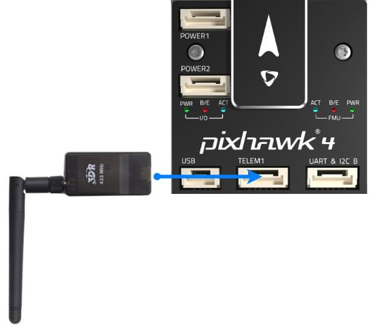

# Pixhawk 4 接线快速入门

本快速入门指南演示如何为 [Pixhawk 4 ](../flight_controller/pixhawk4.md)飞行控制器供电, 并连接其最重要的外围设备。

## 接线图概览

下图展示了如何连接最重要的传感器和外围设备 (电机和伺服舵机输出除外)。 我们将在下面各节中介绍它们的细节。

> **Tip**有关更多可用端口的详细信息, 请参阅此处: Pixhawk 4 > 连接 </1 >。
 </blockquote> 
> 
> ## 飞控的安装和方向
> 
> 应使用减震泡沫垫 (包括在配件中) 将 * Pixhawk 4* 安装在机架上。 应该尽可能接近飞机的重心位置，正面朝上，方向箭头与飞机机头一致朝前
> 
> 
> 
> > **Note** If the controller cannot be mounted in the recommended/default orientation (e.g. due to space constraints) you will need to configure the autopilot software with the orientation that you actually used: [Flight Controller Orientation](../config/flight_controller_orientation.md).
> 
> ## Gps + 指南针 + 蜂鸣器 + 安全开关 + led
> 
> 将所提供的集成指南针、安全开关、蜂鸣器和 led的GPS模块连接到 **GPS moulle</0 > 端口。
 
> 
> The GPS/Compass should be mounted on the frame as far away from other electronics as possible, with the direction marker towards the front of the vehicle (separating the compass from other electronics will reduce interference).
> 
> 
> 
> > **Note** The GPS module's integrated safety switch is enabled *by default* (when enabled, PX4 will not let you arm the vehicle). To disable the safety press and hold the safety switch for 1 second. You can press the safety switch again to enable safety and disarm the vehicle (this can be useful if, for whatever reason, you are unable to disarm the vehicle from your remote control or ground station).
> 
> ## 电源
> 
> 使用6PIN线材将套件中附带的 *电源管理板* (pm板) 的输出连接到 *Pixhawk 4 * 的其中一个 **POWER** 端口。 电源管理板的 **2~12S** 输入将连接到您的锂电池。 下表解释了电源管理板的连接, 包括动力电源与 esc电调和伺服舵机的信号连接。 请注意, 电源管理板不通过 **FMU wwm-out</0 > 的 + 和-引脚为伺服舵机供电。
 
> 
> 下图显示了 *Pixhawk 4 * 所提供的电源管理板接线方式。
> 
> 
> 
> > **Note** If using a plane or rover, the 8 pin power (+) rail of **FMU PWM-OUT** will need to be separately powered in order to drive servos for rudders, elevons etc. To do this, the power rail needs to be connected to a BEC equipped ESC or a standalone 5V BEC or a 2S LiPo battery. Be careful with the voltage of servo you are going to use here.
> 
> | 针脚&连接器      | 功能                                                                                                          |
> | ----------- | ----------------------------------------------------------------------------------------------------------- |
> | I/O PWM-IN  | See note below for connection to *Pixhawk 4*                                                                |
> | M1          | I/O PWM OUT 1: connect signal wire to ESC of motor 1 here                                                   |
> | M2          | I/O PWM OUT 2: connect signal wire to ESC of motor 2 here                                                   |
> | M3          | I/O PWM OUT 3: connect signal wire to ESC of motor 3 here                                                   |
> | M4          | I/O PWM OUT 4: connect signal wire to ESC of motor 4 here                                                   |
> | M5          | I/O PWM OUT 5: connect signal wire to ESC of motor 5 here                                                   |
> | M6          | I/O PWM OUT 6: connect signal wire to ESC of motor 6 here                                                   |
> | M7          | I/O PWM OUT 7: connect signal wire to ESC of motor 7 here                                                   |
> | M8          | I/O PWM OUT 8: connect signal wire to ESC of motor 8 here                                                   |
> | FMU PWM-IN  | See note below for connection to *Pixhawk 4*                                                                |
> | FMU PWM-OUT | If FMU PWM-IN is connected to *Pixhawk 4*, connect signal wires to ESC or signal, +, - wires to servos here |
> | CAP&ADC-OUT | connect to CAP & ADC IN port of *Pixhawk 4*                                                                 |
> | CAP&ADC-IN  | CAP&ADC input: Pinouts are printed on the back side of the board                                            |
> | B+          | connect to ESC B+ to power the ESC                                                                          |
> | GND         | connect to ESC Ground                                                                                       |
> | PWR1        | 5v output 3A, connect to *Pixhawk 4* POWER 1                                                                |
> | PWR2        | 5v output 3A, connect to *Pixhawk 4* POWER 2                                                                |
> | 2~12S       | Power Input, connect to 12S LiPo Battery                                                                    |
> 
> > **Note** Depending on your airframe type, refer to [Airframe Reference](../airframes/airframe_reference.md) to connect **I/O PWM OUT** and **FMU PWM OUT** ports of *Pixhawk 4* to PM board. **MAIN** outputs in PX4 firmware map to **I/O PWM OUT** port of *Pixhawk 4* whereas **AUX outputs** map to **FMU PWM OUT** of *Pixhawk 4*. For example, **MAIN1** maps to IO_CH1 pin of **I/O PWM OUT** and **AUX1** maps to FMU_CH1 pin of **FMU PWM OUT**. **FMU PWM-IN** of PM board is internally connected to **FMU PWM-OUT**, which is used to drive servos (e.g. aileron, elevator, rudder, elevon, gear, flaps, gimbal, steering). **I/O PWM-IN** of PM board is internally connected to **M1-8**, which is used to drive motors (e.g. throttle in Plane, VTOL and Rover).
> 
> 下表总结了如何将 *Pixhawk 4* 的pwm-out 端口连接到电源管理板的 pwm-in 端口, 具体取决于机身参考。
> 
> | Airframe Reference | Connection between *Pixhawk 4* --> PM board |
> | ------------------ | ------------------------------------------- |
> | **MAIN**: motor    | I/O PWM OUT --> I/O PWM IN                  |
> | **MAIN**: servo    | I/O PWM OUT --> FMU PWM IN                  |
> | **AUX**: motor     | FMU PWM OUT --> I/O PWM IN                  |
> | **AUX**: servo     | FMU PWM OUT --> FMU PWM IN                  |
> 
> <!--In the future, when Pixhawk 4 kit is available, add wiring images/videos for different airframes.-->
> 
> *Pixhawk 4* 的电源端口针脚定义如下所示。 电流信号应接入0-3.3V 电压且0-120A 电流的模拟信号。 电压信号应接入0-3.3V电压且0-60A 电流的模拟信号。 Vcc 线路必须提供至少持续3A电流, 并应默认为 5.1V电压。 低于5V的电压仍然是可以接受的, 但不推荐。
> 
> | 针脚       | 信号      | 电压    |
> | -------- | ------- | ----- |
> | 1（红）     | VCC     | +5V   |
> | 2(black) | VCC     | +5V   |
> | 3(black) | CURRENT | +3.3V |
> | 4(black) | VOLTAGE | +3.3V |
> | 5(black) | GND     | GND   |
> | 6(black) | GND     | GND   |
> 
> > **Note**使用套件中附带的电源模块, 您需要在 "2>电源设置 </2 >中配置" 电池片数 </em>参数，但您不需要校准 *voltage divider* 参数。 如果您使用的是任何其他电源模块 (例如, 来自 pixracer 的电源模块), 则必须更新校准 *voltage divider* 参数。
> 
> ## 无线电遥控
> 
> A remote control (RC) radio system is required if you want to *manually* control your vehicle (PX4 does not require a radio system for autonomous flight modes).
> 
> You will need to [select a compatible transmitter/receiver](../getting_started/rc_transmitter_receiver.md) and then *bind* them so that they communicate (read the instructions that come with your specific transmitter/receiver).
> 
> 下面的说明演示如何将不同类型的接收机连接到 *Pixhawk 4 *:
> 
> - Spektrum/DSM 或者 S.BUS 接收机连接到 **DSM/SBUS RC** 输入端口。
>     
>     
> 
> - PPM 接收机连接到 **PPM RC</0 > 输入端口。
 
>     
>     </li> 
>     
>     - PWM 接收机为每个独立的通道配备了独立的连接线，需要通过一个*PPM编码器, 连接到 **PPM RC** 输入端口 *[ ，比如这个](http://www.getfpv.com/radios/radio-accessories/holybro-ppm-encoder-module.html)。</ul> 
>     
>     更多有关遥控器系统选择、接收机兼容性和遥控器接收机对频绑定的详细信息, 请参阅: 遥控器发射机&接收器 </0 >。
 
>     
>     ## 数传电台（可选）
>     
>     Telemetry radios may be used to communicate and control a vehicle in flight from a ground station (for example, you can direct the UAV to a particular position, or upload a new mission).
>     
>     机载端的无线数传模块应连接到 **TELEM1** 端口，如下所示 (如果连接到此端口, 则无需进一步配置)。 另一个匹配的地面端数传电台应该连接到您的地面站电脑或者移动设备上(通常是通过USB接口)。
>     
>     
>     
>     ## SD 卡（可选）
>     
>     SD卡通常是用来 [记录并分析飞行数据](../getting_started/flight_reporting.md). 将内存卡 (包含在 Pixhawk 套件中) 插入 *Pixhawk 4 * 中，如下所示。
>     
>     
>     
>     > **Tip** 闪迪至尊 U3 32GB 是 [强烈推荐 ](https://dev.px4.io/en/log/logging.html#sd-cards)的 (开发人员指南)。
>     
>     ## 电机
>     
>     Motors/servos are connected to the **I/O PWM OUT** (**MAIN**) and **FMU PWM OUT** (**AUX**) ports in the order specified for your vehicle in the [Airframe Reference](../airframes/airframe_reference.md).
>     
>     > **Note** This reference lists the output port to motor/servo mapping for all supported air and ground frames (if your frame is not listed in the reference then use a "generic" airframe of the correct type).
>     
>     

>     
>     > **Caution** The mapping is not consistent across frames (e.g. you can't rely on the throttle being on the same output for all plane frames). Make sure to use the correct mapping for your vehicle.
>     
>     ## 其它外设
>     
>     The wiring and configuration of optional/less common components is covered within the topics for individual [peripherals](../peripherals/README.md).
>     
>     ## 配置
>     
>     一般配置信息在以下内容中介绍: Autopilot 配置 </0 >。
 
>     
>     QuadPlane specific configuration is covered here: [QuadPlane VTOL Configuration](../config_vtol/vtol_quad_configuration.md)
>     
>     <!-- what about config of other vtol types and plane. Do the instructions in these ones above apply for tailsitters etc? -->
>     
>     <!--## Detailed Wiring Infographic (Copter) 

 -->
>     
>     ## 更多信息
>     
>     <!-- - [Pixhawk 4 Quick Start Guide (Holybro)]() Add link-->
>     
>     - [Pixhawk 4](../flight_controller/pixhawk4.md)