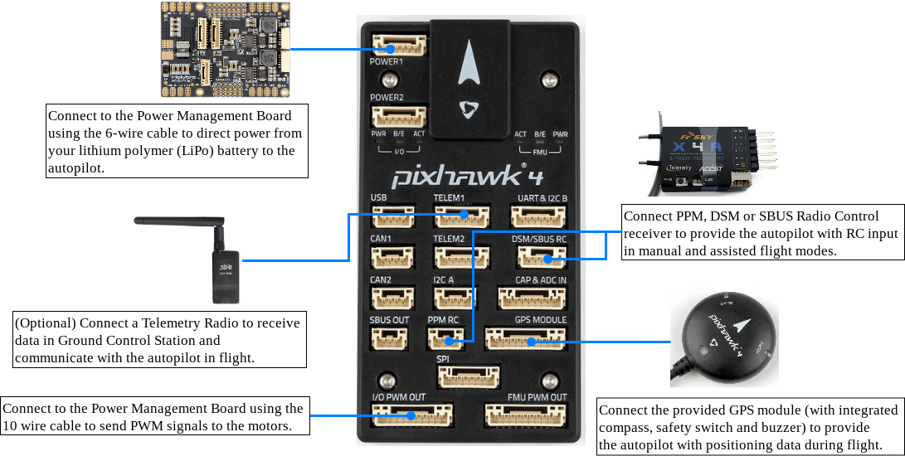

# Pixhawk 4 接线快速入门

> **Warning** PX4 does not manufacture this (or any) autopilot. Contact the [manufacturer](https://shop.holybro.com/) for support or compliance issues.

本快速入门指南演示如何为 [Pixhawk 4](../flight_controller/pixhawk4.md) 飞行控制器供电，并连接主要的外围设备。

## 接线图概览

下图展示了如何连接最重要的传感器和外围设备（电机和伺服舵机输出除外）。 我们将在下面各节中介绍它们的细节。

> **Tip** More information about available ports can be found here: [Pixhawk 4 > Connections](../flight_controller/pixhawk4.md#connectors).

## 飞控的安装和方向

应使用减震泡沫垫 (包括在配件中) 将 *Pixhawk 4* 安装在机架上。 应该尽可能接近飞机的重心位置，正面朝上，方向箭头与飞机机头一致朝前

> **Note** If the controller cannot be mounted in the recommended/default orientation (e.g. due to space constraints) you will need to configure the autopilot software with the orientation that you actually used: [Flight Controller Orientation](../config/flight_controller_orientation.md).

## GPS + 指南针 + 蜂鸣器 + 安全开关 + LED

将所提供的集成指南针、安全开关、蜂鸣器和 LED 的 GPS 模块连接到 **GPS MODULE** 接口。

GPS/指南针模块应尽可能安装在远离其他电子设备的位置上, 方向标记朝向载具的前面 (将指南针与其他电子设备分离将有助于减少干扰)。

> **Note** The GPS module's integrated safety switch is enabled *by default* (when enabled, PX4 will not let you arm the vehicle). To disable the safety press and hold the safety switch for 1 second. You can press the safety switch again to enable safety and disarm the vehicle (this can be useful if, for whatever reason, you are unable to disarm the vehicle from your remote control or ground station).

## 电源

使用6PIN线材将套件中附带的 *电源管理板* (pm板) 的输出连接到 *Pixhawk 4 * 的其中一个 **POWER** 端口。 电源管理板的 **2~12S** 输入将连接到您的锂电池。 下表解释了电源管理板的连接, 包括动力电源与 esc电调和伺服舵机的信号连接。 请注意，电源管理板不通过 **FMU PWM-OUT** 的 + 和 - 引脚为伺服舵机供电。

下图展示了 *Pixhawk 4* 所提供的电源管理板接线方式。

> **Note** If using a plane or rover, the 8 pin power (+) rail of **FMU PWM-OUT** will need to be separately powered in order to drive servos for rudders, elevons etc. To do this, the power rail needs to be connected to a BEC equipped ESC or a standalone 5V BEC or a 2S LiPo battery. Be careful with the voltage of servo you are going to use here.

| 针脚&连接器      | 功能                                                            |
| ----------- | ------------------------------------------------------------- |
| I/O PWM-IN  | 参考下面 *Pixhawk 4* 的连接                                          |
| M1          | I/O PWM OUT 1：将信号线连接到到电机 1 的电调                                |
| M2          | I/O PWM OUT 2：将信号线连接到到电机 2 的电调                                |
| M3          | I/O PWM OUT 3：将信号线连接到到电机 3 的电调                                |
| M4          | I/O PWM OUT 4：将信号线连接到到电机 4 的电调                                |
| M5          | I/O PWM OUT 5：将信号线连接到到电机 5 的电调                                |
| M6          | I/O PWM OUT 6：将信号线连接到到电机 6 的电调                                |
| M7          | I/O PWM OUT 7：将信号线连接到到电机 7 的电调                                |
| M8          | I/O PWM OUT 8：将信号线连接到到电机 8 的电调                                |
| FMU PWM-IN  | 参考下面 *Pixhawk 4* 的连接                                          |
| FMU PWM-OUT | 如果 FMU PWM-IN连接到 *Pixhawk 4*，则将信号线连接到 ESC电调或将信号，+，-线路连接到伺服舵机。 |
| CAP&ADC-OUT | 连接到 *Pixhawk 4* 的CAP & ADC IN 接口。                             |
| CAP&ADC-IN  | CAP&ADC 输入: 针脚打印显示在电路板的背面                                     |
| B+          | 连接到 ESC电调B+以为 ESC电调供电                                         |
| GND         | 连接到 ESC电调负极                                                   |
| PWR1        | 5V 3A 输出，连接到 *Pixhawk 4* 的 POWER 1                            |
| PWR2        | 5V 3A 输出，连接到 *Pixhawk 4* 的 POWER 2                            |
| 2~12S       | 电源输入，连接到12~S的LiPo电池                                           |

> **Note** Depending on your airframe type, refer to [Airframe Reference](../airframes/airframe_reference.md) to connect **I/O PWM OUT** and **FMU PWM OUT** ports of *Pixhawk 4* to PM board. **MAIN** outputs in PX4 firmware map to **I/O PWM OUT** port of *Pixhawk 4* whereas **AUX outputs** map to **FMU PWM OUT** of *Pixhawk 4*. For example, **MAIN1** maps to IO_CH1 pin of **I/O PWM OUT** and **AUX1** maps to FMU_CH1 pin of **FMU PWM OUT**. **FMU PWM-IN** of PM board is internally connected to **FMU PWM-OUT**, which is used to drive servos (e.g. aileron, elevator, rudder, elevon, gear, flaps, gimbal, steering). **I/O PWM-IN** of PM board is internally connected to **M1-8**, which is used to drive motors (e.g. throttle in Plane, VTOL and Rover).

下表总结了如何将 *Pixhawk 4* 的 PWM OUT 端口连接到电源管理板的 PWM-IN 端口，具体取决于机身类型。

| 机架参考        | *Pixhawk 4* -> 电源模块板 之间的连接 |
| ----------- | -------------------------- |
| **MAIN**：电机 | I/O PWM OUT --> I/O PWM IN |
| **MAIN**：舵机 | I/O PWM OUT --> FMU PWM IN |
| **AUX**：电机  | FMU PWM OUT --> I/O PWM IN |
| **AUX**：舵机  | FMU PWM OUT --> FMU PWM IN |

<!--In the future, when Pixhawk 4 kit is available, add wiring images/videos for different airframes.-->

*Pixhawk 4* 的电源端口针脚定义如下所示。 电流信号应接入0-3.3V 电压且0-120A 电流的模拟信号。 电压信号应接入0-3.3V 的模拟电压，默认以此映射 0-60V 的电池电压。 Vcc 线路必须提供至少 3A 的持续电流，并应默认为 5.1V电压。 低于5V的电压仍然是可以接受的, 但不推荐。

| 针脚   | 信号  | 电压    |
| ---- | --- | ----- |
| 1（红） | VCC | +5V   |
| 2（黑） | VCC | +5V   |
| 3（黑） | 电流  | +3.3V |
| 4（黑） | 电压  | +3.3V |
| 5（黑） | GND | GND   |
| 6（黑） | GND | GND   |

> **Note** Using the Power Module that comes with the kit you will need to configure the *Number of Cells* in the [Power Settings](https://docs.qgroundcontrol.com/en/SetupView/Power.html) but you won't need to calibrate the *voltage divider*. You will have to update the *voltage divider* if you are using any other power module (e.g. the one from the Pixracer).

## 无线电遥控

如果你想 *手动* 控制你的飞行器，你需要一个遥控器（PX4在自动飞行模式可以不需要遥控器）。

你需要[一个兼容的发射/接收机](../getting_started/rc_transmitter_receiver.md)，并*对好频*（对频方法参考说明书）。

下面的说明演示如何将不同类型的接收机连接到 *Pixhawk 4*：

- Spektrum/DSM 或者 S.BUS 接收机连接到 **DSM/SBUS RC** 输入端口。
    
    

- PPM 接收机连接到 **PPM RC** 输入端口。
    
    

- PPM 和 *每个通道有单独连接线* 的 PWM 接收机需要连接在 **PPM RC** 端口，PWM信号需要通过一个[类似这样的](http://www.getfpv.com/radios/radio-accessories/holybro-ppm-encoder-module.html)* PPM 编码器*（PPM-Sum 接收机只需要一根信号线就包含所有通道）。

更多有关遥控器系统选择、接收机兼容性和遥控器接收机对频绑定的详细信息，请参阅：[遥控器发射机&接收器](../getting_started/rc_transmitter_receiver.md)。

## 数传电台（可选）

遥测无线电台可用于地面站的通信和飞行控制 (例如, 您可以指定无人机飞行至特定位置, 或上传新的任务)。

机载端的无线数传模块应连接到 **TELEM1** 端口，如下所示（如果连接到此端口，则无需进一步配置）。 数传电台中的另一个应该连接到您的地面站电脑或者移动设备上（通常是通过USB接口）。

## SD Card (Optional)

SD cards are highly recommended as they are needed to [log and analyse flight details](../getting_started/flight_reporting.md), to run missions, and to use UAVCAN-bus hardware. Insert the card (included in Pixhawk 4 kit) into *Pixhawk 4* as shown below.

> **Tip** For more information see [Basic Concepts > SD Cards (Removable Memory)](../getting_started/px4_basic_concepts.md#sd_cards).

## 电机

Motors/servos are connected to the **I/O PWM OUT** (**MAIN**) and **FMU PWM OUT** (**AUX**) ports in the order specified for your vehicle in the [Airframe Reference](../airframes/airframe_reference.md).

> **Note** This reference lists the output port to motor/servo mapping for all supported air and ground frames (if your frame is not listed in the reference then use a "generic" airframe of the correct type).

> **Caution** The mapping is not consistent across frames (e.g. you can't rely on the throttle being on the same output for all plane frames). Make sure to use the correct mapping for your vehicle.

## 其它外设

The wiring and configuration of optional/less common components is covered within the topics for individual [peripherals](../peripherals/README.md).

## 针脚定义

[Pixhawk 4 Pinouts](http://www.holybro.com/manual/Pixhawk4-Pinouts.pdf) (Holybro)

## 配置

General configuration information is covered in: [Autopilot Configuration](../config/README.md).

QuadPlane specific configuration is covered here: [QuadPlane VTOL Configuration](../config_vtol/vtol_quad_configuration.md)

<!-- Nice to have detailed wiring infographic and instructions for different vehicle types. -->

## 更多信息

- [Pixhawk 4](../flight_controller/pixhawk4.md)（概览页面）
- [Pixhawk 4 技术数据表](https://github.com/PX4/px4_user_guide/raw/master/assets/flight_controller/pixhawk4/pixhawk4_technical_data_sheet.pdf)
- [Pixhawk 4 针脚定义](http://www.holybro.com/manual/Pixhawk4-Pinouts.pdf)（PDF）
- [Pixhawk 4 快速入门指南（PDF）](http://www.holybro.com/manual/Pixhawk4-quickstartguide.pdf)