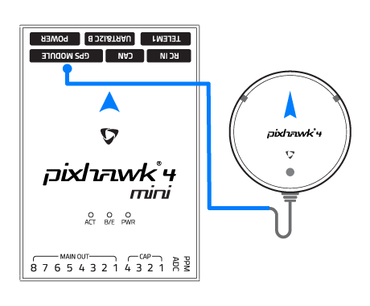
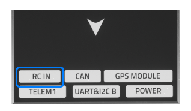
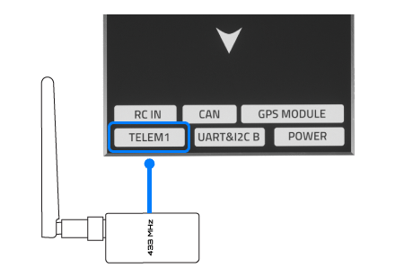

# *Pixhawk 4 mini </0 >接线快速入门</h1> 

> **Warning** PX4 不生产这款且也不生产任何自动驾驶仪。 若需要硬件支持或咨询合规问题，请联系 [制造商](https://shop.holybro.com/)。

本快速入门指南演示如何为 [*Pixhawk&reg; 4 Mini*](../flight_controller/pixhawk4_mini.md) 飞行控制器供电, 并连接其最重要的外围设备。

## 接线图概述

下图展示了如何连接最重要的传感器和外围设备 (电机和伺服舵机输出除外)。

> **Tip** 有关更多可用端口的详细信息, 请参阅此处: [*Pixhawk 4 Mini* > 端口](../flight_controller/pixhawk4_mini.md#interfaces)。

## 飞控的安装和方向

应使用减震泡沫垫 (包括在配件中) 将 * Pixhawk 4 Mini * 安装在机架上。 应该尽可能接近飞机的重心位置，正面朝上，方向箭头与飞机机头一致朝前

> **Note** 如果飞行控制器无法安装在推荐的默认方向 (例如, 由于空间限制), 则需要根据实际安装的方向来配置自动驾驶仪软件: [飞行控制器方向 ](../config/flight_controller_orientation.md)参数。

## GPS + 指南针 + 蜂鸣器 + 安全开关 + LED

将所提供的集成指南针、安全开关、蜂鸣器和 led的GPS模块连接到 **GPS moulle</0 > 端口。 GPS/罗盘在安装时应尽可能远离其他电子元器件，方向标记朝向飞行器前方(将罗盘和其他电子元器件分开可以减少干扰)。
 

> **Note** GPS模块内集成的安全开关 *默认是启用的*（当启用时，PX4将不会让您解锁飞行器）。 如需关闭安全开关，请按住安全开关1秒钟。 您可以在完成任务后再次按下安全开关以启用并锁定飞行器 （因为这是出于安全考虑的机制，无论出于何种原因，您将无法通过遥控器或地面站来远程解锁您的载具）。

## 电源

电源管理板（PMB）提供了电源模块与电源分电板的作用。 除了为 *Pixhawk 4 mini*和 ESC 电调提供稳压电源外, 它还向自动驾驶仪发送电池电压和电流的相关信息。

使用6PIN线材将套件附带的PMB模块的输出接口连接到*Pixhawk 4 mini* 的 **POWER** 端口。 下表解释了电源管理板的连接, 包括动力电源与 ESC电调和伺服舵机的信号连接。

> **注意** 上图仅展示了单个 ESC 和单个伺服舵机的连接方式。 以类似方式连接剩余的 ESC电调和伺服舵机。

| Pin(s) 或连接器 | 功能                                                       |
| ----------- | -------------------------------------------------------- |
| B+          | 连接到 ESC电调B+以为 ESC电调供电                                    |
| GND         | 连接到 ESC电调负极                                              |
| PWR         | JST-GH 6-pin 接头, 5V 3A 输出  
连接到*Pixhawk 4 Mini* 的POWER接口 |
| BAT         | 电源输入，连接到2~12S的LiPo电池                                     |

*Pixhawk 4 Mini* 的**电源**输出针脚如下表所示。 The `CURRENT` signal should carry an analog voltage from 0-3.3V for 0-120A as default. The `VOLTAGE` signal should carry an analog voltage from 0-3.3V for 0-60V as default. Vcc 线路必须提供至少 3A 的持续电流，并应默认为 5.1V电压。 低于5V的电压仍然是可以接受的, 但不推荐。

| 针脚   | 信号  | 电压    |
| ---- | --- | ----- |
| 1（红） | VCC | +5V   |
| 2（黑） | VCC | +5V   |
| 3（黑） | 电流  | +3.3V |
| 4（黑） | 电压  | +3.3V |
| 5（黑） | GND | GND   |
| 6（黑） | GND | GND   |

> **Caution** 如果配置为固定翼或无人车, 飞控**MAIN OUT**8个输出端口的 power (+) 正极线束将要进行独立供电 ，以保障方向舵、升降舵等伺服舵机的正常驱动。 为此，独立供电的正极线束需要连接到一个BEC，如具备BEC独立5V输出的ESC电调或者一个2SLiPo电池。 请注意你要在这里使用的电压是伺服舵机的需要的。

<!--In the future, when Pixhawk 4 kit is available, add wiring images/videos for different airframes.-->

> **Note** 使用套件中附带的电源模块, 您需要在 电源设置 </2 >中配置 *电池片数 *参数，但您不需要校准 *voltage divider* 参数。 如果您使用的是其他的电源模块（例如，来自 Pixracer 的电源模块），则必须更新校准 *电压分圧计* 参数。
 </blockquote> 
> 
> ## 无线电遥控
> 
> 如果你想*手动* 控制你的飞行器，你需要一个遥控器（PX4在自动飞行模式可以不需要遥控器）。
> 
> 你需要[选择一个兼容的发射机/接收机](../getting_started/rc_transmitter_receiver.md)，并*对好频* 以便它们能够正常通信（对频方法参考您的特定遥控器与接收机附带的说明书）。
> 
> 下面的说明将演示如何将不同类型的接收机连接到 *Pixhawk 4 Mini*:
> 
> - Spektrum/DSM 或者 S.BUS 接收机连接到 **DSM/SBUS RC** 输入端口。
>     
>     
> 
> - PPM 接收机连接到 **PPM RC** 输入端口。
>     
>     
> 
> - PPM 和 *每个通道有单独连接线* 的 PWM 接收机需要连接在 **PPM RC** 端口，PWM信号需要通过一个[类似这样的](http://www.getfpv.com/radios/radio-accessories/holybro-ppm-encoder-module.html)* PPM 编码器*（PPM-Sum 接收机只需要一根信号线就包含所有通道）。
> 
> 更多有关遥控器系统选择、接收机兼容性和遥控器接收机对频绑定的详细信息，请参阅：[遥控器发射机&接收器](../getting_started/rc_transmitter_receiver.md)。
> 
> ## 数传电台（可选）
> 
> 遥测无线电台可用于地面站的通信和飞行控制 (例如, 您可以指定无人机飞行至特定位置, 或上传新的任务)。
> 
> 机载端的无线数传模块应连接到 **TELEM1** 端口，如下所示（如果连接到此端口，则无需进一步配置）。 数传电台中的另一个应该连接到您的地面站电脑或者移动设备上（通常是通过USB接口）。
> 
> 
> 
> ## SD卡（可选）
> 
> SD cards are highly recommended as they are needed to [log and analyse flight details](../getting_started/flight_reporting.md), to run missions, and to use UAVCAN-bus hardware. 将内存卡 (包含在套件中) 插入 *Pixhawk 4 Mini * 中，如下所示。
> 
> 
> 
> > **Tip** For more information see [Basic Concepts > SD Cards (Removable Memory)](../getting_started/px4_basic_concepts.md#sd_cards).
> 
> ## 电机
> 
> 电机和舵机按照 [机架参考列表](../airframes/airframe_reference.md) 中为您的飞机指定的顺序连接至 **MAIN OUT** 端口。 有关更多的详细信息，请参阅[*Pixhawk 4 Mini* > 所支持的平台](../flight_controller/pixhawk4_mini.md#supported-platforms)。
> 
> > **Note**本参考列出了所有支持的空中和地面机架的接口与电机/舵机的映射关系（如果您的机架没有在参考列表里，您可以使用对应类型的“通用”机架）。
> 
> 

> 
> > **Caution** 该参考列表并不是与机架类型完全匹配的（例如，您不能将油门应用在其他所有机型的输出端口上）。 请确保为您的飞行器使用正确的映射。
> 
> ## 其它外设
> 
> 针对可选/非通用组件的接线与配置，在 [外围设备](../peripherals/README.md) 独立主题中有详细的内容介绍。
> 
> ## 配置
> 
> 一般配置信息在以下内容中介绍：[Autopilot 配置](../config/README.md)。
> 
> QuadPlane的特定配置在以下内容中介绍：[QuadPlane VTOL Configuration](../config_vtol/vtol_quad_configuration.md)
> 
> <!-- Nice to have detailed wiring infographic and instructions for different vehicle types. -->
> 
> ## 更多信息
> 
> - [*Pixhawk 4 Mini*](../flight_controller/pixhawk4_mini.md)