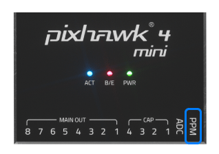

# *Pixhawk 4 mini </0 >接线快速入门</h1> 

本快速入门指南演示如何为 [*Pixhawk&reg; 4 Mini*](../flight_controller/pixhawk4_mini.md) 飞行控制器供电, 并连接其最重要的外围设备。

## 接线图概览

下图展示了如何连接最重要的传感器和外围设备 (电机和伺服舵机输出除外)。

> **Tip** 有关更多可用端口的详细信息, 请参阅此处: [*Pixhawk 4 Mini* > 端口](../flight_controller/pixhawk4_mini.md#interfaces)。

## 飞控的安装和方向

应使用减震泡沫垫 (包括在配件中) 将 * Pixhawk 4 Mini * 安装在机架上。 应该尽可能接近飞机的重心位置，正面朝上，方向箭头与飞机机头一致朝前

> **Note** 如果飞行控制器无法安装在推荐的默认方向 (例如, 由于空间限制), 则需要根据实际安装的方向来配置自动驾驶仪软件: [飞行控制器方向 ](../config/flight_controller_orientation.md)。

## Gps + 指南针 + 蜂鸣器 + 安全开关 + led

将所提供的集成指南针、安全开关、蜂鸣器和 led的GPS模块连接到 **GPS moulle</0 > 端口。 GPS/指南针模块应尽可能安装在远离其他电子设备的位置上, 方向标记朝向载具的前面 (将指南针与其他电子设备分离将有助于减少干扰)。
 

> **Note** GPS模块内集成的安全开关*默认情况下 *是启用的 (启用后, PX4不会让您解锁飞控)。 如需关闭安全开关，请按住安全开关1秒钟。 You can press the safety switch again to enable safety and disarm the vehicle (this can be useful if, for whatever reason, you are unable to disarm the vehicle from your remote control or ground station).

## 电源

The Power Management Board (PMB) serves the purpose of a power module as well as a power distribution board. In addition to providing regulated power to *Pixhawk 4 Mini* and the ESCs, it sends information to the autopilot about the battery’s voltage and current draw.

Connect the output of the PMB that comes with the kit to the **POWER** port of the *Pixhawk 4 Mini* using a 6-wire cable. The connections of the PMB, including power supply and signal connections to the ESCs and servos, are explained in the image below.

> **Note** The image above only shows the connection of a single ESC and a single servo. Connect the remaining ESCs and servos similarly.

| Pin(s) or Connector | 功能                                                                       |
| ------------------- | ------------------------------------------------------------------------ |
| B+                  | Connect to ESC B+ to power the ESC                                       |
| GND                 | Connect to ESC Ground                                                    |
| PWR                 | JST-GH 6-pin Connector, 5V 3A output  
connect to *Pixhawk 4 Mini* POWER |
| BAT                 | Power Input, connect to 2~12s LiPo Battery                               |

*Pixhawk 4 Mini* 的**电源**输出针脚如下表所示。 电流信号应接入0-3.3V 电压且0-120A 电流的模拟信号。 电压信号应接入0-3.3V电压且0-60A 电流的模拟信号。 Vcc 线路必须提供至少持续3A电流, 并应默认为 5.1V电压。 低于5V的电压仍然是可以接受的, 但不推荐。

| 针脚       | 信号      | 电压    |
| -------- | ------- | ----- |
| 1（红）     | VCC     | +5V   |
| 2(black) | VCC     | +5V   |
| 3(black) | CURRENT | +3.3V |
| 4(black) | VOLTAGE | +3.3V |
| 5(black) | GND     | GND   |
| 6(black) | GND     | GND   |

> **Note** If using a plane or rover, the 8 pin power (+) rail of **MAIN OUT** will need to be separately powered in order to drive servos for rudders, elevons, etc. To do this, the power rail needs to be connected to a BEC equipped ESC, a standalone 5V BEC, or a 2S LiPo battery. Be careful with the voltage of servo you are going to use here.

<!--  -->

<!--In the future, when Pixhawk 4 kit is available, add wiring images/videos for different airframes.-->

> **Note** Using the Power Module that comes with the kit you will need to configure the *Number of Cells* in the [Power Settings](https://docs.qgroundcontrol.com/en/SetupView/Power.html) but you won't need to calibrate the *voltage divider*. 如果您使用的是任何其他电源模块 (例如, 来自 pixracer 的电源模块), 则必须更新校准 *voltage divider* 参数。

## 无线电遥控

A remote control (RC) radio system is required if you want to *manually* control your vehicle (PX4 does not require a radio system for autonomous flight modes).

You will need to [select a compatible transmitter/receiver](../getting_started/rc_transmitter_receiver.md) and then *bind* them so that they communicate (read the instructions that come with your specific transmitter/receiver).

The instructions below show how to connect the different types of receivers to *Pixhawk 4 Mini*:

- Spektrum/DSM 或者 S.BUS 接收机连接到 **DSM/SBUS RC** 输入端口。
    
    

- PPM 接收机连接到 **PPM RC</0 > 输入端口。
 
    
    </li> 
    
    - PWM 接收机为每个独立的通道配备了独立的连接线，需要通过一个*PPM编码器, 连接到 **PPM RC** 输入端口 *[ ，比如这个](http://www.getfpv.com/radios/radio-accessories/holybro-ppm-encoder-module.html)。</ul> 
    
    更多有关遥控器系统选择、接收机兼容性和遥控器接收机对频绑定的详细信息, 请参阅: 遥控器发射机&接收器 </0 >。
 
    
    ## Telemetry Radio (Optional)
    
    Telemetry radios may be used to communicate and control a vehicle in flight from a ground station (for example, you can direct the UAV to a particular position, or upload a new mission).
    
    机载端的无线数传模块应连接到 **TELEM1** 端口，如下所示 (如果连接到此端口, 则无需进一步配置)。 另一个匹配的地面端数传电台应该连接到您的地面站电脑或者移动设备上(通常是通过USB接口)。
    
    
    
    ## microSD Card (Optional)
    
    SD cards are most commonly used to [log and analyse flight details](../getting_started/flight_reporting.md). Insert the card (included in the kit) into *Pixhawk 4 Mini* as shown below.
    
    
    
    > **Tip** The SanDisk Extreme U3 32GB is [highly recommended](https://dev.px4.io/en/log/logging.html#sd-cards) (Developer Guide).
    
    ## 电机
    
    Motors/servos are connected to the **MAIN OUT** ports in the order specified for your vehicle in the [Airframe Reference](../airframes/airframe_reference.md). See [*Pixhawk 4 Mini* > Supported Platforms](../flight_controller/pixhawk4_mini.md#supportedplatforms) for more information.
    
    > **Note** This reference lists the output port to motor/servo mapping for all supported air and ground frames (if your frame is not listed in the reference then use a "generic" airframe of the correct type).
    
    

    
    > **Caution** The mapping is not consistent across frames (e.g. you can't rely on the throttle being on the same output for all plane frames). Make sure to use the correct mapping for your vehicle.
    
    ## 其它外设
    
    The wiring and configuration of optional/less common components is covered within the topics for individual [peripherals](../peripherals/README.md).
    
    ## 配置
    
    一般配置信息在以下内容中介绍：[Autopilot 配置](../config/README.md)。
    
    QuadPlane specific configuration is covered here: [QuadPlane VTOL Configuration](../config_vtol/vtol_quad_configuration.md)
    
    <!-- what about config of other vtol types and plane. Do the instructions in these ones above apply for tailsitters etc? -->
    
    <!--## Detailed Wiring Infographic (Copter)

 -->
    
    ## 更多信息
    
    - [*Pixhawk 4 Mini*](../flight_controller/pixhawk4_mini.md)