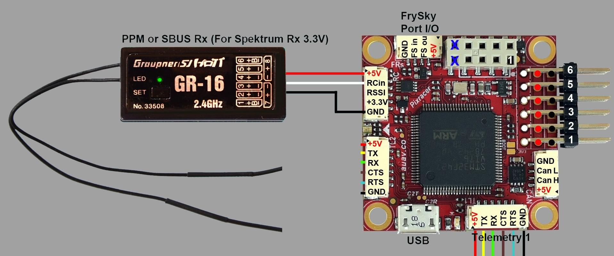

# Pixracer接线指南

:::warning PX4 does not manufacture this (or any) autopilot. Contact the [manufacturer](https://store.mrobotics.io/) for hardware support or compliance issues.
:::

:::warning
Under construction
:::

This quick start guide shows how to power the [Pixracer](../flight_controller/pixracer.md) flight controller and connect its most important peripherals.

## Wiring Guides/Assembly

### 主要设置

### 电台/远程 控制

A remote control (RC) radio system is required if you want to *manually* control your vehicle (PX4 does not require a radio system for autonomous flight modes).

You will need to [select a compatible transmitter/receiver](../getting_started/rc_transmitter_receiver.md) and then *bind* them so that they communicate (read the instructions that come with your specific transmitter/receiver).

The instructions below show how to connect the different types of receivers:

- Frsky 的接收机通过所示的端口连接, 并可以使用提供的 I/o 连接器。
    
    
    
    

- PPM-SUM 和 S.BUS 接收机连接到 **RCIN** 端口。
    
    

- PPM 接收机通过一个 *PPM 编码器*将*每一个通道通过一根线*连接到** RCIN** 通道上[如这个所示](http://www.getfpv.com/radios/radio-accessories/holybro-ppm-encoder-module.html)（PPM-Sum 接收机所有通道可以只需要一根信号线）。

### 电源模块 (ASCP4)

### External Telemetry

Pixracer has inbuilt WiFi, but also supports telemetry via external Wi-Fi or radio telemetry modules connected to the `TELEM1` or `TELEM2` ports. This is shown in the wiring diagram below.

:::note
The `TELEM2` port must be configured as a second MAVLink instance using the [MAV_2_CONFIG](../advanced_config/parameter_reference.md#MAV_2_CONFIG) parameter. For more information see [MAVLink Peripherals > MAVLink Instances](../peripherals/mavlink_peripherals.md#mavlink-instances) (and [Serial Port Configuration](../peripherals/serial_configuration.md)).
:::