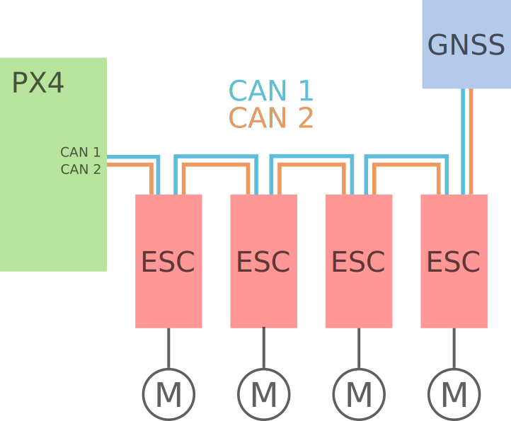

# CAN

[局域网控制器(CAN)](https://en.wikipedia.org/wiki/CAN_bus) 是一种强大的有线网络，允许无人机组件 (如飞控，电调，传感器和其他外设) 之间相互通信。 因为它的设计有仲裁，使用差分信号，即使在较长的电缆 (大型车辆上) 上也非常强大，避免单点故障。 CAN 还允许来自外设的状态反馈，并通过总线方便的进行固件升级。

PX4 支持与 CAN 设备通信的两个软件协议：

- [DroneCAN](../dronecan/index.md): PX4 推荐大多数常见设置使用此协议。 它得到了 PX4 的很好支持，是一个成熟的产品，具有广泛的外围支持，并经过多年的测试。
- [Cyphal](https://opencyphal.org): PX4 支持仍在"进行中"。 Cyphal 是一种更新的协议，允许更多的灵活性和配置，尤其是对于较大和较复杂的载具。 它还没有被广泛应用。

::: info DroneCAN 和 Cyphal 都源自于较早的 UAVCAN 项目。 在2022年，该项目分为两个部分：原始版本的 UAVCAN (UAVCAN v0) 更名为 DroneCAN，较新的 UAVCAN v1 更名为 Cyphal。 这两种协议之间的区别在[Cyphal vs. DroneCAN](https://forum.opencyphal.org/t/cyphal-vs-dronecan/1814)中有描述。
:::

:::warning
PX4 目前不支持其他无人机使用的 CAN 软件协议，如 KDECAN (截至撰写本文时)。
:::

## 接线

The wiring for CAN networks is the same for both DroneCAN and Cyphal/CAN (in fact, for all CAN networks).

Devices are connected in a chain in any order. At either end of the chain, a 120Ω termination resistor should be connected between the two data lines. Flight controllers and some GNSS modules have built in termination resistors for convenience, thus should be placed at opposite ends of the chain. Otherwise, you can use a termination resistor such as [this one from Zubax Robotics](https://shop.zubax.com/products/uavcan-micro-termination-plug?variant=6007985111069), or solder one yourself if you have access to a JST-GH crimper.

The following diagram shows an example of a CAN bus connecting a flight controller to 4 CAN ESCs and a GNSS.

The diagram does not show any power wiring. Refer to your manufacturer instructions to confirm whether components require separate power or can be powered from the CAN bus itself.

For more information, see [Cyphal/CAN device interconnection](https://kb.zubax.com/pages/viewpage.action?pageId=2195476) (kb.zubax.com). While the article is written with the Cyphal protocol in mind, it applies equally to DroneCAN hardware and any other CAN setup. For more advanced scenarios, consult with [On CAN bus topology and termination](https://forum.opencyphal.org/t/on-can-bus-topology-and-termination/1685).

### 连接器

Pixhawk standard compatible CAN devices use 4 pin JST-GH connectors for CAN. Two connectors are used for input and output when wiring in a chain (except for flight controllers and some GNSS devices with builtin termination, which only have a single JST-GH connector).

Other (non-Pixhawk compatible) devices may use different connectors. However, as long as the device firmware supports DroneCAN or Cyphal, it can be used.

### 冗余

DroneCAN and Cyphal/CAN support using a second (redundant) CAN interface. This is completely optional but increases the robustness of the connection. All Pixhawk flight controllers come with 2 CAN interfaces; if your peripherals support 2 CAN interfaces as well, it is recommended to wire both up for increased safety.

## 固件

CAN peripherals may run proprietary or open source firmware (check manufacturer guides to confirm the required setup).

PX4 can be built to run as open-source DroneCAN firmware on supported CAN hardware. See [PX4 DroneCAN Firmware](../dronecan/px4_cannode_fw.md) for more information.

## 支持和配置

[DroneCAN Setup and Configuration](../dronecan/index.md)

[PX4 DroneCAN Firmware](../dronecan/px4_cannode_fw.md)

## 视频

### DroneCAN

Intro to DroneCAN (UAVCANv0) and practical example with setup in QGroundControl:

@[youtube](https://youtu.be/IZMTq9fTiOM)

### Cyphal

UAVCAN v1 for drones — PX4 Developer Summit Virtual 2020

@[youtube](https://youtu.be/6Bvtn_g8liU)

---

Getting started using UAVCAN v1 with PX4 on the NXP UAVCAN Board — PX4 Developer Summit Virtual 2020 @[youtube](https://youtu.be/MwdHwjaXYKs)

---

UAVCAN: a highly dependable publish-subscribe protocol for hard real-time intra-vehicular networking — PX4 Developer Summit Virtual 2019

@[youtube](https://youtu.be/MBtROivYPik)
