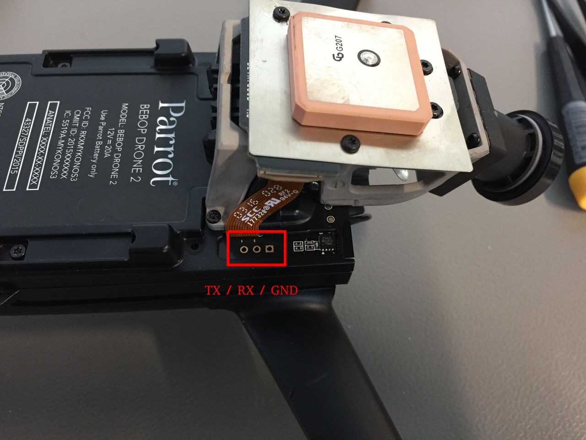
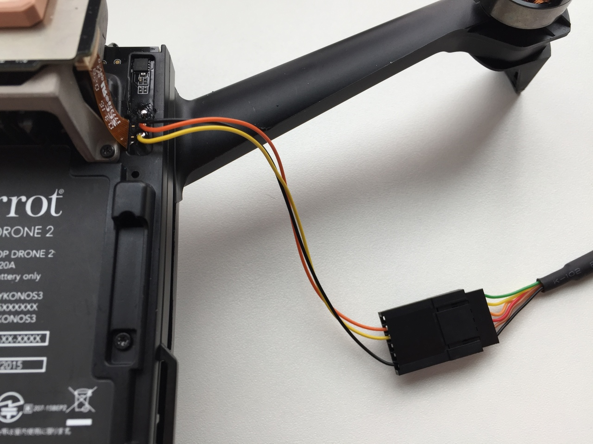

# Parrot Bebop

The [Parrot Bebop 2](http://global.parrot.com/au/products/bebop2/) is a popular flying camera. Basic support for PX4 has been added so that it can be used for research and testing.

> **Warning** Bebop support is at an early stage. To use PX4 with Bebop you will need to [build the code](https://dev.px4.io/master/en/setup/building_px4.html#parrot-bebop) using the developer toolchain.

## Video

https://youtu.be/SsnzYhiuWiE

https://www.youtube.com/watch?v=hTVNHlqxWBk

## Advanced Topics

### FTDI connection

Follow the instructions to connect to the Parrot Bebop 2 via FTDI.

* Loosen the two Torx screws (T5) to take off the front cap. 
* Use pins to connect to ground/RX/TX or solder cables onto the connectors. 
* Connect the FTDI cable and run
    
    ```sh
    screen /dev/ttyUSB0 115200
    ```
    
    to connect to the Bebop.
    
    

## Resources

Instructions on how to build the code and use PX4 with Bebop 2 available in the Developer Guide here:

* [Building the Code](https://dev.px4.io/master/en/setup/building_px4.html#parrot-bebop)
* [Airframe Reference](../airframes/airframe_reference.md#copter_quadrotor_x_parrot_bebop_frame)