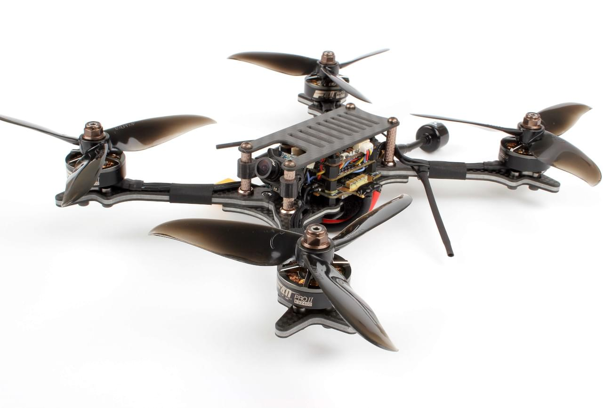

# Holybro Kopis 2

The [Holybro Kopis 2](http://www.holybro.com/product/kopis-2/) is a ready-to-fly racer quad for flying FPV or line-of-sight.

## 购买渠道

The *Kopis 2* can be bought from a number of vendors, including:

- [Holybro](https://shop.holybro.com/kopis-2_p1114.html)
- [GetFPV](https://www.getfpv.com/holybro-kopis-2-fpv-racing-drone-pnp.html)

另外你还需要一些其它的配件：

- 一个遥控器以及接收机。 The *Kopis 2* can ship with an FrSky receiver or no receiver at all.
- LiPo battery and charger.
- 如果你想进行 FPV飞行, 那你则需要一副 FPV眼镜。 除了[Fatshark](https://www.fatshark.com/product/dominator-hd-v3-fpv-headset-goggles/) 以外，还有许多兼容的备选方案。 >**注意** FPV支持是完全独立于PX4或者是其它的飞行控制器的。

## 刷写 Bootloader

The *Kopis 2* comes preinstalled with Betaflight.

在刷 PX4 固件之前，您必须先安装 PX4 的bootloader。 Instructions for installing the bootloader can be found in the [Kakute F7](../flight_controller/kakutef7.md#bootloader) topic (this is the flight controller board on the *Kopis 2*).

> **Tip** You can always [reinstall Betaflight](../advanced_config/bootloader_update_from_betaflight.md#reinstall_betaflight) later if you want!

## 安装配置

一旦安装了bootloader引导程序之后，您就可以通过USB接口连接 *QGroundControl*地面站

> **Note** At time of writing *Kopis 2* is supported on the QGroundControl *Daily Build*, and prebuilt firmware is provided for the master branch only (stable releases are not yet available).

安装和配置 PX4:

- [首先更新PX4 固件目录](../config/firmware.md)。 
- [Set the Airframe](../config/airframe.md) to *Holybro Kopis 2*.
- 再继续进行一些[基本配置](../config/README.md)，包括传感器校准和电台设置。

<!--
## Video

TODO


-->