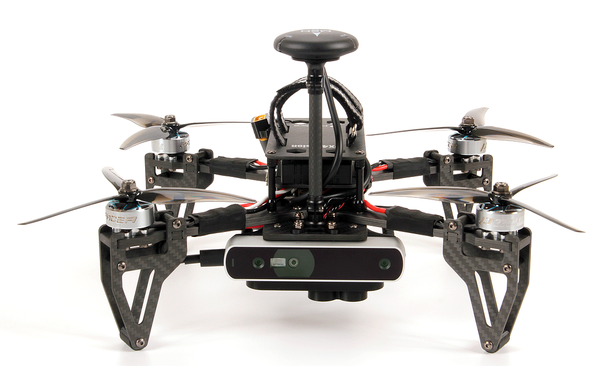
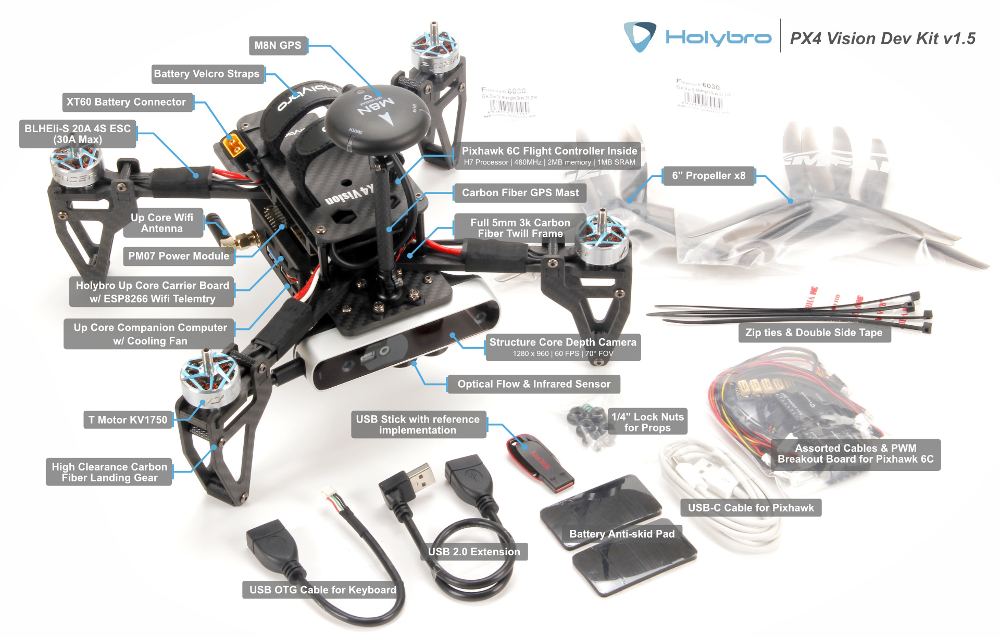
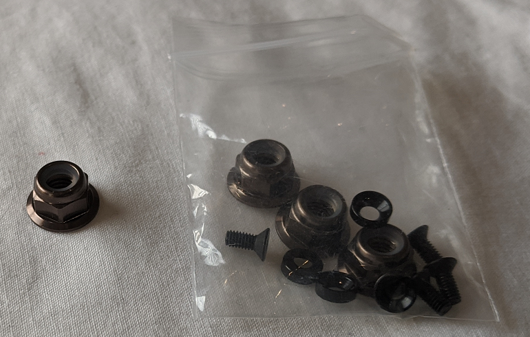

# PX4 Vision 视觉自主开发套件

The [*PX4 Vision Autonomy Development Kit*](https://holybro.com/collections/multicopter-kit/PX4-Vision) is a robust and inexpensive kit for enabling computer vision development on autonomous vehicles.



The kit contains a near-ready-to-fly carbon-fiber quadcopter equipped with a *Pixhawk 4* or *Pixhawk 6C* (on V1.5) flight controller, a *UP Core* companion computer (4GB memory & 64GB eMMC), and a Occipital *Structure Core* depth camera sensor.

:::note
该无人机发货时没有预先安装软件。 A USB stick is included in the kit with an example of an [obstacle avoidance](../computer_vision/obstacle_avoidance.md) feature implementation, based on the [PX4 Avoidance](https://github.com/PX4/PX4-Avoidance) project. This example is intended as a reference only and serves to demonstrate the capabilities of the platform. The software is not compatible with the latest version of PX4, nor is it actively maintained or supported.
:::

该指南阐述了无人机准备飞行所需的最少附加步骤（安装遥控器系统和电池等）。 也包括如何起飞，以及如何修改计算机视觉代码。

## Where to Buy

- [PX4 Vision Dev Kit v1.5](https://holybro.com/collections/multicopter-kit/products/px4-vision-dev-kit-v1-5)
- [PX4 Vision Dev Kit v1 (Discontinued)](https://holybro.com/collections/multicopter-kit/products/px4-vision)

## 警告&通知
- [警告&通知](#warnings-and-notifications)
- [包装内容](#what-is-inside)
- [其他注意事项](#what-else-do-you-need)
- [首次使用](#first-time-setup)
- [试飞无人机（带避障）](#fly-the-drone-with-avoidance)
- [使用套件开发](#development-using-the-kit)
- [PX4 Vision Carrier Board Pinouts](#px4-vision-carrier-board-pinouts)
- [其他拓展资源](#other-development-resources)
- [如何获得技术支持](#how-to-get-technical-support)

## 开始了解你的开发套件

1. 不要直接使用电源为 *UP Core* 计算机供电（可能会摧毁计算机）。 *UP Core* 只能使用电池供电。
1. Obstacle avoidance in missions can only be tested when GPS is available (missions use GPS coordinates). 因此，它不能用于测试 [安全着陆](../computer_vision/safe_landing.md) 或其他需要下方摄像头的功能。
1. 只有在 GPS 工作正常时才能测试任务模式中的自主避障（飞行任务需要使用 GPS 配合）。 防撞功能需要在可获得位置的模式下进行测试，比如GPS或光流有比较好的定位。
1. PX4 Vision v1 with ECN 010 or above (carrier board RC05 and up), the *UP Core* can be powered by either the DC plug or with battery.

    
1. All PX4 Vision v1.5 *UP Core* can be powered by either the DC plug or with battery.

:::warning
For PX4 Vision v1 with ECN below 010/carrier board below RC04, the *UP Core* should only be powered using the battery (do not remove the *UP Core power* socket safety cover). This does not apply to PX4 Vision v1.5


:::

## 包装内容

:::note
Difference between the PX4 Vision V1 and V1.5 can be found [here](https://docs.holybro.com/drone-development-kit/px4-vision-dev-kit-v1.5/v1-and-v1.5-difference)
:::



What's inside the PX4 Vision V1 can be found here in the [PX4 v1.13 Docs here](https://docs.px4.io/v1.13/en/complete_vehicles/px4_vision_kit.html#what-is-inside).

当无人机按上述安装完成时：
- 核心组件：
  - 1x Pixhawk 4 or Pixhawk 6C (for v1.5) flight controller
  - 一个 PMW3901 光流传感器
  - 一个 TOF 红外距离传感器(PSK‐CM8JL65‐CC5)
  - 一个 Structure Core 深度相机
    - 160 深度视图摄像机
    - 立体红外摄像头
    - 板载传感器
    - 强大的 NU3000 多核深度处理器
  - 一个 *UP Core* 计算机 (4GB 内存；64GB eMMC 带 Ubuntu 系统和 PX4 避障)
    - Intel® AtomTM x5-z8350 (up to 1.92 GHz)
    - 兼容的操作系统: Microsoft Windows 10 完整版本, Linux (ubilinux, Ubuntu, Yocto), Android
    - FTDI UART 连接到飞控
    - `USB1`：USB3-A 接口被用来从 USB2.0 储存器启动 PX4 避障环境（连接到 USB3.0 外设可能会导致GPS无法使用）。
    - `USB2`：USB 2.0 接口，用于连接 JST-GH 插接件。 Can be used for second camera, LTE, etc. (or keyboard/mouse during development).
    - `USB3`：USB 2.0 JST-GH 端口连接到深度摄像头
    - `HDMI`：HDMI 输出
    - SD 卡插槽
    - WiFi 802.11 b/g/n @ 2.4 GHz (连接到外部1号天线)。 允许计算机进行 WiFi 家庭网络访问/更新。


- 机械规格：
  - 框架：全 5mm 3k 碳纤纹
  - Motors: T-MOTOR KV1750
  - 电调: BEHEli-S 20A ESC
  - GPS: M8N GPS module
  - 电源模块： Holybro PM07
  - 轴距：286毫米
  - 重量：854克（无电池和桨）
  - 数传：连接飞行控制器的ESP8266（连接外部2号天线）。 实现与地面站的无线连接。


- A USB2.0 stick with pre-flashed software that bundles:
  - Ubuntu 18.04 LTS
  - ROS Melodic
  - Occipital Structure Core 相机 ROS 驱动
  - MAVROS
  - [PX4 Avoidance 避障库](https://github.com/PX4/PX4-Avoidance)


- 各种导线、8个螺旋桨、2个电池带（已安装）和其他附件（可用于连接其他外围设备）。

## 其他注意事项

以下各节说明如何将工具包用作开发计算机视觉软件的环境。
- 电池：
  - 带 XT60 母头的 4S 锂电池
  - 长度小于115毫米（以适合电源插座和 GPS 支架之间的空间）
- 无线电控制系统
  - 可以使用各种 [PX4 兼容的遥控系统](../getting_started/rc_transmitter_receiver.md)。
  - 带有 R-XSR 接收机的 *FrSky Taranis* 发射机是一个受欢迎的配置。
- 一个 H2.0 头的内六角螺丝刀（用来打开顶部的螺丝来安装接收机）

*PX4 避障* 系统由计算机视觉软件组成，这种软件运行在一个配套的计算机上(附着的深度摄像头)，为运行在一个 *飞控上的 PX4 飞行堆栈提供障碍和/或航线信息*
- Laptop or tablet running [QGroundControl](https://docs.qgroundcontrol.com/master/en/getting_started/download_and_install.html) (QGC).

## 首次使用

1. Attach a [compatible RC receiver](../getting_started/rc_transmitter_receiver.md#connecting-receivers) to the vehicle (not supplied with kit):
   - 使用 H2.0 头的内六角螺丝刀移除/取消顶部板块(在电池进入的地方)。
   - [将接收器连接到飞控](../assembly/quick_start_pixhawk4.md#radio-control)。
   - 重新安装上面的外壳。
   - 在无人机背部安装RC 接收器(使用双面胶或其他)。
   - 确保天线无障碍物阻挡并将天线和机架电隔离。例如，在减震板下方或机臂上。

1. [Bind](../getting_started/rc_transmitter_receiver.md#binding) 遥控和接收机配对(如果尚未完成)。 配对方法程序取决于接收机和遥控器（读取接收器手册）。
1. GPS需要高于无人机，并固定到底板。 (Not required for v1.5)

   

1. 将套件中预先烧录好镜像的U盘插入 *UP Core* 的端口 `USB1` （下面高亮的）

   
1. 用充好电的电池的为无人机供电。  :::note
连接电池前要移除螺旋桨。

:::
1. 使用以下默认凭据将地面站连接到无人机WiFi网络（几秒钟后）：
   - **SSID：** pixhawk4
   - **密码：** pixhawk4

:::tip
WiFi 网络 SSID、密码和其他凭据可以在连接后更改(如果需要), 使用 web 浏览器打开 URL： `http://192. 68.4.1` 波特率不得从921600更改。
:::

1. 在地面站启动 *QGroundControl*。
1. [配置/校准](../config/README.md) 无人机：

   :::note
无人机要进行预先校准(例如使用固件、机架、电池和传感器所有安装)。
您需要校准无线电系统 (您刚刚连接) 并且进行以下的基本检查。
:::

   - [校准遥控](../config/radio.md)
   - [校准罗盘](../config/compass.md)


1. 螺旋桨按照下面的方向安装：

   我们推荐的遥控设置为：

   我们推荐的 RC 控制器开关定义为：
   - [Position Mode](../flight_modes_mc/position.md) - a safe manual flight mode that can be used to test collision prevention.
   - *globalplanner* 尚未用这个工具包测试。
   - *降落计划器* 需要一个向下的摄像头，并且必须先修改相机的安装座才能使用。


1. 按如下所示旋转连接螺旋桨：

   

   - 螺旋桨方向可以从标签中确定：*6045* (顺时针) 和 _6045_ **R** (逆时针)。

     

   - 使用随附的螺旋桨螺母将其拧紧：

     


## 测试飞行（带避障）

*PX4 避障* 系统由计算机视觉软件组成，这种软件运行在一个配套的计算机上(附着的深度摄像头)，向运行在 *飞行控制器* 上的PX4飞行堆栈提供障碍和/或路线信息。

1. 连接电池来给载具供电

1. 找到一个安全的户外位置进行飞行，最好是用树或其他方便的障碍测试PX4视觉。

:::tip
从U盘启动/开始的流程大概会要1分钟（从 [内部存储](#install_image_mission_computer) 大概需要30s）
:::

1. 检查避障系统是否已经正常启动

   - 使用套件中的 USB-JST电缆获取一个 USB A 连接器

     
   - 如果键盘和鼠标具有单独的接口，则可以将USB集线器连接到电缆。
1. 等待 GPS 的 LED 变成绿色。 这意味着无人机的GPS已定位并且准备好起飞！
1. 将预先烧录的USB驱动器插入标有 `USB1` 的 *UP Core* 端口中。
1. 找到一个安全的户外位置进行飞行，最好是用树或其他方便的障碍测试PX4视觉。

1. To test [collision prevention](../computer_vision/collision_prevention.md), enable [Position Mode](../flight_modes_mc/position.md) and fly manually towards an obstacle. 无人机应减速，然后在障碍物距离小于6米时悬停(通过 [CP_DIST](../advanced_config/parameter_reference.md#CP_DIST) 参数，距离 [可调整](../advanced_config/parameters.md)  )。

1. 要测试 [避障](../computer_vision/obstacle_avoidance.md)，创建一个被障碍阻止的路径。 然后切换到 [任务模式](../flight_modes/mission.md) 来运行任务。并观察无人机绕开障碍物，然后返回计划路线。


## 使用套件开发

The following sections explain how to use the kit as an environment for developing computer vision software.

### PX4 避障概述

您可以在 *UP Core* 上安装镜像，并从内部内存启动(而不是U盘)。

Documentation about the companion computer vision/planning software can be found on github here: [PX4/PX4-Avoidance](https://github.com/PX4/PX4-Avoidance). The project provides a number of different planner implementations (packaged as ROS nodes):
- 您需要通过 **USB** 将 *QGroundControl* 连接到套件的 *Pixhawk 4* 来更新固件。
- 加载新固件后选择 *PX4 Vision DevKit* 机架：
- *降落计划器* 需要一个向下的摄像头，并且必须先修改相机的安装座才能使用。

将USB镜像刷新到UP Core：
- [*UP Core* Wiki](https://wiki.up-community.org/Ubuntu) - 机载计算机技术信息
- [Occipital Developer Forum](https://structure.io/developers) - *结构核心* 相机信息

<a id="install_image_mission_computer"></a>

### 在机载计算机上安装镜像

You can install the image on the *UP Core* and boot from internal memory (instead of the USB stick).

要将USB映像刷到 *UP Core* ：

首先将提供的 USB2.0 U盘插入标有 `USB1` 的 *UP Core* 端口，然后使用4S电池为无人机供电。 避障系统应在大约1分钟内启动(这取决于所提供的U盘)。

To flash the USB image to the *UP Core*:

1. 将预先烧录的USB驱动器插入标有 `USB1` 的 *UP Core* 端口中。
1.
登录到配套计算机<0> （如上所述）。</li> 
   
   1 打开终端，然后运行以下命令将映像复制到内部存储器（eMMC）。 终端将在刷新过程中提示您一些响应。 
  
  
   ```sh
   cd ~/catkin_ws/src/px4vision_ros/tools
   sudo ./flash_emmc.sh
   ```


:::note
执行此脚本时，将删除 *UP Core* 计算机中保存的所有信息。
:::

1 拔出U盘。

1 重启无人机， *UP Core* 计算机现在将从内部内存（eMMC）引导。</ol> 


### Boot the Companion Computer

PX4 视觉的 *UP Core* 计算机为扩展PX4规避软件（以及更广泛地用于使用ROS2开发新的计算机视觉算法）提供了完整且配置完整的环境。 您可以在无人机上开发和测试您的软件，将其同步到自己的git存储库，并在github [PX4/Avoidance](https://github.com/PX4/avoidance) 存储库上与更广泛的PX4社区共享所有修复和改进。

:::tip
[Fly the Drone with Avoidance](#fly-the-drone-with-avoidance) additionally explains how to verify that the avoidance system is active.
:::

If you've already [installed the image on the companion computer](#install_image_mission_computer) you can just power the vehicle (i.e. no USB stick is needed). The avoidance system should be up and running within around 30 seconds.

Once started the companion computer can be used both as a computer vision development environment and for running the software.

<a id="login_mission_computer"></a>

### 登录机载计算机

To login to the companion computer:

1. 通过端口 `USB2` 将键盘和鼠标连接到 *UP Core*：
   
   

   - 使用套件中的 USB-JST电缆获取一个 USB A 连接器
     
     

   - 如果键盘和鼠标具有单独的接口，则可以将USB集线器连接到电缆。
     
     1. 连接显示器到 *UP Core* 的 HDMI 接口。


Ubuntu 登录屏幕应显示在显示器上。

1. 使用凭据登录到 *UP Core*： 
      - **用户名：**px4vision
   - **密码：**px4vision


### 开发/扩展 PX4 避障功能

避障程序包在引导时启动。 You should develop and test your software on the vehicle, sync it to your own git repository, and share any fixes and improvements with the wider PX4 community on the github [PX4/PX4-Avoidance](https://github.com/PX4/PX4-Avoidance) repo.

ROS 工作区位于 `~/catkin_ws`。 有关在 ROS 中进行开发以及使用 catkin 工作区的参考，请参见 [ROS catkin教程](http://wiki.ros.org/catkin/Tutorials)。

The avoidance package is started on boot. To integrate a different planner, this needs to be disabled.

1. 使用以下指令禁用避障程序： 
   
   
   ```sh
   systemctl stop avoidance.service
   ```


您只需重启机器即可重启服务。

其他有用的指令是： 


   ```sh
   # restart service
   systemctl start avoidance.service

   # disable service (stop service and do not restart after boot)
   systemctl disable avoidance.service

   # enable service (start service and enable restart after boot)
   systemctl enable avoidance.service  
   ```


1. The source code of the obstacle avoidance package can be found in https://github.com/PX4/PX4-Avoidance which is located in `~/catkin_ws/src/avoidance`.

1. 更改代码！ 要获取最新的避障代码，请从避障仓库中提取代码： 
   
   
   ```sh
   git pull origin
   git checkout origin/master
   ```


1. 构建软件包 
   
   
   ```
   catkin build local_planner
   ```


The ROS workspace is placed in `~/catkin_ws`. For reference on developing in ROS and using the catkin workspace, see the [ROS catkin tutorials](http://wiki.ros.org/catkin/Tutorials).


### 开发 PX4 固件

The kit is designed for creating computer vision software that runs on the companion computer, and which integrates with PX4’s flexible path planning and collision prevention interfaces.

可从 [Holybro的网站](http://www.holybro.com/manual/PX4_Vision_carrier_board_pinouts_v1.1.pdf) 下载载板的引脚 。

- You will need to connect *QGroundControl* to the kit's *Pixhawk* **via USB** in order to update firmware.
- 加载新固件后选择 *PX4 Vision DevKit* 机架： 

:::note
Modification of PX4 code is not *needed* to meet most computer vision use cases. To discuss the interfaces or how to integrate other features join the [PX4 support channels](../contribute/support.md).
:::


## PX4 Vision Carrier Board Pinouts

Information for the PX4 Vision 1.15 can be found at [https://docs.holybro.com](https://docs.holybro.com/drone-development-kit/px4-vision-dev-kit-v1.5). The carrier board pinouts and other information are in the [downloads section](https://docs.holybro.com/drone-development-kit/px4-vision-dev-kit-v1.5/downloads).


## 如何获得技术支持？

- [*UP Core* Wiki](https://github.com/up-board/up-community/wiki/Ubuntu) - *Up Core* companion computer technical information
- [Occipital Developer Forum](https://structure.io/developers) - *结构核心* 相机信息
- [Pixhawk 4 概述](../flight_controller/pixhawk4.md)
- [Pixhawk 6C Overview](../flight_controller/pixhawk6c.md)
- [PX4 避障软件/文档](https://github.com/PX4/PX4-Avoidance)
- [路径规划接口](../computer_vision/path_planning_interface.md)


## 如何获得技术支持

For hardware issues, please contact Holybro at: [productservice@holybro.com](mailto:productservice@holybro.com).

For software issues, use the following community support channels:

- [Holybro PX4 Vision Wikifactory 资料库](https://wikifactory.com/+holybro/px4-vision)
- [PX4 Support channels](../contribute/support.md)
