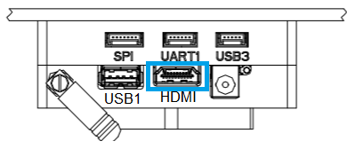

## PX4 Vision Autonomy Development Kit (Early Adopter Edition)

*PX4 Vision Autonomy DevKit*是一个稳定且性价比高的开发包，能够在自主车辆上开发计算机视觉。


这个工具包含有一个可以实时运行的碳纤维骨架四旋翼，配备*Pixhawk 4*飞控、*顶层*机载计算机，以及*Structure Core*和深度相机。 无人机上有来自PX4之外的 [避障](../computer_vision/obstacle_avoidance.md)和[防撞](../computer_vision/collision_prevention.md)软件。 开发者可以使用 PX4 避障项目提供的其他功能。 修改现有代码，或尝试全新的功能。

该指南阐述了无人机准备飞行所需的最低设置(需要遥控器系统和电池)。 它也包括如何起飞，以及如何修改代码。


## Warnings & Notifications

1. 不要直接使用电源为*顶层*计算机供电(可能会摧毁计算机)。 *顶层*计算机只能使用电池供电。

   

1. 该开发包使用前置摄像头，(它没有向下或后置深照相机)。 因此，它不能用于测试[安全着陆](../computer_vision/safe_landing.md)或其他需要下方摄像头的功能。

1. 只有在GPS工作正常时才能测试自主避障（飞行任务使用全球定位系统坐标）。 防撞功能可以在位置估计良好的条件下进行测试，比如GPS或光流有比较好的定位。

1. 如果使用*USB3*外设，`USB1`将会使得GPS阻塞。（会使依赖GPS的功能失效，包括飞行任务） 这是引导镜像从*USB2*内存卡上启动的原因。

## Getting to Know Your DevKit


DevKit 包含以下组件：
- 带有这些组件的 PX4 视觉无人机套件：
  - 1x Pixhawk 4 flight controller (with custom PX4 firmware)
  - 1x pmw3901 optical flow sensor
  - 1x distance sensor
  - 1x Structure Core depth camera
  - 1x *UP Core* computer (with Ubuntu and PX4 avoidance)
    - Atom CPU
    - FTDI UART connected to flight controller
    - `USB1`: USB3 A port used for booting PX4 avoidance environment from a USB2 stick (connecting a USB3 peripheral may jam GPS).
    - `USB2`: USB2 port on a JST-GH connector. Can be used for second camera, LTE, etc. (or keyboard/mouse during development).
    - `USB3`: USB2 JST-GH port connected to depth camera
    - `HDMI`: HDMI out
    - SD card slot
    - WiFi (attached to external antenna #1). Allows computer to access home WiFi network for Internet access/updates.
  - ESP8266 connected to flight controller (attached to external antenna #2). Enables wireless connection to the ground station.
- A USB2.0 stick with pre-flashed software that bundles:
  - Ubuntu 18.04 LTS
  - ROS Melodic
  - Occipital Structure Core ROS driver
  - MAVROS
  - PX4 Avoidance
- Assorted cables, propellers, and other accessories. To be used to attach additional peripherals.


## What Else do you Need?

除电池和遥控须要单独购买，该套件中包内有所有必要的无人机硬件
- Battery:
  - 4S LiPo with XT60 female connector
  - Less than 115mm long (to fit between power connector and GPS mast)
- Radio control system
  - Any [PX4-compatible RC System](../getting_started/rc_transmitter_receiver.md) can be used.
  - An *FrSky Taranis* transmitter with R-XSR receiver is one of the more popular setups.
- An H2.0 Hex Key (to unscrew the top plate so that an RC receiver can be connected)

In addition, users will need ground station hardware/software:
- Laptop or tablet running [QGroundControl](https://docs.qgroundcontrol.com/en/getting_started/download_and_install.html) (QGC).


## First-time Setup

1. 将接收机（套件中不包含）固定在无人机上，
   - 使用H2.0 十六进制键工具移除/取消顶部板块(在电池进入的地方)。
   - [将接收器连接到飞控](../assembly/quick_start_pixhawk4.md#radio-control)。
   - 重新安装上面的外壳。
   - 在无人机背部安装RC 接收器(使用双面胶或其他)。
   - 确保天线无障碍物阻挡并将天线和机架电隔离。例如，在减震板下方或机臂上。

1. 遥控和接收机配对(如果尚未完成的话)。 配对方法程序取决于接收机和遥控器（读取接收器手册）。
1. GPS需要高于无人机，并固定到底板。

   

1. 用充好电的电池的为车辆供电。

   > **注意** 电池连接前移除螺旋桨。
1. 使用 USB 线连接*Pixhawk 4* 和地面站。
1. 启动*QGroundControl*。
1. [配置/校准](../config/README.md) : > **Note** 无人机需要校准前需要完成，机架电池和其他传感器的安装。 您需要校准无线电系统 (您刚刚连接) 并且进行以下的基本检查。

   - [确认机架类型](../config/airframe.md)已设置为 **PX4 Vision Devkit Platform**。
   - [校准遥控](../config/radio.md)
   - [校准罗盘](../config/compass.md)
1. (可选) 在遥控上设置一个[飞行模式切换开关](../config/flight_mode.md)。

   > **Note** 模式也可以通过*QGroundControl*切换

   我们推荐的遥控设置为：
   - [定点模式](../flight_modes/position_mc.md) - 可以测试防撞的安全手动飞行模型
   - [任务模式](../flight_modes/mission.md) - 执行任务并测试避障。
   - [返回模式](../flight_modes/return.md) - 安全返回其发射点并降落。

1. 螺旋桨按照下面的方向安装：

   

   - 螺旋桨方向可以从标签中确定：*6045* (顺时针) 和_6045_**R** (逆时针)。

     

   - 将螺旋桨向下旋紧。

     


## Fly the Drone (with avoidance) {#fly_drone}

When the vehicle setup is complete:

1. Insert the pre-imaged USB2 stick from the kit into the *UP Core* port `USB1` (highlighted below).

   
1. Connect the battery to power the vehicle.

1. Wait until the boot sequence completes and the avoidance system has started (the vehicle will reject arming commands during boot).

   > **Tip** The boot/startup process takes about 2.5 minutes from USB stick (or 30 seconds from [internal memory](#install_image_mission_computer)).

1. Check that the avoidance system has started properly:

   - The *QGroundControl* notification log displays the message: **Avoidance system connected**.

     
   - A red laser is visible on the front of the *Structure Core* camera.
1. Wait for the GPS LED to turn green. This means that the vehicle has a GPS fix and is ready to fly!
1. Connect the ground station to the vehicle WiFi network using the following default credentials:
   - **SSID:** pixhawk4
   - **Password:** pixhawk4

   > **Note** WiFi network SSID, password, and other credentials may be changed after connecting (if desired), by using a web browser to open the URL: `http://192.168.4.1`. The baud rate must not be changed from 921600.

1. Find a safe outdoor location for flying, ideally with a tree or some other convenient obstacle for testing PX4 Vision.

1. To test [collision prevention](../computer_vision/collision_prevention.md), enable [Position Mode](../flight_modes/position_mc.md) and fly manually towards an obstacle. The vehicle should slow down and then stop within 6m of the obstacle (the distance can be [changed](../advanced_config/parameters.md) using the [CP_DIST](../advanced_config/parameter_reference.md#CP_DIST) parameter).

1. To test [obstacle avoidance](../computer_vision/obstacle_avoidance.md), create a mission where the path is blocked by an obstacle. Then switch to [Mission Mode](../flight_modes/mission.md) to run the mission, and observe the vehicle moving around the obstacle and then returning to the planned course.


## Development using the Kit

The following sections explain how to use the kit as an environment for developing computer vision software.

### PX4 Avoidance Overview

The *PX4 Avoidance* system consists of computer vision software running on a companion computer (with attached depth camera) that provides obstacle and/or route information to the PX4 flight stack running on a *flight controller*.

Documentation about the companion computer vision/planning software can be found on github here: [PX4/avoidance](https://github.com/PX4/avoidance#obstacle-detection-and-avoidance). The project provides a number of different planner implementations (packaged as ROS nodes):
- The PX4 Vision Kit runs the *localplanner* by default and this is the recommended starting point for your own software.
- The *globalplanner* has not been tested with this kit.
- The *landing planner* requires a downward facing camera, and cannot used without first modifying the camera mounting.

PX4 and the companion computer exchange data over [MAVLink](https://mavlink.io/en/) using these interfaces:
- [Path Planning Interface](../computer_vision/path_planning_interface.md) - API for implementing avoidance features in automatic modes.
- [Collision Prevention Interface](../computer_vision/collision_prevention.md) - API for vehicle based avoidance in manual position mode based on an obstacle map (currently used for collision prevention).


### Installing the image on the Companion Computer {#install_image_mission_computer}

You can install the image on the *UP Core* and boot from internal memory (instead of the USB).

> **Tip** This is recommended because booting from internal memory is much faster (~30 seconds vs 2.5 minutes), it frees up a USB port, and may well provide more memory than your USB stick.

To flash the USB image to the *UP Core*:

1. Insert the pre-flashed USB drive into the *UP Core* port labeled `USB1`.
1. [Login to the companion computer](#login_mission_computer) (as described above).
1. Open a terminal and run the following command to copy the image onto internal memory (eMMC). The terminal will prompt for a number of responses during the flashing process.
   ```sh
   cd ~/catkin_ws/src/px4vision_ros
   sudo ./flash_emmc.sh
   ```

   > **Note** All information saved in the *UP Core* computer will be removed when executing this script

1. Pull out the USB stick.
1. Restart the vehicle. The *UP Core* computer will now boot from internal memory (eMMC).


### Boot the Companion Computer {#boot_mission_computer}

First insert the provided USB2 stick into the *UP Core* port labeled `USB1`, and then power the vehicle using a 4S battery. The avoidance system should start within about 2.5 minutes.

> **Tip** [Fly the Drone (with avoidance)](#fly_drone) additionally explains how to verify that the avoidance system is active.

If you've already [installed the image on the companion computer](#install_image_mission_computer) you can just power the vehicle (i.e. no USB stick is needed). The avoidance system should be up and running within around 30 seconds.

Once started the companion computer can be used both as a computer vision development environment and for running the software.


### Login to the Companion Computer {#login_mission_computer}

To login to the companion computer:
1. Connect a keyboard and mouse to the *UP Core* via port `USB2`:

   
   - Use the USB-JST cable from the kit to get a USB A connector

     
   - A USB hub can be attached to the cable if the keyboard and mouse have separate connectors.
1. Connect a monitor to the *UP Core* HDMI port.

   

   The Ubuntu login screen should then appear on the monitor.
1. Login to the *UP Core* using the credentials:
   - **Username:** px4vision
   - **Password:** px4vision


### Developing/Extending PX4 Avoidance

The PX4 Vision’s *UP Core* computer provides a complete and fully configured environment for extending PX4 Avoidance software (and more generally, for developing new computer vision algorithms using ROS2). You should develop and test your software on the vehicle, sync it to your own git repository, and share any fixes and improvements with the wider PX4 community on the github [PX4/Avoidance](https://github.com/PX4/avoidance) repo.

The catkin workspace is at `~/catkin_ws`, and is preconfigured for running the PX4 avoidance local planner. The launch-from-boot file (`avoidance.launch`) is in the `px4vision_ros` package (modify this file to change what planner is launched).

The avoidance package is started on boot. To integrate a different planner, this needs to be disabled.

1. Disable the avoidance process using the following command:
   ```sh
   systemctl stop avoidance.service
   ```
   You can simply reboot the machine to restart the service.

   Other useful commands are:
   ```sh
   # restart service
   systemctl start avoidance.service

   # disable service (stop service and do not restart after boot)
   systemctl disable avoidance.service

   # enable service (start service and enable restart after boot)
   systemctl enable avoidance.service  
   ```

1. The source code of the obstacle avoidance package can be found in https://github.com/PX4/avoidance which is located in `~/catkin_ws/src/avoidance`.

1. Make changes to the code! To get the latest code of avoidance pull the code from the avoidance repo:
   ```sh
   git pull origin
   git checkout origin/master
   ```
1. Build the package
   ```
   catkin build local_planner
   ```

The ROS workspace is placed in `~/catkin_ws`. For reference on developing in ROS and using the catkin workspace, see the [ROS catkin tutorials](http://wiki.ros.org/catkin/Tutorials).


### Developing PX4 Firmware

The kit is designed for creating computer vision software that runs on the companion computer, and which integrates with PX4’s flexible path planning and collision prevention interfaces.

Modification of PX4 code is not needed to meet most computer vision use cases. To discuss the interfaces or how to integrate other features join the PX4 slack channel: #computer-vision.

> **Note** Firmware modification is not recommended in the *Early Adopter Edition* (we suggest that you use the shipped version).

## Other Development Resources

- [*UP Core* Wiki ](https://wiki.up-community.org/Ubuntu) - companion computer technical information
- [Occipital Developer Forum](https://structure.io/developers) - *Structure Core* camera information
- [Pixhawk 4 Overview](../flight_controller/pixhawk4.md)
- [PX4 Avoidance software/documentation](https://github.com/PX4/avoidance)
- [Path Planning Interface](../computer_vision/path_planning_interface.md)


## How to get Technical Support?

For hardware issues, please contact Holybro at: [productservice@holybro.com](mailto:productservice@holybro.com).

For software issues, use the following [community support channels](README.md#support):
- PX4 discuss: [Computer Vision](https://discuss.px4.io/c/Vision-based-navigation-and-obstacle-avoidance) category.
- PX4 slack channel: #avoidance

