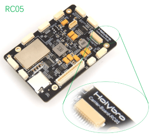
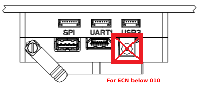
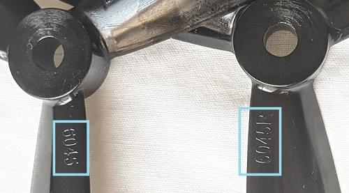

# PX4 Vision 视觉自主开发套件

The [_PX4 Vision Autonomy Development Kit_](https://holybro.com/collections/multicopter-kit/PX4-Vision) is a robust and inexpensive kit for enabling computer vision development on autonomous vehicles.


The kit contains a near-ready-to-fly carbon-fiber quadcopter equipped with a _Pixhawk 4_ or _Pixhawk 6C_ (on V1.5) flight controller, a _UP Core_ companion computer (4GB memory & 64GB eMMC), and a Occipital _Structure Core_ depth camera sensor.

:::note
该无人机发货时没有预先安装软件。 A USB stick is included in the kit with an example of an [obstacle avoidance](../computer_vision/obstacle_avoidance.md) feature implementation, based on the [PX4 Avoidance](https://github.com/PX4/PX4-Avoidance) project. This example is intended as a reference only and serves to demonstrate the capabilities of the platform. The software is not compatible with the latest version of PX4, nor is it actively maintained or supported.
:::

该指南阐述了无人机准备飞行所需的最少附加步骤（安装遥控器系统和电池等）。 也包括如何起飞，以及如何修改计算机视觉代码。

## Where to Buy

- [PX4 Vision Dev Kit v1.5](https://holybro.com/collections/multicopter-kit/products/px4-vision-dev-kit-v1-5)
- [PX4 Vision Dev Kit v1 (Discontinued)](https://holybro.com/collections/multicopter-kit/products/px4-vision)

## 警告&通知

- [警告&通知](#warnings-and-notifications)
- [包装内容](#what-is-inside)
- [其他注意事项](#what-else-do-you-need)
- [首次使用](#first-time-setup)
- [试飞无人机（带避障）](#fly-the-drone-with-avoidance)
- [使用套件开发](#development-using-the-kit)
- [PX4 Vision Carrier Board Pinouts](#px4-vision-carrier-board-pinouts)
- [其他拓展资源](#other-development-resources)
- [如何获得技术支持](#how-to-get-technical-support)

## 开始了解你的开发套件

1. 不要直接使用电源为 *UP Core* 计算机供电（可能会摧毁计算机）。 *UP Core* 只能使用电池供电。
1. Obstacle avoidance in missions can only be tested when GPS is available (missions use GPS coordinates). 因此，它不能用于测试 [安全着陆](../computer_vision/safe_landing.md) 或其他需要下方摄像头的功能。
1. 只有在 GPS 工作正常时才能测试任务模式中的自主避障（飞行任务需要使用 GPS 配合）。 防撞功能需要在可获得位置的模式下进行测试，比如GPS或光流有比较好的定位。
1. PX4 Vision v1 with ECN 010 or above (carrier board RC05 and up), the _UP Core_ can be powered by either the DC plug or with battery.

    

1. All PX4 Vision v1.5 _UP Core_ can be powered by either the DC plug or with battery.

:::warning
For PX4 Vision v1 with ECN below 010/carrier board below RC04, the _UP Core_ should only be powered using the battery (do not remove the _UP Core power_ socket safety cover). This does not apply to PX4 Vision v1.5


:::

## 包装内容

:::note
Difference between the PX4 Vision V1 and V1.5 can be found [here](https://docs.holybro.com/drone-development-kit/px4-vision-dev-kit-v1.5/v1-and-v1.5-difference)
:::


What's inside the PX4 Vision V1 can be found here in the [PX4 v1.13 Docs here](https://docs.px4.io/v1.13/en/complete_vehicles/px4_vision_kit.html#what-is-inside).

当无人机按上述安装完成时：

- 核心组件：

  - 1x Pixhawk 4 or Pixhawk 6C (for v1.5) flight controller
  - 一个 PMW3901 光流传感器
  - 一个 TOF 红外距离传感器(PSK‐CM8JL65‐CC5)
  - 一个 Structure Core 深度相机
    - 160 深度视图摄像机
    - 立体红外摄像头
    - 板载传感器
    - 强大的 NU3000 多核深度处理器
  - 一个 *UP Core* 计算机 (4GB 内存；64GB eMMC 带 Ubuntu 系统和 PX4 避障)
    - Intel® AtomTM x5-z8350 (up to 1.92 GHz)
    - 兼容的操作系统: Microsoft Windows 10 完整版本, Linux (ubilinux, Ubuntu, Yocto), Android
    - FTDI UART 连接到飞控
    - `USB1`：USB3-A 接口被用来从 USB2.0 储存器启动 PX4 避障环境（连接到 USB3.0 外设可能会导致GPS无法使用）。
    - `USB2`：USB 2.0 接口，用于连接 JST-GH 插接件。 Can be used for second camera, LTE, etc. (or keyboard/mouse during development).
    - `USB3`：USB 2.0 JST-GH 端口连接到深度摄像头
    - `HDMI`：HDMI 输出
    - SD 卡插槽
    - WiFi 802.11 b/g/n @ 2.4 GHz (连接到外部1号天线)。 允许计算机进行 WiFi 家庭网络访问/更新。

- 机械规格：

  - 框架：全 5mm 3k 碳纤纹
  - Motors: T-MOTOR KV1750
  - 电调: BEHEli-S 20A ESC
  - GPS: M8N GPS module
  - 电源模块： Holybro PM07
  - 轴距：286毫米
  - 重量：854克（无电池和桨）
  - 数传：连接飞行控制器的ESP8266（连接外部2号天线）。 实现与地面站的无线连接。

- A USB2.0 stick with pre-flashed software that bundles:

  - Ubuntu 18.04 LTS
  - ROS Melodic
  - Occipital Structure Core 相机 ROS 驱动
  - MAVROS
  - [PX4 Avoidance 避障库](https://github.com/PX4/PX4-Avoidance)

- 各种导线、8个螺旋桨、2个电池带（已安装）和其他附件（可用于连接其他外围设备）。

## 其他注意事项

以下各节说明如何将工具包用作开发计算机视觉软件的环境。

- 电池：
  - 带 XT60 母头的 4S 锂电池
  - 长度小于115毫米（以适合电源插座和 GPS 支架之间的空间）
- 无线电控制系统
  - 可以使用各种 [PX4 兼容的遥控系统](../getting_started/rc_transmitter_receiver.md)。
  - 带有 R-XSR 接收机的 *FrSky Taranis* 发射机是一个受欢迎的配置。
- 一个 H2.0 头的内六角螺丝刀（用来打开顶部的螺丝来安装接收机）

*PX4 避障* 系统由计算机视觉软件组成，这种软件运行在一个配套的计算机上(附着的深度摄像头)，为运行在一个 *飞控上的 PX4 飞行堆栈提供障碍和/或航线信息*

- Laptop or tablet running [QGroundControl](https://docs.qgroundcontrol.com/master/en/getting_started/download_and_install.html) (QGC).

## 首次使用

1. Attach a [compatible RC receiver](../getting_started/rc_transmitter_receiver.md#connecting-receivers) to the vehicle (not supplied with kit):

   - Remove/unscrew the top plate (where the battery goes) using an H2.0 hex key tool.
   - [Connect the receiver to the flight controller](../assembly/quick_start_pixhawk4.md#radio-control).
   - Re-attach the top plate.
   - Mount the RC receiver on the _UP Core_ carrier board plate at the back of the vehicle (use zipties or double-sided tape).
   - Ensure the antennas are clear of any obstructions and electrically isolated from the frame (e.g. secure them under the carrier board or to the vehicle arms or legs).

1. [Bind](../getting_started/rc_transmitter_receiver.md#binding) the RC ground and air units (if not already done). The binding procedure depends on the specific radio system used (read the receiver manual).
1. Raise the GPS mast to the vertical position and screw the cover onto the holder on the base plate. (Not required for v1.5)

   

1. Insert the pre-imaged USB2.0 stick from the kit into the _UP Core_ port labeled `USB1` (highlighted below).

   

1. Power the vehicle with a fully charged battery. :::note
Ensure propellers are removed before connecting the battery.
:::
1. Connect the ground station to the vehicle WiFi network (after a few seconds) using the following default credentials:

   - **SSID:** pixhawk4
   - **Password:** pixhawk4

:::tip
WiFi network SSID, password, and other credentials may be changed after connecting (if desired), by using a web browser to open the URL: `http://192.168.4.1`. The baud rate must not be changed from 921600.
:::

1. Start _QGroundControl_ on the ground station.
1. [Configure/calibrate](../config/README.md) the vehicle:

   :::note
The vehicle should arrive pre-calibrated (e.g. with firmware, airframe, battery, and sensors all setup).
You will however need to calibrate the radio system (that you just connected) and it is often worth re-doing the compass calibration.
:::

   - [Calibrate the Radio System](../config/radio.md)
   - [Calibrate the Compass](../config/compass.md)

1. (Optional) Configure a [Flight Mode selector switch](../config/flight_mode.md) on the remote controller.

:::note
Modes can also be changed using _QGroundControl_
:::

   We recommend RC controller switches are define for:

   - [Position Mode](../flight_modes_mc/position.md) - a safe manual flight mode that can be used to test collision prevention.
   - [Mission Mode](../flight_modes_mc/mission.md) - run missions and test obstacle avoidance.
   - [Return Mode](../flight_modes/return.md) - return vehicle safely to its launch point and land.

1. Attach the propellers with the rotations as shown:

   

   - The propellers directions can be determined from the labels: _6045_ (normal, counter-clockwise) and _6045_**R** (reversed, clockwise).

     

   - Screw down firmly using the provided propellor nuts:

     

## 测试飞行（带避障）

*PX4 避障* 系统由计算机视觉软件组成，这种软件运行在一个配套的计算机上(附着的深度摄像头)，向运行在 *飞行控制器* 上的PX4飞行堆栈提供障碍和/或路线信息。

1. Connect the battery to power the vehicle.

1. Wait until the boot sequence completes and the avoidance system has started (the vehicle will reject arming commands during boot).

:::tip
The boot/startup process takes around 1 minute from the supplied USB stick (or 30 seconds from [internal memory](#install_image_mission_computer)).
:::

1. Check that the avoidance system has started properly:

   - The _QGroundControl_ notification log displays the message: **Avoidance system connected**.

     

   - A red laser is visible on the front of the _Structure Core_ camera.

1. Wait for the GPS LED to turn green. This means that the vehicle has a GPS fix and is ready to fly!
1. Connect the ground station to the vehicle WiFi network.
1. Find a safe outdoor location for flying, ideally with a tree or some other convenient obstacle for testing PX4 Vision.

1. To test [collision prevention](../computer_vision/collision_prevention.md), enable [Position Mode](../flight_modes_mc/position.md) and fly manually towards an obstacle. The vehicle should slow down and then stop within 6m of the obstacle (the distance can be [changed](../advanced_config/parameters.md) using the [CP_DIST](../advanced_config/parameter_reference.md#CP_DIST) parameter).

1. To test [obstacle avoidance](../computer_vision/obstacle_avoidance.md), create a mission where the path is blocked by an obstacle. Then switch to [Mission Mode](../flight_modes_mc/mission.md) to run the mission, and observe the vehicle moving around the obstacle and then returning to the planned course.

## 使用套件开发

The following sections explain how to use the kit as an environment for developing computer vision software.

### PX4 避障概述

您可以在 *UP Core* 上安装镜像，并从内部内存启动(而不是U盘)。

Documentation about the companion computer vision/planning software can be found on github here: [PX4/PX4-Avoidance](https://github.com/PX4/PX4-Avoidance). The project provides a number of different planner implementations (packaged as ROS nodes):

- The PX4 Vision Kit runs the _localplanner_ by default and this is the recommended starting point for your own software.
- The _globalplanner_ has not been tested with this kit.
- The _landing planner_ requires a downward facing camera, and cannot used without first modifying the camera mounting.

将USB镜像刷新到UP Core：

- [Path Planning Interface](../computer_vision/path_planning_interface.md) - API for implementing avoidance features in automatic modes.
- 加载新固件后选择 *PX4 Vision DevKit* 机架：

<a id="install_image_mission_computer"></a>

### 在机载计算机上安装镜像

You can install the image on the _UP Core_ and boot from internal memory (instead of the USB stick).

要将USB映像刷到 *UP Core* ：

首先将提供的 USB2.0 U盘插入标有 `USB1` 的 *UP Core* 端口，然后使用4S电池为无人机供电。 避障系统应在大约1分钟内启动(这取决于所提供的U盘)。

To flash the USB image to the _UP Core_:

1. Insert the pre-flashed USB drive into the _UP Core_ port labeled `USB1`.
1. [Login to the companion computer](#login_mission_computer) (as described above).
1. Open a terminal and run the following command to copy the image onto internal memory (eMMC). The terminal will prompt for a number of responses during the flashing process.

   ```sh
   cd ~/catkin_ws/src/px4vision_ros/tools
   sudo ./flash_emmc.sh
   ```

:::note
All information saved in the _UP Core_ computer will be removed when executing this script.
:::

1. Pull out the USB stick.
1. Restart the vehicle. The _UP Core_ computer will now boot from internal memory (eMMC).

### Boot the Companion Computer

PX4 视觉的 *UP Core* 计算机为扩展PX4规避软件（以及更广泛地用于使用ROS2开发新的计算机视觉算法）提供了完整且配置完整的环境。 您可以在无人机上开发和测试您的软件，将其同步到自己的git存储库，并在github [PX4/Avoidance](https://github.com/PX4/avoidance) 存储库上与更广泛的PX4社区共享所有修复和改进。

:::tip
[Fly the Drone with Avoidance](#fly-the-drone-with-avoidance) additionally explains how to verify that the avoidance system is active.
:::

If you've already [installed the image on the companion computer](#install_image_mission_computer) you can just power the vehicle (i.e. no USB stick is needed). The avoidance system should be up and running within around 30 seconds.

Once started the companion computer can be used both as a computer vision development environment and for running the software.

<a id="login_mission_computer"></a>

### 登录机载计算机

To login to the companion computer:

1. Connect a keyboard and mouse to the _UP Core_ via port `USB2`:

   

   - Use the USB-JST cable from the kit to get a USB A connector

     

   - A USB hub can be attached to the cable if the keyboard and mouse have separate connectors.

1. Connect a monitor to the _UP Core_ HDMI port.

   

   The Ubuntu login screen should then appear on the monitor.

1. Login to the _UP Core_ using the credentials:

   - **Username:** px4vision
   - **Password:** px4vision

### 开发/扩展 PX4 避障功能

避障程序包在引导时启动。 You should develop and test your software on the vehicle, sync it to your own git repository, and share any fixes and improvements with the wider PX4 community on the github [PX4/PX4-Avoidance](https://github.com/PX4/PX4-Avoidance) repo.

ROS 工作区位于 `~/catkin_ws`。 有关在 ROS 中进行开发以及使用 catkin 工作区的参考，请参见 [ROS catkin教程](http://wiki.ros.org/catkin/Tutorials)。

The avoidance package is started on boot. To integrate a different planner, this needs to be disabled.

1. Disable the avoidance process using the following command:

   ```sh
   systemctl stop avoidance.service
   ```

   You can simply reboot the machine to restart the service.

   Other useful commands are:

   ```sh
   # restart service
   systemctl start avoidance.service

   # disable service (stop service and do not restart after boot)
   systemctl disable avoidance.service

   # enable service (start service and enable restart after boot)
   systemctl enable avoidance.service
   ```

1. The source code of the obstacle avoidance package can be found in https://github.com/PX4/PX4-Avoidance which is located in `~/catkin_ws/src/avoidance`.

1. Make changes to the code! To get the latest code of avoidance pull the code from the avoidance repo:

   ```sh
   git pull origin
   git checkout origin/master
   ```

1. Build the package

   ```sh
   catkin build local_planner
   ```

The ROS workspace is placed in `~/catkin_ws`. For reference on developing in ROS and using the catkin workspace, see the [ROS catkin tutorials](http://wiki.ros.org/catkin/Tutorials).

### 开发 PX4 固件

The kit is designed for creating computer vision software that runs on the companion computer, and which integrates with PX4’s flexible path planning and collision prevention interfaces.

可从 [Holybro的网站](http://www.holybro.com/manual/PX4_Vision_carrier_board_pinouts_v1.1.pdf) 下载载板的引脚 。

- You will need to connect _QGroundControl_ to the kit's _Pixhawk_ **via USB** in order to update firmware.
- Select the _PX4 Vision DevKit_ airframe after loading new firmware: 

:::note
Modification of PX4 code is not _needed_ to meet most computer vision use cases. To discuss the interfaces or how to integrate other features join the [PX4 support channels](../contribute/support.md).
:::

## PX4 Vision Carrier Board Pinouts

Information for the PX4 Vision 1.15 can be found at [https://docs.holybro.com](https://docs.holybro.com/drone-development-kit/px4-vision-dev-kit-v1.5). The carrier board pinouts and other information are in the [downloads section](https://docs.holybro.com/drone-development-kit/px4-vision-dev-kit-v1.5/downloads).

## 如何获得技术支持？

- [_UP Core_ Wiki](https://github.com/up-board/up-community/wiki/Ubuntu) - _Up Core_ companion computer technical information
- [Occipital Developer Forum](https://structure.io/developers) - _Structure Core_ camera information
- [Pixhawk 4 Overview](../flight_controller/pixhawk4.md)
- [Pixhawk 6C Overview](../flight_controller/pixhawk6c.md)
- [PX4 Avoidance software/documentation](https://github.com/PX4/PX4-Avoidance)
- [Path Planning Interface](../computer_vision/path_planning_interface.md)

## 如何获得技术支持

For hardware issues, please contact Holybro at: [productservice@holybro.com](mailto:productservice@holybro.com).

For software issues, use the following community support channels:

- [Holybro PX4 Vision Wikifactory](https://wikifactory.com/+holybro/px4-vision)
- [PX4 Support channels](../contribute/support.md)
