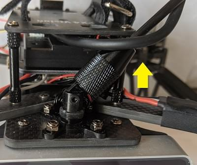
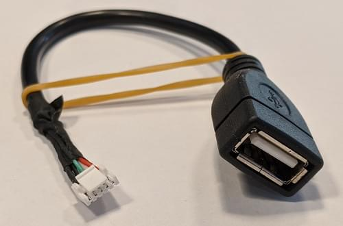

## PX4 Vision 自主无人机开发套件（先行者版）

*PX4视觉自主开发套件*是一个稳定且高性价比的套件，让你能够在自动化无人机上开发计算机视觉。


这个套件含有一个几乎到手即飞的碳纤维机架四旋翼，配备 *Pixhawk 4* 飞控、*UP Core*机载计算机，以及*Structure Core*深度相机。 无人机上启用了用于PX4的[避障](../computer_vision/obstacle_avoidance.md)和[防撞](../computer_vision/collision_prevention.md)软件，开箱即用。 开发者可以使用 PX4 避障项目提供的其他功能。 修改现有代码，或尝试全新的功能。

该指南阐述了无人机准备飞行所需的最少附加步骤（安装遥控器系统和电池等）。 也包括如何起飞，以及如何修改计算机视觉代码。

## 警告&通知

Purchase link and more information about this kit [can be found here](http://www.holybro.com/product/px4-vision/).

## 开始了解你的开发套件

1. 不要直接使用电源为 *UP Core* 计算机供电（可能会摧毁计算机）。 *UP Core* 只能使用电池供电。

1. 该开发包使用前置摄像头，（它没有向下或后置深照相机）。 因此，它不能用于测试 [安全着陆](../computer_vision/safe_landing.md) 或其他需要下方摄像头的功能。

1. 只有在 GPS 工作正常时才能测试任务模式中的自主避障（飞行任务需要使用 GPS 配合）。 防撞功能需要在可获得位置的模式下进行测试，比如GPS或光流有比较好的定位。

1. *UP Core* 只能使用电池供电(请勿卸下 *UP Core* 电源安全盖)。

   

## 你需要什么其他的东西


该套件中包含了必要的无人机硬件，电池和遥控须要单独购买：
- 带有如下组件的 PX4 视觉无人机套件：
  - 一个Pixhawk 4飞控（包含定制化的PX4固件）
  - 一个 PMW3901 光流传感器
  - 一个距离传感器
  - 一个 Structure Core 深度相机
  - 一个 *UP Core* 计算机（预装 Ubuntu 和 PX4 避障库）
    - Atom CPU
    - FTDI UART 连接到飞控
    - `USB1`：USB3-A 接口被用来从 USB2.0 储存器启动 PX4 避障环境（连接到 USB3.0 外设可能会导致GPS无法使用）。
    - `USB2`：USB 2.0 接口，用于连接 JST-GH 插接件。 可以用于第二个相机，LTE模块等。 （或开发期间使用的键盘/鼠标）。
    - `USB3`：USB 2.0 JST-GH 端口连接到深度摄像头
    - `HDMI`：HDMI 输出
    - SD 卡插槽
    - WiFi（连在外置天线 #1）。 允许计算机进行 WiFi 家庭网络访问/更新。
  - ESP8266 连接到飞控（连在外部天线#2）。 实现与地面站的无线连接。
- 一个预先烧录捆绑软件的 USB2.0 储存棒：
  - Ubuntu 18.04 LTS
  - ROS Melodic
  - Occipital Structure Core 相机 ROS 驱动
  - MAVROS
  - [PX4 避障](https://github.com/PX4/avoidance#obstacle-detection-and-avoidance)
- 各式电缆、推进器和其他配件（可用于附加外设）。


## 其他注意事项

该套件中包含了必要的无人机硬件，电池和遥控须要单独购买：
- 电池：
  - 带 XT60 母头的 4S 锂电池
  - 长度小于115毫米（以适合电源插座和 GPS 支架之间的空间）
- 无线电控制系统
  - 可以使用各种 [PX4 兼容的遥控系统](../getting_started/rc_transmitter_receiver.md)。
  - 带有 R-XSR 接收机的 *FrSky Taranis* 发射机是一个受欢迎的配置。
- 一个 H2.0 头的内六角螺丝刀（用来打开顶部的螺丝来安装接收机）

此外，用户也需要地面站硬件/软件：
- 可运行 [QGC地面站（QGroundControl）](https://docs.qgroundcontrol.com/en/getting_started/download_and_install.html) 的笔记本电脑或者平板。


## 首次使用

1. 将接收机（套件中不包含）固定在无人机上，
   - 使用 H2.0 头的内六角螺丝刀移除/取消顶部板块(在电池进入的地方)。
   - [将接收器连接到飞控](../assembly/quick_start_pixhawk4.md#radio-control)。
   - 重新安装上面的外壳。
   - 在无人机背部安装RC 接收器(使用双面胶或其他)。
   - 确保天线无障碍物阻挡并将天线和机架电隔离。例如，在减震板下方或机臂上。

1. 遥控和接收机配对(如果尚未完成的话)。 配对方法程序取决于接收机和遥控器（读取接收器手册）。
1. GPS需要高于无人机，并固定到底板。

   

1. 将套件中预先烧录好镜像的U盘插入 *UP Core* 的端口 `USB1` （下面高亮的）

   
1. 用充好电的电池的为无人机供电。

   > **Note** 电池连接前移除螺旋桨。
1. 使用以下默认凭据将地面站连接到无人机WiFi网络（几秒钟后）：
   - **SSID：** pixhawk4
   - **密码：** pixhawk4

   > **提示** WiFi网络 SSID、密码和其他凭据可以在连接后更改(如果需要), 使用 web 浏览器打开 URL： `http://192. 68.4.1` 波特率不得从921600更改。

1. 在地面站启动 *QGroundControl*。
1. [配置/校准](../config/README.md) 无人机：

   > **Note** 无人机要进行预先校准(例如使用固件、机架、电池和传感器所有安装)。 您需要校准无线电系统 (您刚刚连接) 并且进行以下的基本检查。

   - [校准遥控](../config/radio.md)
   - [校准罗盘](../config/compass.md)
1. (可选) 在遥控上设置一个 [飞行模式切换开关](../config/flight_mode.md)。

   > **Note** 模式也可以通过 *QGroundControl</1 >切换</p> </blockquote> 
   > 
   > 我们推荐的遥控设置为：</li> 
   > 
   > - [定点模式](../flight_modes/position_mc.md) - 可以测试防撞的安全手动飞行模型
   > 
   > - [任务模式](../flight_modes/mission.md) - 执行任务并测试避障。
   > - [返航模式](../flight_modes/return.md) - 安全返回其发射点并降落。</ul> 
   > 
   > 1. 螺旋桨按照下面的方向安装：
   >     
   >     
   > 
   > - 螺旋桨方向可以从标签中确定：*6045* (顺时针) 和_6045_**R** (逆时针)。
   >     
   >     
   > 
   > - 使用随附的螺旋桨螺母将其拧紧：
   >     
   >     
   > 
   > <span id="fly_drone"></span> 
   > 
   > ## 测试飞行（带避障）
   > 
   > 当无人机按上述安装完成时：
   > 
   > 1. 连接电池来给无人机供电
   > 
   > 2. 等到启动序列完成，并且避障系统已经启动（正在启动过程中时，飞机会拒绝解锁）
   >     
   >     > **Tip** 从U盘启动/开始的流程大概会要1分钟（从内部存储大概需要30s）
   > 
   > 3. 检查避障系统是否已经正常启动
   > 
   > - *QGroundControl* 通知日志显示消息： **避障系统已连接**。
   >     
   >     
   > 
   > - 可以在 *Structure Core* 摄像头前面看到红色光线。
   >     
   >     1. 等待 GPS 的 LED 变成绿色。 这意味着无人机的GPS已定位并且准备好起飞！
   > 
   > 1. 将地面站与无人机WiFi连接。
   > 2. 找到一个安全的户外位置进行飞行，最好是用树或其他方便的障碍测试PX4视觉。
   > 
   > 3. 测试 [防止碰撞](../computer_vision/collision_prevention.md), 启用 [位置模式](../flight_modes/position_mc.md) 并手动向障碍飞行。 无人机应减速，然后在障碍物距离小于6米时悬停(通过 [CP_DIST](../advanced_config/parameter_reference.md#CP_DIST) 参数，距离 [可调整](../advanced_config/parameters.md)  )。
   > 
   > 4. 要测试 [避障](../computer_vision/obstacle_avoidance.md)，创建一个被障碍阻止的路径。 然后切换到 [任务模式](../flight_modes/mission.md) 来运行任务。并观察无人机绕开障碍物，然后返回计划路线。
   > 
   > ## 使用套件开发
   > 
   > 以下各节说明如何将工具包用作开发计算机视觉软件的环境。
   > 
   > ### PX4 Avoidance Overview
   > 
   > *PX4 避障* 系统由计算机视觉软件组成，这种软件运行在一个配套的计算机上(附着的深度摄像头)，为运行在一个 *飞控上的 PX4 飞行堆栈提供障碍和/或航线信息*
   > 
   > 关于配套计算机视觉/规划软件的文档可以在 github 上找到： [PX4/avoidcen](https://github.com/PX4/avoidance#obstacle-detection-and-avoidance)。 该项目提供了许多不同的规划程序实现（打包为ROS节点）：
   > 
   > - 默认情况下，PX4 Vision Kit运行 *localplanner* ，这是您自己的软件的推荐起点。
   > - *globalplanner* 尚未用这个工具包测试。
   > - *降落计划器* 需要一个向下的摄像头，并且必须先修改相机的安装座才能使用。
   > 
   > PX4 和配套的计算机使用如下接口通过 [MAVLink](https://mavlink.io/en/) 交换数据：
   > 
   > - [路径规划接口](../computer_vision/path_planning_interface.md) - API 用于实现自动模式中的避障功能。
   > - [防撞接口](../computer_vision/collision_prevention.md) - 基于无人机避障的API，在基于障碍地图的手动位置模式下(目前用于防撞)。
   > 
   > <span id="install_image_mission_computer"></span> 
   > 
   > ### 在机载计算机上安装镜像
   > 
   > 您可以在 *UP Core* 上安装镜像，并从内部内存启动(而不是U盘)。
   > 
   > 建议这样做是因为从内部内存启动得更快。 释放USB端口，也能提供比U盘更多的内存。 
   > 
   > > **Note** 从内部存储器启动大约需要30秒，而从随附的USB2盘启动大约需要一分钟（其他卡可能要花几倍的时间）。
   > 
   > 将USB镜像刷新到UP Core：
   > 
   > 1. 将预先烧录的USB驱动器插入标有 `USB1` 的 *UP Core* 端口中。
   > 2.登录到配套计算机<0> （如上所述）。</li> 
   >     
   >     - 打开终端，然后运行以下命令将映像复制到内部存储器（eMMC）。 终端将在刷新过程中提示您一些响应。 
   >         
   >         
   ```sh
   cd ~/catkin_ws/src/px4vision_ros
   sudo ./flash_emmc.sh
   ```

   >     
   >     > **Note** 保存到 *UP Core* 计算机的所有信息将在执行此脚本时被删除
   > 
   > - 拔出U盘。
   > 
   > - 重启无人机， *UP Core* 计算机现在将从内部内存（eMMC）引导。</ol> 
   > <span id="boot_mission_computer"></span> 
   > 
   > ### 开启机载计算机
   > 
   > 首先插入所提供的 USB2.0 盘 *UP 核心* 端口标签 `USB1` 然后用4S电池给无人机供电。 避障系统应在大约1分钟内启动(这取决于所提供的U盘)。
   > 
   > > **提示** [ 飞行无人机(带避障)](#fly_drone) 另外解释了如何验证避障系统是否有效。
   > 
   > 如果您已经在机载计算机上安装了 [镜像](#install_image_mission_computer) 您只需为该无人机供电(即不需要U盘)。 避障系统应在30秒内启动并运行。
   > 
   > 机载计算机一旦启动，就可以用作计算机视力开发环境和运行软件的环境。
   > 
   > <span id="login_mission_computer"></span> 
   > 
   > ### 登录机载计算机
   > 
   > 登录到机载计算机:
   > 
   > 1. 通过端口 `USB2` 将键盘和鼠标连接到 *UP Core*：
   >     
   >     
   > 
   > - 使用套件中的 USB-JST电缆获取一个 USB A 连接器
   >     
   >     
   > 
   > - 如果键盘和鼠标具有单独的接口，则可以将USB集线器连接到电缆。
   >     
   >     1. 连接显示器到 *UP Core* 的 HDMI 接口。
   >     
   >     
   >     Ubuntu 登录屏幕应显示在显示器上。 
   > 
   > 1. 使用凭据登录到 *UP Core* 
   >     - **用户名：**px4vision
   >     - **密码：**px4vision
   > 
   > ### 开发/扩展 PX4 避障功能
   > 
   > PX4 视觉的 *UP Core* 计算机为扩展PX4规避软件（以及更广泛地用于使用ROS2开发新的计算机视觉算法）提供了完整且配置完整的环境。 您可以在无人机上开发和测试您的软件，将其同步到自己的git存储库，并在github [PX4/Avoidance](https://github.com/PX4/avoidance) 存储库上与更广泛的PX4社区共享所有修复和改进。
   > 
   > Catkin工作区是 `~/catkin_ws`,并且已预先配置为运行PX4避障本地计划程序。 The launch-from-boot file (`avoidance.launch`) is in the `px4vision_ros` package (modify this file to change what planner is launched).
   > 
   > The avoidance package is started on boot. To integrate a different planner, this needs to be disabled.
   > 
   > 1. Disable the avoidance process using the following command: 
   >     
   >     
   ```sh
   systemctl stop avoidance.service
   ```

   > 
   > You can simply reboot the machine to restart the service.
   > 
   > Other useful commands are: 
   > 
   > 
   ```sh
   # restart service
   systemctl start avoidance.service

   # disable service (stop service and do not restart after boot)
   systemctl disable avoidance.service

   # enable service (start service and enable restart after boot)
   systemctl enable avoidance.service  
   ```


2. The source code of the obstacle avoidance package can be found in https://github.com/PX4/avoidance which is located in `~/catkin_ws/src/avoidance`.

3. Make changes to the code! To get the latest code of avoidance pull the code from the avoidance repo: 
    
    
   ```sh
   git pull origin
   git checkout origin/master
   ```


4. Build the package 
    
    
   ```
   catkin build local_planner
   ```


The ROS workspace is placed in `~/catkin_ws`. For reference on developing in ROS and using the catkin workspace, see the [ROS catkin tutorials](http://wiki.ros.org/catkin/Tutorials).

### 开发 PX4 固件

The kit is designed for creating computer vision software that runs on the companion computer, and which integrates with PX4’s flexible path planning and collision prevention interfaces.

You can also modify PX4 itself, and [install it as custom firmware](../config/firmware.md#custom):

- You will need to connect *QGroundControl* to the kit's *Pixhawk 4* **via USB** in order to update firmware.
- Select the *PX4 Vision DevKit* airframe after loading new firmware: 

> **Note** Modification of PX4 code is not *needed* to meet most computer vision use cases. To discuss the interfaces or how to integrate other features join the PX4 slack channel: #computer-vision.

## Other Development Resources

- [*UP Core* Wiki](https://wiki.up-community.org/Ubuntu) - companion computer technical information
- [Occipital Developer Forum](https://structure.io/developers) - *Structure Core* camera information
- [Pixhawk 4 Overview](../flight_controller/pixhawk4.md)
- [PX4 Avoidance software/documentation](https://github.com/PX4/avoidance)
- [Path Planning Interface](../computer_vision/path_planning_interface.md)

## How to get Technical Support?

For hardware issues, please contact Holybro at: [productservice@holybro.com](mailto:productservice@holybro.com).

For software issues, use the following [community support channels](README.md#support):

- PX4 discuss: [Computer Vision](https://discuss.px4.io/c/Vision-based-navigation-and-obstacle-avoidance) category.
- PX4 slack channel: #avoidance

