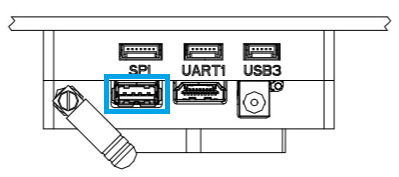
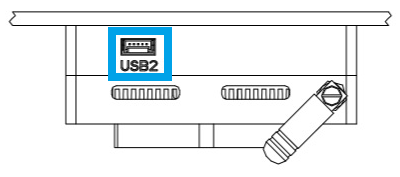

# PX4 Vision Autonomy Development Kit

*PX4视觉自主开发套件*是一个稳定且高性价比的套件，让你能够在自动化无人机上开发计算机视觉。


The kit contains a near-ready-to-fly carbon-fiber quadcopter equipped with a *Pixhawk 4* flight controller, a *UP Core* companion computer (4GB memory & 64GB eMMC), and a Occipital *Structure Core* depth camera sensor.

> **Note** This vehicle comes with no pre-installed software. A pre-imaged USB stick that contains a reference implementation of the [PX4/Avoidance](../computer_vision/obstacle_avoidance.md) local planner software is provided by *Auterion*. This software provides only a very basic example of what you can do with the PX4 Vision Autonomy Kit. Developers can use the kit to try out other features provided by the [PX4 Avoidance](https://github.com/PX4/avoidance#obstacle-detection-and-avoidance) project, modify the existing code, or experiment with completely new computer vision-based functionality.

该指南阐述了无人机准备飞行所需的最少附加步骤（安装遥控器系统和电池等）。 也包括如何起飞，以及如何修改计算机视觉代码。

## PX4 Vision 自主无人机开发套件（先行者版）

- [Holybro Website](https://shop.holybro.com/px4-vision_p1225.html?)

## 警告&通知
- [Warnings & Notifications](#warnings-and-notifications)
- [What is Inside](#what-is-inside)
- [What Else Do You Need](#what-else-do-you-need)
- [First-time Setup](#first-time-setup)
- [Fly the Drone with avoidance](#fly-the-drone-with-avoidance)
- [Development using the Kit](#development-using-the-kit)
- [Px4 Vision Carrier Board Pinouts](#px4-vision-carrier-board-pinouts)
- [Other Development Resources](#other-development-resources)
- [How to get Technical Support](#how-to-get-technical-support)

## 开始了解你的开发套件

1. 不要直接使用电源为 *UP Core* 计算机供电（可能会摧毁计算机）。 *UP Core* 只能使用电池供电。
1. 该开发包使用前置摄像头，（它没有向下或后置深照相机）。 因此，它不能用于测试 [安全着陆](../computer_vision/safe_landing.md) 或其他需要下方摄像头的功能。
1. 只有在 GPS 工作正常时才能测试任务模式中的自主避障（飞行任务需要使用 GPS 配合）。 防撞功能需要在可获得位置的模式下进行测试，比如GPS或光流有比较好的定位。
1. *UP Core* 只能使用电池供电(请勿卸下 *UP Core* 电源安全盖)。

   

## 开始了解你的开发套件


该套件中包含了必要的无人机硬件，电池和遥控须要单独购买：
- Core Components:
  - 1x Pixhawk 4 flight controller (with custom PX4 firmware)
  - 1x PMW3901 optical flow sensor
  - 1x TOF Infrared distance sensor (PSK‐CM8JL65‐CC5)
  - 1x Structure Core depth camera
    - 160 deg wide vision camera
    - Stereo infrared cameras
    - Onboard IMU
    - Powerful NU3000 Multi-core depth Processor
  - 1x *UP Core* computer (4GB memory & 64GB eMMC with Ubuntu and PX4 avoidance)
    - Intel® Atom™ x5-z8350 (up to 1.92 GHz)
    - Compatible OS: Microsoft Windows 10 full version, Linux (ubilinux, Ubuntu, Yocto), Android
    - FTDI UART connected to flight controller
    - `USB1`: USB3.0 A port used for booting PX4 avoidance environment from a USB2.0 stick (connecting a USB3.0 peripheral may jam GPS).
    - `USB2`: USB2.0 port on a JST-GH connector. Can be used for second camera, LTE, etc. (or keyboard/mouse during development).
    - `USB3`: USB2.0 JST-GH port connected to depth camera
    - `HDMI`: HDMI out
    - SD card slot
    - WiFi 802.11 b/g/n @ 2.4 GHz (attached to external antenna #1). Allows computer to access home WiFi network for Internet access/updates.


- Mechanical Specification:
  - Frame: Full 5mm 3k carbon fiber twill
  - Motors: T-MOTOR F60 PROⅢ KV1750
  - ESC: BEHEli-S 20A ESC
  - Propellers: T6045
  - GPS: Pixhawk4 GPS module
  - Power module: Holybro PM07
  - Wheelbase: 286mm
  - Weight: 854 grams without battery or props
  - Telemetry: ESP8266 connected to flight controller (attached to external antenna #2). Enables wireless connection to the ground station.


- A USB2.0 stick with pre-flashed software provided by Auterion that bundles:
  - Ubuntu 18.04 LTS
  - ROS Melodic
  - Occipital Structure Core ROS driver
  - MAVROS
  - [PX4 Avoidance](https://github.com/PX4/avoidance#obstacle-detection-and-avoidance)


- Assorted cables, 8x propellers, 2x battery straps (installed) and other accessories (these can be used to attach additional peripherals).

## 其他注意事项

该套件中包含了必要的无人机硬件，电池和遥控须要单独购买：
- Battery:
  - 4S LiPo with XT60 female connector
  - Less than 115mm long (to fit between power connector and GPS mast)
- Radio control system
  - Any [PX4-compatible RC System](../getting_started/rc_transmitter_receiver.md) can be used.
  - An *FrSky Taranis* transmitter with R-XSR receiver is one of the more popular setups.
- An H2.0 Hex Key (to unscrew the top plate so that an RC receiver can be connected)

此外，用户也需要地面站硬件/软件：
- Laptop or tablet running [QGroundControl](https://docs.qgroundcontrol.com/en/getting_started/download_and_install.html) (QGC).

## 首次使用

1. 将接收机（套件中不包含）固定在无人机上，
   - 使用 H2.0 头的内六角螺丝刀移除/取消顶部板块(在电池进入的地方)。
   - [将接收器连接到飞控](../assembly/quick_start_pixhawk4.md#radio-control)。
   - 重新安装上面的外壳。
   - 在无人机背部安装RC 接收器(使用双面胶或其他)。
   - 确保天线无障碍物阻挡并将天线和机架电隔离。例如，在减震板下方或机臂上。

1. 遥控和接收机配对(如果尚未完成的话)。 配对方法程序取决于接收机和遥控器（读取接收器手册）。
1. GPS需要高于无人机，并固定到底板。

   

1. 将套件中预先烧录好镜像的U盘插入 *UP Core* 的端口 `USB1` （下面高亮的）

   
1. 用充好电的电池的为无人机供电。

   > **Note** 电池连接前移除螺旋桨。
1. 使用以下默认凭据将地面站连接到无人机WiFi网络（几秒钟后）：
   - **SSID：** pixhawk4
   - **密码：** pixhawk4

   > **提示** WiFi网络 SSID、密码和其他凭据可以在连接后更改(如果需要), 使用 web 浏览器打开 URL： `http://192. 68.4.1` 波特率不得从921600更改。

1. 在地面站启动 *QGroundControl*。
1. [配置/校准](../config/README.md) 无人机：

   > **Note** 无人机要进行预先校准(例如使用固件、机架、电池和传感器所有安装)。 您需要校准无线电系统 (您刚刚连接) 并且进行以下的基本检查。

   - [Calibrate the Radio System](../config/radio.md)
   - [Calibrate the Compass](../config/compass.md)


1. 螺旋桨按照下面的方向安装：

   > **Note** Modes can also be changed using *QGroundControl*

   We recommend RC controller switches are define for:
   - 默认情况下，PX4 Vision Kit运行 *localplanner* ，这是您自己的软件的推荐起点。
   - *globalplanner* 尚未用这个工具包测试。
   - *降落计划器* 需要一个向下的摄像头，并且必须先修改相机的安装座才能使用。


1. 连接电池来给无人机供电

   

   - The propellers directions can be determined from the labels: *6045* (normal, counter-clockwise) and _6045_**R** (reversed, clockwise).

     

   - Screw down firmly using the provided propellor nuts:

     


## 测试飞行（带避障）

当无人机按上述安装完成时：

1. Connect the battery to power the vehicle.

1. 找到一个安全的户外位置进行飞行，最好是用树或其他方便的障碍测试PX4视觉。

   > **Tip** The boot/startup process takes around 1 minute from the supplied USB stick (or 30 seconds from [internal memory](#install_image_mission_computer)).

1. Check that the avoidance system has started properly:

   - 使用套件中的 USB-JST电缆获取一个 USB A 连接器

     
   - 如果键盘和鼠标具有单独的接口，则可以将USB集线器连接到电缆。
1. Wait for the GPS LED to turn green. This means that the vehicle has a GPS fix and is ready to fly!
1. 将预先烧录的USB驱动器插入标有 `USB1` 的 *UP Core* 端口中。
1. Find a safe outdoor location for flying, ideally with a tree or some other convenient obstacle for testing PX4 Vision.

1. To test [collision prevention](../computer_vision/collision_prevention.md), enable [Position Mode](../flight_modes/position_mc.md) and fly manually towards an obstacle. The vehicle should slow down and then stop within 6m of the obstacle (the distance can be [changed](../advanced_config/parameters.md) using the [CP_DIST](../advanced_config/parameter_reference.md#CP_DIST) parameter).

1. To test [obstacle avoidance](../computer_vision/obstacle_avoidance.md), create a mission where the path is blocked by an obstacle. Then switch to [Mission Mode](../flight_modes/mission.md) to run the mission, and observe the vehicle moving around the obstacle and then returning to the planned course.


## 使用套件开发

以下各节说明如何将工具包用作开发计算机视觉软件的环境。

### PX4 避障概述

*PX4 避障* 系统由计算机视觉软件组成，这种软件运行在一个配套的计算机上(附着的深度摄像头)，为运行在一个 *飞控上的 PX4 飞行堆栈提供障碍和/或航线信息*

关于配套计算机视觉/规划软件的文档可以在 github 上找到： [PX4/avoidcen](https://github.com/PX4/avoidance#obstacle-detection-and-avoidance)。 该项目提供了许多不同的规划程序实现（打包为ROS节点）：
- 您需要通过 **USB** 将 *QGroundControl* 连接到套件的 *Pixhawk 4* 来更新固件。
- 加载新固件后选择 *PX4 Vision DevKit* 机架：
- The *landing planner* requires a downward facing camera, and cannot used without first modifying the camera mounting.

PX4 和配套的计算机使用如下接口通过 [MAVLink](https://mavlink.io/en/) 交换数据：
- [*UP Core* Wiki](https://wiki.up-community.org/Ubuntu) - 机载计算机技术信息
- [Occipital Developer Forum](https://structure.io/developers) - *结构核心* 相机信息

<span id="install_image_mission_computer"></span>
### 在机载计算机上安装镜像

您可以在 *UP Core* 上安装镜像，并从内部内存启动(而不是U盘)。

建议这样做是因为从内部内存启动得更快。 释放USB端口，也能提供比U盘更多的内存。

> **提示** [ 飞行无人机(带避障)](#fly_drone) 另外解释了如何验证避障系统是否有效。

将USB镜像刷新到UP Core：

1. Insert the pre-flashed USB drive into the *UP Core* port labeled `USB1`.
1. [Login to the companion computer](#login_mission_computer) (as described above).
1. Open a terminal and run the following command to copy the image onto internal memory (eMMC). The terminal will prompt for a number of responses during the flashing process.
   ```sh
   cd ~/catkin_ws/src/px4vision_ros
   sudo ./flash_emmc.sh
   ```

   > **Note** All information saved in the *UP Core* computer will be removed when executing this script

1. Pull out the USB stick.
1. Restart the vehicle. The *UP Core* computer will now boot from internal memory (eMMC).

<span id="boot_mission_computer"></span>
### Boot the Companion Computer {#boot_mission_computer}

首先插入所提供的 USB2.0 盘 *UP 核心* 端口标签 `USB1` 然后用4S电池给无人机供电。 避障系统应在大约1分钟内启动(这取决于所提供的U盘)。

> **Tip** [Fly the Drone with Avoidance](#Fly-the-Drone-with-Avoidance) additionally explains how to verify that the avoidance system is active.

如果您已经在机载计算机上安装了 [镜像](#install_image_mission_computer) 您只需为该无人机供电(即不需要U盘)。 避障系统应在30秒内启动并运行。

机载计算机一旦启动，就可以用作计算机视力开发环境和运行软件的环境。

<span id="login_mission_computer"></span>
### 登录机载计算机

登录到机载计算机:
1. Connect a keyboard and mouse to the *UP Core* via port `USB2`:

   
   - Use the USB-JST cable from the kit to get a USB A connector

     
   - A USB hub can be attached to the cable if the keyboard and mouse have separate connectors.
1. Connect a monitor to the *UP Core* HDMI port.

   

   The Ubuntu login screen should then appear on the monitor.
1. Login to the *UP Core* using the credentials:
   - **Username:** px4vision
   - **Password:** px4vision


### 开发/扩展 PX4 避障功能

PX4 视觉的 *UP Core* 计算机为扩展PX4规避软件（以及更广泛地用于使用ROS2开发新的计算机视觉算法）提供了完整且配置完整的环境。 您可以在无人机上开发和测试您的软件，将其同步到自己的git存储库，并在github [PX4/Avoidance](https://github.com/PX4/avoidance) 存储库上与更广泛的PX4社区共享所有修复和改进。

Catkin工作区是 `~/catkin_ws`,并且已预先配置为运行PX4避障本地计划程序。 引导启动文件 (`撤销.launch`) 位于 `px4vision_ros` 软件包中（修改此文件以更改启动计划程序的文件）。

避障程序包在引导时启动。 要集成其他规划，需要禁用此功能。

1. Disable the avoidance process using the following command:
   ```sh
   systemctl stop avoidance.service
   ```
   You can simply reboot the machine to restart the service.

   Other useful commands are:
   ```sh
   # restart service
   systemctl start avoidance.service

   # disable service (stop service and do not restart after boot)
   systemctl disable avoidance.service

   # enable service (start service and enable restart after boot)
   systemctl enable avoidance.service  
   ```

1. The source code of the obstacle avoidance package can be found in https://github.com/PX4/avoidance which is located in `~/catkin_ws/src/avoidance`.

1. Make changes to the code! To get the latest code of avoidance pull the code from the avoidance repo:
   ```sh
   git pull origin
   git checkout origin/master
   ```
1. Build the package
   ```
   catkin build local_planner
   ```

ROS工作区位于 `~/catkin_ws`。 关于在 ROS中开发和使用 catkin 工作区，请参阅 [ROS catkin教程](http://wiki.ros.org/catkin/Tutorials)。


### 开发 PX4 固件

该套件旨在创建可在机载计算机上运行的计算机视觉软件，并与PX4的灵活路径规划和防撞界面集成在一起。

您也可以修改 PX4 本身，然后 [将其安装为自定义固件](../config/firmware.md#custom)：
- You will need to connect *QGroundControl* to the kit's *Pixhawk 4* **via USB** in order to update firmware.
- Select the *PX4 Vision DevKit* airframe after loading new firmware: 

> **Note** Modification of PX4 code is not *needed* to meet most computer vision use cases. To discuss the interfaces or how to integrate other features join the PX4 slack channel: #computer-vision.

## 其他拓展资源

硬件问题，请联系 Holybro： [productservice@holybro.com](mailto:productservice@holybro.com)。

## 如何获得技术支持？

- [*UP Core* Wiki](https://wiki.up-community.org/Ubuntu) - *Up Core* companion computer technical information
- [Occipital Developer Forum](https://structure.io/developers) - *Structure Core* camera information
- [Pixhawk 4 Overview](../flight_controller/pixhawk4.md)
- [PX4 Avoidance software/documentation](https://github.com/PX4/avoidance)
- [Path Planning Interface](../computer_vision/path_planning_interface.md)
- [Px4 Vision Carrier Board Pinouts](http://www.holybro.com/manual/PX4_Vision_carrier_board_pinouts_v1.1.pdf)

## How to get Technical Support

软件问题，请使用以下 [社区支持频道](README.md#support)：

For software issues, use the following [community support channels](README.md#support):
- [PX4 discuss: Computer Vision category.](https://discuss.px4.io/c/Vision-based-navigation-and-obstacle-avoidance)
- [PX4 slack](https://slack.px4.io/) channel: #avoidance
- [Holybro PX4 Vision Wikifactory](https://wikifactory.com/+holybro/px4-vision)
