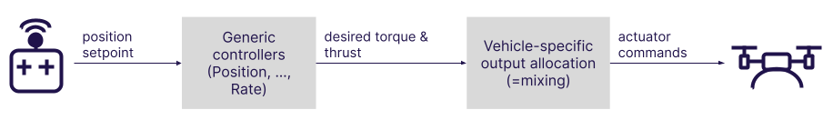
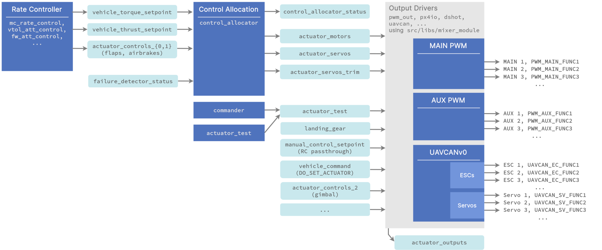

# 控制分配 (混控)

:::note
控制分配取代了在 PX4 v1.13 中使用的旧的混控方法。 PX4 v1.13 文档见： [混控& 驱动器](https://docs.px4.io/v1.13/en/concept/mixing.html), [构型文件](https://docs.px4.io/v1.13/en/concept/geometry_files.html) 和 [添加一个新的机型配置](https://docs.px4.io/v1.13/en/dev_airframes/adding_a_new_frame.html)。
:::

PX4从核心控制器获取所需的扭矩和推力指令，并将它们转换为控制电机或作动器的驱动指令。

指令间的转换取决于飞行器的物理构型。 例如，给“向右转”需要给出一个扭矩指令：

- 对于每个副翼都有一个舵机的飞机来说，该指令将会控制一个舵机向高处偏转，另一个向低处偏转。
- 多旋翼将会通过改变所有电机的转速来向右偏航。

PX4将这个转换逻辑区分开，这个逻辑被称为从姿态/角速率控制器输出的“混控”。 这样可以确保核心控制器不需要对每个机型构型进行特殊处理，可以大大提高复用性。

此外，PX4还将输出函数映射至指定的硬件输出。 这也意味着任何电机或舵机可以分配给几乎任何物理输出。 

<!-- https://docs.google.com/drawings/d/1Li9YhTLc3yX6mGX0iSOfItHXvaUhevO2DRZwuxPQ1PI/edit -->


## 作动器控制流程

模块和uORB话题混控流程概览（点击全屏查看）：
<!-- https://drive.google.com/file/d/1L2IoxsyB4GAWE-s82R_x42mVXW_IDlHP/view?usp=sharing -->


备注：
- 角速率控制器输出力矩和推力设定值
- `control_allocator` 模块：
  - 根据配置参数处理不同飞行器构型
  - 进行混控计算
  - 处理电机失效
  - 发布电机和作动器控制信号
  - 单独发布舵机配平，以便在 [测试驱动器](../config/actuators.md#actuator-testing) (使用测试滑块)时将它们添加为偏移。
- 输出驱动：
  - 处理硬件初始化和更新
  - 使用共享库 [src/libs/mixer_module](https://github.com/PX4/PX4-Autopilot/blob/release/1.14/src/lib/mixer_module/)。 驱动程序定义了参数前缀，例如 `PWM_MAIN` 被库用于配置。 其主要任务是从输入话题中选择，并根据用户设置的 `<param_prefix>_FUNCx` 参数值将正确的数据分配给输出。 例如， `PWM_MAIN_FUNC3` 已设置为 **Motor 2**，第三个输出设置为来自 `actuator_motors`的第二个电机。
  - 输出函数定义于 [src/lib/mixer_module/output_functions.yaml](https://github.com/PX4/PX4-Autopilot/blob/release/1.14/src/lib/mixer_module/output_functions.yaml)。
- 如果想要通过MAVLink控制其输出，请将相关的输出函数设置为 **Offboard Actor Set x**，然后发送 [MAV_CMD_DO_SET_ACTUATOR](https://mavlink.io/en/messages/common.html#MAV_CMD_DO_SET_ACTUATOR) MAVLink指令。

## 添加新构型或输出函数

请参阅该[提交](https://github.com/PX4/PX4-Autopilot/commit/5cdb6fbd8e1352dcb94bd58918da405f8ff930d7) 以了解如何添加新构型。 当 [CA_AIRAME](../advanced_config/parameter_reference.md#CA_AIRFRAME) 设置为新构型时，QGC 界面将自动显示正确的配置界面。

该[提交](https://github.com/PX4/PX4-Autopilot/commit/a65533b46986e32254b64b7c92469afb8178e370) 显示了如何添加新的输出函数。 任何uORB话题都可以被订阅并分配到一个函数。

请注意，控制分配的参数是在 [src/modules/control_allocator/module.yaml](https://github.com/PX4/PX4-Autopilot/blob/release/1.14/src/modules/control_allocator/module.yaml)中定义的。 此文件的架构参见 [这里](https://github.com/PX4/PX4-Autopilot/blob/release/1.14/validation/module_schema.yaml#L440=) （典型的，搜索关键字 `mixer:`）

## 设置默认机型构型

当 [添加一个新的机型配置](../dev_airframes/adding_a_new_frame.md)，需要设置合适的 [CA_AIRAME](../advanced_config/parameter_reference.md#CA_AIRFRAME) 和其他默认的构型混控参数。

例如，可以参见机型配置文件 [13200_generic_vtol_tailsitter](https://github.com/PX4/PX4-Autopilot/blob/release/1.14/ROMFS/px4fmu_common/init.d/airframes/13200_generic_vtol_tailsitter) 。
```
...
param set-default CA_AIRFRAME 4
param set-default CA_ROTOR_COUNT 2
param set-default CA_ROTOR0_KM -0.05
param set-default CA_ROTOR0_PY 0.2
...
```

## 设置构型和输出

当通过 QGroundControl 中的 [Basic Configuration > Airframe](../config/airframe.md) 选择机型时，飞行器的几何构型和默认参数将为默认参数（来自frame configuration文件）。

特定机型的几何构型参数和飞控硬件输出映射可通过 QGroundControl 中的 **Actuators** 设置页面： [Basic Configuration > 精Actuator Configuration and Testing](../config/actuators.md) 来设置。
