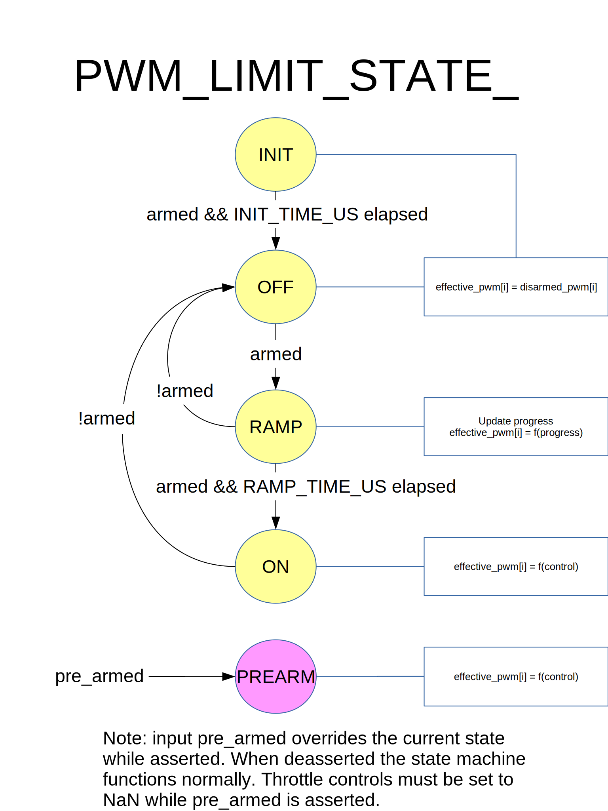

# PWM_limit 状态机

The`PWM_limit State Machine` controls PWM outputs as a function of pre-armed and armed inputs. 并且会在解锁指令发出后、飞机油门增加之前引入一个延时。

## 总览

**输入**
  * 解锁（armed）模式：宣告允许执行危险的动作指令，如转动螺旋桨。
  * 锁定（pre-armed）模式：宣告允许执行温和的动作指令，如移动控制舵面。
   * 该输入会覆盖当前状态。
   * 激活 锁定（pre-armed）模式后无论飞控当前处于什么状态，飞控都会立刻终止状态 ON 的运转。
   * 取消 锁定（pre-armed）模式会使飞控返回到当前状态。

**状态**
  * INIT 和 OFF
    * pwm 输出设置为锁定状态的值。
  * RAMP
    * pwm outputs ramp from disarmed values to min values.
  * ON
    * 根据实际控制量设定 pwm 的输出值。

## 状态转移图

