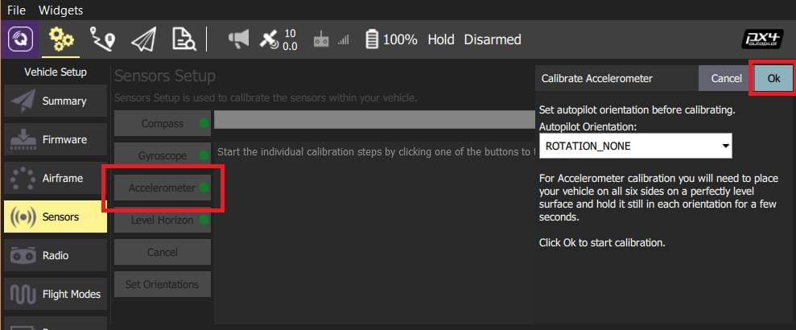
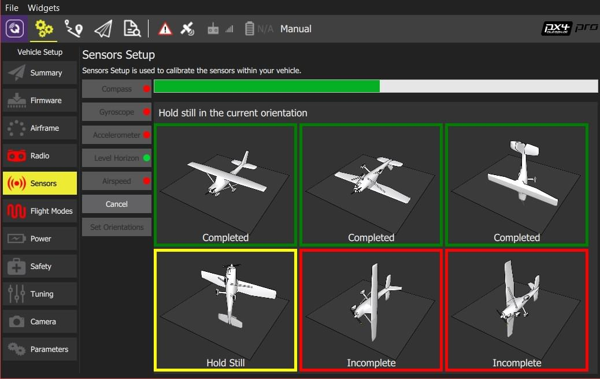

# Accelerometer Calibration

You will need to calibrate your accelerometer on first use or if the flight controller orientation is changed. Otherwise you should not need to recalibrate (except perhaps in winter, if you have a flight controller that was not [thermally calibrated](../advanced_config/sensor_thermal_calibration.md) in the factory).

:::note
Poor accelerometer calibration is generally caught by preflight checks and arming-denied messages (QGC warnings typically refer to "high accelerometer bias" and "consistency check failures").
:::

*QGroundControl* will guide you to place and hold your vehicle in a number of orientations (you will be prompted when to move between positions).

:::tip
This is similar to [compass calibration](../config/compass.md) except that you hold the vehicle still (rather than rotate it) in each orientation.
:::

:::note
The calibration uses a least squares 'fit' algorithm that doesn't require you to have "perfect" 90 degree orientations.
Provided each axis is pointed mostly up and down at some time in the calibration sequence, and the vehicle is held stationary, the precise orientation doesn't matter.
:::

## 执行校准

The calibration steps are:

1. Start *QGroundControl* and connect the vehicle.
1. Select the **Gear** icon (Vehicle Setup) in the top toolbar and then **Sensors** in the sidebar.
1. Click the **Accelerometer** sensor button.

   

:::note
You should already have set the [Autopilot Orientation](../config/flight_controller_orientation.md). If not, you can also set it here.
:::

1. Click **OK** to start the calibration.
1. Position the vehicle as guided by the *images* on the screen. 看到 (图示位置变成黄色) 的提示，握紧机体并保持静止。 该位置标定完成后，屏幕上的相应图示将变成绿色。

  

1. 在机体的所有方向上重复校准步骤。

Once you've calibrated the vehicle in all the positions *QGroundControl* will display *Calibration complete* (all orientation images will be displayed in green and the progress bar will fill completely). You can then proceed to the next sensor.

## 更多信息：

* [QGroundControl User Guide > Sensors](https://docs.qgroundcontrol.com/master/en/SetupView/sensors_px4.html#accelerometer)
* [PX4 设置视频 - @1分46秒](https://youtu.be/91VGmdSlbo4?t=1m46s)（Youtube）
