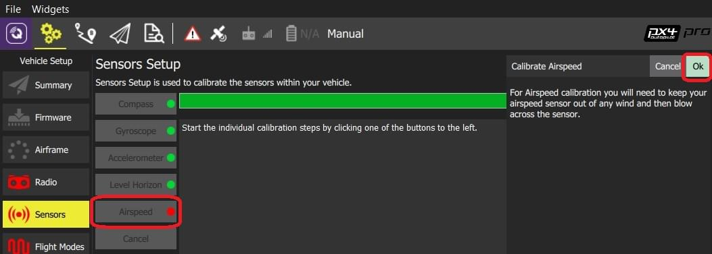

# 空速校准

空速校准需要读取零空速的稳定基础数据以确定偏移量。 将手放在皮托管上以阻挡风（如果在室内校准传感器则不需要），然后用嘴向管中吹气（表示完成校准）。

:::note
Fixed Wing and VTOL vehicles usually have an airspeed sensor.
:::

## 执行校准

To calibrate the airspeed sensor:

1. 打开 *QGroundControl* 并连接上飞机。
2. 在工具栏选择 **齿轮** 图标 (机体设置)，然后在侧边栏选择 **传感器**。
3. 点击 **空速** 传感器按钮。
    
    

4. 将传感器与风隔离（即用手盖住传感器）。 注意不要阻挡任何孔。

5. 点击**确定**开始校准。
6. 向皮托管的尖端内吹气以指示校准结束。
    
:::tip
Blowing into the tube is also a basic check that the dynamic and static ports are installed correctly. If they are swapped then the sensor will read a large negative differential pressure when you blow into the tube, and the calibration will abort with an error.
:::

7. 等待 2-3秒钟, 然后取出覆盖物 (几秒钟后, 校准以静默方式完成)

## 测试

After calibration a quick test is to press your finger against the tip of the pitot and hold it. You should see the system read and hold a positive airspeed until you release.

## 更多信息

* [QGroundControl 用户手册 > 传感器](https://docs.qgroundcontrol.com/en/SetupView/sensors_px4.html#airspeed)