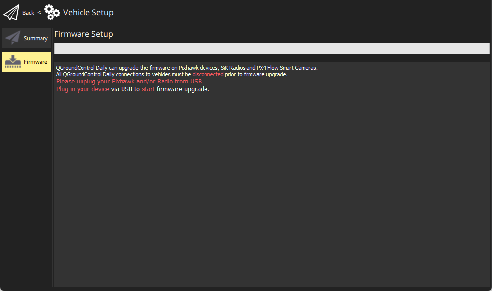
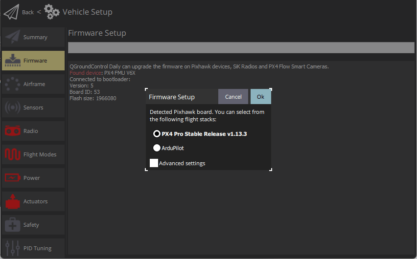
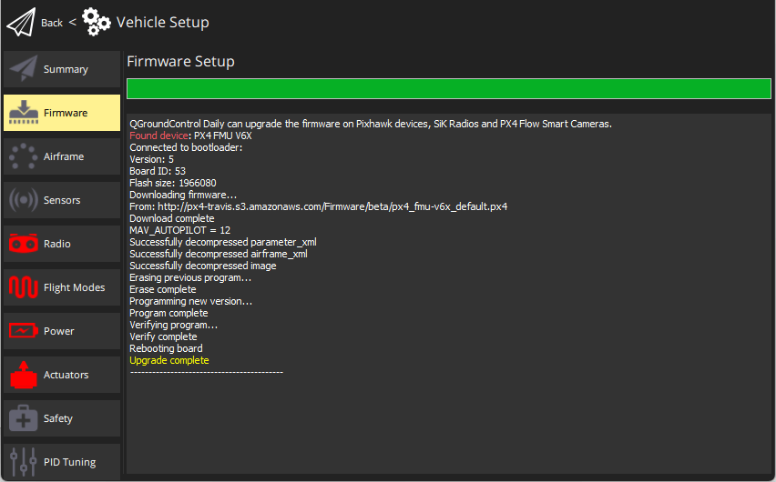
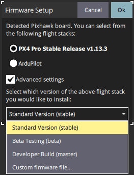

# 加载固件

*QGroundControl* **桌面** 版本可以用于安装 PX4 固件到 [Pixhawk系列](../getting_started/flight_controller_selection.md) 飞行控制板。

**Caution** **在开始安装固件前** 飞行器的所有USB连接必须 *断开* （包括直接连接或通过数传连接）。 飞行器必须 *不能* 由电池供电。
:::

## 安装稳定的PX4版本

通常您应该使用最新 *发布* PX4版本，以便修复错误并获得最新的功能。

:::tip
This is the version that is installed by default.
:::

To install PX4:

1. 打开 *QGroundControl* 并连接上机体。
1. 选择**"Q" 图标>机体设置>固件**（侧边栏）打开*固件设置*

   

1. Connect the flight controller directly to your computer via USB.

   :::note
Connect directly to a powered USB port on your machine (do not connect through a USB hub).
:::

1. 选择 **PX4 Pro 稳定版本的 vX.x.x** 选项为您的飞行控制器</em> (自动检测) 安装最新稳定版本的 PX4 *

   </li>

1

单击 **OK** 按钮开始更新。

   The firmware will then proceed through a number of upgrade steps (downloading new firmware, erasing old firmware etc.). Each step is printed to the screen and overall progress is displayed on a progress bar.

   

   Once the firmware has completed loading, the device/vehicle will reboot and reconnect.

   如果 *QGroundControl* 安装FMUv2 固件（请参阅安装过程中的控制台），并且您有一个更新的飞控板，则可能需要[更新bootloader](#bootloader)，以访问飞行控制器上的所有内存。 :::</ol>

Next you will need to specify the [vehicle airframe](../config/airframe.md) (and then sensors, radio, etc.)

## 安装PX4 Main, Beta或自定义固件

To install a different version of PX4:

1. 如上所述连接飞行器，并选择 **PX4 飞行栈 vX.x.x Stagable Release**. 
1. 检查 **高级设置** 并从下拉列表中选择版本：
   - **标准版本 (稳定):** 默认版本 (即无需使用高级设置来安装！)
   - **Beta 测试(beta)：** 测试/候选版本。 只有当新版本准备完毕时才可用。
   - **Developer Build (master):** PX4/PX4-Autopilot _主分支_ 最新版本。
   - **自定义固件文件...:** 自定义固件文件 (例如你已在本地构建的)。 如果选择 Custom firmware file ，您需要在下一步中从文件系统中选择自定义固件。

Firmware update then continues as before.

## Bootloader 更新

硬件通常预先安装匹配版本的引导程序。

您可能需要更新的是安装较新的 Pixhawk 板FMUv2 固件 。 如果 *QGroundControl* 安装FMUv2 固件（请参阅安装过程中的控制台），并且您有一个更新的飞控板，则可能需要更新bootloader，以访问飞行控制器上的所有内存。

您可以按照 [引导加载器更新 > FMUv2 启动加载器更新](../advanced_config/bootloader_update.md#fmuv2-bootloader-update)

## 更多信息

* [QGroundControl 用户指南>固件](https://docs.qgroundcontrol.com/master/en/SetupView/Firmware.html)。
* [PX4 Setup Video](https://youtu.be/91VGmdSlbo4) (Youtube)
