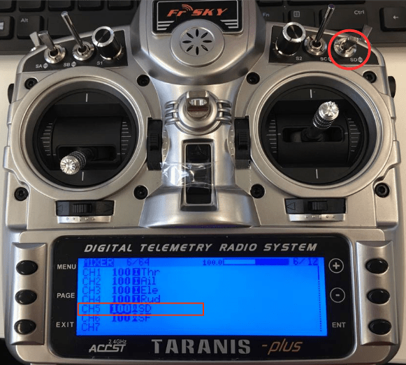

# 飞行模式有关配置

This topic explains how to map [flight modes](../getting_started/flight_modes.md) and other functions to the switches on your radio control transmitter.

:::tip
In order to set up flight modes you must already have:

- [Configured your radio](../config/radio.md)
- [Setup your transmitter](#rc-transmitter-setup) to encode the physical positions of your mode switch(es) into a single channel. We provide examples for the popular _Taranis_ transmitter [below](#taranis-setup-3-way-switch-configuration-for-single-channel-mode) (check your documentation if you use a different transmitter).
:::

## What Flight Modes and Switches Should I Set?

_Flight Modes_ provide different types of _autopilot-assisted flight_, and _fully autonomous flight_. You can set any (or none) of the flight modes [described here](../getting_started/flight_modes.md). Most users should set the following functions, as these make the vehicle easier and safer to fly:

- **位置模式** ([多旋翼飞行器](../getting_started/flight_modes.md#position-mode-mc), [固定翼飞行器](../getting_started/flight_modes.md#position-mode-fw)- 手动飞行最简单和最安全的模式。
- [Return mode](../flight_modes/return.md) - Return to launch position by safe path and land (by default).
- **垂直起降开关**-在 VTOL 飞行器上的固定翼和多旋翼飞行配置之间切换。

It is also common to map switches to:

- [Mission](../flight_modes/mission.md) - This mode runs a pre-programmed mission sent by the ground control station.
-  [Kill Switch](../config/safety.md#kill-switch) - Immediately stops all motor outputs (the vehicle will crash, which may in some circumstances be more desirable than allowing it to continue flying).

## Flight Mode Selection

PX4 allows you to specify a "mode" channel and select up to 6 flight modes that will be activated based on the PWM value of the channel. You can also separately specify channels for mapping a kill switch, return to launch mode, and offboard mode.

To configure single-channel flight mode selection:

1. Start _QGroundControl_ and connect the vehicle.
1. 打开您的 RC 遥控器发射机。
1. 选择 **QGroundControllation 图标 > 车辆设置**, 然后在侧边栏中选择 **飞行模式**

   

1. Specify _Flight Mode Settings_:

   - Select the **Mode channel** (above this shown as Channel 5, but this will depend on your transmitter configuration).
   - Move the transmitter switch (or switches) that you have set up for mode selection through the available positions. The mode slot matching your current switch position will be highlighted (above this is _Flight Mode 1_).

     :::note
While you can set flight modes in any of the 6 slots, only the channels that are mapped to switch positions will be highlighted/used.
:::

   - Select the flight mode that you want triggered for each switch position.

1. Specify _Switch Settings_:

   - Select the channels that you want to map to specific actions - e.g.: _Return_ mode, _Kill switch_, _offboard_ mode, etc. (if you have spare switches and channels on your transmitter).

1. Test that the modes are mapped to the right transmitter switches:
   - Check the _Channel Monitor_ to confirm that the expected channel is changed by each switch.
   - Select each mode switch on your transmitter in turn, and check that the desired flight mode is activated (the text turns yellow on _QGroundControl_ for the active mode).

All values are automatically saved as they are changed.

## RC Transmitter Setup

This section contains a small number of possible setup configurations for taranis. QGroundControl _可能_在[这里有其他遥控器的设置信息](https://docs.qgroundcontrol.com/master/en/SetupView/FlightModes.html#transmitter-setup)。

### Taranis Setup: 3-way Switch Configuration for Single-Channel Mode

If you only need to support selecting between two or three modes then you can map the modes to the positions of a single 3-way switch. Below we show how to map the Taranis 3-way "SD" switch to channel 5.

:::note
This example shows how to set up the popular _FrSky Taranis_ transmitter. Transmitter setup will be different on other transmitters.
:::

打开Taranis UI**MIXER**页面，向下滚动道**CH5**，如下：

Press **ENT(ER)** to edit the **CH5** configuration then change the **Source** to be the _SD_ button.

That's it! 通道5现在将为三个不同的**SD**开关位置输出3个不同的PWM的值。

The _QGroundControl_ configuration is then as described in the previous section.

### Taranis Setup: Multi-Switch Configuration for Single-Channel Mode

Most transmitters do not have 6-way switches, so if you need to be able to support more modes than the number of switch positions available (up to 6) then you will have to represent them using multiple switches. Commonly this is done by encoding the positions of a 2- and a 3-position switch into a single channel, so that each switch position results in a different PWM value.

On the FrSky Taranis this process involves assigning a "logical switch" to each combination of positions of the two real switches. Each logical switch is then assigned to a different PWM value on the same channel.

The video below shows how this is done with the _FrSky Taranis_ transmitter.<!-- \[youtube\](https://youtu.be/scqO7vbH2jo) Video has gone private and is no longer available --><!-- @\[youtube\](https://youtu.be/BNzeVGD8IZI?t=427) - video showing how to set the QGC side - at about 7mins and 3 secs -->@[youtube](https://youtu.be/TFEjEQZqdVA)

The _QGroundControl_ configuration is then [as described above](#flight-mode-selection).

## Further Information

- [Flight Modes Overview](../flight_modes/README.md)
- [QGroundControl > Flight Modes](https://docs.qgroundcontrol.com/master/en/SetupView/FlightModes.html#px4-pro-flight-mode-setup)
- [PX4 Setup Video - @6m53s](https://youtu.be/91VGmdSlbo4?t=6m53s) (Youtube)
- [Radio switch parameters](../advanced_config/parameter_reference.md#radio-switches) - Can be used to set mappings via parameters
