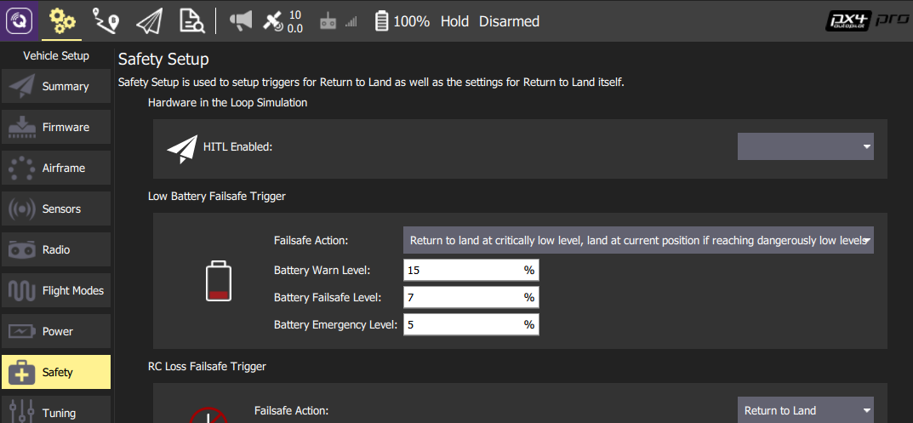
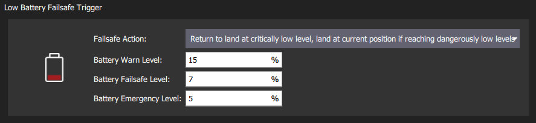
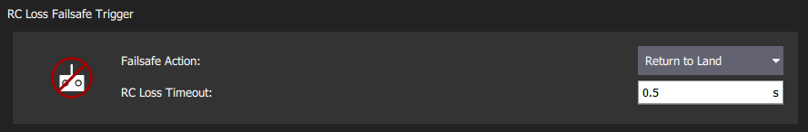
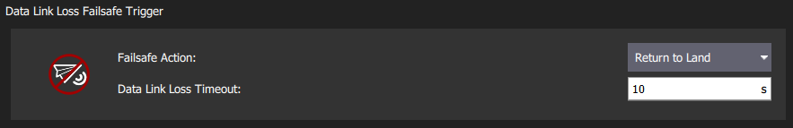
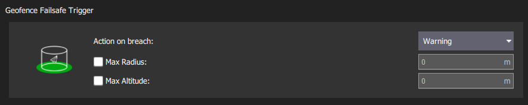
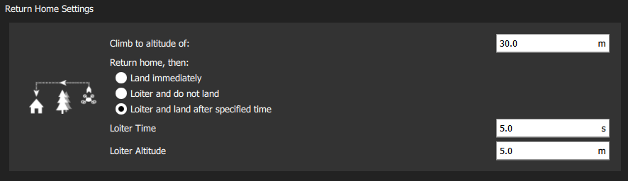
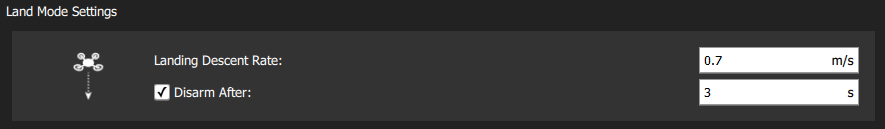

# Safety Configuration (Failsafes)

PX4 has a number of safety features to protect and recover your vehicle if something goes wrong:

* *Failsafes* allow you to specify areas and conditions under which you can safely fly, and the [action](#failsafe_actions) that will be performed if a failsafe is triggered (for example, landing, holding position, or returning to a specified point). The most important failsafe settings are configured in the *QGroundControl* [Safety Setup](#qgc_safety_setup) page. Others must be configured via [parameters](#failsafe_other).
* [Safety switches](#safety_switch) on the remote control can be used to immediately stop motors or return the vehicle in the event of a problem.

## Failsafe Actions {#failsafe_actions}

Each failsafe defines its own set of actions. Some of the more common failsafe actions are:

| Action                                                                                  | 描述                                                                                                                                                                                                                                                                                                                                                                                                                            |
| --------------------------------------------------------------------------------------- | ----------------------------------------------------------------------------------------------------------------------------------------------------------------------------------------------------------------------------------------------------------------------------------------------------------------------------------------------------------------------------------------------------------------------------- |
| None/Disabled                                                  | No action (the failsafe will be ignored).                                                                                                                                                                                                                                                                                                                                                                                     |
| Warning 警告                                                     | A warning message will be sent to *QGroundControl*.                                                                                                                                                                                                                                                                                                                                                                           |
| [Hold mode](../flight_modes/hold.md)                           | The vehicle will enter *Hold mode*. For multicopters this means the vehicle will hover, while for fixed/wing the vehicle will circle.                                                                                                                                                                                                                                                                                         |
| [Return mode](../flight_modes/return.md)                       | The vehicle will enter *Return mode*. Return behaviour can be set in the [Return Home Settings](#return_settings) (below).                                                                                                                                                                                                                                                                                                    |
| [Land mode](../flight_modes/land.md)                           | The vehicle will enter *Land mode*, and lands immediately.                                                                                                                                                                                                                                                                                                                                                                    |
| [Flight termination](../advanced_config/flight_termination.md) | Turns off all controllers and sets all PWM outputs to their failsafe values (e.g. [PWM_MAIN_FAILn](../advanced_config/parameter_reference.md#PWM_MAIN_FAIL1), [PWM_AUX_FAILn](../advanced_config/parameter_reference.md#PWM_AUX_FAIL1)). The failsafe outputs can be used to deploy a parachute, landing gear or perform another operation. For a fixed-wing vehicle this might allow you to glide the vehicle to safety. |
| Lockdown                                                       | Kills the motors (sets them to disarmed). This is the same as using the [kill switch](#kill_switch).                                                                                                                                                                                                                                                                                                                          |

> **Note** It is possible to recover from a failsafe action (if the cause is fixed) by switching modes. For example, in the case where RC Loss failsafe causes the vehicle to enter *Return mode*, if RC is recovered you can change to *Position mode* and continue flying.

> **Note** If a failsafe occurs while the vehicle is responding to another failsafe (e.g. Low battery while in Return mode due to RC Loss), the specified failsafe action for the second trigger is ignored. Instead the action is determined by separate system level and vehicle specific code. This might result in the vehicle being changed to a manual mode so the user can directly manage recovery.

## QGroundControl Safety Setup {#qgc_safety_setup}

The *QGroundControl* Safety Setup page is accessed by clicking the *QGroundControl* **Gear** icon (Vehicle Setup - top toolbar) and then **Safety** in the sidebar). This includes the most important failsafe settings (battery, RC loss etc.) and the settings for the return actions *Return* and *Land*.

### Low Battery Failsafe

The low battery failsafe is triggered when the battery capacity drops below one (or more warning) level values.

The most common configuration is to set the values and action as above (with `Warn > Failsafe > Emergency`). With this configuration the failsafe will trigger warning, then return, and finally landing if capacity drops below the respective levels.

It is also possible to set the *Failsafe Action* to warn, return, or land when the [Battery Failsafe Level](#BAT_CRIT_THR) failsafe level is reached.

The settings and underlying parameters are shown below.

| Setting                                         | 参数                                                                             | 参数描述                                                                                                                                                                      |
| ----------------------------------------------- | ------------------------------------------------------------------------------ | ------------------------------------------------------------------------------------------------------------------------------------------------------------------------- |
| Failsafe Action                                 | [COM_LOW_BAT_ACT](../advanced_config/parameter_reference.md#COM_LOW_BAT_ACT) | Warn, Return, or Land based when capacity drops below [Battery Failsafe Level](#BAT_CRIT_THR), OR Warn, then return, then land based on each of the level settings below. |
| Battery Warn Level                              | [BAT_LOW_THR](../advanced_config/parameter_reference.md#BAT_LOW_THR)         | Percentage capacity for warnings (or other actions).                                                                                                                      |
| Battery Failsafe Level | [BAT_CRIT_THR](../advanced_config/parameter_reference.md#BAT_CRIT_THR)       | Percentage capacity for Return action (or other actions if a single action selected).                                                                                     |
| Battery Emergency Level                         | [BAT_EMERGEN_THR](../advanced_config/parameter_reference.md#BAT_EMERGEN_THR) | Percentage capacity for triggering Land (immediately) action.                                                                                                             |

### RC Loss Failsafe {#rc_loss_failsafe}

The RC Loss failsafe is triggered if the RC transmitter link is lost.

> **Note** PX4 and the receiver may also need to be configured in order to *detect RC loss*: [Radio Setup > RC Loss Detection](../config/radio.md#rc_loss_detection).

The settings and underlying parameters are shown below.

| Setting         | 参数                                                                         | 参数描述                                                                            |
| --------------- | -------------------------------------------------------------------------- | ------------------------------------------------------------------------------- |
| RC Loss Timeout | [COM_RC_LOSS_T](../advanced_config/parameter_reference.md#COM_RC_LOSS_T) | Amount of time after losing the RC connection before the failsafe will trigger. |
| Failsafe Action | [NAV_RCL_ACT](../advanced_config/parameter_reference.md#NAV_RCL_ACT)     | Disabled, Loiter, Return, Land, Terminate, Lockdown.                            |

### Data Link Loss Failsafe

The Data Link Loss failsafe is triggered if a telemetry link (connection to ground station) is lost when flying a [mission](../flying/missions.md).

The settings and underlying parameters are shown below.

| Setting                | 参数                                                                         | 参数描述                                                                              |
| ---------------------- | -------------------------------------------------------------------------- | --------------------------------------------------------------------------------- |
| Data Link Loss Timeout | [COM_DL_LOSS_T](../advanced_config/parameter_reference.md#COM_DL_LOSS_T) | Amount of time after losing the data connection before the failsafe will trigger. |
| Failsafe Action        | [NAV_DLL_ACT](../advanced_config/parameter_reference.md#NAV_DLL_ACT)     | Disabled, Hold mode, Return mode, Land mode, Terminate, Lockdown.                 |

### Geofence Failsafe

The *Geofence Failsafe* is a "virtual" cylinder centered around the home position. If the vehicle moves outside the radius or above the altitude the specified *Failsafe Action* will trigger.

> **Tip** PX4 separately supports more complicated GeoFence geometries with multiple arbitrary polygonal and circular inclusion and exclusion areas: [Flying > GeoFence](../flying/geofence.md).

The settings and underlying [geofence parameters](../advanced_config/parameter_reference.md#geofence) are shown below.

| Setting          | 参数                                                                             | 参数描述                                                            |
| ---------------- | ------------------------------------------------------------------------------ | --------------------------------------------------------------- |
| Action on breach | [GF_ACTION](../advanced_config/parameter_reference.md#GF_ACTION)               | None, Warning, Hold mode, Return mode, Terminate.               |
| Max Radius       | [GF_MAX_HOR_DIST](../advanced_config/parameter_reference.md#GF_MAX_HOR_DIST) | Horizontal radius of geofence cylinder. Geofence disabled if 0. |
| Max Altitude     | [GF_MAX_VER_DIST](../advanced_config/parameter_reference.md#GF_MAX_VER_DIST) | Height of geofence cylinder. Geofence disabled if 0.            |

> **Note** Setting `GF_ACTION` to terminate will kill the vehicle on violation of the fence. Due to the inherent danger of this, this function is disabled using [CBRK_FLIGHTTERM](#CBRK_FLIGHTTERM), which needs to be reset to 0 to really shut down the system.

The following settings also apply, but are not displayed in the QGC UI.

| Setting                                                         | 参数                                                                           | 参数描述                                                                                                                  |
| --------------------------------------------------------------- | ---------------------------------------------------------------------------- | --------------------------------------------------------------------------------------------------------------------- |
| Geofence altitude mode                                          | [GF_ALTMODE](../advanced_config/parameter_reference.md#GF_ALTMODE)           | Altitude reference used: 0 = WGS84, 1 = AMSL.                                                                         |
| Geofence counter limit                                          | [GF_COUNT](../advanced_config/parameter_reference.md#GF_COUNT)               | Set how many subsequent position measurements outside of the fence are needed before geofence violation is triggered. |
| Geofence source                                                 | [GF_SOURCE](../advanced_config/parameter_reference.md#GF_SOURCE)             | Set whether position source is estimated global position or direct from the GPS device.                               |
| Circuit breaker for flight termination | [CBRK_FLIGHTTERM](../advanced_config/parameter_reference.md#CBRK_FLIGHTTERM) | Enables/Disables flight termination action (disabled by default).                                                     |

### Return Mode Settings {#return_settings}

*Return* is a common [failsafe action](#failsafe_actions) that engages [Return mode](../flight_modes/return.md) to return the vehicle to the home position. This section shows how to set the land/loiter behaviour after returning.

The settings and underlying parameters are shown below:

| Setting           | 参数                                                                             | 参数描述                                                                                                   |
| ----------------- | ------------------------------------------------------------------------------ | ------------------------------------------------------------------------------------------------------ |
| Climb to altitude | [RTL_RETURN_ALT](../advanced_config/parameter_reference.md#RTL_RETURN_ALT)   | Vehicle ascend to this minimum height (if below it) for the return flight.                             |
| Return behaviour  |                                                                                | Choice list of *Return then*: Land, Loiter and do not land, or Loiter and land after a specified time. |
| Loiter Altitude   | [RTL_DESCEND_ALT](../advanced_config/parameter_reference.md#RTL_DESCEND_ALT) | If return with loiter is selected you can also specify the altitude at which the vehicle hold.         |
| Loiter Time       | [RTL_LAND_DELAY](../advanced_config/parameter_reference.md#RTL_LAND_DELAY)   | If return with loiter then land is selected you can also specify how long the vehicle will hold.       |

> **Note** The return behavour is defined by [RTL_LAND_DELAY](../advanced_config/parameter_reference.md#RTL_LAND_DELAY). If negative the vehicle will land immediately. Additional information can be found in [Return mode](../flight_modes/return.md).

### Land Mode Settings

*Land at the current position* is a common [failsafe action](#failsafe_actions) that engages [Land Mode](../flight_modes/land.md). This section shows how to control when and if the vehicle automatically disarms after landing. For Multicopters (only) you can additionally set the descent rate.

The settings and underlying parameters are shown below:

| Setting              | 参数                                                                             | 参数描述                                                                                                                                 |
| -------------------- | ------------------------------------------------------------------------------ | ------------------------------------------------------------------------------------------------------------------------------------ |
| Disarm After         | [COM_DISARM_LAND](../advanced_config/parameter_reference.md#COM_DISARM_LAND) | Select checkbox to specify that the vehicle will disarm after landing. The value must be non-zero but can be a fraction of a second. |
| Landing Descent Rate | [MPC_LAND_SPEED](../advanced_config/parameter_reference.md#MPC_LAND_SPEED)   | Rate of descent (MC only).                                                                                                           |

## Other Failsafe Settings {#failsafe_other}

This section contains information about failsafe settings that cannot be configured through the *QGroundControl* [Safety Setup](#qgc_safety_setup) page.

### Position (GPS) Loss Failsafe

The *Position Loss Failsafe* is triggered if the quality of the PX4 position estimate falls below acceptable levels (this might be caused by GPS loss) while in a mode that requires an acceptable position estimate.

The failure action is controlled by [COM_POSCTL_NAVL](../advanced_config/parameter_reference.md#COM_POSCTL_NAVL), based on whether RC control is assumed to be available (and altitude information):

* `0`: Remote control available. Switch to *Altitude mode* if a height estimate is available, otherwise *Stabilized mode*.
* `1`: Remote control *not* available. Switch to *Land mode* if a height estimate is available, otherwise enter flight termination.

Fixed Wing vehicles additionally have a parameter ([NAV_GPSF_LT](../advanced_config/parameter_reference.md#NAV_GPSF_LT)) for defining how long they will loiter (circle) after losing position before attempting to land.

The relevant parameters for all vehicles shown below (also see [GPS Failure navigation parameters](../advanced_config/parameter_reference.md#gps-failure-navigation)):

| 参数                                                                               | 参数描述                                                                                                      |
| -------------------------------------------------------------------------------- | --------------------------------------------------------------------------------------------------------- |
| [COM_POS_FS_DELAY](../advanced_config/parameter_reference.md#COM_POS_FS_DELAY) | Delay after loss of position before the failsafe is triggered.                                            |
| [COM_POSCTL_NAVL](../advanced_config/parameter_reference.md#COM_POSCTL_NAVL)   | Position control navigation loss response during mission. Values: 0 - assume use of RC, 1 - Assume no RC. |
| [CBRK_VELPOSERR](../advanced_config/parameter_reference.md#CBRK_VELPOSERR)       | Circuit breaker for position error check (disables error checks in all modes).                            |

Parameters that only affect Fixed Wing vehicles:

| 参数                                                                     | 参数描述                                                                                                |
| ---------------------------------------------------------------------- | --------------------------------------------------------------------------------------------------- |
| [NAV_GPSF_LT](../advanced_config/parameter_reference.md#NAV_GPSF_LT) | Loiter time (waiting for GPS recovery before it goes into flight termination). Set to 0 to disable. |
| [NAV_GPSF_P](../advanced_config/parameter_reference.md#NAV_GPSF_P)   | Fixed pitch angle while circling.                                                                   |
| [NAV_GPSF_R](../advanced_config/parameter_reference.md#NAV_GPSF_R)   | Fixed roll/bank angle while circling.                                                               |
| [NAV_GPSF_TR](../advanced_config/parameter_reference.md#NAV_GPSF_TR) | Thrust while circling.                                                                              |

### Offboard Loss Failsafe

The *Offboard Loss Failsafe* is triggered if the offboard link is lost while under Offboard control. Different failsafe behaviour can be specified based on whether or not there is also an RC connection available.

The relevant parameters are shown below:

| 参数                                                                           | 参数描述                                                                                                              |
| ---------------------------------------------------------------------------- | ----------------------------------------------------------------------------------------------------------------- |
| [COM_OF_LOSS_T](../advanced_config/parameter_reference.md#COM_OF_LOSS_T)   | Delay after loss of offboard connection before the failsafe is triggered.                                         |
| [COM_OBL_ACT](../advanced_config/parameter_reference.md#COM_OBL_ACT)       | Failsafe action if no RC is available: Land mode, Hold mode, Return mode.                                         |
| [COM_OBL_RC_ACT](../advanced_config/parameter_reference.md#COM_OBL_RC_ACT) | Failsafe action if RC is available: Position mode, Altitude mode, Manual mode, Return mode, Land mode, Hold mode. |

### Mission Failsafe

The Mission Failsafe checks prevent a previous mission being started at a new takeoff location or if it is too big (distance between waypoints is too great). The failsafe action is that the mission will not be run.

The relevant parameters are shown below:

| 参数                                                                       | 参数描述                                                                                                                                            |
| ------------------------------------------------------------------------ | ----------------------------------------------------------------------------------------------------------------------------------------------- |
| [MIS_DIST_1WP](../advanced_config/parameter_reference.md#MIS_DIST_1WP) | The mission will not be started if the current waypoint is more distant than this value from the home position. Disabled if value is 0 or less. |
| [MIS_DIST_WPS](../advanced_config/parameter_reference.md#MIS_DIST_WPS) | The mission will not be started if any distance between two subsequent waypoints is greater than this value.                                    |

### Traffic Avoidance Failsafe

The Traffic Avoidance Failsafe allows PX4 to respond to transponder data (e.g. from [ADSB transponders](../advanced_features/traffic_avoidance_adsb.md)) during missions.

The relevant parameters are shown below:

| 参数                                                                             | 参数描述                                                             |
| ------------------------------------------------------------------------------ | ---------------------------------------------------------------- |
| [NAV_TRAFF_AVOID](../advanced_config/parameter_reference.md#NAV_TRAFF_AVOID) | Set the failsafe action: Disabled, Warn, Return mode, Land mode. |

### Adaptive QuadChute Failsafe

Failsafe for when a pusher motor fails (or airspeed sensor) and a VTOL vehicle can no longer achieve a desired altitude setpoint in fixed-wing mode. If triggered, the vehicle will transition to multicopter mode and enter failsafe Return mode.

The relevant parameters are shown below:

| 参数                                                                         | 参数描述                                                                                                                                                                                              |
| -------------------------------------------------------------------------- | ------------------------------------------------------------------------------------------------------------------------------------------------------------------------------------------------- |
| [VT_FW_ALT_ERR](../advanced_config/parameter_reference.md#VT_FW_ALT_ERR) | Maximum negative altitude error for fixed wing flight. If the altitude drops more than this value below the altitude setpoint the vehicle will transition back to MC mode and enter failsafe RTL. |

## 故障检测器 {#failure_detector}

故障检测器允许载具在意外翻转或收到外部故障检测系统通知时执行保护措施。

在飞行期间，如果满足故障条件，可以用故障检测器触发[飞行终止](../advanced_config/flight_termination.md)，随后可以发射[降落伞](../peripherals/parachute.md)或执行一些其他操作。

> **Note** 飞行期间的故障检测默认被停用（通过设置参数启用：CBRK_FLIGHTTERM=0）。
 </blockquote> 
> 
> 在起飞过程中，如果发生载具翻转，故障检测器的[姿态触发器](#attitude_trigger)会触发[上锁动作](#action_lockdown)（与飞行终止不同，上锁虽然会制动电机，但不会发射降落伞或执行其他故障动作）。 请注意，无论 `CBRK_FLIGHTERM` 参数为何值，起飞时总是启用此检查。
> 
> 故障检测器在所有载具类型和飞行模式下均处于激活状态，但*预期*会翻转的载具类型除外（即 [Acro 特技模式（MC）](../flight_modes/altitude_mc.md)，[Acro 特技模式（FW）](../flight_modes/altitude_fw.md)，[Rattitude 半自稳模式](../flight_modes/rattitude_mc.md)和 Manual 手动模式（FW））。
 
> 
> ### 姿态触发器 {#attitude_trigger}
> 
> 如果载具姿态在超过规定时间的情况下超过预定的俯仰和横滚值，则故障检测器可以配置为触发器。
> 
> 相关参数如下：
> 
> | 参数                                                                                                     | 描述                                                    |
> | ------------------------------------------------------------------------------------------------------ | ----------------------------------------------------- |
> | [CBRK_FLIGHTTERM](../advanced_config/parameter_reference.md#CBRK_FLIGHTTERM) | 飞行终止断路器。 从 121212（默认）取消设置，以启用由于故障检测器或 FMU 丢失而导致的飞行终止。 |
> | [FD_FAIL_P](../advanced_config/parameter_reference.md#FD_FAIL_P)           | 最大允许俯仰角（角度制）。                                         |
> | [FD_FAIL_R](../advanced_config/parameter_reference.md#FD_FAIL_R)           | 最大允许横滚角（角度制）。                                         |
> | [FD_FAIL_P_TTRI](../advanced_config/parameter_reference.md#FD_FAIL_P_TTRI) | 超过故障检测的 [FD_FAIL_P](#FD_FAIL_P) 时间（默认为 0.3s）。       |
> | [FD_FAIL_R_TTRI](../advanced_config/parameter_reference.md#FD_FAIL_R_TTRI) | 超过故障检测的 [FD_FAIL_R](#FD_FAIL_R) 时间（默认为 0.3s）。       |
> 
> ### 外部自动触发系统（ATS） {#external_ats}
> 
> [故障检测器](#failure_detector)在[启用](#CBRK_FLIGHTTERM)的状态下也可以由外部自动触发系统 ATS 触发。 外部触发系统必须连接到飞行控制器的 AUX5 端口（或者是那些没有 AUX 端口的飞控板上的 MAIN5 端口），并使用以下参数进行配置。
> 
> > **Note** [ASTM F3322-18](https://webstore.ansi.org/Standards/ASTM/ASTMF332218) 标准规范要求启用外部自动触发系统 ATS。 ATS设备的一个例子是 [Fruity Chutes 公司的降落伞自动触发系统](https://fruitychutes.com/uav_rpv_drone_recovery_parachutes/sentinel-automatic-trigger-system.htm)。
> 
> | 参数                                                                                                       | 描述                                                               |
> | -------------------------------------------------------------------------------------------------------- | ---------------------------------------------------------------- |
> | [FD_EXT_ATS_EN](../advanced_config/parameter_reference.md#FD_EXT_ATS_EN)     | 启用 AUX5 或 MAIN5（取决于飞控板）上的 PWM 输入，以便从外部自动触发系统（ATS）启用故障保护。 默认值：禁用。 |
> | [FD_EXT_ATS_TRIG](../advanced_config/parameter_reference.md#FD_EXT_ATS_TRIG) | 来自外部自动触发系统的用于接通故障保护的 PWM 阈值。 默认值：1900m/s。                        |
> 
> ## 应急开关 {#safety_switch}
> 
> 可以配置遥控开关（*QGroundControl* [飞行模式设置](../config/flight_mode.md)的一部分），以便在出现问题或发生紧急情况时及时采取矫正措施；例如，制动所有电机或激活[返航模式](#return_switch)。
> 
> 本节列出了可用的应急开关。
> 
> ### 急停开关 {#kill_switch}
> 
> 急停开关会立即终止所有电机的输出（如果正处于飞行状态，载具将开始降落）！ 如果开关在 5 秒内复位，电机将重启。 5 秒后，载具将自动上锁；您需要再次解锁才能启动电机。
> 
> ### 解锁/上锁开关 {#arming_switch}
> 
> 解锁/上锁开关是对默认杆状安全开关机制的*直接替换*（二者作用相同：确保在电机启动/停止之前有一个需要用户留意的步骤）。 它可能优先于默认机制使用，原因如下：
> 
> * 这种机制偏向于切换动作而不是持续运动。
> * 这种机制可以避免因为某种意外误触而引发的飞行期间解锁/上锁。
> * 这种机制没有延迟（立即作出反应）。
> 
> 对于那些*支持在飞行期间上锁*的飞行模式<1>，解锁/上锁开关会立即上锁（制动）电机。 支持飞行期间上锁的模式如下：
 
> 
> * *手动模式*
> * *特技模式*
> * *自稳模式*
> * *半自稳模式*
> 
> 对于不支持在飞行期间上锁的模式，在飞行期间会忽略该开关信号，但在检测到着陆后可以使用该开关。 不支持飞行期间上锁的模式包括*定点模式*和自主模式（例如*任务模式*、*降落模式*等）。
> 
> > **Note** [自动上锁超时](#auto-disarming-timeouts)（如由 [COM_DISARM_LAND](#COM_DISARM_LAND) 导致）独立于解锁/上锁开关——即使解锁开关已超时，操作仍然有效。
> 
> <!--
> **Note** This can also be done by [manually setting](../advanced_config/parameters.md) the [RC_MAP_ARM_SW](../advanced_config/parameter_reference.md#RC_MAP_ARM_SW) parameter to the corresponding switch RC channel.
  If the switch positions are reversed, change the sign of the parameter [RC_ARMSWITCH_TH](../advanced_config/parameter_reference.md#RC_ARMSWITCH_TH) (or also change its value to alter the threshold value).
-->
> 
> ### 返航开关 {#return_switch}
> 
> 返航开关可以立即启动[返航模式](../flight_modes/return.md)。
> 
> ## 其他安全设置
> 
> ### 超时自动上锁 {#auto-disarming-timeouts}
> 
> 如果起飞，并且/或者着陆后的响应速度太慢，您可以设置超时自动上锁（上锁会断开电机的电源，导致螺旋桨不会旋转）。
> 
> [相关参数](../advanced_config/parameters.md)显示如下：
> 
> | 参数                                                                                                         | 描述                |
> | ---------------------------------------------------------------------------------------------------------- | ----------------- |
> | [COM_DISARM_LAND](../advanced_config/parameter_reference.md#COM_DISARM_LAND)   | 降落后自动上锁的超时时间。     |
> | [COM_DISARM_PRFLT](../advanced_config/parameter_reference.md#COM_DISARM_PRFLT) | 如果起飞速度太慢，将启动自动上锁。 |
> 
> ## 更多信息
> 
> * [QGroundControl 用户手册 > 安全设置](https://docs.qgroundcontrol.com/en/SetupView/Safety.html)