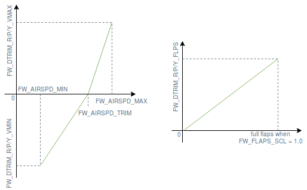

# 固定翼配平指南

配平校准是指在配平状态下计算/设置舵面偏度（配平状态包含相对空速、空气密度、攻击角、飞机配置等）。 一架具有合适配平设置的飞机在配平状态下飞行将自动保持其姿态，不需要飞行员或增稳计算机进行任何的控制操作。

通用航空器、 商用以及大型无人驾驶飞机用 [配平小舵](https://en.wikipedia.org/wiki/Trim_tab) 来配平舵面，而小型无人驾驶飞行器通常通过简单的在舵面上施加一个偏置实现。

[基础配平](#basic-trimming) 部分解释了每个配平参数的目的以及如何找到正确的值。 [高级配平](#advanced-trimming) 部分引入了可以根据测量的空速和襟翼位置来自动调整配平参数。

## 基础配平

操作者可通过若干个参数来恰当地配平固定翼飞机。 以下是这些参数及其使用场景的概述：

- [RCx_TRIM](../advanced_config/parameter_reference.md#RC1_TRIM) 用于配平从 RC 发射器收到的信号。 这些参数在 [RC校准](../config/radio.md) 期间自动设置。
- [CA_SV_CSx_TRIM](../advanced_config/parameter_reference.md#CA_SV_CS0_TRIM) 应用于舵面通道配平。 该参数用于在飞行前精确地将舵面与默认角度对齐。
- [FW_PSP_OFF](../advanced_config/parameter_reference.md#FW_PSP_OFF) 用于对俯仰设定值添加偏置。 该参数用来设定飞机在巡航速度飞行时所需要的攻角。
- [FW_AIRSPD_TRIM](../advanced_config/parameter_reference.md#FW_AIRSPD_TRIM) 被角速率控制器根据测量空速来缩放其控制输出。 查看 [空速缩放](../flight_stack/controller_diagrams.md#airspeed-scaling) 了解更多信息。
- [TRIM_ROLL](../advanced_config/parameter_reference.md#TRIM_ROLL), [TRIM_PITCH](../advanced_config/parameter_reference.md#TRIM_PITCH) 和 [TRIM_YAW](../advanced_config/parameter_reference.md#TRIM_YAW) 用于在混控</em> 之前 *对控制信号进行配平。 例如，如果你有两个升降舵舵机， `TRIM_PITCH` 对这两个舵机都进行配平。 这些参数在您的舵面已对齐，但在手动飞行期间出现飞机俯仰/滚轮/偏航/上下/左右动作(不稳定)时，或在增稳飞行期间控制信号有恒定偏移时使用。
</li> </ul>

设置上述参数的正确顺序是：

1. 尽可能通过调整舵面连杆长度来配平舵面，也可以通过修改对应舵面 PWM 频道的配平参数(使用 `PWM_MAIN/AUX_TRIMx`)来将舵面配平至其理论位置。
1. 在增稳模式下按巡航速度飞行，将俯仰设定值偏移量(`FW_PSP_OFF`)设置为该状态下的飞行攻角。 巡航速度飞行下的需用攻角为飞机在平飞状态下保持固定高度时的实际飞行迎角。 如果您使用了空速传感器，也设置了正确的巡航速度(`FW_AIRSPD_TRIM`)。
1. 查看日志文件中的舵机控制量 (例如可以将其上传到 [Flight Review](https://logs.px4.io) 并绘图查看 *Actuator Controls* ) 来设置俯仰配平(`TRIM_PITCH`)。 将该值设置为平飞时俯仰角度的平均值。

步骤3可以在步骤2之前执行，如果你不想查看日志， 或者如果您在手动模式下感觉舒适。 然后你可以通过遥控器（微调开关）进行配平用并将该值设置给 `TRIM_PITCH` (并从你的遥控器中移除微调)，或者也可以通过数据链和QGC在飞行过程中直接修改 `TRIM_PITCH` 。

## 高级配平

在空速增加过程中，会因非对称翼型和使用襟翼而引入俯仰通道低头力矩，因此飞机需要根据测量空速和襟翼位置重新计算配平。 为此，可以使用以下参数定义一个关于空速的双线性曲线函数和关于襟翼状态的俯仰修正增量函数（参见下图）：

- [FW\_DTRIM\_\[R/P/Y\]_\[VMIN/VMAX\]](../advanced_config/parameter_reference.md#FW_DTRIM_R_VMIN) 是滚转/俯仰/偏航增加到 `TRIM_ROL/PITCH/YAW` 的配平值，最小/最大空速(由 [FW_AIRSPD_MIN](../advanced_config/parameter_reference.md#FW_AIRSPD_MIN) 和 [FW_AIRSPD_MAX](../advanced_config/parameter_reference.md#FW_AIRSPD_MAX) 定义)。
- [CA_SV_CSx_FLAP](../advanced_config/parameter_reference.md#CA_SV_CS0_FLAP) 和 [CA_SV_CSx_SPOIL](../advanced_config/parameter_reference.md#CA_SV_CS0_SPOIL) 分别对应于襟翼完全部署状态下的舵面配平量和扰流板完全部署状态下的舵面配平量。

 <!-- The drawing is on draw.io: https://drive.google.com/file/d/15AbscUF1kRdWMh8ONcCRu6QBwGbqVGfl/view?usp=sharing
Request access from dev team. -->

一个完全对称的机身只需要进行俯仰修正增量，但由于实际机身永远不是完全对称的，有时还需要进行横滚和偏航的修正增量。 
