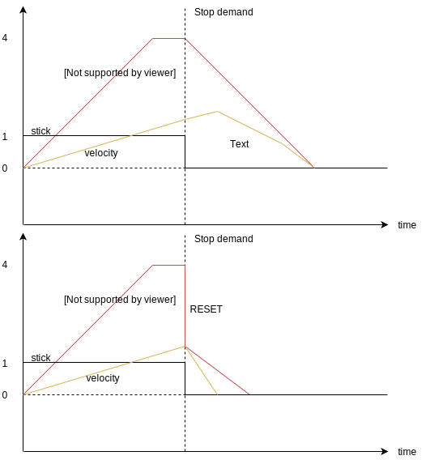

# 多旋翼的转换速率型轨迹

> **Tip** 该轨迹类型可以通过设置以下参数：[MPC_POS_MODE=1](../advanced_config/parameter_reference.md#MPC_POS_MODE) 在[定点模式](../flight_modes/position_mc.md)（仅限）下启用。
> 
> [多旋翼的加加速度限制型轨迹调整](../config_mc/mc_jerk_limited_type_trajectory.md)是另一种提供更平滑响应的轨迹。

转换速率轨迹类型是一种简单的实现方式，在这种情况下，加加速度和加速度使用转换速率进行限制（加加速度和加速度限制不是硬约束）。

它允许非对称配置的用户意图（平滑加速及快速停止），并且应该在响应快速摇杆输入（可能是“抖动”）优先于保证平滑加减速时使用（例如，对于位置保持状态下的激烈飞行）。

本话题解释了如何调整轨迹类型。

## 定点模式

在[定点模式](../flight_modes/position_mc.md)中， 摇杆输入映射为**位置-控制**或**速度-控制**。

> **Note** 位置控制器（[此图](https://dev.px4.io/master/en/flight_stack/controller_diagrams.html#multicopter-position-controller)）由一个外环 **P** 位置控制回路和一个内环 **PID** 速度控制回路组成。 根据模式和情况启用两个回路或仅启用速度控制回路。
> 
> 对于本话题的其余部分，术语“**位置-控制**”代表两个回路均被启用，而“**速度-控制**”指的是仅启用速度控制回路的情况。

当摇杆输入在死区 [MPC_HOLD_DZ](../advanced_config/parameter_reference.md#MPC_HOLD_DZ)内时，位置控制被启用，否则启用速度控制。

以下所有参数都是可调节参数，不能被直接映射为物理量。

#### MPC_ACC_HOR_MAX

该参数用于水平方向的位置控制，即机体理应停留在当前位置。 速度设定值变化率的极限由 [MPC_ACC_HOR_MAX](../advanced_config/parameter_reference.md#MPC_ACC_HOR_MAX) 定义。 此参数应设置为大于水平方向上任何其他加速度相关参数。

#### MPC_ACC_HOR 和 MPC_HOR_SLOW {#mpc_acc_hor-and-mpc_dec_hor_slow}

在速度控制中，速度设定值的速率极限是从摇杆输入到加速度极限的线性映射中提取的，最大值为 [MPC_ACC_HOR](../advanced_config/parameter_reference.md#MPC_ACC_HOR)，最小值为 [MPC_DEC_HOR_SLOW](../advanced_config/parameter_reference.md#MPC_DEC_HOR_SLOW)。 例如，若摇杆输入为 `MPC_HOLD_DZ`，则极限加速度为 `MPC_DEC_HOR_SLOW`。 如果摇杆输入为最大值 (=`1`)，则极限加速度为 `MPC_ACC_HOR`，并且任意摇杆输入都将在这两个参数之间线性映射。 此外，当用户要求在当前飞行方向减速时，`MPC_DEC_HOR_SLOW` 也会限制速度设定值的变化。 例如，当摇杆的输入量从最大值（=`1`）变化到 `0.5` 时，速度设定的变化将由 `MPC_DEC_HOR_SLOW` 限定。

当由 **速度-控制** 过渡为 **位置-控制**时，将会发生一个从 `MPC_ACC_HOR` 切换到 `MPC_ACC_HOR_MAX` 的强制转变， 并且速度设定值会重置为当前机体速度。 重置和强制转变都可能在机体减速停止的过程中引起飞行抖动。 尽管如此，重置也是必需的，因为平滑参数会导致延迟到达设定值，若不重置则可能导致始料不及的飞行动作。

下面给出一个简单例子来解释为什么需要重置。

考虑这样一种情况：用户要求机体从悬停状态转为全速飞行，接着又要求机体停止前飞。 这相当于先使摇杆满输入取最大值 `1`，后又使其置零。 为了简化这个例子，假设参数 `MPC_ACC_HOR_MAX` 等于 `MPC_ACC_HOR`，因此当从**速度-控制**转为**位置-控制**时，加速限制没有强制转变。 此外，我们假设期望的最大速度为 `4 m/s`。

在摇杆满输入期间，速度设定值不会直接从 `0 m/s` 变为 `4 m/s`（即阶跃输入），而是会根据参数 `MPC_ACC_HOR` 的斜率渐变。 然而，机体的实际速度不会完美地跟踪设定值，而是总会稍微滞后。 `MPC_ACC_HOR` 的值越大，滞后越显著。

如果不重置（如顶部图所示），在发送停止指令时（摇杆输入值为 0），速度设定值将以` MPC_ACC_HOR_MAX `所示的最大速率缓降。 由于滞后，机体将先在停止指令发送之前的行进方向上继续加速，然后缓慢减速至零。 通过将速度设定值重置为当前速度，可以克服停止指令导致的延迟。

#### MPC_ACC_UP_MAX 和 MPC_ACC_DOWN_MAX

`MPC_ACC_UP_MAX` >= `MPC_ACC_DOWN_MAX`，否则固件将重写给定值以满足此条件。

- **位置-控制：**速度设定值在 z 方向的变化上限由参数 [MPC_ACC_UP_MAX](../advanced_config/parameter_reference.md#MPC_ACC_UP_MAX) 给出。
- **速度-控制：**摇杆输入导致的速度设定值的变化极限由两个参数给出， `MPC_ACC_UP_MAX` 为上限， [MPC_ACC_DOWN_MAX](../advanced_config/parameter_reference.md#MPC_ACC_DOWN_MAX) 为下限。

#### MPC_JERK_MAX 和 MPC_JERK_MIN

这两个参数仅在从**速度-控制**到**位置-控制</ 0>的转换期间有效。 这两个参数的意义是尽量减小机体从前飞状态到悬停状态导致的加加速度（请参见 [MPC_ACC_HOR 和 MPC_DEC_HOR_SLOW](#mpc_acc_hor-and-mpc_dec_hor_slow)）。
 

加加速度参数通过设置最大加速度 `MPC_ACC_HOR_MAX` 来控制速度上限。 实际的加加速度值和飞行器制动前的速度值呈线性关系， 全速映射到[MPC_JERK_MAX](../advanced_config/parameter_reference.md#MPC_JERK_MAX) 而零速映射到 [MPC_JERK_MIN](../advanced_config/parameter_reference.md#MPC_JERK_MIN)。 你可以通过将 `MPC_JERK_MAX` 设置为小于 `MPC_JERK_MIN` 的值来禁用平滑效果。