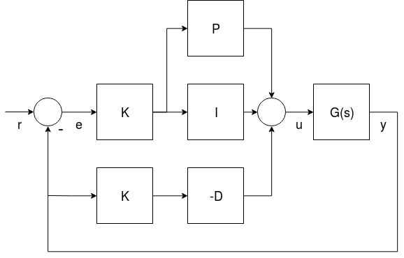
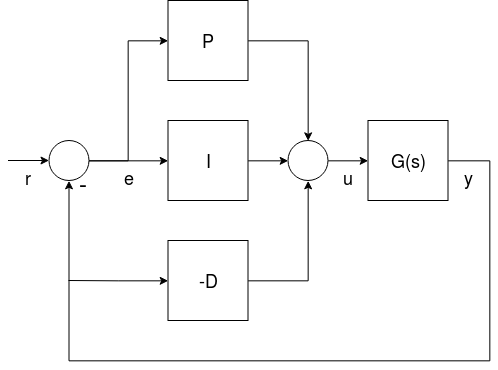
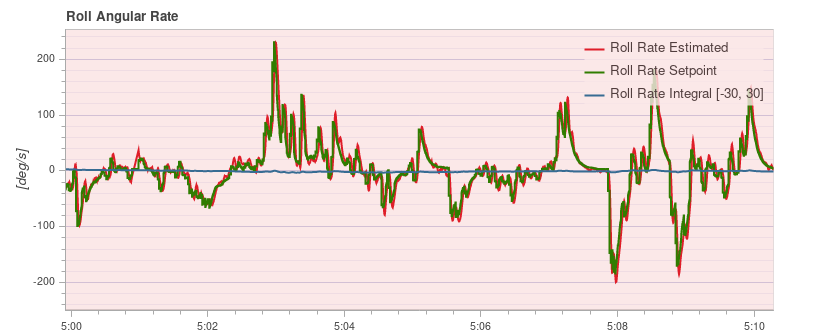
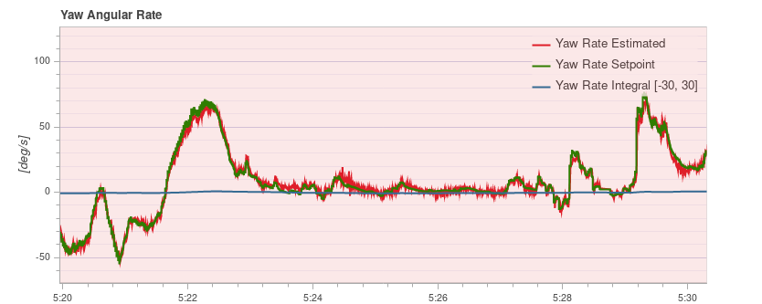
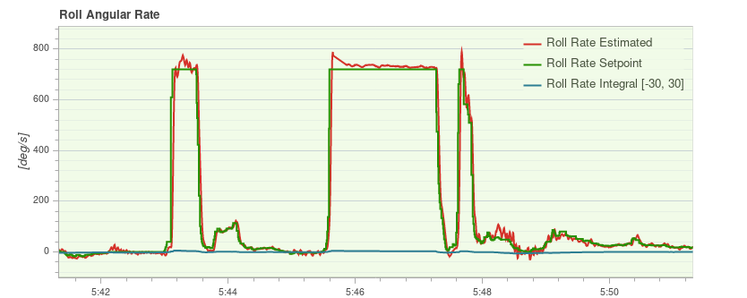

# 多轴飞行器 PID 调参指南

本教程介绍如何在 PX4 上调整 [ 多轴飞行器 ](../airframes/airframe_reference.md#copter) (四、六、八旋翼等) 的 PID 参数 。

通常, 如果您使用的是 [ 已经支持的机型 ](../airframes/airframe_reference.md#copter) （例如, [ QGroundControl ](../config/airframe.md) 中的机身），则默认参数应足以安全地飞行。 为了获得最好的性能, 最好能整定新飞机的 PID 参数。 例如, 不同的电调或电机需要不同的控制增益, 才能获得最佳飞行效果。

> **Warning** 本指南仅适用于高级用户。 不合适的参数可能会导致飞行器不稳定，甚至炸机。 确保预先指定保护开关 ( Kill-switch ) 。

## 简介

PX4 uses **P**roportional, **I**ntegral, **D**erivative (PID) controllers (these are the most widespread control technique).

The controllers are layered, which means a higher-level controller passes its results to a lower-level controller. The lowest-level controller is the the **rate controller**, then there is the **attitude contoller**, and then the **velocity & position controller**. The PID tuning needs to be done in the same order, starting with the rate controller, as it will affect all other controllers.

## 前置条件

- 您已为您的飞行器选择了最接近的 [ 默认机型配置 ](../config/airframe.md)。 这应该可以让你的飞行器飞起来。
- 您应该已经执行过 [ 电调（ESC）校准 ](../advanced_config/esc_calibration.md)。
- [ PWM_MIN ](../advanced_config/parameter_reference.md#PWM_MIN) 正确设置。 它需要设置一个小值, 但当飞行器解锁时, 需要保证 ** 电机不停转 **。
  
  可以在 [特技 Acro 模式](../flight_modes/acro_mc.md) 或 [ 手动/自稳模式 ](../flight_modes/manual_stabilized_mc.md) 中进行测试：
  
  - 卸下螺旋桨
  - 解锁，并将油门杆拉到最低
  - 把飞行器倾斜到各个方向, 大约60度
  - 确保没有电机停转
- 可以通过 [ SDLOG_PROFILE ](../advanced_config/parameter_reference.md#SDLOG_PROFILE) 参数，启用高速率日志记录配置文件, 以便使用日志来查看角速率和姿态跟踪性能 (之后可以禁用该选项) 。

> **警告** 在调参过程中，禁用 [MC_AIRMODE](../advanced_config/parameter_reference.md#MC_AIRMODE)。

## 调参步骤

> **Note** For safety reasons, the default gains are set to low values. You must increase the gains before you can expect good control responses. 

以下是做调参时要遵循的一些一般要点：

- 调整增益时，所有的增益值都应该慢慢增加, 因为增益过大可能会导致危险的振荡! 一般情况下，每次增益值的调整幅度大约在20%到30%，获得最优增益值后，基于最优值再下调5%到10%。
- 在修改参数之前务必先着陆。 慢慢增加油门，观察振荡的现象。
- Tune the vehicle around the hovering thrust point, and use the [thrust curve parameter](#thrust_curve) to account for thrust non-linearities or high-thrust oscillations.

### 速率控制器

The rate controller is the inner-most loop with three independent PID controllers to control the body rates (yaw, pitch, roll).

> **注意** 把角速度控制器调好是非常重要的，因为它会影响到 *所有的*飞行模式。 角速度控制器跳得好不好可以在[位置模式](../flight_modes/position_mc.md)中显现出来，举个例子，你的飞机可能会「抽搐」（飞行器无法很好地悬停在空中）

#### Rate Controller Architecture/Form

PX4 supports two (mathematically equivalent) forms of the PID rate controller in a single "mixed" implementation: [Parallel](#parallel_form) and [Standard](#standard_form).

Users can select the form that is used by setting the proportional gain for the other form to "1" (i.e. in the diagram below set **K** to 1 for the parallel form, or **P** to 1 for the standard form - this will replace either the K or P blocks with a line).

 <!-- The drawing is on draw.io: https://drive.google.com/file/d/1hXnAJVRyqNAdcreqNa5W4PQFkYnzwgOO/view?usp=sharing -->

- *G(s)* represents the angular rates dynamics of a vehicle
- *r* is the rate setpoint
- *y* is the body angular rate (measured by a gyro)
- *e* is the error between the rate setpoint and the measured rate
- *u* is the output of the PID controller

The two forms are described below.

> **Note** The derivative term (**D**) is on the feedback path in order to avoid an effect known as the [derivative kick](http://brettbeauregard.com/blog/2011/04/improving-the-beginner%E2%80%99s-pid-derivative-kick/).

> **Tip** For more information see:

    - [Not all PID controllers are the same](https://www.controleng.com/articles/not-all-pid-controllers-are-the-same/) (www.controleng.com) 
    - [PID controller > Standard versus parallel (ideal) PID form](https://en.wikipedia.org/wiki/PID_controller#Standard_versus_parallel_(ideal)_PID_form) (Wikipedia)
    

##### Parallel Form {#parallel_form}

The *parallel form* is the simplest form, and is (hence) commonly used in textbooks. In this case the output of the controller is simply the sum of the proportional, integral and derivative actions.

##### Standard Form {#standard_form}

This form is mathematically equivalent to the parallel form, but the main advantage is that (even if it seems counter intuitive) it decouples the proportional gain tuning from the integral and derivative gains. This means that a new platform can easily be tuned by taking the gains of a drone with similar size/inertia and simply adjust the K gain to have it flying properly.

#### Rate PID Tuning

The related parameters for the tuning of the PID rate controllers are:

- Roll rate control ([MC_ROLLRATE_P](../advanced_config/parameter_reference.md#MC_ROLLRATE_P), [MC_ROLLRATE_I](../advanced_config/parameter_reference.md#MC_ROLLRATE_I), [MC_ROLLRATE_D](../advanced_config/parameter_reference.md#MC_ROLLRATE_D), [MC_ROLLRATE_K](../advanced_config/parameter_reference.md#MC_ROLLRATE_K))
- Pitch rate control ([MC_PITCHRATE_P](../advanced_config/parameter_reference.md#MC_PITCHRATE_P), [MC_PITCHRATE_I](../advanced_config/parameter_reference.md#MC_PITCHRATE_I), [MC_PITCHRATE_D](../advanced_config/parameter_reference.md#MC_PITCHRATE_D), [MC_PITCHRATE_K](../advanced_config/parameter_reference.md#MC_PITCHRATE_K))
- Yaw rate control ([MC_YAWRATE_P](../advanced_config/parameter_reference.md#MC_YAWRATE_P), [MC_YAWRATE_I](../advanced_config/parameter_reference.md#MC_YAWRATE_I), [MC_YAWRATE_D](../advanced_config/parameter_reference.md#MC_YAWRATE_D), [MC_YAWRATE_K](../advanced_config/parameter_reference.md#MC_YAWRATE_K))

The rate controller can be tuned in [Acro mode](../flight_modes/acro_mc.md) or [Manual/Stabilized mode](../flight_modes/manual_stabilized_mc.md):

- *Acro mode* is preferred, but is harder to fly. If you choose this mode, disable all stick expo: 
  - `MC_ACRO_EXPO` = 0, `MC_ACRO_EXPO_Y` = 0, `MC_ACRO_SUPEXPO` = 0, `MC_ACRO_SUPEXPOY` = 0
  - `MC_ACRO_P_MAX` = 200, `MC_ACRO_R_MAX` = 200
  - `MC_ACRO_Y_MAX` = 100
- *Manual/Stabilized mode* is simpler to fly, but it is also more difficult to see if the attitude or the rate controller needs more tuning.

If the vehicle does not fly at all:

- If there are strong oscillations when first trying to takeoff (to the point where it does not fly), decrease all **P** and **D** gains until it takes off.
- If the reaction to RC movement is minimal, increase the **P** gains.

The actual tuning is roughly the same in *Manual mode* or *Acro mode*: You iteratively tune the **P** and **D** gains for roll and pitch, and then the **I** gain. Initially you can use the same values for roll and pitch, and once you have good values, you can fine-tune them by looking at roll and pitch response separately (if your vehicle is symmetric, this is not needed). For yaw it is very similar, except that **D** can be left at 0.

##### Proportional Gain (P/K)

The proportional gain is used to minimize the tracking error (below we use **P** to refer to both **P** or **K**). It is responsible for a quick response and thus should be set as high as possible, but without introducing oscillations.

- If the **P** gain is too high: you will see high-frequency oscillations.
- If the **P** gain is too low: 
  - the vehicle will react slowly to input changes.
  - In *Acro mode* the vehicle will drift, and you will constantly need to correct to keep it level.

##### Derivative Gain (D)

The **D** (derivative) gain is used for rate damping. It is required but should be set only as high as needed to avoid overshoots.

- If the **D** gain is too high: the motors become twitchy (and maybe hot), because the **D** term amplifies noise.
- If the **D** gain is too low: you see overshoots after a step-input.

Typical values are:

- standard form (**P** = 1): between 0.01 (4" racer) and 0.04 (500 size), for any value of **K**
- parallel form (**K** = 1): between 0.0004 and 0.005, depending on the value of **P**

##### Integral Gain (I)

The **I** (integral) gain keeps a memory of the error. The **I** term increases when the desired rate is not reached over some time. It is important (especially when flying *Acro mode*), but it should not be set too high.

- If the I gain is too high: you will see slow oscillations.
- If the I gain is too low: this is best tested in *Acro mode*, by tilting the vehicle to one side about 45 degrees, and keeping it like that. It should keep the same angle. If it drifts back, increase the **I** gain. A low **I** gain is also visible in a log, when there is an offset between the desired and the actual rate over a longer time.

Typical values are:

- standard form (**P** = 1): between 0.5 (VTOL plane), 1 (500 size) and 8 (4" racer), for any value of **K**
- parallel form (**K** = 1): between 0.3 and 0.5 if **P** is around 0.15 The pitch gain usually needs to be a bit higher than the roll gain.

#### Testing Procedure

To test the current gains, provide a fast **step-input** when hovering and observe how the vehicle reacts. It should immediately follow the command, and neither oscillate, nor overshoot (it feels 'locked-in').

You can create a step-input for example for roll, by quickly pushing the roll stick to one side, and then let it go back quickly (be aware that the stick will oscillate too if you just let go of it, because it is spring-loaded — a well-tuned vehicle will follow these oscillations).

> **Note** A well-tuned vehicle in *Acro mode* will not tilt randomly towards one side, but keeps the attitude for tens of seconds even without any corrections.

#### Logs

Looking at a log helps to evaluate tracking performance as well. Here is an example for good roll and yaw rate tracking:

 

And here is a good example for the roll rate tracking with several flips, which create an extreme step-input. You can see that the vehicle overshoots only by a very small amount: 

### 角度控制

This controls the orientation and outputs desired body rates with the following tuning parameters:

- Roll control ([MC_ROLL_P](../advanced_config/parameter_reference.md#MC_ROLL_P))
- Pitch control ([MC_PITCH_P](../advanced_config/parameter_reference.md#MC_PITCH_P)
- Yaw control ([MC_YAW_P](../advanced_config/parameter_reference.md#MC_YAW_P))

The attitude controller is much easier to tune. In fact, most of the time the defaults do not need to be changed at all.

To tune the attitude controller, fly in *Manual/Stabilized mode* and increase the **P** gains gradually. If you start to see oscillations or overshoots, the gains are too high.

The following parameters can also be adjusted. These determine the maximum rotation rates around all three axes:

- Maximum roll rate ([MC_ROLLRATE_MAX](../advanced_config/parameter_reference.md#MC_ROLLRATE_MAX))
- Maximum pitch rate ([MC_PITCHRATE_MAX](../advanced_config/parameter_reference.md#MC_PITCHRATE_MAX)
- Maximum yaw rate ([MC_YAWRATE_MAX](../advanced_config/parameter_reference.md#MC_YAWRATE_MAX))

### Thrust Curve {#thrust_curve}

The tuning above optimises performance around the hover throttle. But it can be that you start to see oscillations when going towards full throttle.

To counteract that adjust the **thrust curve** with the [THR_MDL_FAC](../advanced_config/parameter_reference.md#THR_MDL_FAC) parameter.

> **Note** The rate controller might need to be re-tuned if you change this parameter.

The mapping from motor control signals (e.g. PWM) to expected thrust is linear by default — setting `THR_MDL_FAC` to 1 makes it quadratic. Values in between use a linear interpolation of the two. Typical values are between 0.3 and 0.5.

If you have a [thrust stand](https://www.rcbenchmark.com/pages/series-1580-thrust-stand-dynamometer) (or can otherwise *measure* thrust), you can determine the relationship between the PWM control signal and the motor's actual thrust, and fit a function to the data. [This Notebook](https://github.com/PX4/px4_user_guide/blob/master/assets/config/mc/ThrustCurve.ipynb) shows how the thrust model factor `THR_MDL_FAC` may be calculated from previously measured thrust data.

> **Note** The mapping between PWM and static thrust depends highly on the battery voltage.

If you don't have access to a thrust stand, you can also tune the modeling factor empirically. Start off with 0.3 and increase it by 0.1 at a time. If it is too high, you will start to notice oscillations at lower throttle values. If it is too low you'll notice oscillations at higher throttle values.

<!-- TODO
### Velocity & Position Controller
The PID-Gains should be chosen such that tracking is as tight as possible. Before doing any position/velocity control related tuning,
turn off all [higher-level position controller tuning gains](../config_mc/mc_trajectory_tuning.md).

- [MPC_ACC_HOR_MAX](../advanced_config/parameter_reference.md#MPC_ACC_HOR_MAX): 1000
- [MPC_ACC_HOR](../advanced_config/parameter_reference.md#MPC_ACC_HOR) : 1000
- [MPC_DEC_HOR_SLOW](../advanced_config/parameter_reference.md#MPC_DEC_HOR_SLOW) : 1000
- [MPC_ACC_UP_MAX](../advanced_config/parameter_reference.md#MPC_ACC_UP_MAX) : 1000
- [MPC_ACC_DOWN_MAX](../advanced_config/parameter_reference.md#MPC_ACC_DOWN_MAX) : 1000
- [MPC_JERK_MAX](../advanced_config/parameter_reference.md#MPC_JERK_MAX) : 0
- [MPC_JERK_MIN](../advanced_config/parameter_reference.md#MPC_JERK_MIN) : 1
 -->

### Airmode & 混控器饱和 {#airmode}

The rate controller outputs torque commands for all three axis (roll, pitch and yaw) and a scalar thrust value, which need to be converted into individual motor thrust commands. This step is called mixing.

It can happen that one of the motor commands becomes negative, for example for a low thrust and large roll command (and similarly it can go above 100%). This is a mixer saturation. It is physically impossible for the vehicle to execute these commands (except for reversible motors). PX4 has two modes to resolve this:

- Either by reducing the commanded torque for roll such that none of the motor commands is below zero (Airmode disabled). In the extreme case where the commanded thrust is zero, it means that no attitude correction is possible anymore, which is why a minimum thrust is always required for this mode.
- Or by increasing (boosting) the commanded thrust, such that none of the motor commands is negative (Airmode enabled). This has the big advantage that the attitude/rates can be tracked correctly even at low or zero throttle. It generally improves the flight performance.
  
  However it increases the total thrust which can lead to situations where the vehicle continues to ascend even though the throttle is reduced to zero. For a well-tuned, correctly functioning vehicle it is not the case, but for example it can happen when the vehicle strongly oscillates due to too high P tuning gains.

Both modes are shown below with a 2D illustration for two motors and a torque command for roll r. On the left motor r is added to the commanded thrust, while on the right motor it is subtracted from it. The motor thrusts are in green. With Airmode enabled, the commanded thrust is increased by b. When it is disabled, r is reduced.

 <!-- The drawing is on draw.io: https://drive.google.com/file/d/1N0qjbiJX6JuEk2I1-xFvigLEPKJRIjBP/view?usp=sharing
     On the first Tab
-->

If mixing becomes saturated towards the upper bound the commanded thrust is reduced to ensure that no motor is commanded to deliver more than 100% thrust. This behaviour is similar to the Airmode logic, and is applied whether Airmode is enabled or disabled.

Once your vehicle flies well you can enable Airmode via the [MC_AIRMODE](../advanced_config/parameter_reference.md#MC_AIRMODE) parameter.