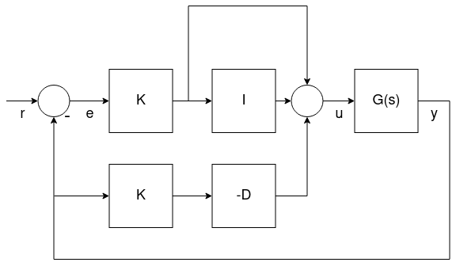

# 多轴飞行器 PID 调参指南

本教程介绍如何在 PX4 上调整 [ 多轴飞行器 ](../airframes/airframe_reference.md#copter) (四、六、八旋翼等) 的 PID 参数 。

通常, 如果您使用的是 [ 已经支持的机型 ](../airframes/airframe_reference.md#copter) （例如, [ QGroundControl ](../config/airframe.md) 中的机身），则默认参数应足以安全地飞行。 为了获得最好的性能, 最好能整定新飞机的 PID 参数。 例如, 不同的电调或电机需要不同的控制增益, 才能获得最佳飞行效果。

:::warning
本指南仅适用于高级用户。 未调试或部分调试的无人机很可能不稳定，很容易坠毁。 请确保预先指定了保护开关 ( Kill-switch ) 。
:::

## 简介

PX4 使用 **P比例**, **I积分**, **D微分**(PID) 控制器，(是使用最广泛的控制技术)。 

控制器是分级的, 这意味着外环的控制器将其结果传递给内环的控制器。 最内环的控制器是 ** 角速率控制器 **, 然后是 ** 姿态控制器 **, 然后 ** 速度 & 位置控制器 **。 PID 调参需要按相同的顺序进行, 从角速率控制器开始, 因为它将影响其他所有控制器。

## 前置条件

- 您已为您的飞行器选择了最接近的 [ 默认机型配置 ](../config/airframe.md)。 这应该可以让你的飞行器飞起来。
- 您应该已经执行过 [ 电调（ESC）校准 ](../advanced_config/esc_calibration.md)。
- [ PWM_MIN ](../advanced_config/parameter_reference.md#PWM_MIN) 正确设置。 它需要设置一个小值, 但当飞行器解锁时, 需要保证 ** 电机不停转 **。
  
  可以在 [特技 Acro 模式](../flight_modes/acro_mc.md) 或 [ 手动/自稳模式 ](../flight_modes/manual_stabilized_mc.md) 中进行测试：
  
  - 卸下螺旋桨
  - 解锁，并将油门杆拉到最低
  - 把飞行器倾斜到各个方向, 大约60度
  - 确保没有电机停转
- 可以通过 [ SDLOG_PROFILE ](../advanced_config/parameter_reference.md#SDLOG_PROFILE) 参数，启用高速率日志记录配置文件, 以便使用日志来查看角速率和姿态跟踪性能 (之后可以禁用该选项) 。

::warning 在调参过程中，禁用 [MC_AIRMODE](../advanced_config/parameter_reference.md#MC_AIRMODE)。
:::

## 调参步骤

:::note
出于安全原因，默认增益设置比较低。 您必须增加增益才能得到良好的控制响应。
:::

以下是做调参时要遵循的一些一般要点：

- 调整增益时，所有的增益值都应该慢慢增加, 因为增益过大可能会导致危险的振荡! 一般情况下，每次增益值的调整幅度大约在20%到30%，获得最优增益值后，基于最优值再下调5%到10%。
- 在修改参数之前务必先着陆。 慢慢增加油门，观察振荡的现象。
- 调参时的油门值应该在无人机的悬停油门, 并使用 [ 推力曲线参数（Thrust Curve Parameter 或 TPA) ](#thrust_curve) 来观察或判断推力非线性或高推力振荡现象。

### 速率控制器

角速度控制是最内环的控制器，它用三个独立的PID控制来控制机身角速度(航向，俯仰，横滚)。

:::note
把角速度控制器调好是非常重要的，因为它会影响到 *所有的*飞行模式。 角速度控制器跳得好不好可以在[位置模式](../flight_modes/position_mc.md)中显现出来，举个例子，你的飞机可能会「抽搐」（飞行器无法很好地悬停在空中）
:::

#### 速率控制器架构/形式

PX4在一个单一的“混合”实现上支持两种(数学上等价的)PID速率控制器:并行和标准。

用户可以通过设置其他形式的比例值为“1”，来选择使用的形式(即在下图设置K 为1来选择并行形式,或P为1选择标准形式——这将用一条线来取代 K或P框图)。

 <!-- The drawing is on draw.io: https://drive.google.com/file/d/1hXnAJVRyqNAdcreqNa5W4PQFkYnzwgOO/view?usp=sharing -->

- *G(s)* represents the angular rates dynamics of a vehicle
- *r* 是角速读目标值
- *y* 是机体角速度 (由陀螺仪测量)
- *e* 是设定角速度和测定角速度之间的误差
- *u* 是 PID 控制器的输出

这两种形式将在后面介绍。

:::note微分项(**D**) 加在反馈路径上，以避免被称为 [微分冲击](http://brettbeauregard.com/blog/2011/04/improving-the-beginner%E2%80%99s-pid-derivative-kick/)的现象。
:::

有关详细信息，请参阅︰

- [Not all PID controllers are the same](https://www.controleng.com/articles/not-all-pid-controllers-are-the-same/) (www.controleng.com) 
- [PID controller > Standard versus parallel (ideal) PID form](https://en.wikipedia.org/wiki/PID_controller#Standard_versus_parallel_(ideal)_PID_form) (Wikipedia)
:::

##### 并行模式

*并行模式* 是最简单的形式，也是教科书中最常用的形式。 在这种情况下，控制器的输出只是简单的将比例，积分和微分项相加。

##### 标准模式

这种形式在数学上等同于平行形式。 但主要的优点是（即使似乎反直觉）将比例增益的调试与积分、微分增益分离开来。 这意味着一个新的平台通过使用同样大小/推力 无人机的增益，使它更易于调试，只是简单地调整K增益就可正常飞行。

#### 角速度 PID 调试

调试角速度PID控制器的相关参数是：

- 横滚角速度控制([MC_ROLLRATE_P](../advanced_config/parameter_reference.md#MC_ROLLRATE_P), [MC_ROLLRATE_I](../advanced_config/parameter_reference.md#MC_ROLLRATE_I), [MC_ROLLRATE_D](../advanced_config/parameter_reference.md#MC_ROLLRATE_D), [MC_ROLLRATE_K](../advanced_config/parameter_reference.md#MC_ROLLRATE_K))
- 俯仰角速度控制([MC_PITCHRATE_P](../advanced_config/parameter_reference.md#MC_PITCHRATE_P), [MC_PITCHRATE_I](../advanced_config/parameter_reference.md#MC_PITCHRATE_I), [MC_PITCHRATE_D](../advanced_config/parameter_reference.md#MC_PITCHRATE_D), [MC_PITCHRATE_K](../advanced_config/parameter_reference.md#MC_PITCHRATE_K))
- 航向角速度控制([MC_YAWRATE_P](../advanced_config/parameter_reference.md#MC_YAWRATE_P), [MC_YAWRATE_I](../advanced_config/parameter_reference.md#MC_YAWRATE_I), [MC_YAWRATE_D](../advanced_config/parameter_reference.md#MC_YAWRATE_D), [MC_YAWRATE_K](../advanced_config/parameter_reference.md#MC_YAWRATE_K)) 

角速度控制器可以在[特技模式](../flight_modes/acro_mc.md)或者[手动/自稳模式](../flight_modes/manual_stabilized_mc.md)中调整。

- *我们更推荐特技模式，* 但这种模式比较难飞。 如果你选择特技模式，记得把把特技模式指数因子都禁用了： 
  - `MC_ACRO_EXPO` = 0, `MC_ACRO_EXPO_Y` = 0, `MC_ACRO_SUPEXPO` = 0, `MC_ACRO_SUPEXPOY` = 0
  - `MC_ACRO_P_MAX` = 200, `MC_ACRO_R_MAX` = 200
  - `MC_ACRO_Y_MAX` = 100
- *手动/自稳模式*更好飞，但这种模式也比较难观察姿态和角速度控制器到底调好了没。

万一你的飞行器完全飞不起来：

- 如果你发现首次起飞有严重的振荡（严重到根本没法飞），那你可以减小所有的**P**和**D**参数，直到它能够正常起飞。
- 如果对对遥控器的响应微小，增加 **P** 增益。

*手动模式*和*特技模式*的调参套路差不多：一步步地迭代调整滚转和俯仰的**P**和**D**增益，然后再调**I**增益。 一开始你的ROLL和PITCH可以用相同的值，等调的差不多了，细调的时候可以分别再调整滚转和俯仰（如果你的飞行器是对称的，那就不用再细调了。） 偏航调试也是同样的方法，除了偏航的D可以为0。

##### Proportional Gain (P/K)

比例增益用于最小化跟踪误差 (下面我们使用 **P** 来代指 **P** 或 **K**)。 它可以加快响应速度，因此应该在不引入震荡的前提下设的尽量的高。

- 如果**P**增益太高了，会有高频率的振荡。
- 如果 **P** 增益太低了: 
  - 飞行器会对遥控器的输入很迟钝。
  - 如果是在*特技模式*下，飞行器会漂移，你会一直要矫正它来让它水平。

##### 微分增益

**D增益**(微分增益) 用来增加阻尼，可以防止超调。 同样地，这个值应该尽量设大一些来避免超调。

- **D增益**太大，电机可能会抽搐、发热(也有可能不会) 。这是因为**D**项同时也会放大震动等带来的噪声。
- **D增益**太低会导致超调，在一个阶跃输入后看到超调。

典型值是：

- 标准模式 (**P** = 1): 0.01 (4" racer) 到0.04 (500 size)之间， 不管 **K**的值是多少
- 并行模式 (**K** = 1): 0.0004 到0.005之间, 取决于 **P**的值

##### 积分增益 (I)

**I**（积分）增益可以「记住误差」。 当一段时间后没有达到目的角速度，积分项 **I**就会增加 它很重要(尤其在*特技模式*下) ，但我们不应该把它设得太高。

- 如果积分增益太高：你会看到缓慢的振荡。
- 如果积分增益太低：我们可以在*特技模式*下很好地看到这一点，让飞行器朝一个方向转45度，并保持一会。 他应该始终保持相同的角度。 如果它往回漂移，增加** I **。 通过观察日志我们也可以发现** I **增益太小的问题，可以看到实际的角速度过很久也达不到期望的角速度。

典型值是：

- 标准模式 (**P** = 1): 在 0.5 (VTOL 飞机), 1 (500 size) and 8 (4" 竞速机)之间, 不管 **K**是多少
- 并行模式 (**K** = 1): 如果 **P** 是差不多 0.15，那在0.3 和 0.5之间。 俯仰的增益一般要比横滚的高一点。

#### 测试步骤

要测试现在的增益，可以给一个在悬停状况下给一个**脉冲输入**（打一下杆再回来）然后观察飞行器的反应。 他应该反应很快，振荡和超调量都不大。(有种「锁定」的感觉)。

比如在横滚方向上来一个阶跃输入，把横滚杆推向一侧，然后让它迅速回中（注意如果你直接松手的话，由于它的弹簧结构，杆会振荡 - 调好的无人机会跟随这些振荡）。

:::note
一个调得很好的旋翼在*特技模式*不会随便超某个方向倾斜，即使不做任何矫正也能保持姿态几十秒。
:::

#### 日志

看看日志有助于你看看你调的参咋样。 下面是一份调得比较好的滚转和偏航角速度的日志。

 

下面这份日志的滚转角速度调试的很号，它有几个翻转，也就是很极限的阶跃输入。 你可以看到飞行器的超调量非常小。 

### 角度控制

角度控制环控制机体的姿态角，并通过一下可调参数输出目标角速度：

- 滚转角控制 ([MC_ROLL_P](../advanced_config/parameter_reference.md#MC_ROLL_P))
- 俯仰角控制 ([MC_PITCH_P](../advanced_config/parameter_reference.md#MC_PITCH_P))
- 偏航角控制([MC_YAW_P](../advanced_config/parameter_reference.md#MC_YAW_P))

姿态角控制环调起来就容易多了。 其实大多数时候默认值就够了，完全不用调。

角度控制环可以在*手动/自稳模式*下调，逐渐增大**P**增益。 如果看到有振荡或者超调，就说明调得太高了。

下面这几个参数也可以调整 这些参数决定了绕三个轴的最大角速度：

- 最大滚转角速度 ([MC_ROLLRATE_MAX](../advanced_config/parameter_reference.md#MC_ROLLRATE_MAX))
- 最大俯仰角速度 ([MC_PITCHRATE_MAX](../advanced_config/parameter_reference.md#MC_PITCHRATE_MAX))
- 最大偏航角速度 ([MC_YAWRATE_MAX](../advanced_config/parameter_reference.md#MC_YAWRATE_MAX))

### 推力曲线

以上的调整都是在悬停油门的基础上的。 但当你逐渐增大到满油门时，机体可能又开始振荡了。

为了抵消这个现象，用 [THR_MDL_FAC](../advanced_config/parameter_reference.md#THR_MDL_FAC)参数来调整**推力曲线**。

:::note
如果改变了这个参数，角速度控制器可能需要重新调试。
:::

默认情况下电机的推力和它的输入信号(也就是PWM)应该是线性的 — 设置`THR_MDL_FAC` 为 1就会变成二次的. 0~1之间的值表示线性和二次之间的一个插值。 典型的数值介于 0.3 和 0.5 之间。

如果您有一个 [thrust stand](https://www.rcbenchmark.com/pages/series-1580-thrust-stand-dynamometer) (或可以 *同时测量* 推力和电机指令), 你可以确定电机控制信号和实际推力之间的关系，并找到适应数据的一个函数。 电机命令，PX4称之为`执行器输出`根据使用的电调可以是PWM，Dshot，UAVCAN。 [这个手册](https://github.com/PX4/px4_user_guide/blob/master/assets/config/mc/ThrustCurve.ipynb) 展示了一种方法，可以从先前测量的推力和 PWM 数据计算来计算推力模型因子 `THR_MDL_FAC` 。 此图中显示的曲线被 &alpha; 和 k参数化， 并显示推力和PWM的真实单位(kgf 和 &mu;s)。 为了简化曲线合适的问题。 您可以在 0 和 1 之间归一化数据以找到 `k` 而不需要估计 &alpha; (&alpha; = 1, 当数据归一化后)。

:::note PWM
和静态推力之间的映射高度取决于电池电压。
:::

进行这个试验的另一种方法是对归一化的电机指令和推力值做散电图， 并通过试验`THR_MDL_FAC`参数迭代调整推力曲线。 该图示的示例显示在这里：

如果在整个实验范围内收集电机命令和推力数据是全范围的，可以使用下面的公式对数据进行归一化：

*normalized_value = ( raw_value - min (raw_value) ) / ( max ( raw_value ) - min ( raw_value ) )*

当你有归一化数值的散射图时，你可以尝试通过绘制方程式进行曲线匹配

*rel_thrust = ( `THR_MDL_FAC` ) * rel_signal^2 + ( 1 - `THR_MDL_FAC` ) * rel_signal*

over a linear range of normalized motor command values between 0 and 1. 请注意，这是固件中用来映射推力和电机命令的方程式，跟在 [THR_MDL_FAC](../advanced_config/parameter_reference.md#THR_MDL_FAC) 参数参考中显示的一样。 在这里， *rel_thrust* 是介于 0 和 1 之间的归一化推力值， *rel_signal* 是介于 0 和 1 之间的归一化电机信号值。

在上面的例子中，当 `THR_MDL_FAC` 被设置为 0.7时，曲线似乎最适合。

如果您没有 thrust stand，您也可以根据经验调整建模因子。 以0.3开始后每次增加0.1。 如果该参数太大，你可以看到低油门下的振荡现象。 如果参数太小，高油门下可以看到振荡。

<!-- TODO
### Velocity & Position Controller
The PID-Gains should be chosen such that tracking is as tight as possible. Before doing any position/velocity control related tuning,
turn off all [higher-level position controller tuning gains](../config_mc/mc_trajectory_tuning.md).

- [MPC_ACC_HOR_MAX](../advanced_config/parameter_reference.md#MPC_ACC_HOR_MAX): 1000
- [MPC_ACC_HOR](../advanced_config/parameter_reference.md#MPC_ACC_HOR) : 1000
- [MPC_DEC_HOR_SLOW](../advanced_config/parameter_reference.md#MPC_DEC_HOR_SLOW) : 1000
- [MPC_ACC_UP_MAX](../advanced_config/parameter_reference.md#MPC_ACC_UP_MAX) : 1000
- [MPC_ACC_DOWN_MAX](../advanced_config/parameter_reference.md#MPC_ACC_DOWN_MAX) : 1000
- [MPC_JERK_MAX](../advanced_config/parameter_reference.md#MPC_JERK_MAX) : 0
- [MPC_JERK_MIN](../advanced_config/parameter_reference.md#MPC_JERK_MIN) : 1
 -->

### Airmode & 混控器饱和

角速度控制器输出三个轴(滚转、俯仰和偏航)的扭力和一个标量推力 ，而这些输出需要被转换为每个电机的推力命令。 这种转换被称为混控。

可能出现的情况是，其中一个电机命令变成负值， 例如，低油门和大横滚命令（同样也可以超过100%）。 这就是混控器饱和。 对于电机来说执行这样的命令是不可能的(除了可逆式电机) 。 PX4有两种办法来解决混控器饱和。

- 通过减小沿旋转轴的力矩命令，来让转换后的电机命令都大于零。（关闭Airmode的情况下）。 在极端情况下，输出的拉力命令会为零，这意味着不能做任何的姿态调整，这也是为什么我们为什么在这种模式下我们要设一个最小拉力。
- 通过增加拉力命令来让各个电机的拉力不小于零。（启动 Airmode 的情况下）。 这样做的好处是即使在零油门下我们也可以很好地跟踪 角度 / 角速度 的误差。 这种模式一般会提高飞行的性能。
  
  然而在这种模式下会增加总推力，因此也可能会出现问题：即使油门减到零了，飞行器还是在往上跑。 对一个调参调的比较好的飞行器来说，这种问题一般不太会存在。然而在调参调的不好的飞行器上，这个问题就会显现出来，比如因为P调的太大而剧烈振荡的飞行器上，这种问题可能就会比较严重。

下面是这两种模式的示意图，由左右两个电机产生力矩，而期望力矩是 r。 对左边的电机而言，推力增加了r，而右边的电机则减去r。 电机的推力用绿色表示。 在打开Airmode的时候，期望总推力会增加b来避免负的力矩。 而当关掉这种模式的时候，我们减小期望力矩r来避免负的推力出现。

 <!-- The drawing is on draw.io: https://drive.google.com/file/d/1N0qjbiJX6JuEk2I1-xFvigLEPKJRIjBP/view?usp=sharing
     On the first Tab
-->

如果在混控过程中，某个电机的期望拉力超过了100%，飞控就会减小两个电机的期望总拉力，来满足期望力矩。 这点和「Airmode逻辑」是相同的，并且飞控在Airmode打开和关闭的时候都会这么干。

如果你觉得你的旋翼飞行器已经飞的很好了，可以通过参数[MC_AIRMODE](../advanced_config/parameter_reference.md#MC_AIRMODE)来启用Airmode。