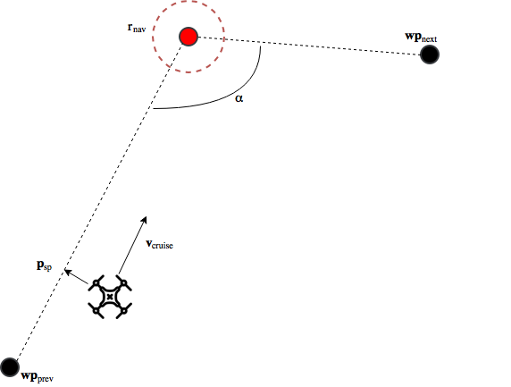
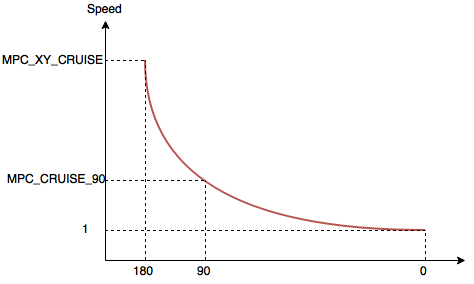

# 多旋翼的转换速率型轨迹

The Slew Rate trajectory type should be used when a quick (and potentially "jerky") response to stick input is more important than ensuring smooth acceleration and deceleration (e.g.: for inspection, aggressive flight with position hold, fast missions).

This type is a simple implementation where the jerk and acceleration is limited using slew-rates. In manual mode, it allows asymmetric profiles based on user intention (smooth acceleration and quick stop). 加加速度和加速度限制不是硬性约束。

Enable this trajectory type using the following parameter settings: [MPC_POS_MODE=1](../advanced_config/parameter_reference.md#MPC_POS_MODE), `MPC_POS_MODE=2`, [MPC_AUTO_MODE=0](../advanced_config/parameter_reference.md#MPC_AUTO_MODE).

> **Note** [Setpoint Tuning (Trajectory Generator)](../config_mc/mc_trajectory_tuning.md) also supports [MC Jerk-limited Trajectory Tuning](../config_mc/mc_jerk_limited_type_trajectory.md) for smoother responses.

This topic explains how the trajectory type works, and can be tuned, in both position and mission modes.

## 定点模式

在[定点模式](../flight_modes/position_mc.md)中， 摇杆输入映射为**位置-控制**或**速度-控制**。

当摇杆输入在死区 [MPC_HOLD_DZ](../advanced_config/parameter_reference.md#MPC_HOLD_DZ)内时，位置控制被激活，否则是速度控制。 以下参数都是可调节参数，并且不能被直接映射为物理量。

#### MPC_ACC_HOR_MAX

该参数用于水平方向的位置控制，即机体理应停留在当前位置。 速度设定值变化率的极限由 [MPC_ACC_HOR_MAX](../advanced_config/parameter_reference.md#MPC_ACC_HOR_MAX) 定义。 此参数应设置为大于水平方向上任何其他加速度相关参数。

#### MPC_ACC_HOR 和 MPC_HOR_SLOW {#mpc_acc_hor-and-mpc_dec_hor_slow}

在速度控制中，速度设定值的速率极限是从摇杆输入到加速度极限的线性映射中提取的，最大值为 [MPC_ACC_HOR](../advanced_config/parameter_reference.md#MPC_ACC_HOR)，最小值为 [MPC_DEC_HOR_SLOW](../advanced_config/parameter_reference.md#MPC_DEC_HOR_SLOW)。 例如，若摇杆输入为 `MPC_HOLD_DZ`，则极限加速度为 `MPC_DEC_HOR_SLOW`。 如果摇杆输入为最大值 (=`1`)，则极限加速度为 `MPC_ACC_HOR`，并且任意摇杆输入都将在这两个参数之间线性映射。 此外，当用户要求在当前飞行方向减速时，`MPC_DEC_HOR_SLOW` 也会限制速度设定值的变化。 例如，当摇杆的输入量从最大值（=`1`）变化到 `0.5` 时，速度设定的变化将由 `MPC_DEC_HOR_SLOW` 限定。

当由 **速度-控制** 过渡为 **位置-控制**时，将会发生一个从 `MPC_ACC_HOR` 切换到 `MPC_ACC_HOR_MAX` 的强制转变， 并且速度设定值会重置为当前机体速度。 重置和强制转变都可能在机体减速停止的过程中引起飞行抖动。 尽管如此，重置也是必需的，因为平滑参数会导致延迟到达设定值，若不重置则可能导致始料不及的飞行动作。

下面给出一个简单例子来解释为什么需要重置。

考虑这样一种情况：用户要求机体从悬停状态转为全速飞行，接着又要求机体停止前飞。 这相当于先使摇杆满输入取最大值 `1`，后又使其置零。 为了简化这个例子，假设参数 `MPC_ACC_HOR_MAX` 等于 `MPC_ACC_HOR`，因此当从**速度-控制**转为**位置-控制**时，加速限制没有强制转变。 此外，我们假设期望的最大速度为 `4 m/s`。

在摇杆满输入期间，速度设定值不会直接从 `0 m/s` 变为 `4 m/s`（即阶跃输入），而是会根据参数 `MPC_ACC_HOR` 的斜率渐变。 然而，机体的实际速度不会完美地跟踪设定值，而是总会稍微滞后。 `MPC_ACC_HOR` 的值越大，滞后越显著。

如果不重置（如顶部图所示），在发送停止指令时（摇杆输入值为 0），速度设定值将以` MPC_ACC_HOR_MAX `所示的最大速率缓降。 由于滞后，机体将先在停止指令发送之前的行进方向上继续加速，然后缓慢减速至零。 通过将速度设定值重置为当前速度，可以克服停止指令导致的延迟。

#### MPC_ACC_UP_MAX 和 MPC_ACC_DOWN_MAX

`MPC_ACC_UP_MAX` >= `MPC_ACC_DOWN_MAX`，否则固件将重写给定值以满足此条件。

- **位置-控制：**速度设定值在 z 方向的变化上限由参数 [MPC_ACC_UP_MAX](../advanced_config/parameter_reference.md#MPC_ACC_UP_MAX) 给出。
- **速度-控制：**摇杆输入导致的速度设定值的变化极限由两个参数给出， `MPC_ACC_UP_MAX` 为上限， [MPC_ACC_DOWN_MAX](../advanced_config/parameter_reference.md#MPC_ACC_DOWN_MAX) 为下限。

#### MPC_JERK_MAX 和 MPC_JERK_MIN

这两个参数仅在从**速度-控制**到**位置-控制</ 0>的转换期间有效。 这两个参数的意义是尽量减小机体从前飞状态到悬停状态导致的加加速度（请参见 [MPC_ACC_HOR 和 MPC_DEC_HOR_SLOW](#mpc_acc_hor-and-mpc_dec_hor_slow)）。
 

加加速度参数通过设置最大加速度 `MPC_ACC_HOR_MAX` 来控制速度上限。 实际的加加速度值和飞行器制动前的速度值呈线性关系， 全速映射到[MPC_JERK_MAX](../advanced_config/parameter_reference.md#MPC_JERK_MAX) 而零速映射到 [MPC_JERK_MIN](../advanced_config/parameter_reference.md#MPC_JERK_MIN)。 你可以通过将 `MPC_JERK_MAX` 设置为小于 `MPC_JERK_MIN` 的值来禁用平滑效果。

## 任务模式

In [Mission mode](../flight_modes/mission.md) the vehicle always follows a straight line from the previous waypoint to the current target.

$$\mathbf{wp}_{prev}$$ 是上一个目标航点，如果没有上一个目标航点，那就是收到第一个航点时飞行器的位置。

追踪航线过程中的设定点可以分为两部分：

- 位置设定值 $$\mathbf{p}_{sp}$$: 距离飞行器最近的航线上的点。
- 速度设定值 $$\mathbf{v}_{cruise}$$: 在追踪期间的期望速度。

巡航速度 $$\mathbf{v}*{cruise}$$ 的默认设定为 [MPC_XY_CRUISE](../advanced_config/parameter_reference.md#MPC_XY_CRUISE)。 However, if the target waypoint (red circle) is close to the previous waypoint, the cruise speed will be adjusted accordingly. 为了到达巡航速度$$\mathbf{v}*{cruise}$$ ，飞行器会以加速度`MPC_ACC_HOR`进行加速。

当飞行器距离目标航点还有 `1.5 x MPC_XY_CRUISE` 的时候, 飞行器会减速到一个特定的速度（该速度取决于转折角度$$\alpha$$）。 用于计算这个特定速度的函数是一个指数函数。 $$a \times b^{x} + c$$:

在角度为 `180 度`的时候，对应从上一个航点$$\mathbf{wp}*{prev}$$ 到下一个航点之间的线段上$$\mathbf{wp}*{next}$$ 有一个目标航点的情况，在这个目标航点的速度就会是 `MPC_XY_CRUISE`。 角度是 `0 度`，对应于下一个航点$$\mathbf{wp}*{next}$$ 在上一个航点$$\mathbf{wp}*{prev}$$和当前目标航点组成的线段上，这种情况下目标速度就会被设为最小速度`1 m/s`. 如果角度是 `90 degrees`，那么目标速度就会被设为 [MPC_CRUISE_90](../advanced_config/parameter_reference.md#MPC_CRUISE_90)。 所有其他可能的角度也都会通过这个指数函数来映射到一个特定的速度。 如果当前没有收到下一个航点 $$\mathbf{wp}_{next}$$ ，那么飞行器的速度就会将巡航速度减小到零。

只有当飞行器的位置小于可达半径$$r_{rad}$$时，飞行器才会往目标航点飞（最大可达半径可以通过调参数[NAV_ACC_RAD](../advanced_config/parameter_reference.md#NAV_ACC_RAD)来调整。）

除此之外，飞行器 必须要到达设定的高度（阈值[NAV_MC_ALT_RAD](../advanced_config/parameter_reference.md#NAV_MC_ALT_RAD)）和正确的偏航(阈值 [MIS_YAW_ERR](../advanced_config/parameter_reference.md#MIS_YAW_ERR)). 一旦飞行器进入代表航点的小圈圈，航点就会更新。 $$\mathbf{wp}*{next}$$会变成新的目标航点， $$\mathbf{wp}*{prev}$$ 会被设为刚刚达到的那个航点。同时还会把新的$$\mathbf{wp}_{next}$$ 加进来。