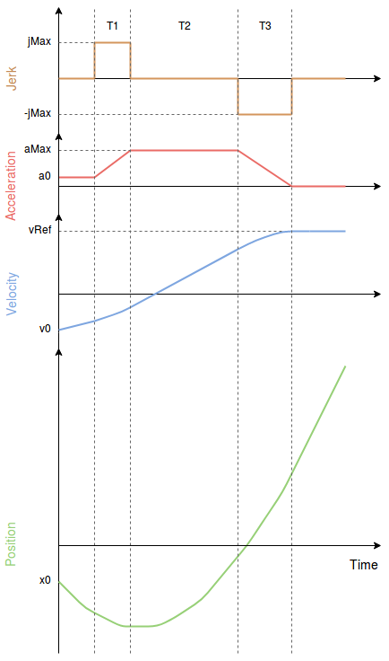

# 多旋翼的加加速度限制型轨迹

The Jerk-limited trajectory type should be used when smooth motion is required in response to user stick input or mission changes (e.g.: for filming, mapping, cargo). 它能产生对称的平滑 S-曲线使加加速度和加速度的极限始终得到保证。

使用以下参数设置启用此轨迹类型： [MPPC_POS_MODE=3](../advanced_config/parameter_reference.md#MPC_POS_MODE), [MPPC_AUTO_MODE=1](../advanced_config/parameter_reference.md#MPC_AUTO_MODE)

> **Note** [Setpoint Tuning (Trajectory Generator)](../config_mc/mc_trajectory_tuning.md) also supports [MC Slew-rate Trajectory Tuning](../config_mc/mc_slew_rate_type_trajectory.md) for faster (albeit "jerky") response.

## 轨迹生成器

下图显示了具有如下约束的典型加加速度限制剖面：

- `jMax`：最大抖动
- `jMax`：初始加速度 
- `aMax`：最大加速度
- `a3`：最终加速度（始终为 0）
- `v0`：初始速度
- `vRef`：期望速度

其中，约束 `jMax`、`aMax` 由用户通过参数页配置，在手动定点控制和自动模式下可能有所不同。

所得的速度剖面通常称为“S-曲线”。

## 手动模式

在手动定点模式下，通过摇杆控制速度，在这种情况下，通过参数 [MPC_VEL_MANUAL](../advanced_config/parameter_reference.md#MPC_VEL_MANUAL) 定义完整的摇杆挠度。

### 约束

XY平面：

- `jMax`：[MPC_JERK_MAX](../advanced_config/parameter_reference.md#MPC_JERK_MAX)
- `aMax`: [MPC_ACC_HOR_MAX](../advanced_config/parameter_reference.md#MPC_ACC_HOR_MAX)

Z轴：

- `jMax`：[MPC_JERK_MAX](../advanced_config/parameter_reference.md#MPC_JERK_MAX)
- `aMax`（上升动作）：[MPC_ACC_UP_MAX](../advanced_config/parameter_reference.md#MPC_ACC_UP_MAX)
- `aMax`（下降动作）：[MPC_ACC_DOWN_MAX](../advanced_config/parameter_reference.md#MPC_ACC_DOWN_MAX)

## 自动模式

在自动模式下，所需的速度是 [MPC_XY_CRUISE](../advanced_config/parameter_reference.md#MPC_XY_CRUISE)，但该值会根据到下一个航点的距离、航线中可能的最大速度以及所需的最大加速度和加加速度自动调整。

### 约束

XY平面：

- `jMax`：[MPC_JERK_AUTO](../advanced_config/parameter_reference.md#MPC_JERK_AUTO)
- `aMax`：[MPC_ACC_HOR](../advanced_config/parameter_reference.md#MPC_ACC_HOR)

Z轴：

- `jMax`：[MPC_JERK_AUTO](../advanced_config/parameter_reference.md#MPC_JERK_AUTO)
- `aMax`（上升动作）：[MPC_ACC_UP_MAX](../advanced_config/parameter_reference.md#MPC_ACC_UP_MAX)
- `aMax`（下降动作）：[MPC_ACC_DOWN_MAX](../advanced_config/parameter_reference.md#MPC_ACC_DOWN_MAX)

渐进某个航点时的距离-速度增益：

- [MPC_XY_TRAJ_P](../advanced_config/parameter_reference.md#MPC_XY_TRAJ_P)
- [MPC_Z_TRAJ_P](../advanced_config/parameter_reference.md#MPC_Z_TRAJ_P)

### 相关参数

- [MPC_XY_VEL_MAX](../advanced_config/parameter_reference.md#MPC_XY_VEL_MAX)
- [MPC_Z_VEL_MAX_UP](../advanced_config/parameter_reference.md#MPC_Z_VEL_MAX_UP)
- [MPC_Z_VEL_MAX_DN](../advanced_config/parameter_reference.md#MPC_Z_VEL_MAX_DN)
- [MPC_TKO_SPEED](../advanced_config/parameter_reference.md#MPC_TKO_SPEED)
- [MPC_LAND_SPEED](../advanced_config/parameter_reference.md#MPC_LAND_SPEED)
- [MPC_LAND_ALT1](../advanced_config/parameter_reference.md#MPC_LAND_ALT1)
- [MPC_LAND_ALT2](../advanced_config/parameter_reference.md#MPC_LAND_ALT2)