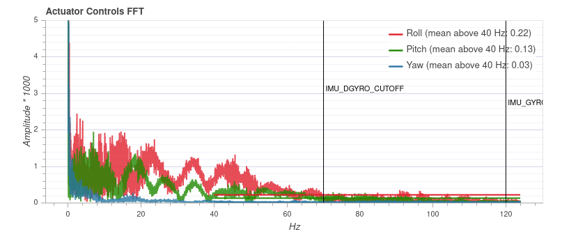

# 穿越机设置

本页面描述了：如何设置和配置一台穿越机来获取良好的性能（尤其对于特技模式）

请注意穿越机是经过特殊设计的动力强劲的快速飞行器。 你应该是有一定经验的使用者，或者让有经验的使用者帮助你。

:::tip
这里所述的许多知识可以用来改善其他类型多旋翼飞行器的飞行性能。
:::

:::note
穿越机通常会少一些传感器（比如：GPS）。 因此，他的保护性选项有所缺失。
:::

## 构建选项

穿越机通常会少一些传感器。

最小配置是只使用陀螺仪和加速度计。

:::note
如果板载自带了磁罗盘，不应该使用他（小穿越机尤其容易受到较强的电磁干扰）。
:::

穿越机通常没有GPS，因为它会增加重量且再发生撞击时候更容易被损坏（一个GPS+外部磁罗盘需要被放置在GPS杆上来避免大电流对磁罗盘的影响，因此也就意味着它更容易被损坏）。

但是增加GPS也有一些好处，尤其是对于初学者。

- 你可以让飞机进入定位状态，飞行器将会待在一个地方。 当你失去方向或者需要刹车时候，这会是有用的。 它通常也可以被用来安全降落。
- 返航模式将可以使用，可以使用开关触发，或者是遥控器信号丢失或者低电量保护逻辑触发。
- 当发生事故时，你将有飞机最后的位置，方便寻找飞机。
- 飞行记录将包含飞行路线追踪，这意味着你可以进行航行回顾（3D 模式）。 这可以帮助你改善特技飞行技巧。

:::note
在有挑战性的特技精巧操作中，GPS会在短时间内失效。 如果您在此期间切换到位置模式，高度模式将被使用，直到位置再次生效。
:::

## 硬件安装

以下各段叙述了在构建穿越机时的几个重要问题。 如果你需要完整的构建指南，你可以参考 [QAV-R 5"KISS ESC Racer](../frames_multicopter/qav_r_5_kiss_esc_racer.md) 构建日志。

### 振动设置

有各种安装方法来减少振动。 例如，飞行控制器可以安装震动抑制泡沫，或者使用 [O-圆环](../frames_multicopter/qav_r_5_kiss_esc_racer.md#mounting)。

虽然没有单一最好的方法，但如果您使用高质量的组件，您会遇到更少的振动问题。 例如在 [QAV-R 5" 中使用的 KISS ESC 穿越机](../frames_multicopter/qav_r_5_kiss_esc_racer.md)。

确保您使用调平衡过的桨叶。

### 重心

确保重心尽可能靠近推力中心。 左右平衡通常不是问题，但前后平衡可能是一个问题。 您可以移动电池直到重心配置正确后再机架上标记它，这样您就可以始终正确放置电池。

:::note
虽然积分项可以解决不平衡的安装，但是一个自定义的混控器可以处理的更好。 然而，最好还是将不平衡问题在飞行器安装阶段解决掉。
:::

### 电机顺序

如果您计划使用一个四合一的 ESC, 例如 [Hobbywing XRotor Micro 40A 4in1](http://www.hobbywing.com/goods.php?id=588), 你会注意到它使用了不同于PX4使用的电机安装顺序。 PX4 允许您通过 [MOT_ORDERING](../advanced_config/parameter_reference.md#MOT_ORDERING) 参数更改飞控固件中的电机顺序。 您通常可以选择 Betaflight/Cleanflight的电机安装顺序，它是在四合一电调中的常用顺序。

## 软件设置

在搭建好穿越机硬件后, 你需要配置软件。 跳过 [基本配置指南](../config/README.md) 并选择 [通用的 250 穿越机](../airframes/airframe_reference.md#copter_quadrotor_x_generic_250_racer) 机架，这些机架已经设置了一些针对穿越机的参数。

这些参数很重要：

- Enable One-Shot (set [PWM_RATE](../advanced_config/parameter_reference.md#PWM_RATE) to 0) or DShot ([DSHOT_CONFIG](../advanced_config/parameter_reference.md#DSHOT_CONFIG)).
- 设置手动/稳定模式的最大滚动、pitch-和 yaw 速率为 所希望： [MC_ROLLRATE_MAX](../advanced_config/parameter_reference.md#MC_ROLLRATE_MAX), [MC_PITCHRATE_MAX](../advanced_config/parameter_reference.md#MC_PITCHRATE_MAX) 和 [MC_YAWRATE_MAX](../advanced_config/parameter_reference.md#MC_YAWRATE_MAX) 最大倾斜角度是用 [MPC_MAN_TILT_MAX](../advanced_config/parameter_reference.md#MPC_MAN_TILT_MAX) 配置的。
- 最小推力 [MPC_MANTHR_MIN](../advanced_config/parameter_reference.md#MPC_MANTHR_MIN) 应该设置为 0。

### 估计器

如果您使用GPS，您可以跳过此部分，使用默认估算。 否则，您应该切换到Q姿态估计器，它可以在没有磁罗盘或气压计的情况下工作。

若要选择它，请设置 [SYS_MC_EST_GROUP](../advanced_config/parameter_reference.md#SYS_MC_EST_GROUP) 至 1, 并更改 以下参数：

- 如果系统没有磁罗盘，设置 [SYS_HAS_MAG](../advanced_config/parameter_reference.md#SYS_HAS_MAG) 至 0。
- 如果系统没有气压计，设置 [SYS_HAS_BARO](../advanced_config/parameter_reference.md#SYS_HAS_BARO) 到 0。
- 配置 Q 估算器：设置 [ATT_ACC_COMP](../advanced_config/parameter_reference.md#ATT_ACC_COMP) 到 0, [ATT_W_AC](../advanced_config/parameter_reference.md#ATT_W_ACC) 到 0.4 和 [ATT_W_GYRO_BIA](../advanced_config/parameter_reference.md#ATT_W_GYRO_BIAS) 到 0。 如果您愿意，您可以稍后调整这些。

### 故障保护

配置 [RC 丢失和低电量保护](../config/safety.md)。 如果您不使用 GPS，请将故障安全设置为 **Lockdown**，后者关闭电机。 通过将飞机安装在测试台上不装桨叶时，解锁后关闭遥控器，测试遥控器信号丢失后的保护策略 。

请务必分配一个 [杀死开关](../config/safety.md#kill_switch) 或 [解锁开关](../config/safety.md#arming_switch)。 测试并训练它来使用它！

### PX4 调试

:::note
请确保在进行任何调试之前已经完成了电调校准。
:::

此刻，您应该准备好进行第一次测试飞行。

如果进展顺利，请先通过 [PID 调整](../config_mc/pid_tuning_guide_multicopter.md) (忽略推力曲线设置)。 穿越机需要是 **欠调试的**，这意味着 **P** 和 **D** 增益应该设置得很低 - 这样控制器就不会产生可能被解释为噪音的振荡(默认增益可能足够好)。 这对于 [滤波器](#filters) 调节非常重要。 稍后将进行第二轮PID调整。

### 控制延迟

*控制延迟* 是从飞机受到物理干扰出到电机做出相应反应的延迟。

:::tip
是尽可能减少控制延迟是 *关键的* — 较低的延迟允许您提高角速度 **P** 增益, 这意味着更好的飞行性能。 即使在延迟中添加了一个毫秒，也是不同的。
:::

这些因素影响到延迟：

- 软机架或软振动隔离装置会增加延迟(它们充当了滤波器)。
- 软件和传感器芯片中的低通滤波器在改善噪声与增加延迟之间形成均衡。
- PX4 软件内部：传感器信号需要从驱动程序中读取，然后通过控制器传递到输出驱动器。
- IO chip (MAINpins) 添加了大约5.4ms的延迟相对于使用 AUX pins的延迟时间(这不适用于 *Pixracer* 或 *Omnibus F4*, 但适用于Pixhawk)。 要避免IO 延迟，请禁用 [SYS_USE_IO](../advanced_config/parameter_reference.md#SYS_USE_IO) 并将电机连接到 AUX 引脚。
- 通过设置 [PWM_RATE](../advanced_config/parameter_reference.md#PWM_RATE) 到 0来启用单射以减少延迟。 

### 滤波器

<!-- TODO: this probably should be documented somewhere else --> 如上一节所述，滤波器会影响控制延迟。

这是控制器在 PX4 控制器中使用滤波器的流程：

- 芯片内的DLPF用于陀螺仪滤波。 截止频率设置到98赫兹，采样频率1千赫兹。
- 低通滤波器用于陀螺数据。 它可以使用 [IMU_GYRO_CUTOFF](../advanced_config/parameter_reference.md#IMU_GYRO_CUTOFF) 参数进行配置。
- D条目上单独的低通滤波器。 D项对噪声敏感，稍微增加延迟不会减低性能。 出于这个原因，D项一个可单独配置的低通过过滤器， [IMU_DGYRO_CUTOFF](../advanced_config/parameter_reference.md#IMU_DGYRO_CUTOFF)。
- 用于电机输出的限速滤波器 ([MOT_SLEW_MAX](../advanced_config/parameter_reference.md#MOT_SLEW_MAX))。 通常不使用。

为了减少控制延迟，我们希望提高低通滤波器的截止频率。 然而，这是一种权衡，因为它也会增加信号的噪音，并带入电机。 发动机上的噪音具有以下后果：

- 电机和电调会发热，可能达到损坏程度。
- 飞行时间减少，因为电机不断改变其速度。
- 可见的随机小抽动。

最佳过滤器设置取决于穿越机本身。 默认设置是保守的，这样它们就可以在较低质量的飞行棋配置上。

#### 滤波器整定

首先确保激活高速率日志文件记录(通过[SDLOG_PROFILE](../advanced_config/parameter_reference.md#SDLOG_PROFILE) 参数)。 [飞行记录](../getting_started/flight_reporting.md) 将显示一个关于roll、pitch、yaw控制的FFT 图。

:::warning
不要试图通过调整滤波器来完善一台受到较大振动的飞行器。 而是改善飞行器的硬件安装来改善性能。
:::

最好通过检查飞行日志来进行滤波器调整。 您可以用不同的参数进行多次飞行，然后检查所有日志， 但确保在两者之间加锁电机，以便分隔日志文件。

执行的飞行可以只是在 [手动/稳定模式](../flight_modes/manual_stabilized_mc.md) 中悬停，可以有一些到所有方向的roll和pitch，以及增加一些油门。 总持续时间不需要超过 30 秒。 为了更好地进行比较，所有测试中的操作都应该是相似的。

首先调整陀螺仪的滤波器 [IMU_GYRO_CUTOFF](../advanced_config/parameter_reference.md#IMU_GYRO_CUTOFF) ，方法是在使用一个较低的D项滤波值时以十赫兹的步长增加它([IMU_DGYRO_CUTOFF](../advanced_config/parameter_reference.md#IMU_DGYRO_CUTOFF) = 30)。  
上传日志到 https://logs.px4.io 并比较 *执行器控制 FFT* 图。 在噪声开始显著增加之前设置截止频率(对于60赫兹周围和以上的频率)。 然后以同样的方式调整D项滤波器(`IMU_DGYRO_CUTOFF`)。

下面是三种不同滤波器设置值的示例(40Hz, 70Hz, 90Hz)。 在90赫兹，一般噪音水平开始增加（尤其是roll），因此70赫兹的截断频率是安全的。   

:::note
飞行记录图不能在不同的飞行器之间进行比较，因为y轴尺度可能不同。 在同一台飞行器上，它是一贯的，独立于飞行时间的。
:::

### PID 调整 (第二轮)

现在进行第二轮PID调整，这次尽可能紧凑，同时调整推力曲线。

### 飞行模式

在你已经验证了飞行器在高低油门下都飞行的很好后，你可以通过[MC_AIRMODE](../advanced_config/parameter_reference.md#MC_AIRMODE)参数使能[airmode](../config_mc/pid_tuning_guide_multicopter.md#airmode)。 这个功能可以确保飞行器是可控的，并且在低油门时追踪角速度设置。

快乐翻飞 :)