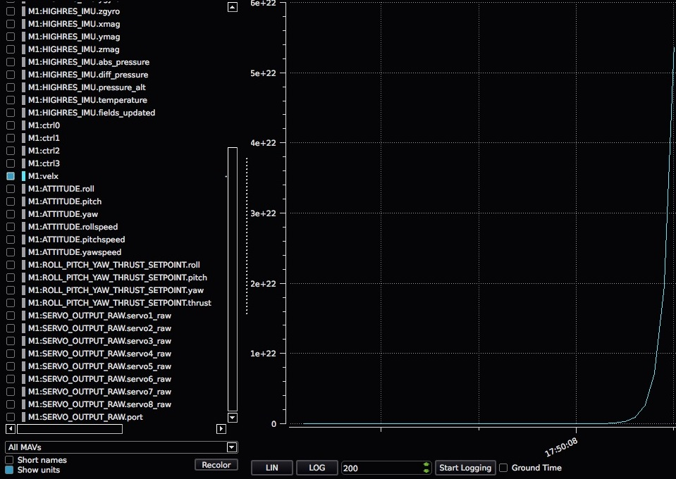

# 发送和接收调试值

在软件开发过程中，输出单个重要数字通常是必要的。 这就是 MAVLink 的通用 `NAMED_VALUE_FLOAT`、`DEBUG` 和 `DEBUG_VECT` 数据包的来源。

## 在 MAVLink 调试消息和 uORB 主题之间进行映射

MAVLink调试消息转换为/自 uORB 主题。 为了发送或接收 MAVLink 调试消息，您必须分别发布或订阅相应的主题。 下面是一个表，其中总结了 MAVLink 调试消息和 uORB 主题之间的映射：

| MAVLink 消息          | uORB topic        |
| ------------------- | ----------------- |
| NAMED_VALUE_FLOAT | debug_key_value |
| DEBUG               | debug_value       |
| DEBUG_VECT          | debug_vect        |

## 教程：发送字符串/浮点配对

本教程演示如何使用关联的 uORB 主题 `debug_key_value` `NAMED_VALUE_FLOAT` 发送 MAVLink 消息。

本教程的代码可在此处找到：

* [调试教程代码](https://github.com/PX4/PX4-Autopilot/blob/master/src/examples/px4_mavlink_debug/px4_mavlink_debug.cpp)
* [开启教程 app](https://github.com/PX4/Firmware/tree/master/cmake/configs)，方法是在你配置的主板上的 mavlink 调试应用程序来取消/开启

设置调试发布所需的只是此代码段。 首先添加头文件：

```C
#include <uORB/uORB.h>
#include <uORB/topics/debug_key_value.h>
```

然后广播调试值主题（一个针对不同发布名称的广播就足够了）。 把这个放在你的主循环前面：

```C
/* 广播调试值 */
struct debug_key_value_s dbg = { .key = "velx", .value = 0.0f };
orb_advert_t pub_dbg = orb_advertise(ORB_ID(debug_key_value), &dbg);
```

而发送主循环更简单：

```C
dbg.value = position[0];
orb_publish(ORB_ID(debug_key_value), pub_dbg, &dbg);
```

:::caution
Multiple debug messages must have enough time between their respective publishings for Mavlink to process them. This means that either the code must wait between publishing multiple debug messages, or alternate the messages on each function call iteration.
:::

The result in QGroundControl then looks like this on the real-time plot:




## 教程：发送字符串/浮点配对

首先，订阅主题 `debug_key_value`：

然后对主题进行监听：

```C
#include <poll.h>
#include <uORB/topics/debug_key_value.h>

int debug_sub_fd = orb_subscribe(ORB_ID(debug_key_value));
[...]
```

当 `debug_key_value` 主题上有新消息可用时，不要忘记根据其键属性对其进行筛选，以便放弃键与 `velx` 不同的消息：

```C
[...]
[...]
/* one could wait for multiple topics with this technique, just using one here */
px4_pollfd_struct_t fds[] = {
    { .fd = debug_sub_fd,   .events = POLLIN },
};

while (true) {
    /* 等待 debug_key_value 等待时间 1000 ms (1 秒) */
    int poll_ret = px4_poll(fds, 1, 1000);

    [...]
```

When a new message is available on the `debug_key_value` topic, do not forget to filter it based on its key attribute in order to discard the messages with key different than `velx`:

```C
    [...]
    [...]
    if (fds[0].revents & POLLIN) {
        /* 获取数据用于第一文件描述符 */
        struct debug_key_value_s dbg;

        /* 拷贝数据至本地缓存 */
        orb_copy(ORB_ID(debug_key_value), debug_sub_fd, &dbg);

        /* 基于 key attribute 的消息过滤器 */
        if (strcmp(_sub_debug_vect.get().key, "velx") == 0) {
            PX4_INFO("velx:\t%8.4f", dbg.value);
        }
    }
}

```
