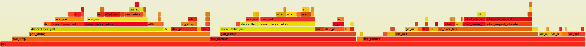

# Poor Man's Sampling Profiler

This section describes how you can use the [Poor Man's Sampling Profiler](https://github.com/PX4/PX4-Autopilot/blob/master/platforms/nuttx/Debug/poor-mans-profiler.sh) (PMSP) shell script to assess the performance of PX4. This is an implementation of a known method originally invented by [Mark Callaghan and Domas Mituzas](https://poormansprofiler.org/).

## 方法

PMSP 是一种 shell 脚本,它通过定期中断固件的执行来运行，便对当前堆栈跟踪进行采样。 采样的堆栈跟踪将追加到文本文件中。 一旦采样完成（通常需要大约一个小时或更长时间），收集的堆栈跟踪将 *folded*。 *folding* 的结果是另一个包含相同堆栈跟踪的文本文件，只是所有类似的堆栈跟踪（即在程序中的同一点获得的堆栈跟踪）都连接在一起，并记录其出现次数。 然后将折叠的堆栈输入到可视化脚本中，为此，我们使用了 [FlameGraph--开源堆栈跟踪可视化 ](http://www.brendangregg.com/flamegraphs.html)。

## 基本用法

### Prerequisites

探查器的基本用法可通过生成系统使用。 例如，下面的命令生成和探查出 px4_fmu-v4pro 目标的10000个样本（提取 *FlameGraph* 并根据需要将其添加到路径中）。 You will then need a [SWD (JTAG) Hardware Debugging Interface](../debug/swd_debug.md#debug-probes), such as the DroneCode Probe, to run the GDB server and interact with the board.


### Determine the Debugger Device

The `poor-mans-profiler.sh` automatically detects and uses the correct USB device if you use it with a [DroneCode Probe](../debug/swd_debug.md#dronecode-probe). If you use a different kind of probe you may need to pass in the specific _device_ on which the debugger is located. You can use the bash command `ls -alh /dev/serial/by-id/` to enumerate the possible devices on Ubuntu. For example the following devices are enumerated with a Pixhawk 4 and DroneCode Probe connected over USB:
```
user@ubuntu:~/PX4-Autopilot$ ls -alh /dev/serial/by-id/
total 0
drwxr-xr-x 2 root root 100 Apr 23 18:57 .
drwxr-xr-x 4 root root  80 Apr 23 18:48 ..
lrwxrwxrwx 1 root root  13 Apr 23 18:48 usb-3D_Robotics_PX4_FMU_v5.x_0-if00 -> ../../ttyACM0
lrwxrwxrwx 1 root root  13 Apr 23 18:57 usb-Black_Sphere_Technologies_Black_Magic_Probe_BFCCB401-if00 -> ../../ttyACM1
lrwxrwxrwx 1 root root  13 Apr 23 18:57 usb-Black_Sphere_Technologies_Black_Magic_Probe_BFCCB401-if02 -> ../../ttyACM2
```

In this case, the script would automatically pick up the device named `*Black_Magic_Probe*-if00`. But if you were using a different device you would be able discover the appropriate id from the listing above.

Then pass in the appropriate device using the `--gdbdev` argument like this:
```bash
./poor-mans-profiler.sh --elf=build/px4_fmu-v4_default/px4_fmu-v4_default.elf --nsamples=30000
```


### Running

在火焰图上，水平水平表示堆叠帧，而每个帧的宽度与采样次数成正比。 反过来，函数最终被采样的次数也与其执行的持续时间频率成正比。

```
./poor-mans-profiler.sh --elf=build/px4_fmu-v4_default/px4_fmu-v4_default.elf --nsamples=30000 --append
```

For more control over the build process, including setting the number of samples, see the [Implementation](#implementation).

## 理解输出

A screenshot of an example output is provided below (note that it is not interactive here):



PMSP 使用 GDB 收集堆栈跟踪。 目前，它使用 `arm-none-eabi-gdb`，今后可能会添加其他工具链。

## 可能的问题

为了能够映射内存地址到符号，脚本需要被当前运行的文件中提及。 这个是在 `--elf=&lt;file&gt;` 的选项帮助下完成的，该选项需要一个指向当前执行ELF位置的路径来执行（相对于储存库的root）。

* 如果 GDB 出现故障，脚本可能无法检测到该问题，并继续运行。 在这种情况下，显然不会产生可用的堆栈。 为了避免这种情况，用户应定期检查文件 `/tmp/pmpn-gdberr.log`，其中包含最近调用 GDB 的 stderr 输出。 将来，应修改脚本以在安静模式下调用 GDB，在安静模式下，它将通过其退出代码指示问题。

* 有时 GDB 一直运行，同时采样堆栈跟踪。 在此失败期间，目标将无限期停止。 解决方案是手动中止脚本，然后使用 `--append` 选项再次重新启动它。 将来，应修改脚本以对每次 GDB 调用强制执行超时。

* 不支持多线程环境。 这不会影响单个核心嵌入式目标，因为它们总是在一个线程中执行，但这一限制使探查器与许多其他应用程序不兼容。 将来，应修改堆栈文件夹以支持每个示例的多个堆栈跟踪。

## 实现

The script is located at [/platforms/nuttx/Debug/poor-mans-profiler.sh](https://github.com/PX4/PX4-Autopilot/blob/master/platforms/nuttx/Debug/poor-mans-profiler.sh) Once launched, it will perform the specified number of samples with the specified time interval. Collected samples will be stored in a text file in the system temp directory (typically `/tmp`). Once sampling is finished, the script will automatically invoke the stack folder, the output of which will be stored in an adjacent file in the temp directory. If the stacks were folded successfully, the script will invoke the *FlameGraph* script and store the result in an interactive SVG file. Please note that not all image viewers support interactive images; it is recommended to open the resulting SVG in a web browser.

The FlameGraph script must reside in the `PATH`, otherwise PMSP will refuse to launch.

PMSP uses GDB to collect the stack traces. Currently it uses `arm-none-eabi-gdb`, other toolchains may be added in the future.

In order to be able to map memory locations to symbols, the script needs to be referred to the executable file that is currently running on the target. This is done with the help of the option `--elf=<file>`, which expects a path (relative to the root of the repository) pointing to the location of the currently executing ELF.

该想法的功劳归属 [Mark Callaghan and Domas Mituzas](https://dom.as/2009/02/15/poor-mans-contention-profiling/)。

```bash
./poor-mans-profiler.sh --elf=build/px4_fmu-v4_default/px4_fmu-v4_default.elf --nsamples=30000
```

Note that every launch of the script will overwrite the old stacks. Should you want to append to the old stacks rather than overwrite them, use the option `--append`:

```bash
./poor-mans-profiler.sh --elf=build/px4_fmu-v4_default/px4_fmu-v4_default.elf --nsamples=30000 --append
```

As one might suspect, `--append` with `--nsamples=0` will instruct the script to only regenerate the SVG without accessing the target at all.

Please read the script for a more in depth understanding of how it works.
