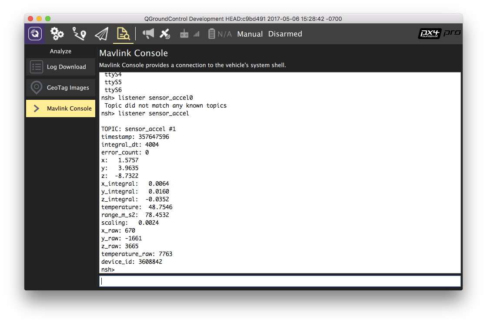

# 使用侦听器命令进行传感器/主题调试

uORB 是用于进程间通信的异步 `publish()`/`subscribe()` 消息传递 API。 `listener` 命令可从 *QGroundControl 的 MAVLink 控制台* 中用于检查主题（消息）值，包括传感器发布的当前值。

> **Tip** 之所以是非常有用的调试工具是因为可以在 QGC 上通过无线连接（比如飞机在飞行过程中）。

> **Note** `listener` 命令也可通过 [System 控制台](../debug/system_console.md) 和 [MAVLink shell](../debug/system_console.md#mavlink-shell)。

> **Note** `listener` 命令仅适用于基于 Nuttx 的系统（Pixhawk、Pixracer 等）和 Linux/OS X。

下图演示了 *QGroundControl* 用于获取加速度传感器值。

有关如何确定可用的主题以及如何调用 `listener` 的详细信息，请参阅：[uORB 消息列表主题和侦听 ](../middleware/uorb.md#listing-topics-and-listening-in)。
