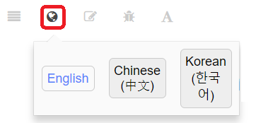

# PX4 开发指南

  

> **Info** 本手册主要面向软件开发人员及（新的）硬件集成商。 想要使用支持飞行、编译和更改的飞行器，请参阅 [PX4 用户手册](https://docs.px4.io/en/)。

本指南介绍了如下内容：

* 了解到 [配置最小开发环境](setup/config_initial.md)，[用源码编译PX4](setup/building_px4.md) 以及部署到 [众多支持的自动驾驶仪](https://docs.px4.io/en/flight_controller/)。
* 理解 [PX4 系统架构](concept/architecture.md) 以及核心概念。
* 学习如何更改飞行栈及中间层：
  - 更改飞行算法和添加新的 [飞行模式](concept/flight_modes.md)。
  - 支持新的 [机型](airframes/README.md)。
* 学习如何将PX4集成到新的硬件上：
  - 支持新的传感器和执行器, 包括摄像头、测距仪等。
  - 修改PX4使之能够在新的自驾仪硬件上运行。
* 对 PX4 进行 [仿真](simulation/README.md)、[测试](test_and_ci/README.md) 和 [调试/查看日志](debug/README.md)。
* 与外部机器人的 API 进行联调通信/集成。

## 技术支持

核心开发团队和社区活跃与以下论坛和聊天频道。

> **Tip** The [Weekly Dev Call](contribute/dev_call.md) is another great opportunity to meet the PX4 dev team and discuss platform technical details, pull requests, major impacting issues etc. There is also time for Q&A.

## 贡献

**Tip** 希望为平台做[贡献](contribute/README.md)的开发人员是最受欢迎的， 来参加 [每周开发者通讯](contribute/README.md#dev_call) 和我们其他 [开发人员活动](contribute/README.md#calendar) 中。

## 翻译

在[BSD 3-clause license](https://opensource.org/licenses/BSD-3-Clause)的条款许可下，该代码可以自由使用和修改。 文档在[CC BY 4.0](https://creativecommons.org/licenses/by/4.0/)下获得许可。 更多信息请参见：[许可证](contribute/licenses.md)。

## 许可证

本指南中有中文和韩文 [翻译](contribute/docs.md#translation)。 您可以通过单击语言切换器图标来访问这些内容：

## 治理

The *Dronecode Calendar* shows important events for platform developers and users. Select the links below to display the calendar in your timezone (and to add it to your own calendar):
* [Switzerland – Zurich](https://calendar.google.com/calendar/embed?src=linuxfoundation.org_g21tvam24m7pm7jhev01bvlqh8%40group.calendar.google.com&ctz=Europe%2FZurich)
* [太平洋时间 – Tijuana](https://calendar.google.com/calendar/embed?src=linuxfoundation.org_g21tvam24m7pm7jhev01bvlqh8%40group.calendar.google.com&ctz=America%2FTijuana)
* [Google+](https://calendar.google.com/calendar/embed?src=linuxfoundation.org_g21tvam24m7pm7jhev01bvlqh8%40group.calendar.google.com&ctz=Australia%2FSydney)

**Note:** 日历默认为 CET 时间。


<iframe src="https://calendar.google.com/calendar/embed?title=Dronecode%20Calendar&amp;mode=WEEK&amp;height=600&amp;wkst=1&amp;bgcolor=%23FFFFFF&amp;src=linuxfoundation.org_g21tvam24m7pm7jhev01bvlqh8%40group.calendar.google.com&amp;color=%23691426&amp;ctz=Europe%2FZurich" style="border-width:0" width="800" height="600" frameborder="0" scrolling="no" mark="crwd-mark"></iframe>


## 治理

PX4飞行栈由 [Dronecode项目](https://www.dronecode.org/) 治理。

&nbsp;

