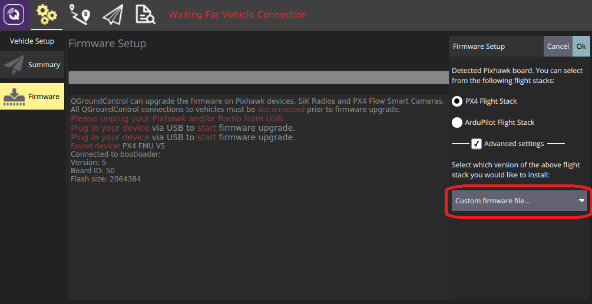

# 添加一个新的机型

PX4使用存储的配置作为机型的起始点>。 机体的配置在[ROMFS/px4fmu_common/init.d](https://github.com/PX4/Firmware/tree/master/ROMFS/px4fmu_common/init.d)文件夹下的[配置文件](#config-file)中定义。 配置文件中引用[混控文件](#mixer-file)，混控文件是用来描述机体的物理结构，存储在[ROMFS/px4fmu_common/mixers](https://github.com/PX4/Firmware/tree/master/ROMFS/px4fmu_common/mixers)文件夹

添加配置是非常简单的：在[init.d文件夹](https://github.com/PX4/Firmware/tree/master/ROMFS/px4fmu_common/init.d)创建一个新的文件(使用未使用的autostart ID作为文件名的前缀)，然后[构建并上传](../setup/building_px4.md)固件即可。

如果不想创建自己的配置文件，也可以用SD卡上的文本文件替换掉已有的自定义配置文件，具体细节请查看[自定义系统启动页。 ](../concept/system_startup.md)

:::note
为了决定哪些参数/值需要在配置文件中设置，你可以先指定一个通用机架并调整自驾仪，之后用[`param show-for-airframe`](../modules/modules_command.md#param)来列出改变的参数。
:::

## 配置文件概述

在配置文件和混控器文件下的配置由几个主要代码块组成:

* 机架说明文档(被[Airframes Reference](../airframes/airframe_reference.md)和*QGroundControl*) 使用。
* 飞机特定的参数设置，包括[tuning gains](#tuning-gains)。
* 应该启动的控制器和应用，例如多旋翼或者固定翼的控制器，着陆检测等等。
* 系统（固定翼，飞翼或者多旋翼）的物理配置。 这叫[混控器](../concept/mixing.md)。

一个典型的配置文件如下所示 ([original file here](https://github.com/PX4/Firmware/blob/master/ROMFS/px4fmu_common/init.d/airframes/3033_wingwing)) .

:::note
新的机架文件只会在清理构建之后 (运行 `make clean`)被加入到编译系统。 [Airframes Reference](../airframes/airframe_reference.md) 和 *QGroundControl* 会用到该部分内容。

<a id="config-file"></a>

### 配置文件

接下来的一部分指定车辆特定的参数，包括调参系数。

第一部分是机身框架的文档说明 它将会被[Airframes Reference](../airframes/airframe_reference.md)和*QGroundControl*使用
```bash
#!nsh
#
# @name Wing Wing (aka Z-84) Flying Wing
#
# @url https://docs.px4.io/en/framebuild_plane/wing_wing_z84.html
#
# @type Flying Wing
# @class Plane
#
# @output MAIN1 left aileron
# @output MAIN2 right aileron
# @output MAIN4 throttle
#
# @output AUX1 feed-through of RC AUX1 channel
# @output AUX2 feed-through of RC AUX2 channel
# @output AUX3 feed-through of RC AUX3 channel
#
# @maintainer Lorenz Meier <lorenz@px4.io>
#
```

设置需要使用的混控器:
```bash
. ${R}etc/init.d/rc.fw_defaults

param set-default BAT_N_CELLS 2
param set-default FW_AIRSPD_MAX 15
param set-default FW_AIRSPD_MIN 10
param set-default FW_AIRSPD_TRIM 13
param set-default FW_R_TC 0.3
param set-default FW_P_TC 0.3
param set-default FW_L1_DAMPING 0.74
param set-default FW_L1_PERIOD 16
param set-default FW_LND_ANG 15
param set-default FW_LND_FLALT 5
param set-default FW_LND_HHDIST 15
param set-default FW_LND_HVIRT 13
param set-default FW_LND_TLALT 5
param set-default FW_THR_LND_MAX 0
param set-default FW_PR_FF 0.35
param set-default FW_RR_FF 0.6
param set-default FW_RR_P 0.04

param set-default PWM_MAIN_DISARM 1000
```

配置PWM输出(指定驱动/激活的输出和级别)。
```bash
# 配置此为固定翼
set MAV_TYPE 1
```

设定使用的 [混控器](#mixer-file) :
```bash
# 设定混控
set MIXER wingwing
```

配置 PWM 输出 (指定要驱动/激活的输出和级别).
```bash
# 向 ESC 提供一个常值 1000 us 脉冲
set PWM_OUT 4
set PWM_DISARMED 1000
```

:::警告 如果你想将某一个通道反相,千万不要在你的遥控器上这样做或者改变例如`RC1_ REV `这样的参数。 The channels are only reversed when flying in manual mode, when you switch in an autopilot flight mode, the channels output will still be wrong (it only inverts your RC signal). Thus for a correct channel assignment change either your PWM signals with `PWM_MAIN_REV1` (e.g. for channel one) or change the signs of the output scaling in the corresponding mixer (see below).
:::

<a id="mixer-file"></a>

### 混控器文件

:::note
First read [Concepts > Mixing](../concept/mixing.md). This provides background information required to interpret this mixer file.
:::

A typical mixer file is shown below ([original file here](https://github.com/PX4/PX4-Autopilot/blob/master/ROMFS/px4fmu_common/mixers/wingwing.main.mix)). A mixer filename, in this case `wingwing.main.mix`, gives important information about the type of airframe (`wingwing`), the type of output (`.main` or `.aux`) and lastly that it is a mixer file (`.mix`).

The mixer file contains several blocks of code, each of which refers to one actuator or ESC. So if you have e.g. two servos and one ESC, the mixer file will contain three blocks of code.

:::note
The plugs of the servos / motors go in the order of the mixers in this file.
:::

So MAIN1 would be the left aileron, MAIN2 the right aileron, MAIN3 is empty (note the Z: zero mixer) and MAIN4 is throttle (to keep throttle on output 4 for common fixed wing configurations).

使用编译指令 `make airframe_metadata` 可以运行脚本自动根据机型描述语句生成需要在 *QGroundControl* 中使用的机型元数据文件和文档源代码。

```
M: 2
O:      10000  10000      0 -10000  10000
S: 0 0  -6000  -6000      0 -10000  10000
S: 0 1   6500   6500      0 -10000  10000
```

For a new airframe belonging to an existing group, you don't need to do anything more than provide documentation in the airframe description located at [ROMFS/px4fmu_common/init.d](https://github.com/PX4/Firmware/tree/master/ROMFS/px4fmu_common/init.d).

* M: Indicates two scalers for two control inputs. It indicates the number of control inputs the mixer will receive. 该参数表示混控器将接受到的控制输入的数量。
* O: Indicates the output scaling (*1 in negative, *1 in positive), offset (zero here), and output range (-1..+1 here).
  * If you want to invert your PWM signal, the signs of the output scalings have to be changed. (`O:      -10000  -10000      0 -10000  10000`)
    ```
    O:      -10000  -10000      0 -10000  10000
    ```
  * This line can (and should) be omitted completely if it specifies the default scaling: `O:      10000  10000   0 -10000  10000`
    ```
    O:      10000  10000   0 -10000  10000
    ```
* S: Indicates the first input scaler: It takes input from control group #0 (Flight Control) and the first input (roll). It scales the roll control input * 0.6 and reverts the sign (-0.6 becomes -6000 in scaled units). It applies no offset (0) and outputs to the full range (-1..+1) 它将滚转控制输入 * 0.6 进行缩放并反转输入量的正负号（-0.6 在缩放后的单位中变成了 -6000）。 该混控器不施加任何偏移量（0）且输出量幅值在 （-1.. +1）这个范围内。
* S: Indicates the second input scaler: It takes input from control group #0 (Flight Control) and the second input (pitch). It scales the pitch control input * 0.65. It applies no offset (0) and outputs to the full range (-1..+1) \ It scales the pitch control input * 0.65. 该混控器不施加任何偏移量（0）且输出量幅值在 （-1.. +1）这个范围内。

如果机型属于一个 **新的组** 那么你还需要进行如下操作：

Behind the scenes, both scalers are added, which for a flying wing means the control surface takes maximum 60% deflection from roll and 65% deflection from pitch.

To make a new airframe available for section in the *QGroundControl* [airframe configuration](https://docs.px4.io/en/config/airframe.html):


```bash
Delta-wing mixer for PX4FMU
===========================

Designed for Wing Wing Z-84

This file defines mixers suitable for controlling a delta wing aircraft using
PX4FMU. The configuration assumes the elevon servos are connected to PX4FMU
servo outputs 0 and 1 and the motor speed control to output 3. Output 2 is
assumed to be unused.

Inputs to the mixer come from channel group 0 (vehicle attitude), channels 0
(roll), 1 (pitch) and 3 (thrust).

See the README for more information on the scaler format.

Elevon mixers
-------------
Three scalers total (output, roll, pitch).

The scaling factor for roll inputs is adjusted to implement differential travel
for the elevons. 

This first block of code is for Servo 0...

M: 2
O:      10000  10000      0 -10000  10000
S: 0 0  -6000  -6000      0 -10000  10000
S: 0 1   6500   6500      0 -10000  10000

And this is for Servo 1...

M: 2
O:      10000  10000      0 -10000  10000
S: 0 0  -6000  -6000      0 -10000  10000
S: 0 1  -6500  -6500      0 -10000  10000

Note that in principle, you could implement left/right wing asymmetric mixing, but in general the two blocks of code will be numerically equal, and just differ by the sign of the third line (S: 0 1), since to roll the plane, the two ailerons must move in OPPOSITE directions. The signs of the second lines (S: 0 0) are indentical, since to pitch the plane, both servos need to move in the SAME direction. 

Output 2
--------
This mixer is empty.

Z:

Motor speed mixer
-----------------
Two scalers total (output, thrust).

This mixer generates a full-range output (-1 to 1) from an input in the (0 - 1)
range.  Inputs below zero are treated as zero.

M: 1
O:      10000  10000      0 -10000  10000
S: 0 3      0  20000 -10000 -10000  10000 The configuration assumes the elevon servos are connected to PX4FMU
servo outputs 0 and 1 and the motor speed control to output 3. Output 2 is
assumed to be unused.

Inputs to the mixer come from channel group 0 (vehicle attitude), channels 0
(roll), 1 (pitch) and 3 (thrust).

See the README for more information on the scaler format.

Elevon mixers
-------------
Three scalers total (output, roll, pitch).

The scaling factor for roll inputs is adjusted to implement differential travel
for the elevons.

This first block of code is for Servo 0...

M: 2
O:      10000  10000      0 -10000  10000
S: 0 0  -6000  -6000      0 -10000  10000
S: 0 1   6500   6500      0 -10000  10000

And this is for Servo 1...

M: 2
O:      10000  10000      0 -10000  10000
S: 0 0  -6000  -6000      0 -10000  10000
S: 0 1  -6500  -6500      0 -10000  10000

Note that in principle, you could implement left/right wing asymmetric mixing, but in general the two blocks of code will be numerically equal, and just differ by the sign of the third line (S: 0 1), since to roll the plane, the two ailerons must move in OPPOSITE directions.
The signs of the second lines (S: 0 0) are indentical, since to pitch the plane, both servos need to move in the SAME direction.

Output 2
--------
This mixer is empty.

Z:

Motor speed mixer
-----------------
Two scalers total (output, thrust).

This mixer generates a full-range output (-1 to 1) from an input in the (0 - 1)
range.  Inputs below zero are treated as zero.

M: 1
O:      10000  10000      0 -10000  10000
S: 0 3      0  20000 -10000 -10000  10000

```

## 增加一个新的机型组（Airframe Group）

Airframe "groups" are used to group similar airframes for selection in [QGroundControl](https://docs.qgroundcontrol.com/en/SetupView/Airframe.html) and in the *Airframe Reference* documentation ([PX4 DevGuide](../airframes/airframe_reference.md) and [PX4 UserGuide](../airframes/airframe_reference.md)). Every group has a name, and an associated svg image which shows the common geometry, number of motors, and direction of motor rotation for the grouped airframes.

The airframe metadata files used by *QGroundControl* and the documentation source code are generated from the airframe description, via a script, using the build command: `make airframe_metadata`

For a new airframe belonging to an existing group, you don't need to do anything more than provide documentation in the airframe description located at [ROMFS/px4fmu_common/init.d](https://github.com/PX4/PX4-Autopilot/tree/master/ROMFS/px4fmu_common/init.d).

If the airframe is for a **new group** you additionally need to:
1. Add the svg image for the group into user guide documentation (if no image is provided a placeholder image is displayed): [assets/airframes/types](https://github.com/PX4/px4_user_guide/tree/master/assets/airframes/types)
1. Add a mapping between the new group name and image filename in the [srcparser.py](https://github.com/PX4/Firmware/blob/master/Tools/px4airframes/srcparser.py) method `GetImageName()` (follow the pattern below): def GetImageName(self): """ Get parameter group image base name (w/o extension) """ if (self.name == "Standard Plane"): return "Plane" elif (self.name == "Flying Wing"): return "FlyingWing" ... ... return "AirframeUnknown"
   ```
   def GetImageName(self):
       """
       Get parameter group image base name (w/o extension)
       """
       if (self.name == "Standard Plane"):
           return "Plane"
       elif (self.name == "Flying Wing"):
           return "FlyingWing"
        ...
    ...
       return "AirframeUnknown"
   ```
1. 更新 *QGroundControl*：
   * 将该机型组的 svg 图像文件添加至： [src/AutopilotPlugins/Common/images](https://github.com/mavlink/qgroundcontrol/tree/master/src/AutoPilotPlugins/Common/Images)
   * Add reference to the svg image into [qgcresources.qrc](https://github.com/mavlink/qgroundcontrol/blob/master/qgcresources.qrc), following the pattern below:
     ```
     <qresource prefix="/qmlimages">
        ...
        <file alias="Airframe/AirframeSimulation">src/AutoPilotPlugins/Common/Images/AirframeSimulation.svg</file>
        <file alias="Airframe/AirframeUnknown">src/AutoPilotPlugins/Common/Images/AirframeUnknown.svg</file>
        <file alias="Airframe/Boat">src/AutoPilotPlugins/Common/Images/Boat.svg</file>
        <file alias="Airframe/FlyingWing">src/AutoPilotPlugins/Common/Images/FlyingWing.svg</file>
        ...
     ```
:::note
The remaining airframe metadata should be automatically included in the firmware (once **srcparser.py** is updated).
:::


## 调参

The following topics explain how to tune the parameters that will be specified in the config file:

* [多轴飞行器 PID 调参指南](../config_mc/pid_tuning_guide_multicopter.md)
* [固定翼 PID 调参指南](../config_fw/pid_tuning_guide_fixedwing.md)
* [垂直起降（VTOL）配置](../config_vtol/README.md)


## 将新的机型加入到 QGroundControl

To make a new airframe available for section in the *QGroundControl* [airframe configuration](../config/airframe.md):

1. 创建一个干净的生成（例如，先运行 `make clean` 指令，然后再运行 `make px4_fmu-v5_default`）
1. 打开 QGC 然后如下图所示单击 **Custom firmware file...**：

  

  随后你将会被要求选择需要被载入的 **.px4** 固件文件（该文件是一个被压缩的 JSON 文件，文件内包含了机型的元数据）。
1. Navigate to the build folder and select the firmware file (e.g. **Firmware/build/px4_fmu-v5_default/px4_fmu-v5_default.px4**).
1. 单击 **OK** 开始载入固件。
1. 重启 *QGroundControl*。

The new airframe will then be available for selection in *QGroundControl*.
