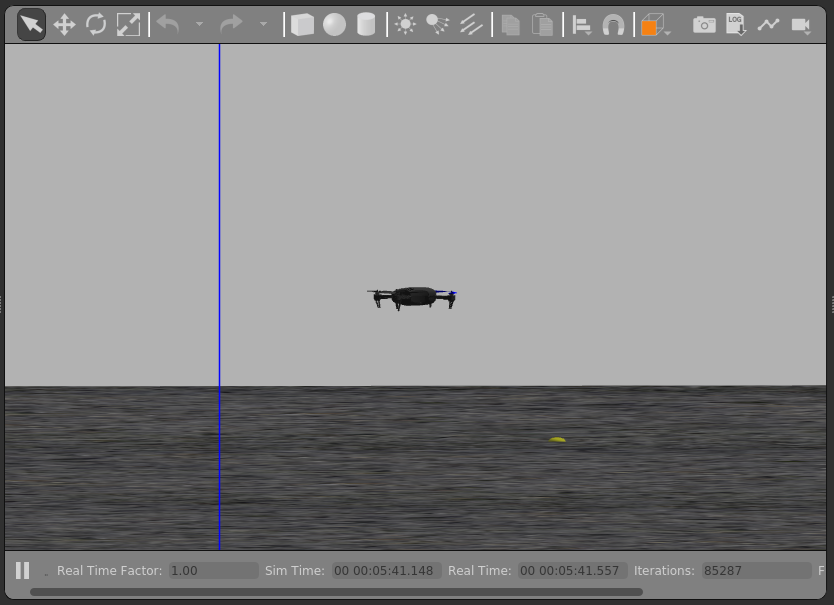

# 构建 PX4 软件

无论对于模拟器还是硬件目标设备，PX4固件可以在控制台或者IDE中从源码构建

您需要构建PX4才能使用[模拟器](../simulation/index.md)，或者如果您想修改PX4并创建自定义构建。 如果您只是想在真实硬件上尝试PX4，那么可以使用QGroundControl来[加载预先构建的二进制文件](../config/firmware.md)（无需遵循这些说明）。

::: info 在跟随这些指示之前，必须首先为主机操作系统和目标硬件安装 <[开发者工具链](../dev_setup/dev_env.md)。 如果您在按照这些步骤之后遇到任何问题，请查看下面的[故障排除](#troubleshooting)部分。 若要在您的计算机上获得*最新的*版本，请在终端中输入以下命令：

## 下载 PX4 源代码

PX4 源代码存储在GitHub 上的[PX4/Firmware](https://github.com/PX4/PX4-Autopilot) 存储库中。

若要在您的计算机上获得_最新的_（`main`分支）版本，请在终端中输入以下命令：

```sh
git clone https://github.com/PX4/PX4-Autopilot.git --recursive
```

注意，您可能在安装[开发工具链](../dev_setup/dev_env.md)时已经完成了这项操作

::: info 你只需要执行它就能够得到最新的代码。 如果需要，您还可以[获取特定版本的源代码](../contribute/git_examples.md#get-a-specific-release)。 [GIT 示例](../contribute/git_examples.md) 提供了更多关于与发布和向 PX4 贡献工作的信息。 这使我们能够在进入真正的硬件和 IDE 之前验证系统设置。

## 初次构建（使用模拟器）

首先我们要用控制台环境来构建一个模拟器目标 这使我们能够在转移到真正的硬件和 IDE 之前验证系统设置。

导航到 **PX4-Autopilot** 目录。 根据您的操作系统，您将安装[Gazebo SITL](../sim_gazebo_gz/index.md)或[Gazebo Classic SITL](../sim_gazebo_classic/index.md)（如果您不知道，可以尝试两者）。

:::: tabs

::: tab Gazebo 使用以下命令启动 [Gazebo SITL](../sim_gazebo_gz/index.md)

```sh
make px4_sitl gz_x500
```

:::

::: tab Gazebo-Classic 使用以下命令启动 [Gazebo SITL](../sim_gazebo_gz/index.md)

```sh
make px4_sitl gazebo-classic
```

:::

::::

这将显示 PX4 控制台：


::: info 在继续之前, 您可能需要启动_QGroundControl_，因为默认 PX4 配置需要在起飞前与地面站连接。 它可以从[这里下载](https://docs.qgroundcontrol.com/master/en/qgc-user-guide/getting_started/download_and_install.html)。 运行成功后将输出类似结束：

可以通过键入以下命令（如上方控制台中所示）来控制飞行器。

```sh
pxh> commander takeoff
```

该机体将起飞，您将在模拟器UI中看到：

:::: tabs

::: tab Gazebo 
:::

::: tab Gazebo-Classic 
:::

::::

无人机可以通过输入 `commander land` 着陆,，整个模拟可以通过 **CTRL+C**（或输入 `shutdown`）来停止。

与地面站一起飞模拟器更接近飞机的实际运行。 在飞机飞行时（Takeoff飞行模式），单击地图上的某个位置并启用滑块。 这将重新定位飞机。


## 基于NuttX / Pixhawk 的飞控板

### 为NuttX构建

要构建基于 Nuttx 或 Pixhawk 的飞控板，请跳转到**PX4-Autopilo**目录，然后调用 `make`加上你的板子的构建目标 来构建。

例如，要为[Pixhawk 4](../flight_controller/pixhawk4.md)构建，您将使用以下命令：

```sh
cd PX4-Autopilot
make px4_fmu-v5_default
```

运行成功后将输出类似结果：

```sh
-- Build files have been written to: /home/youruser/src/PX4-Autopilot/build/px4_fmu-v4_default
[954/954] Creating /home/youruser/src/PX4-Autopilot/build/px4_fmu-v4_default/px4_fmu-v4_default.px4
```

构建目标`px4_fmu-v4`的第一部分表示固件适用的飞控硬件。 后缀，在这种情况下为 `_default`, 表示一个固件 _配置_, 例如支持或忽略特定的功能。

::: info `_default`后缀是可选的。 例如，`make px4_fmu-v5` 和 `make px4_fmu-v5_default` 会产生相同的固件。 若要在您的计算机上获得*最新的*版本，请在终端中输入以下命令：

以下列表显示了为 [Pixhawk 标准](../flight_controller/autopilot_pixhawk_standard.md)板构建命令:

- [Holybro Pixhawk 6X-RT (FMUv6X)](../flight_controller/pixhawk6x-rt.md): `make px4_fmu-v6xrt_default`
- [Holybro Pixhawk 6X (FMUv6X)](../flight_controller/pixhawk6x.md): `make px4_fmu-v6x_default`
- [Holybro Pixhawk 6C (FMUv6C)](../flight_controller/pixhawk6c.md): `make px4_fmu-v6c_default`
- [Holybro Pixhawk 6C Mini (FMUv6C)](../flight_controller/pixhawk6c_mini.md): `make px4_fmu-v6c_default`
- [Holybro Pix32 v6 (FMUv6C)](../flight_controller/holybro_pix32_v6.md): `make px4_fmu-v6c_default`
- [Holybro Pixhawk 5X (FMUv5X)](../flight_controller/pixhawk5x.md): `make px4_fmu-v5x_default`
- [Pixhawk 4 (FMUv5)](../flight_controller/pixhawk4.md): `make px4_fmu-v5_default`
- [Pixhawk 4 Mini (FMUv5)](../flight_controller/pixhawk4_mini.md): `make px4_fmu-v5_default`
- [CUAV V5+ (FMUv5)](../flight_controller/cuav_v5_plus.md): `make px4_fmu-v5_default`
- [CUAV V5 nano (FMUv5)](../flight_controller/cuav_v5_nano.md): `make px4_fmu-v5_default`
- [Pixracer (FMUv4)](../flight_controller/pixracer.md): `make px4_fmu-v4_default`
- [Pixhawk 3 Pro](../flight_controller/pixhawk3_pro.md): `make px4_fmu-v4pro_default`
- [Pixhawk Mini](../flight_controller/pixhawk_mini.md): `make px4_fmu-v3_default`
- [Pixhawk 2 (Cube Black) (FMUv3)](../flight_controller/pixhawk-2.md): `make px4_fmu-v3_default`
- [mRo Pixhawk (FMUv3)](../flight_controller/mro_pixhawk.md): `make px4_fmu-v3_default` (supports 2MB Flash)
- [Holybro pix32 (FMUv2)](../flight_controller/holybro_pix32.md): `make px4_fmu-v2_default`
- [Pixfalcon (FMUv2)](../flight_controller/pixfalcon.md): `make px4_fmu-v2_default`
- [Dropix (FMUv2)](../flight_controller/dropix.md): `make px4_fmu-v2_default`
- [Pixhawk 1 (FMUv2)](../flight_controller/pixhawk.md): `make px4_fmu-v2_default`

:::warning
您 **必须** 使用受支持的GCC版本来为这个板子构建（比如，和用于[CI/docker](../test_and_ci/docker.md)的一样）或者从构建中删除模块。 Building with an unsupported GCC may fail, as PX4 is close to the board's 1MB flash limit. 若要在您的计算机上获得*最新的*版本，请在终端中输入以下命令：

- Pixhawk 1 with 2 MB flash: `make px4_fmu-v3_default`

Build commands for non-Pixhawk NuttX fight controllers (and for all other-boards) are provided in the documentation for the individual [flight controller boards](../flight_controller/README.md).

### 将固件烧录到飞控板

在make 命令后面附加 `upload`，通过 USB 将编译的二进制文件烧录到自动驾驶仪硬件。 例如

```sh
make px4_fmu-v4_default upload
```

运行成功后将有以下输出：

```sh
Erase  : [====================] 100.0%
Program: [====================] 100.0%
Verify : [====================] 100.0%
Rebooting.

[100%] Built target upload
```

## 其他飞控板

为其他板使用的构建命令在[特定板子的飞控页面](../flight_controller/index.md)提供（通常在_构建固件_标题下）。

您还可以使用以下命令列出所有配置目标：

```sh
make list_config_targets
```

## 用图形界面 IDE 编译

[VSCode](../dev_setup/vscode.md) 是 PX4 开发的官方支持（和推荐）的集成开发环境。 It is easy to set up and can be used to compile PX4 for both simulation and hardware environments.

## 故障处理

### 常规构建错误

许多构建问题是由不匹配的子模块或未完全清理的构建环境引起的。 更新子模块并进行 `distclean` 可以修复这类错误:

```sh
git submodule update --recursive
make distclean
```

### 闪存溢出了 XXX 字节

`region 'flash' overflowed by XXXX bytes` 错误表明固件对目标硬件平台太大了。 这在构建`make px4_fmu-v2_default`时很常见，它的闪存大小限制为1MB。

如果您正在构建_基础版_master分支，则最可能的原因是使用不受支持的GCC版本。 在这种情况下，请安装[开发工具链](../dev_setup/dev_env.md)指定的版本。

如果在构建自己的分支，您可能已将固件大小增加到超过1MB的限制。 在这种情况下，您需要从构建中删除您不需要的任何驱动程序/模块。

### macOS：打开文件过多错误

MacOS 默认允许在所有正在运行的进程中最多打开256个文件。 PX4构建系统打开大量文件，因此您可能会超出此数量。

构建工具链将随后报告`Too many open files`，如下所示：

```sh
/usr/local/Cellar/gcc-arm-none-eabi/20171218/bin/../lib/gcc/arm-none-eabi/7.2.1/../../../../arm-none-eabi/bin/ld: cannot find NuttX/nuttx/fs/libfs.a: Too many open files
```

解决方案是增加允许打开文件的最大数量（例如增加到300）。 您可以在每个会话的 macOS _终端_ 中执行此操作：

- 运行脚本 [Tools/mac_set_ulimit.sh](https://github.com/PX4/PX4-Autopilot/blob/main/Tools/mac_set_ulimit.sh)，或
- 运行这个命令:

  ```sh
  ulimit -S -n 300
  ```

### macOS Catalina：运行cmake时出现问题

对于 macOS Catalina 10.15.1 ，在尝试使用 _cmake_ 构建模拟器时可能会遇到问题。 如果您在这个平台上遇到构建问题，请尝试在终端中运行以下命令：

```sh
xcode-select --install
sudo ln -s /Library/Developer/CommandLineTools/SDKs/MacOSX.sdk/usr/include/* /usr/local/include/
```

### Ubuntu 18.04：涉及arm_none_eabi_gcc的编译错误

与`arm_none_eabi_gcc`相关的构建问题可能是由于损坏的g++工具链安装引起的。 您可以通过检查缺少的依赖项来验证这一点：

```sh
arm-none-eabi-gcc --version
arm-none-eabi-g++ --version
arm-none-eabi-gdb --version
arm-none-eabi-size --version
```

缺少依赖项的 bash 输出示例：

```sh
arm-none-eabi-gdb --version
arm-none-eabi-gdb: command not found
```

可以通过删除和 [重新安装编译器](https://askubuntu.com/questions/1243252/how-to-install-arm-none-eabi-gdb-on-ubuntu-20-04-lts-focal-fossa) 来解决这个问题。

### Ubuntu 18.04：Visual Studio Code 无法监视此大型工作区中的文件更改

请参阅 [Visual Studio 代码 IDE (VSCode) > 疑难解答](../dev_setup/vscode.md#troubleshooting)

### 导入Python软件包失败

在运行 `make px4_sitl jmavsim` 命令时，“导入失败”错误表示某些Python 软件包未安装(但是必需的)。

```sh
Failed to import jinja2: No module named 'jinja2'
您可能需要使用以下方式进行安装:
    pip3 install --user jinja2
```

如果您已经安装了这些依赖关系，这可能是因为计算机上存在多个 Python 版本（例如 Python 2.7.16 和 Python 3.8.3），并且该模块不存在于构建工具链使用的版本中。

您应该能够按照所示明确安装依赖项来解决此问题。

```sh
pip3 install --user pyserial empty toml numpy pandas jinja2 pyyaml pyros-genmsg packaging
```

## PX4 创建生成目标

前面的部分演示了如何调用 _make_ 来构建多个不同的目标、启动模拟器、使用 IDE 等。 本节介绍如何构造 _make_ 选项以及如何查找可用选项。

使用特定的 配置 和 初始化文件 调用 _make_ 的完整语法是：

```sh
make [VENDOR_][MODEL][_VARIANT] [VIEWER_MODEL_DEBUGGER_WORLD]
```

**VENDOR_MODEL_VARIANT**: (也称为 `CONFIGURATION_TARGET`)

- **VENDOR:** 飞控板制造商：`px4`，`aerotenna`，`airmind`，`atlflight`，`auav`，`beaglebone`，`intel`，`nxp`等。 Pixhawk 系列飞控板的制造商是 `PX4`。
- **MODEL：** _飞控板型号_：`sitl`、`fmu-v2`、`fmu-v3`、`fmu-v4`、`fmu-v5`、`navio2` 等。
- **VARIANT:**指示特定配置：例如`bootloader`, `cyphal`,，其中包含 `默认` 配置中不存在的组件。 最常见的是 `default`，可以省略。

:::tip
您可以使用下面的命令获取 _所有_ 可用的 `CONFIGURATION_TARGET` 选项的列表：

```sh
make list_config_targets
```

:::

**VIEWER_MODEL_DEBUGGER_WORLD:**

- **VIEWER:**这是启动和连接的模拟器（"查看器"）：`gazebo`, `jmavsim`, `none` <!-- , ?airsim -->

:::tip
`none` 可以用于启动 PX4 并等待模拟器（jmavsim、Gazebo、Gazebo Classic 或其他一些模拟器）。 例如，`make px4_sitl none_iris` 启动 PX4 而不带模拟器（但带有iris机架）。 若要在您的计算机上获得*最新的*版本，请在终端中输入以下命令：

- **模型:**要使用的 _机体_ 模型（例如 `iris` (_default_)、`rover`、`tailsitter` 等），该模型将由模拟器加载。 环境变量 `PX4_SIM_MODEL` 将设置为所选模型。 然后在 [启动脚本 ](#scripts) 中使用该模型来选择适当的参数。
- **DEBUGGER:**要使用的调试器：`none` (_default_)、`ide`、`gdb`、`lldb`、`ddd`、`valgrind`、`callgrind`。 有关详细信息，请参阅 [模拟器调试 ](../debug/simulation_debugging.md)。
- **WORLD:** (仅限Gazebo Classic). 设置被加载的世界（[PX4-Autopilot/Tools/simulation/gazebo-classic/sitl_gazebo-classic/worlds](https://github.com/PX4/PX4-SITL_gazebo-classic/tree/main/worlds)）. 默认为 [空世界](https://github.com/PX4/PX4-SITL_gazebo-classic/blob/main/worlds/empty.world)。 欲了解更多信息，请参阅 [Gazebo Classic> 加载特定世界](../sim_gazebo_classic/index.md#loading-a-specific-world)

您可以使用下面的命令获取_所有_ 可用的 `VIEWER_MODEL_DEBUGGER` 选项的列表：

```sh
make px4_sitl list_vmd_make_targets
```

:::

::: info

- `CONFIGURATION_TARGET` 和 `VIEWER_MODEL_DEBUGGER` 中的大多数值都有默认值, 因此是可选的。 比如，`gazebo-classic` 相当于 `gazebo-classic_iris` 或 `gazebo-classic_iris_none`。
- 如果要在其他两个设置之间指定默认值，可以使用三个下划线。 比如，`gazebo-classic___gdb` 相当于 `gazebo-classic_iris_gdb`。
- 您可以使用 `VIEWER_MODEL_DEBUGGER` 的 `none` 值启动 PX4 并等待模拟器。 例如，使用 `make px4_sitl_default none` 启动 PX4和使用`./Tools/simulation/jmavsim/jmavsim_run.sh -l`启动 jMAVSim 。

:::

`VENDOR_MODEL_VARIANT` 选项映射到 PX4 源代码树中 [/boards](https://github.com/PX4/PX4-Autopilot/tree/main/boards) 目录下的特定 _px4board_ 配置文件。 具体而言 `VENDOR_MODEL_VARIANT` 映射到配置文件 **boards/VENDOR/MODEL/VARIANT.cmake**（例如 `px4_fmu-v5_default` 对应于 [boards/px4/fmu-v5/default.px4board](https://github.com/PX4/PX4-Autopilot/blob/main/boards/px4/fmu-v5/default.px4board)）。

其他 make 目标在相关章节中讨论：

- `bloaty_compare_master`: [二进制大小分析](../debug/binary_size_profiling.md)
- ...

## 固件版本& Git 标签

_PX4 固件版本_ 和 _自定义固件版本_ 使用 MAVLink [AUTOPILOT_VERSION](https://mavlink.io/en/messages/common.html#AUTOPILOT_VERSION) 消息发布， 显示在 _QGroundControl_ **设置 > 摘要** 机架面板：


这些是在构建时从您存储库树的活动的_git tag_提取的。 Git 标签应该格式为 `<PX4版本>-<制造商版本>` (例如上面图像中的标签设置为 `v1.8.1-2.22.1`）

:::warning
如果您使用不同的git标签格式，版本信息可能无法正确显示。
:::
