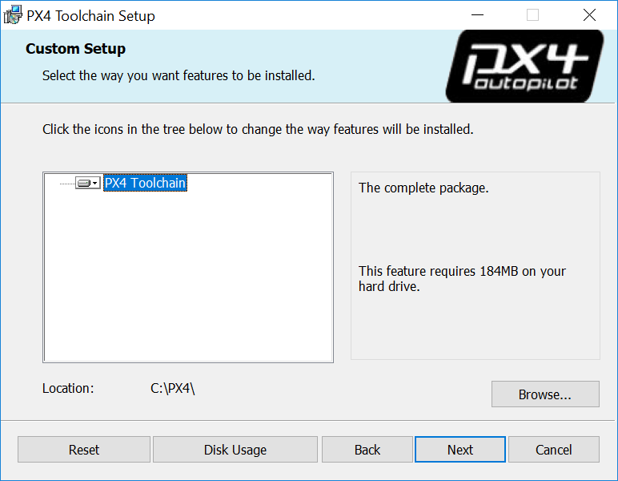

# Windows Cygwin 工具链

该工具链非常轻便，而且容易安装和使用。 它是目前Windows环境下用于PX4开发的最新和最好的工具。

:::tip
This is the only officially supported toolchain for building PX4 on Windows (i.e. it is tested in our continuous integration system).
:::

这篇文章将解释怎样下载和使用该环境，并且在需要的时候怎样扩展和更新(比如，使用其他的编译器)。
* 编译/上传 PX4到Nuttx目标(Pixhawk系列飞控)
* JMAVSim/SITL 仿真会获得比其他Windows工具链更好的性能
* 类型校验，轻便安装，完整的命令行支持和许多[其他特性](#features)

编写或复制 ** 批处理脚本 ** [`run-console.bat`](https://github.com/MaEtUgR/PX4Toolchain/blob/master/run-console.bat) 和 [`setup-environment-variables.bat`](https://github.com/MaEtUgR/PX4Toolchain/blob/master/toolchain/setup-environment-variables.bat)。

<a id="installation"></a>

## 安装说明

1. 从 [Github](https://github.com/PX4/windows-toolchain/releases) 或者 [S3](https://s3-us-west-2.amazonaws.com/px4-tools/PX4+Windows+Cygwin+Toolchain/PX4+Windows+Cygwin+Toolchain+0.5.msi) 下载最新的MSI安装文件。
1. 运行它，选择你需要的安装路径，执行安装 
1. Tick the box at the end of the installation to *clone the PX4 repository, build and run simulation with jMAVSim* (this simplifies the process to get you started). :::note If you missed this step you will need to [clone the PX4-Autopilot repository manually](#getting_started).
:::

<a id="getting_started"></a>

## 入门指南

工具链使用专门配置的控制台(通过运行**run-console.bat**脚本)从而可以使用PX4编译命令

1. 进入到工具链的安装目录(默认**C:\PX4**)
1. 运行**run-console.bat**(双击)启动Cygwin bash控制台
1. 在控制台中运行克隆PX4 Firmware仓库命令

:::note
Cloning only needs to be done once! Skip this step if you ticked the installer option to *clone the PX4 repository, build and run simulation with jMAVSim*.
:::

   ```bash
   # Clone the PX4-Autopilot repository into the home folder & loads submodules in parallel
   git clone --recursive -j8 https://github.com/PX4/PX4-Autopilot.git
   ```

   You can now use the console/PX4-Autopilot repository to build PX4.

1. 举例，要运行JMAVSim:
   ```bash
   # 进入Firmware仓库目录
    cd Firmware 
    # 使用JMAVSim编译并运行SITL模拟器来验证 
    make px4_sitl jmavsim
   ```
   控制台将会显示：

   

下面[ 有关如何生成 PX4 的详细说明 ](../setup/building_px4.md) (或参阅下面的部分以了解更多常规用法说明)。

<a id="usage_instructions"></a>

## 使用说明

安装目录 （默认位置： **C:\PX4**） 用于开启PX4 SITL（类Linux）命令行窗口的脚本文件： **run-console.bat**

:::tip
The [Manual Setup](#manual_setup) section explains why you need to use the script and how it all works.
:::

The ordinary workflow consists of starting a console window by double clicking on the **run-console.bat** script to manually run terminal commands.

### Windows & Git 特殊情况

Antivirus and other background file monitoring tools can significantly slow down both installation of the toolchain and PX4 build times.

但我们并不建议这样做, 因为它可能会影响 Windows 计算机上的任何其他 (无关) git 使用。

### Windows & Git 特殊情况

#### Windows CR+LF 对比 Unix LF 行结尾

We recommend that you force Unix style LF endings for every repository you're working with using this toolchain (and use an editor which preserves them when saving your changes - e.g. Eclipse or VS Code). Compilation of source files also works with CR+LF endings checked out locally, but there are cases in Cygwin (e.g. execution of shell scripts) that require Unix line endings (otherwise you get errors like `$'\r': Command not found.`). Luckily git can do this for you when you execute the two commands in the root directory of your repo:
```
git config core.autocrlf false
git config core.eol lf
```

If you work with this toolchain on multiple repositories you can also set these two configurations globally for your machine:
```
git config --global ...
```
对于由局部配置引起此问题的现有存储库，你可以使用如下命令：

#### Unix 执行权限

Under Unix there's a flag in the permissions of each file that tells the OS whether or not the file is allowed to be executed. *git* under Cygwin supports and cares about that bit (even though the Windows NTFS file system does not use it). This often results in *git* finding "false-positive" differences in permissions. The resulting diff might look like this:
```
diff --git ...
old mode 100644
new mode 100755
old mode 100644
new mode 100755
```

补充:
```
git config --global core.fileMode false # disable execution bit check globally for the machine
```

你还可以使用 Github 项目中的 shell 脚本进行开发环境的安装。
```
git config --unset core.filemode # 移除当前存储库的局部配置，改用全局配置
git submodule foreach --recursive git config --unset core.filemode # 移除所有子模块的局部配置
```


## 附加信息

<a id="features"></a>

### 特性/问题

你还可以使用 Github 项目中的 shell 脚本进行开发环境的安装。

* 使用 jMAVSim 编译和运行 SITL, 其性能明显优于虚拟机 (Cygwin会生成一个本机 windows 二进制文件 ** px4.exe **)。
* 编译和上传 NuttX 二进制文件（例如：px4_fmu-v2 和 px4_fmu-v4）。
* 使用 * astyle * 进行格式检查 (支持命令: `make format`)。
* 命令行自动补全。
* 绿色安装！ 安装程序不会影响您的系统和全局路径设置 (它只修改选定的安装目录, 例如 ** C:\PX4 \ ** 并使用临时本地路径变量)。
* 安装程序支持更新到最新版本, 同时保持您的个人更改在工具链文件夹中。

Omissions:
* 仿真模拟：暂不支持Gazebo 和 ROS。
* 仅支持 NuttX 和 JMAVSim/SITL 编译。
* [Known problems](https://github.com/orgs/PX4/projects/6) (Also use to report issues).

<a id="script_setup"></a>

### Shell 脚本安装

You can also install the environment using shell scripts in the Github project.

1. 请确保安装了 [ Windows Git ](https://git-scm.com/download/win)。
1. 将代码仓库 https://github.com/PX4/windows-toolchain 克隆到要安装工具链的位置。 打开 `Git Bash` 并执行以下操作，打开后会自动进入默认的安装目录:
```
> **注意：** 这就是 [cygwin64/install-cygwin-px4.bat](https://github.com/MaEtUgR/PX4Toolchain/blob/master/toolchain/cygwin64/install-cygwin-px4.bat) 所做的工作。
```
1. 如果要安装所有组件, 请进入到新克隆的代码仓库文件夹, 然后双击位于文件夹 `toolchain`目录中的脚本 `install-all-components.bat`。 如果您只需要某些组件并希望占用有限的Internet 数据和磁盘空间, 则可以进入到不同的组件文件夹, 如 `toolchain\cygwin64`, 然后单击 ** install-XXX.bat ** 脚本以获取特定的内容。
1. 从 [ Cygwin 官方网站 ](https://cygwin.com/install.html) 下载 * Cygwin 安装程序 * 文件 [ official Cygwin website ](https://cygwin.com/setup-x86_64.exe)

<a id="manual_setup"></a>

### 手动安装 (对于开发人员)

This section describes how to setup the Cygwin toolchain manually yourself while pointing to the corresponding scripts from the script based installation repo. The result should be the same as using the scripts or MSI installer.

:::note
The toolchain gets maintained and hence these instructions might not cover every detail of all the future changes.
:::

1. 创建 * 文件夹 *: ** C:\PX4 \ **、** C:\PX4\toolchain \ ** 和 ** C:\PX4\home \ **
1. 在安装向导中选择安装到文件夹中: ** C:\PX4\toolchain\cygwin64 \ **
1. 运行下载的安装程序文件
1. ** 注意 **这就是 [ cygwin64/install-cygwin-pxbat ](https://github.com/MaEtUgR/PX4Toolchain/blob/master/toolchain/cygwin64/install-cygwin-python-packages.bat) 所做的工作。
1. 选择安装默认的 Cygwin 基础包和以下附加包的最新可用版本:

   * **目录:安装包名**
   * Devel:cmake (3.3.2 正常工作无告警, 3.6.2有告警但能够正常工作)
   * Devel:gcc-g++
   * Devel:gdb
   * Devel:git
   * Devel:make
   * Devel:ninja
   * Devel:patch
   * Editors:xxd
   * Editors:nano (除非你精通vim)
   * Python:python2
   * Python:python2-pip
   * Python:python2-numpy
   * Python:python2-jinja2
   * Python:python2-pyyaml
   * Python:python2-cerberus
   * Archive:unzip
   * Utils:astyle
   * Shells:bash-completion
   * Web:wget

:::note
Do not select as many packages as possible which are not on this list, there are some which conflict and break the builds.
:::

:::note
That's what [cygwin64/install-cygwin-px4.bat](https://github.com/MaEtUgR/PX4Toolchain/blob/master/toolchain/cygwin64/install-cygwin-px4.bat) does.
:::

1. 下载 [**Apache Ant**](https://ant.apache.org/bindownload.cgi) zip 存档, 并将内容解压缩到文件夹 `C:\PX4\toolchain\apache-ant`。

   使用预先准备好的批处理脚本启动开发环境的原因是，这些脚本预配置了程序使用工具链所在目录下的绿色版 Cygwin 环境变量。 这是通过始终首先调用脚本 [** setup-environment-variables.bat **](https://github.com/MaEtUgR/PX4Toolchain/blob/master/toolchain/setup-environment-variables.bat) 和所需的应用程序 (如控制台) 来完成的。

   脚本 [`setup-environment-variables.bat`](https://github.com/MaEtUgR/PX4Toolchain/blob/master/toolchain/setup-environment-variables.bat)用于设置工作区根目录的环境变量 `PX4_DIR`、所有可执行程序 `PATH` 和 unix 环境的HOME目录`HOME`。

1. 通过执行 Cygwin 工具链控制台 (双击 ** run-console.bat **) 脚本, 向安装程序添加必要的 ** python 包 **
   ```
   pip2 install toml 
 pip2 install pyserial 
 pip2 install pyulog
   ```

:::note
That's what [cygwin64/install-cygwin-python-packages.bat](https://github.com/MaEtUgR/PX4Toolchain/blob/master/toolchain/cygwin64/install-cygwin-python-packages.bat) does.
:::

1. 下载 [**ARM GCC 编译器**](https://developer.arm.com/open-source/gnu-toolchain/gnu-rm/downloads) zip 存档，并将内容解压缩到文件夹 `C:\PX4\toolchain\gcc-arm`。

:::note
This is what the toolchain does in: [gcc-arm/install-gcc-arm.bat](https://github.com/MaEtUgR/PX4Toolchain/blob/master/toolchain/gcc-arm/install-gcc-arm.bat).
:::

1. 安装 JDK
   * 下载 [** Java Development Kit Installer **](http://www.oracle.com/technetwork/java/javase/downloads/jdk8-downloads-2133151.html)。
   * 因为不幸的是, 没有绿色的归档文件直接包含二进制文件, 所以您必须安装它。
   * 查找二进制文件并将其移动/复制到 ** C:\PX4\toolchain\jdk **。
   * 您可以再次从 Windows 系统中卸载该JDK工具包, 我们只需要工具链的二进制文件。

:::note
This is what the toolchain does in: [jdk/install-jdk.bat](https://github.com/MaEtUgR/PX4Toolchain/blob/master/toolchain/jdk/install-jdk.bat).
:::

1. {\[--gt--]} ** 注意 **这就是工具链在 [ gcc-arm/install-apache-ant.bat \](https://github.com/MaEtUgR/PX4Toolchain/blob/master/toolchain/apache-ant/install-apache-ant.bat) 脚本中所做的工作。

:::tip
Make sure you don't have an additional folder layer from the folder which is inside the downloaded archive.
:::

:::note
This is what the toolchain does in: [apache-ant/install-apache-ant.bat](https://github.com/MaEtUgR/PX4Toolchain/blob/master/toolchain/apache-ant/install-apache-ant.bat).
:::

1. Download, build and add *genromfs* to the path:
   * Clone the source code to the folder **C:\PX4\toolchain\genromfs\genromfs-src** with
     ```
     cd /c/toolchain/genromfs
     git clone https://github.com/chexum/genromfs.git genromfs-src
     ```

   * 使用如下命令进行编译：
     ```
     cd genromfs-src
 make all
    ```

    * 将包含有生成的二进制 ** genromfs.exe ** 的文件夹复制到: ** C:\PX4\toolchain\genromfs **

:::note
This is what the toolchain does in: [genromfs/install-genromfs.bat](https://github.com/MaEtUgR/PX4Toolchain/blob/master/toolchain/genromfs/install-genromfs.bat).
:::

1. Make sure all the binary folders of all the installed components are correctly listed in the `PATH` variable configured by [**setup-environment.bat**](https://github.com/PX4/windows-toolchain/blob/master/toolchain/scripts/setup-environment.bat).
