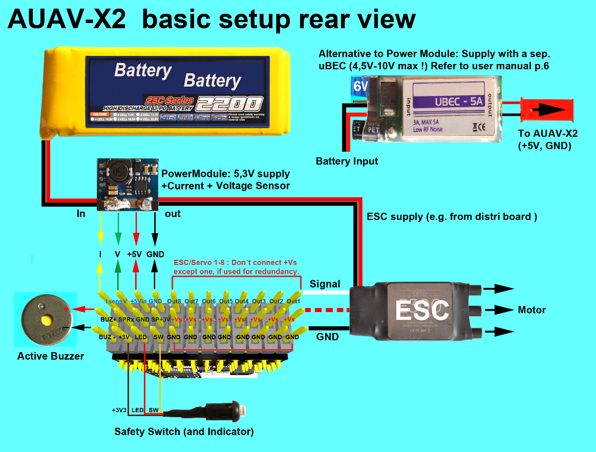

# AUAV-X2 自动驾驶仪 (停产)

> **Warning** This flight controller has been [discontinued](../flight_controller/autopilot_experimental.md) and is no longer commercially available.

[AUAV&reg; ](http://www.auav.com/) *AUAV-X2 autopilot* 基于[Pixhawk&reg;-项目](https://pixhawk.org/) ** FMUv2** 开放硬件设计。 它在 [NuttX](http://nuttx.org) 操作系统上运行 PX4。

## 总览

* 主片上系统：[STM32F427](http://www.st.com/web/en/catalog/mmc/FM141/SC1169/SS1577/LN1789) 
  * CPU：STM32F427VIT6 ARM 微控制器-版本 3
  * IO：STM32F100C8T6 ARM 微控制器
* 传感器： 
  * Invensense MPU9250 9DOF
  * Invensense ICM-20608 6DOF
  * MEAS MS5611 气压计
* 尺寸/重量 
  * 尺寸：36mm x 50mm
  * 安装点：30.5mm x 30.5mm 直径 3.2mm
  * 重量: 10.9g
* 具有反向电压保护的电源 OR-ing 原理图。 需要 5V 电源模块！

## 连接

* 2.54 毫米头：
* GPS (USART4)
* I2C
* 遥控输入
* PPM 输入
* Spektrum 输入
* RSSI 输入
* sBus 输入 
* sBus 输出
* 电源输入
* 蜂鸣器输出
* LED 输出
* 8路伺服输出
* 6路辅助输出
* USART7（控制台）
* USART8（OSD）

## 访问链接

已停产。 这已被 [mRo X2.1](mro_x2.1.md) 替代。 mRobotics is the distributor for the AUAV Products from August 2017.

## 主链接

* [用户手册](http://arsovtech.com/wp-content/uploads/2015/08/AUAV-X2-user-manual-EN.pdf)
* [DIY 无人机邮报](http://diydrones.com/profiles/blogs/introducing-the-auav-x2-1-flight-controller)

## 接线指南

## 原理图

该板基于 [Pixhawk project](https://pixhawk.org/) **FMUv2** 开放式硬件设计。

* [FMUv2 + IOv2 schematic](https://raw.githubusercontent.com/PX4/Hardware/master/FMUv2/PX4FMUv2.4.5.pdf) - 原理图和布局

> **Note**作为 CC-BY-SA 3.0 许可的开放硬件设计，所有原理图和设计文件都是 [available](https://github.com/PX4/Hardware)。

## Serial Port Mapping

| UART   | Device     | Port                  |
| ------ | ---------- | --------------------- |
| UART1  | /dev/ttyS0 | IO debug              |
| USART2 | /dev/ttyS1 | TELEM1 (flow control) |
| USART3 | /dev/ttyS2 | TELEM2 (flow control) |
| UART4  |            |                       |
| UART7  | CONSOLE    |                       |
| UART8  | SERIAL4    |                       |