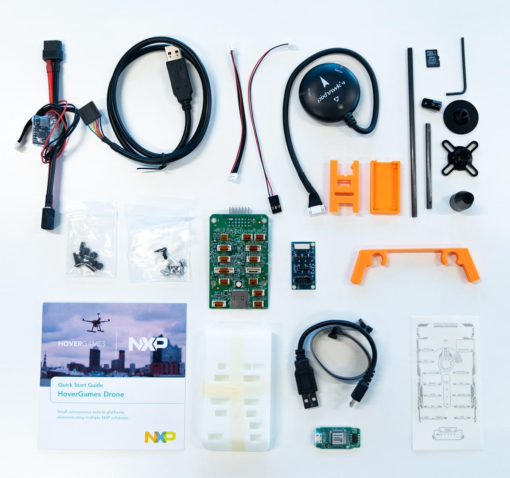

# NXP RDDRONE-FMUK66 FMU

> **Warning** PX4 不生产这款且也不生产任何自动驾驶仪。 若需要硬件支持或咨询合规问题，请联系 [制造商](https://www.nxp.com/)。

RDDRONE-FMUK66 FMU is a reference design using NXP Semiconductor components that closely follows Pixhawk FMUv4 specifications while adding two wire automotive Ethernet 100BASET1 and secure element A71CH (RevC) or SE050 (RevD). NXP provides the schematics, gerbers, BOM and source files so that anyone can duplicate, change or repurpose this design.

This is the official FMU for use with [HoverGames](https://www.hovergames.com/).


The NXP FMU and included peripherals have been tested to comply with FCC/CE/RoHs/REACH directives.

> **Note** These flight controllers are [manufacturer supported](../flight_controller/autopilot_manufacturer_supported.md).


## 概览

- **Main FMU Processor:**
  - Kinetis K66 MK66FN2MOVLQ18 microcontroller running at 180MHz Cortex-M4F MCU, 2MB Flash, 256KB SRAM, Dual USBs (FS + HS), Ethernet, 144-LQFP.
- **内置传感器：**
  - Accel/Gyro: BMI088/ICM42688 (RevD)...
  - Accel/Magnetometer: FXOS8700CQ
  - Gyro: FXAS21002CQ
  - Magnetometer: BMM150
  - Barometer: ML3115A2
  - Barometer: BMP280
- **GPS:**
  - ublox Neo-M8N GPS/GLONASS receiver; integrated magnetometer IST8310


This FMU is provided only as a kit, and includes [Segger Jlink EDU mini debugger](https://www.segger.com/products/debug-probes/j-link/models/j-link-edu-mini/), DCD-LZ debugger adapter, USB-TTL-3V3 console cable, HolyBro GPS module, battery power module, SDCard and case, screws and stickers. Telemetry radios ([HGD-TELEM433](https://www.nxp.com/part/HGD-TELEM433) and [HGD-TELEM915](https://www.nxp.com/part/HGD-TELEM915)) must be purchased separately to match ISM band frequencies used in your country.



A "Lite" version RDDRONE-FMUK66L is also available which does not include the power module, GPS, Jlink or USB-TTL-3V3 console cable or SDCard.[Scroll down to see FMUK66L in the buy section of the FMUK66 buy page](https://www.nxp.com/design/designs/px4-robotic-drone-fmu-rddrone-fmuk66:RDDRONE-FMUK66#buy)

Additional information can be found in the [Technical Data Sheet](https://www.nxp.com/design/designs/px4-robotic-drone-fmu-rddrone-fmuk66:RDDRONE-FMUK66). <!-- www.nxp.com/rddrone-fmuk66 -->


## 采购

**RDDRONE-FMUK66** reference design kit may be purchased direct from NXP or from any of NXP's authorised worldwide network of [electronics distributors](https://www.nxp.com/support/sample-and-buy/distributor-network:DISTRIBUTORS).

- [Purchase Link](https://www.nxp.com/design/designs/px4-robotic-drone-fmu-rddrone-fmuk66:RDDRONE-FMUK66#buy) (www.nxp.com)
- Telemetry radios are purchased separately depending on frequency band:
  - [HGD-TELEM433](https://www.nxp.com/part/HGD-TELEM433)
  - [HGD-TELEM915](https://www.nxp.com/part/HGD-TELEM915)


> **Note** *RDDRONE-FMUK66* FMU is also included in the complete HoverGames drone kit: [KIT-HGDRONEK66](https://www.nxp.com/applications/solutions/industrial/aerospace-and-mobile-robotics/uavs-drones-and-rovers/nxp-hovergames-drone-kit-including-rddrone-fmuk66-and-peripherals:KIT-HGDRONEK66#buy)


<!--
## Connectors

[Connector Diagram]

## Pinouts

[Pinouts listing or link]

## Dimensions

[Dimensions]

-->

## 组装 / 设置

https://nxp.gitbook.io/hovergames

## 编译固件

> **Tip** 大多数用户不需要构建此固件！ 它是预构建的，并在连接适当的硬件时由 *QGroundControl* 自动安装。

为此目标 [编译 PX4](../dev_setup/building_px4.md)：
```
make nxp_fmuk66-v3_default
```


## Debug调试端口

The [PX4 System Console](../debug/system_console.md) and the [SWD interface](../debug/swd_debug.md) run on the [DCD-LZ FMU Debug](https://nxp.gitbook.io/hovergames/rddrone-fmuk66/connectors/debug-interface-dcd-lz) port.

NXP's DCD-LZ is a 7 pin JST-GH connector and adds the nRST/MCU_RESET pin to the [Pixhawk 6-Pin standard debug port](https://pixhawk.org/pixhawk-connector-standard/#dronecode_debug).

The DCD-LZ breakout adapter permits the use of a standard 10 pin JTAG/SWD interface (i.e. using the Segger Jlink) and a standard 5 pin FTDI USB-TTL-3V3 type cable.

<!--

## Peripherals

* [List of anything people should use with this hardware]

-->

## 支持的平台/机身

任何可用普通遥控舵机系统或 Futaba S-Bus 舵机系统控制的多旋翼、固定翼、无人车、无人船。 全部可支持的机型可见 [机型参考](../airframes/airframe_reference.md)。


> **Tip** The NXP [HoverGames Drone Kit](https://www.nxp.com/kit-hgdronek66) (shown above) is a complete drone development kit that includes everything needed to build a quadcopter. You only need to supply the 3S/4S LiPo battery.

## 更多信息

- [HoverGames online documentation](https://nxp.gitbook.io/hovergames) PX4 user and programming guide, specific assembly, construction, debugging, programming instructions.

- 3DModels supporting HoverGames and RDDRONE-FMUK66 can be found on *Thingiverse* at these search links: [fmuk66](https://www.thingiverse.com/search?q=fmuk66&type=things&sort=relevant), [hovergames](https://www.thingiverse.com/search?q=hovergames&type=things&sort=relevant).

!\[HoverGamesDronelogo\](../../assets/flight_controller/nxp_rddrone_fmuk66/The HoverGames_Colored-small.png)

