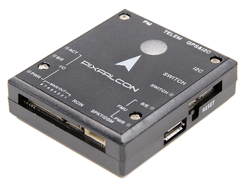

# Pixfalcon Flight Controller (Discontinued)

> **Warning** This flight controller has been [discontinued](../flight_controller/autopilot_experimental.md) and is no longer commercially available.

The Pixfalcon autopilot (designed by [Holybro&reg;](http://www.holybro.com/)) is binary-compatible (FMUv2) derivative of the [Pixhawk 1](../flight_controller/pixhawk.md) design that has been optimized for space-constrained applications such as FPV racers. It has less IO to allow for the reduction in size.

## 总览

* Main System-on-Chip: [STM32F427](http://www.st.com/web/en/catalog/mmc/FM141/SC1169/SS1577/LN1789) 
  * CPU: 180 MHz ARM&reg; Cortex&reg; M4 with single-precision FPU
  * RAM: 256 KB SRAM (L1)
* Failsafe System-on-Chip: STM32F100 
  * CPU: 24 MHz ARM Cortex M3
  * RAM: 8 KB SRAM
* GPS: U-Blox&reg; M8 (bundled)

### Connectivity

* 1x I2C
* 2x UART (one for Telemetry / OSD, no flow control)
* 8x PWM with manual override
* S.BUS / PPM input

## 访问链接:

From distributor [Hobbyking&reg;](https://hobbyking.com/en_us/pixfalcon-micro-px4-autopilot-plus-micro-m8n-gps-and-mega-pbd-power-module.html)

Optional hardware:

* Optical flow: PX4 Flow unit from manufacturer [Holybro](http://www.holybro.com/product/px4flow/)
* Digital Airspeed sensor from manufacturer [Holybro](http://www.holybro.com/product/digital-air-speed-sensor/) or distributor [Hobbyking](https://hobbyking.com/en_us/hkpilot-32-digital-air-speed-sensor-and-pitot-tube-set.html)
* On screen display with integrated Telemetry: 
  * [Hobbyking OSD + EU Telemetry (433 MHz)](https://hobbyking.com/en_us/micro-hkpilot-telemetry-radio-module-with-on-screen-display-osd-unit-433mhz.html)
* Pure Telemetry options: 
  * [Hobbyking Wifi Telemetry](https://hobbyking.com/en_us/apm-pixhawk-wireless-wifi-radio-module.html)
  * [HKPilot Micro Telemetry EU version (433 MHz)](https://hobbyking.com/en_us/hkpilot32-autonomous-vehicle-32bit-control-set-with-telemetry-and-gps-433mhz.html)
  * [HKPilot Micro Telemetry EU version (915 MHz)](https://hobbyking.com/en_us/hkpilot32-autonomous-vehicle-32bit-control-set-with-telemetry-and-gps-915mhz.html)

## 编译固件

> **Tip** Most users will not need to build this firmware! It is pre-built and automatically installed by *QGroundControl* when appropriate hardware is connected.

To [build PX4](https://dev.px4.io/master/en/setup/building_px4.html) for this target:

    make px4_fmu-v2_default
    

## Debug Port

This board does not have a debug port (i.e it does not have a port for accessing the [System Console](http://dev.px4.io/master/en/debug/system_console.html) or the [SWD interface](http://dev.px4.io/master/en/debug/swd_debug.html) (JTAG).

Developers will need to solder wires to the board test pads for SWD, and to the STM32F4 (IC) TX and RX to get a console.

## Serial Port Mapping

| UART   | Device     | Port                     |
| ------ | ---------- | ------------------------ |
| UART1  | /dev/ttyS0 | IO Debug                 |
| USART2 | /dev/ttyS1 | TELEM1 (No flow control) |
| UART4  | /dev/ttyS2 | GPS                      |

## Key Links

* [User Manual](http://www.holybro.com/manual/pixfalcon11.pdf)