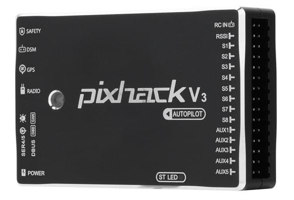

# Pixhack v3

CUAV *Pixhack v3* 飞行控制器是一款灵活轻便的自动驾驶仪，主要面向于商用无人系统制造商。

该控制器是SOLO Pixhawk&reg; 2 (PH2) 飞行控制器的变形体，后者又基于[Pixhawk](https://pixhawk.org/)项目的**FMUv3**开放式硬件设计。 它在[NuttX](http://nuttx.org) OS上运行PX4，并且与PX4和ArduPilot&reg;（APM）固件完全兼容。

*Pixhack V3*相较于原始设计有着显著的改进，包括更好的接口布局以及增加内置减震和恒温系统。

> **Tip** This autopilot is [supported](../flight_controller/autopilot_pixhawk_standard.md) by the PX4 maintenance and test teams.

## 快速预览

* 微处理器： 
  * STM32F427
  * STM32F100 (故障保护协处理器)
* 传感器： 
  * 加速度计 (3): LSM303D,MPU6000,MPU6000
  * 陀螺仪 (3): L3GD20, MPU6000, MPU9250
  * 指南针 (2): LS303D, MPU9250
  * 气压计 (2): MS5611*2
* 接口： 
  * MAVLink UART (2)
  * GPS UART (2)
  * DEBUG UART (1)
  * 遥控信号输入(支持PPM, SBUS, DSM/DSM2)
  * RSSI输入: PWM或3.3ADC
  * I2C总线 (2)
  * CAN总线 (1)
  * ADC输入: 3.3V X1 , 6.6V X1
  * PWM输出: 8 PWM IO + 4 IO
* 电源系统 
  * Power口输入电压: 4.5 ~ 5.5 V
  * USB口输入电压：5.0 V +- 0.25v
* 重量和尺寸: 
  * 重量: 63g
  * 宽度：68mm
  * 厚度: 17mm
  * 长度：44mm
* 其它特性: 
  * 工作温度: -20 ~ 60°C

## 访问链接

该控制器可以从以下链接购买：

* [store.cuav.net](http://store.cuav.net/index.php?id_product=8&id_product_attribute=0&rewrite=pixhack-v3-autopilot&controller=product&id_lang=3)
* [leixun.aliexpress.com/store](https://leixun.aliexpress.com/store)

## 编译固件

> **Tip** Most users will not need to build this firmware! It is pre-built and automatically installed by *QGroundControl* when appropriate hardware is connected.

To [build PX4](https://dev.px4.io/master/en/setup/building_px4.html) for this target:

    make px4_fmu-v3_default
    

## 引脚和原理图

* [Documentation/wiring guides](http://doc.cuav.net/flight-controller/pixhack/en/pixhack-v3.html)

## Serial Port Mapping

| UART   | Device     | Port                  |
| ------ | ---------- | --------------------- |
| UART1  | /dev/ttyS0 | IO debug              |
| USART2 | /dev/ttyS1 | TELEM1 (flow control) |
| USART3 | /dev/ttyS2 | TELEM2 (flow control) |
| UART4  |            |                       |
| UART7  | CONSOLE    |                       |
| UART8  | SERIAL4    |                       |