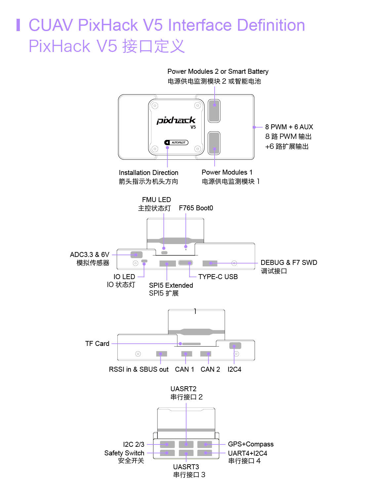
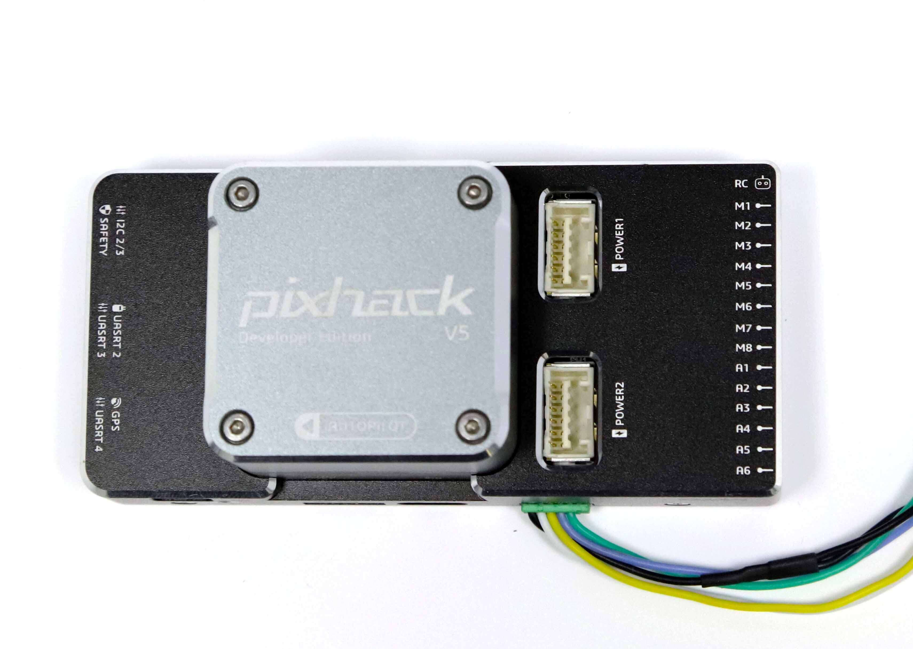

# CUAV v5

*CUAV v5*&reg; (previously "Pixhack v5") is an advanced autopilot designed and made by CUAV&reg;. 该控制器基于[Pixhawk项目](https://pixhawk.org/)的**FMUv5** 开源硬件设计。 它在[NuttX](http://nuttx.org) OS操作系统上运行PX4，并与PX4固件完全兼容。 它主要面向学术和商业开发者。

## 快速预览

* 主处理器：STM32F765 
  * 32 位 Arm® Cortex®-M7，216MHz，2MB 储存，512KB RAM
* IO 处理器：STM32F100 
  * 32 位 Arm® Cortex®-M3，24MHz，8KB SRAM

* 内置传感器：
  
  * 加速度计/陀螺仪：ICM-20689
  * 加速度计/陀螺仪：BMI055
  * 磁力计：IST8310
  * 气压计：MS5611

* 接口：
  
  * 14路PWM输出 (6路来自FMU, 8路来自 IO)
  * FMU上有3个专用PWM/Capture输入
  * CPPM专用的RC输入
  * 用于ppm/DSM和S.Bus的专用RC输入 
  * 电平/PWM RSSI输入
  * S.BUS伺服输出
  * 5个通用串行口
  * 4路I2C总线
  * 4路SPI总线
  * 2路CAN总线
  * 2个电池电流/电压模拟输入口
* 电源系统： 
  * 输入电压：4.3~5.4V
  * USB输入电压: 4.75~5.25V
  * 伺服导轨输入电压：0~36V
* 重量和尺寸: 
  * 重量：99g
  * 尺寸：44*84*12mm
* 其它特性: 
  * 工作温度：-20 ~ 80°C （实测值）

## 采购

从 [CUAV](https://cuav.taobao.com/index.htm?spm=2013.1.w5002-16371268426.2.411f26d9E18eAz) 官方淘宝店采购。

## 接口定义 {#connection}

> **Warning** RCIN接口仅限于为遥控接收机供电，不能连接任何电源/负载。

## 额定电压

*CUAV v5* can be triple-redundant on the power supply if three power sources are supplied. 三个电源口：**POWER1**, **POWER2** and **USB**。 

> **Note**输出电源轨** FMU PWM OUT**和**IO PWM OUT** （0V至36V）不为飞行控制器供电（并且不由其供电)。 您必须在**POWER1** 、**POWER2** 或 **USB** 任一接口中接入电源，否则主板将断开供电。

**正常运行最大额定值**

在这些条件下，所有电源将按此顺序用于为系统供电：

1. **POWER1** 和 **POWER2** 输入电压 (4.3 v 至 5.4 v)
2. **USB** 输入电压 (4.75 v 至 5.25 v)

## 编译固件

> **Tip**大多数用户将不需要构建此固件! 它是预构建的, 并在连接适当的硬件时由 *QGroundControl* 自动安装。

为此目标 [编译 PX4](https://dev.px4.io/en/setup/building_px4.html)：

    make px4_fmu-v5_default
    

## Debug调试端口

系统的串行控制台和SWD接口在** FMU Debug **端口上运行。 只需将FTDI电缆连接到Debug & F7 SWD连接器。 To access the I/O Debug port, the user must remove the CUAV v5 shell. 这两个端口都有标准串行引脚, 可以连接到标准的FTDI电缆(3.3 v,但耐压5v )。

引脚排列如图所示

| 针脚 | CUAV v5 debug |
| -- | ------------- |
| 1  | GND           |
| 2  | FMU-swclk     |
| 3  | FMU-SWDIO     |
| 4  | UART7_RX      |
| 5  | UART7_TX      |
| 6  | VCC           |

## 外部设备

* [数字空速传感器](https://item.taobao.com/item.htm?spm=a1z10.3-c-s.w4002-16371268452.37.6d9f48afsFgGZI&id=9512463037)
* [遥测无线电模块](https://cuav.taobao.com/category-158480951.htm?spm=2013.1.w5002-16371268426.4.410b7a821qYbBq&search=y&catName=%CA%FD%B4%AB%B5%E7%CC%A8)
* [距离传感器](../sensor/rangefinders.md)

## 支持的平台/机身

任何可用普通RC伺服系统或Futaba S-Bus伺服系统控制的多旋翼、固定翼、无人机、无人船。 全部可支持的机型可见 [机型参考](../airframes/airframe_reference.md)。

## 更多信息

* FMUv5参考设计</0 >。 </li> 
  
  * [CUAV v5 docs](http://doc.cuav.net/flight-controller/pixhack-v5/en/) 
  * [CUAV Github库](https://github.com/cuav) </ul>