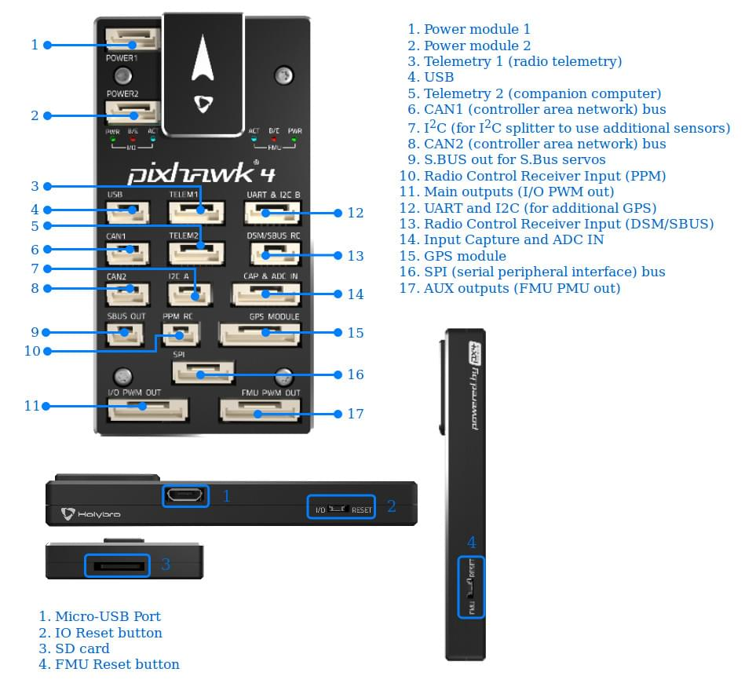

# Pixhawk 4

*Pixhawk 4*&reg; is an advanced autopilot designed and made in collaboration with Holybro&reg; and the PX4 team. It is optimized to run PX4 version 1.7, suitable for academic and commercial developers.

It is based on the [Pixhawk-project](https://pixhawk.org/) **FMUv5** open hardware design and runs PX4 on the [NuttX](http://nuttx.org) OS.

 

## 总览

* 主 FMU 处理器：STM32F765 
  * 32 位 Arm® Cortex®-M7，216MHz，2MB 储存，512KB RAM
* IO 处理器：STM32F100 
  * 32 位 Arm® Cortex®-M3，24MHz，8KB SRAM
* 板载传感器： 
  * Accel/Gyro: ICM-20689
  * Accel/Gyro: BMI055
  * Magnetometer: IST8310
  * Barometer: MS5611
* GPS: ublox Neo-M8N GPS/GLONASS receiver; integrated magnetometer IST8310
* 接口： 
  * 8-16 PWM outputs (8 from IO, 8 from FMU)
  * 3 dedicated PWM/Capture inputs on FMU
  * Dedicated R/C input for CPPM
  * Dedicated R/C input for Spektrum / DSM and S.Bus with analog / PWM RSSI input
  * Dedicated S.Bus servo output
  * 5 general purpose serial ports
  * 3 路 I2C 接口
  * 4 路 SPI 总线
  * Up to 2 CANBuses for dual CAN with serial ESC
  * Analog inputs for voltage / current of 2 batteries
* 电源系统： 
  * 电源模块输出：4.9~5.5V
  * USB 电源输入：4.75~5.25V
  * 舵机轨道输入：0~36V
* 重量和尺寸： 
  * 重量：15.8g
  * 尺寸：44x84x12mm
* 其它特性： 
  * 工作温度：-40 ~ 85°C

Additional information can be found in the [Pixhawk 4 Technical Data Sheet](https://github.com/PX4/px4_user_guide/raw/master/assets/flight_controller/pixhawk4/pixhawk4_technical_data_sheet.pdf).

## 采购

Order from [Holybro](https://shop.holybro.com/pixhawk-4beta-launch_p1089.html).

## 连接器

> **Warning** The **DSM/SBUS RC** and **PPM RC** ports are for RC receivers only. These are powered! NEVER connect any servos, power supplies or batteries (or to any connected receiver).

## 针脚定义

Download *Pixhawk 4* pinouts from [here](http://www.holybro.com/manual/Pixhawk4-Pinouts.pdf).

## 尺寸

## 额定电压

*Pixhawk 4* can be triple-redundant on the power supply if three power sources are supplied. 三个供电轨道为：**POWER1**，**POWER2** 和 **USB**。

> **Note** The output power rails **FMU PWM OUT** and **I/O PWM OUT** (0V to 36V) do not power the flight controller board (and are not powered by it). You must supply power to one of **POWER1**, **POWER2** or **USB** or the board will be unpowered.

**正常运行最大额定值**

在这些条件下，所有电源将按此顺序用于为系统供电：

1. **POWER1** and **POWER2** inputs (4.9V to 5.5V)
2. **USB** input (4.75V to 5.25V)

**Absolute Maximum Ratings**

Under these conditions the system will not draw any power (will not be operational), but will remain intact.

1. **POWER1** and **POWER2** inputs (operational range 4.1V to 5.7V, 0V to 10V undamaged)
2. **USB** input (operational range 4.1V to 5.7V, 0V to 6V undamaged)
3. Servo input: VDD_SERVO pin of **FMU PWM OUT** and **I/O PWM OUT** (0V to 42V undamaged)

## 组装 / 设置

The [Pixhawk 4 Wiring Quick Start](../assembly/quick_start_pixhawk4.md) provides instructions on how to assemble required/important peripherals including GPS, Power Management Board etc.

## 编译固件

> **Tip** Most users will not need to build this firmware! It is pre-built and automatically installed by *QGroundControl* when appropriate hardware is connected.

To [build PX4](https://dev.px4.io/en/setup/building_px4.html) for this target:

    make px4_fmu-v5_default
    

## 调试接口

The system's serial console and SWD interface runs on the **FMU Debug** port, while the I/O console and SWD interface can be accessed via **I/O Debug** port. In order to access these ports, the user must remove the *Pixhawk 4* casing.

Both ports have standard serial pinout and can be connected to a standard FTDI cable (3.3V, but it's 5V tolerant) or a [Dronecode probe](https://kb.zubax.com/display/MAINKB/Dronecode+Probe+documentation). The pinout uses the standard Dronecode debug connector pinout. Please refer to the [wiring](https://dev.px4.io/en/debug/system_console.html) page for details of how to wire up this port.

## 外部设备

* [数字空速传感器](https://drotek.com/shop/en/home/848-sdp3x-airspeed-sensor-kit-sdp33.html)
* [数传电台模块](../telemetry/README.md)
* [测距仪/距离传感器](../sensor/rangefinders.md)

## 支持的平台 / 机身

Any multicopter / airplane / rover or boat that can be controlled with normal RC servos or Futaba S-Bus servos. The complete set of supported configurations can be seen in the [Airframes Reference](../airframes/airframe_reference.md).

## 更多信息

* [Pixhawk 4 技术数据表](https://github.com/PX4/px4_user_guide/raw/master/assets/flight_controller/pixhawk4/pixhawk4_technical_data_sheet.pdf)
* [FMUv5 参考设计 pinout](https://docs.google.com/spreadsheets/d/1-n0__BYDedQrc_2NHqBenG1DNepAgnHpSGglke-QQwY/edit#gid=912976165)