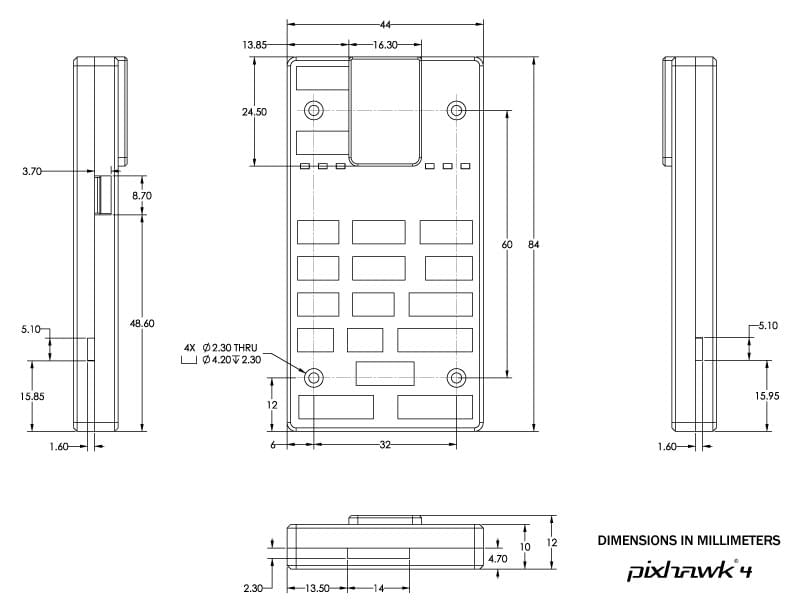

# Pixhawk 4

*Pixhawk 4*&reg; 是一款高端自驾仪，由 Holybro&reg; 与 PX4 团队联合设计打造。 It is optimized to run PX4 v1.7 and later, and is suitable for academic and commercial developers.

它基于 [Pixhawk 项目](https://pixhawk.org/) 的 **FMUv5** 开放硬件设计，在 [NuttX](http://nuttx.org) 操作系统上运行 PX4。

 

> **Tip** This autopilot is [supported](../flight_controller/autopilot_pixhawk_standard.md) by the PX4 maintenance and test teams.

## 总览

* 主 FMU 处理器：STM32F765 
  * 32 位 Arm® Cortex®-M7，216MHz，2MB 储存，512KB RAM
* IO 处理器：STM32F100 
  * 32 位 Arm® Cortex®-M3，24MHz，8KB SRAM
* 板载传感器： 
  * 加速度计 / 陀螺仪：ICM-20689
  * 加速度计 / 陀螺仪：BMI055
  * 磁力计：IST8310
  * 气压计：MS5611
* GPS：ublox Neo-M8N GPS/GLONASS 接收器；集成磁力计 IST8310
* 接口： 
  * 8-16 路PWM输出（8路来自 IO，8路来自 FMU）
  * FMU 上有 3 路专用 PWM/Capture 输入
  * 用于 CPPM 的专用遥控输入
  * 用于 Spektrum / DSM 与 有模拟 / PWM RSSI 的 S.Bus 的专用遥控输入
  * 专用 S.Bus 舵机输出
  * 5 个通用串行接口
  * 3 个 I2C 接口
  * 4 路 SPI 总线
  * 多达 2 路 CAN 总线用于带串口的电调
  * 两路电池电压 / 电流模拟输入口
* 电源系统： 
  * 电源模块输出：4.9~5.5V
  * USB 电源输入：4.75~5.25V
  * 舵机轨道输入：0~36V
* 重量和尺寸： 
  * 重量：15.8g
  * 尺寸：44x84x12mm
* 其它特性： 
  * 工作温度：-40 ~ 85°C

更多信息可以在 [Pixhawk 4 技术数据表](https://github.com/PX4/px4_user_guide/raw/master/assets/flight_controller/pixhawk4/pixhawk4_technical_data_sheet.pdf)中找到。

## 采购

中国大陆用户请从官方代理商 [思动智能](https://thone.io) 的淘宝店 [地面售货站](https://item.taobao.com/item.htm?id=569286312095) 购买。境外用户从 [Holybro](https://shop.holybro.com/pixhawk-4beta-launch_p1089.html) 购买。

## 连接器

> **Warning** The **DSM/SBUS RC** and **PPM RC** ports are for RC receivers only. These are powered! NEVER connect any servos, power supplies or batteries (or to any connected receiver).

## 针脚定义

[点此下载](http://www.holybro.com/manual/Pixhawk4-Pinouts.pdf) *Pixhawk 4* 的针脚定义。

> **Note** Connector pin assignments are left to right (i.e. Pin 1 is the left-most pin). The exception is the [debug port(s)](#debug_port) (pin 1 is the right-most, as shown below).

## Serial Port Mapping

| UART   | Device     | Port                  |
| ------ | ---------- | --------------------- |
| UART1  | /dev/ttyS0 | GPS                   |
| USART2 | /dev/ttyS1 | TELEM1 (flow control) |
| USART3 | /dev/ttyS2 | TELEM2 (flow control) |
| UART4  | /dev/ttyS3 | TELEM4                |
| USART6 | /dev/ttyS4 | RC SBUS               |
| UART7  | /dev/ttyS5 | Debug Console         |
| UART8  | /dev/ttyS6 | PX4IO                 |

## Dimensions

## Voltage Ratings

*Pixhawk 4* 可以实现电源三度冗余。 三个供电轨道为：**POWER1**，**POWER2** 和 **USB**。

> **Note** The output power rails **FMU PWM OUT** and **I/O PWM OUT** (0V to 36V) do not power the flight controller board (and are not powered by it). You must supply power to one of **POWER1**, **POWER2** or **USB** or the board will be unpowered.

**正常运行最大额定值**

在以下条件下，所有电源将按此顺序用于为系统供电：

1. **POWER1** 和 **POWER2** 输入电压（4.9 v 至 5.5 v）
2. **USB** 输入电压（4.75 v 至 5.25 v）

**绝对最大额定值**

在以下条件下，系统不会获得任何供电（不可运行），但不会损坏。

1. **POWER1** 与 **POWER2** 输入（可运行范围 4.1V 至 5.7V，0V 至 10V 不会损坏）
2. **USB** 输入（可运行范围 4.1V 至 5.7V，0V 至 6V 不会损坏）
3. 舵机输入：**FMU PWM OUT** 和 **I/O PWM OUT** 的 VDD_SERVO 针脚 （0V 至 42V 不会损坏）

## Assembly/Setup

[Pixhawk 4 快速接线指南](../assembly/quick_start_pixhawk4.md) 提供如何组装所需的/重要的外设包含 GPS，电源管理板等的说明。

## Building Firmware

> **Tip** Most users will not need to build this firmware! It is pre-built and automatically installed by *QGroundControl* when appropriate hardware is connected.

为此目标 [构建(build) PX4](https://dev.px4.io/master/en/setup/building_px4.html)：

    make px4_fmu-v5_default
    

## Debug Port {#debug_port}

The [PX4 System Console](https://dev.px4.io/master/en/debug/system_console.html) and [SWD interface](http://dev.px4.io/master/en/debug/swd_debug.html) run on the **FMU Debug** port, while the I/O console and SWD interface can be accessed via **I/O Debug** port. 为了能访问这些接口，用户需要移除 *Pixhawk 4* 的外壳。

The pinout uses the standard [Pixhawk debug connector pinout](https://pixhawk.org/pixhawk-connector-standard/#dronecode_debug). For wiring information see:

* [System Console > Pixhawk Debug Port](https://dev.px4.io/master/en/debug/system_console.html#pixhawk_debug_port) (PX4 Developer Guide)

## Peripherals

* [数字空速传感器](https://drotek.com/shop/en/home/848-sdp3x-airspeed-sensor-kit-sdp33.html)
* [数传电台模块](../telemetry/README.md)
* [测距仪/距离传感器](../sensor/rangefinders.md)

## Supported Platforms / Airframes

Any multicopter / airplane / rover or boat that can be controlled with normal RC servos or Futaba S-Bus servos. The complete set of supported configurations can be seen in the [Airframes Reference](../airframes/airframe_reference.md).

## Further info

* [Pixhawk 4 Technical Data Sheet](https://github.com/PX4/px4_user_guide/raw/master/assets/flight_controller/pixhawk4/pixhawk4_technical_data_sheet.pdf)
* [FMUv5 reference design pinout](https://docs.google.com/spreadsheets/d/1-n0__BYDedQrc_2NHqBenG1DNepAgnHpSGglke-QQwY/edit#gid=912976165).
* [Pixhawk 4 Wiring QuickStart](../assembly/quick_start_pixhawk4.md)
* [Pixhawk 4 Pinouts](http://www.holybro.com/manual/Pixhawk4-Pinouts.pdf) (Holybro)
* [Pixhawk 4 Quick Start Guide (Holybro)](http://www.holybro.com/manual/Pixhawk4-quickstartguide.pdf)