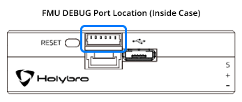

# Pixhawk 4 Mini

*Pixhawk&reg; 4 Mini* 自动驾驶仪是为想办法利用 *Pixhawk 4* 的力量，但是使用的是较小的无人机的工程师和爱好者而设计的。 *Pixhawk 4 Mini* 使用 *Pixhawk 4* 相同的 FMU 处理器与储存资源，同时砍掉了通常不会使用的接口。 这使得 *Pixhawk 4 Mini* 足够小，可以装到 250mm 的穿越机上。

*Pixhawk 4 Mini* 由 Holybro&reg; 和 Auterion&reg; 合作设计开发。 它基于 [Pixhawk](https://pixhawk.org/) **FMUv5** 设计标准，并为 PX4 飞行控制软件优化。 This allows the *Pixhawk 4 Mini* to be small enough to fit in a 250mm racer drone.

*Pixhawk 4 Mini* was designed and developed in collaboration with Holybro&reg; and Auterion&reg;. It is based on the [Pixhawk](https://pixhawk.org/) **FMUv5** design standard and is optimized to run PX4 flight control software.

:::tip
This autopilot is [supported](../flight_controller/autopilot_pixhawk_standard.md) by the PX4 maintenance and test teams.
:::

## 概览

* 主 FMU 处理器：STM32F765 
  * 32 位 Arm® Cortex®-M7，216MHz，2MB 储存，512KB RAM
* 内置传感器： 
  * 加速度计 / 陀螺仪：ICM-20689
  * 加速度计 / 陀螺仪：BMI055
  * 磁力计：IST8310
  * 气压计：MS5611
* GPS：ublox Neo-M8N GPS/GLONASS 接收器；集成磁力计 IST8310
* 接口： 
  * 8 路 PWM 输出
  * FMU 上有 4 路专用 PWM/Capture 输入
  * 用于 CPPM 的专用遥控输入
  * 用于 Spektrum / DSM 与 有模拟 / PWM RSSI 的 S.Bus 的专用遥控输入
  * 3个通用串行口
  * 2 路 I2C 总线
  * 3 路 SPI 总线
  * 1 路 CAN 总线用于 CAN 电调
  * 电池电压 / 电流模拟输入口
  * 2 个模拟输入接口
* 电源系统： 
  * Power 接口输入：4.75~5.5V
  * USB 电源输入：4.75~5.25V
  * 舵机轨道输入：0~24V
  * 最大电流感应：120A
* 重量和尺寸: 
  * Weight: 37.2g
  * Dimensions: 38x55x15.5mm
* 其它特性: 
  * 工作温度：-40 ~ 85°C

Additional information can be found in the [*Pixhawk 4 Mini* Technical Data Sheet](https://github.com/PX4/px4_user_guide/raw/master/assets/flight_controller/pixhawk4mini/pixhawk4mini_technical_data_sheet.pdf).

## 采购

[在此下载](https://github.com/PX4/px4_user_guide/raw/master/assets/flight_controller/pixhawk4mini/pixhawk4mini_pinouts.pdf) *Pixhawk 4 Mini* 的 pinout。

## 接口

:::warning
The **RC IN** and **PPM** ports are for RC receivers only. These are powered! NEVER connect any servos, power supplies or batteries (or to any connected receiver).
:::

## 针脚定义

Download *Pixhawk 4 Mini* pinouts from [here](https://github.com/PX4/px4_user_guide/raw/master/assets/flight_controller/pixhawk4mini/pixhawk4mini_pinouts.pdf).

## 尺寸

## 额定电压

*Pixhawk 4 Mini* can have power supply redundancy — if two power sources are supplied. The power rails are: **POWER** and **USB**.

:::note
The output power rail of **MAIN OUT** does not power the flight controller board (and is not powered by it). You must [supply power](../assembly/quick_start_pixhawk4_mini.md#power) to one of **POWER** or **USB** or the board will be unpowered.
:::

**Normal Operation Maximum Ratings**

为此目标 [编译 PX4](../dev_setup/building_px4.md)：

1. **POWER**（4.75V 至 5.5V）
2. **USB** 输入电压（4.75 v 至 5.25 v）

**Absolute Maximum Ratings**

Under these conditions the system will remain intact.

1. **POWER** 输入（0V 至 6V 不会损坏）
2. **USB** 输入（0V 至 6V 不会损坏）
3. 舵机输入：**MAIN OUT** 的 VDD_SERVO 针脚 （0V 至 24V 不会损坏）

## 组装 / 设置

The [*Pixhawk 4 Mini* Wiring Quick Start](../assembly/quick_start_pixhawk4_mini.md) provides instructions on how to assemble required/important peripherals including GPS, Power Management Board, etc.

## 编译固件

电机和舵机按照 [机架参考](../airframes/airframe_reference.md) 中为您的飞机指定的顺序连接至 **MAIN OUT** 端口。 本参考列出了所有支持的空中和地面机架的接口和电机/舵机的映射关系（如果你的机架没有在参考列表里，你可以使用对应类型的“通用（generic）”机架）。
:::

To [build PX4](../dev_setup/building_px4.md) for this target:

    make px4_fmu-v5_default
    

## 调试接口

The [PX4 System Console](../debug/system_console.md) and [SWD interface](../debug/swd_debug.md) run on the **FMU Debug** port. In order to access these ports, the user must remove the *Pixhawk 4 Mini* casing.

The port has a standard serial pinout and can be connected to a standard FTDI cable (3.3V, but it's 5V tolerant) or a [Dronecode probe](https://kb.zubax.com/display/MAINKB/Dronecode+Probe+documentation). The pinout uses the standard [Pixhawk debug connector](https://pixhawk.org/pixhawk-connector-standard/#dronecode_debug) pinout. Please refer to the [wiring](../debug/system_console.md) page for details of how to wire up this port.

## Serial Port Mapping

| UART   | 设备         | Port                                  |
| ------ | ---------- | ------------------------------------- |
| UART1  | /dev/ttyS0 | GPS                                   |
| USART2 | /dev/ttyS1 | TELEM1 (flow control)                 |
| USART3 | /dev/ttyS2 | TELEM2 (flow control)                 |
| UART4  | /dev/ttyS3 | TELEM4                                |
| USART6 | /dev/ttyS4 | TX is RC input from SBUS_RC connector |
| UART7  | /dev/ttyS5 | Debug Console                         |
| UART8  | /dev/ttyS6 | Not connected (no PX4IO)              |

<!-- Note: Got ports using https://github.com/PX4/px4_user_guide/pull/672#issuecomment-598198434 -->

## 外部设备

* [数字空速传感器](https://store-drotek.com/848-sdp3x-airspeed-sensor-kit-sdp33.html)
* [数传电台模块](../telemetry/README.md)
* [测距仪/距离传感器](../sensor/rangefinders.md)

## 支持的平台

Motors and servos are connected to the **MAIN OUT** ports in the order specified for your vehicle in the [Airframe Reference](../airframes/airframe_reference.md). This reference lists the output port to motor/servo mapping for all supported air and ground frames (if your frame is not listed in the reference then use a "generic" airframe of the correct type).

:::warning
*Pixhawk 4 Mini* does not have AUX ports. The board cannot be used with frames that require more than 8 ports or which use AUX ports for motors or control surfaces. It can be used for airframes that use AUX for non-essential peripherals (e.g. "feed-through of RC AUX1 channel").
:::

## 更多信息

- [*Pixhawk 4 Mini* 技术数据表](https://github.com/PX4/px4_user_guide/raw/master/assets/flight_controller/pixhawk4mini/pixhawk4mini_technical_data_sheet.pdf)
- [FMUv5 参考设计 pinout](https://docs.google.com/spreadsheets/d/1-n0__BYDedQrc_2NHqBenG1DNepAgnHpSGglke-QQwY/edit#gid=912976165)