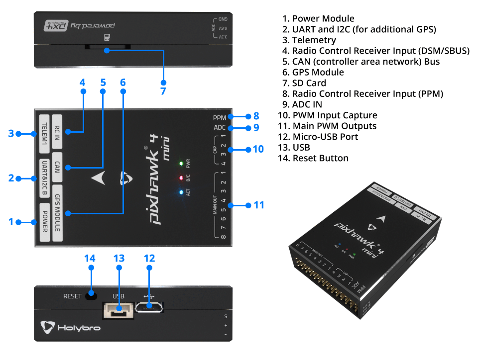

# Pixhawk 4 Mini

*Pixhawk&reg; 4 Mini* 自动驾驶仪是为想办法利用 *Pixhawk 4* 的力量，但是使用的是较小的无人机的工程师和爱好者而设计的。 *Pixhawk 4 Mini* 使用 *Pixhawk 4* 相同的 FMU 处理器与储存资源，同时砍掉了通常不会使用的接口。 这使得 *Pixhawk 4 Mini* 足够小，可以装到 250mm 的穿越机上。

*Pixhawk 4 Mini* 由 Holybro&reg; 和 Auterion&reg; 合作设计开发。 它基于 [Pixhawk](https://pixhawk.org/) **FMUv5** 设计标准，并为 PX4 飞行控制软件优化。

## 总览

* 主 FMU 处理器：STM32F765 
  * 32 位 Arm® Cortex®-M7，216MHz，2MB 储存，512KB RAM
* 内置传感器： 
  * 加速度计 / 陀螺仪：ICM-20689
  * 加速度计 / 陀螺仪：BMI055
  * 磁力计：IST8310
  * 气压计：MS5611
* GPS：ublox Neo-M8N GPS/GLONASS 接收器；集成磁力计 IST8310
* 接口： 
  * 8 路 PWM 输出
  * FMU 上有 4 路专用 PWM/Capture 输入
  * 用于 CPPM 的专用遥控输入
  * 用于 Spektrum / DSM 与 有模拟 / PWM RSSI 的 S.Bus 的专用遥控输入
  * 3个通用串行口
  * 2 路 I2C 总线
  * 3 路 SPI 总线
  * 1 路 CAN 总线用于 CAN 电调
  * 电池电压 / 电流模拟输入口
  * 2 个模拟输入接口
* 电源系统： 
  * Power 接口输入：4.75~5.5V
  * USB 电源输入：4.75~5.25V
  * 舵机轨道输入：0~24V
  * 最大电流感应：120A
* 重量和尺寸: 
  * 尺寸：38*55*15.5mm
* 其它特性: 
  * 工作温度：-40 ~ 85°C

更多信息可以在 [*Pixhawk 4 Mini* 技术数据表](https://github.com/PX4/px4_user_guide/raw/master/assets/flight_controller/pixhawk4mini/pixhawk4mini_technical_data_sheet.pdf)中找到。

## 采购

中国大陆用户请从官方代理商“思动智能”的淘宝店“地面售货站”购买。境外用户从 [Holybro](https://shop.holybro.com/pixhawk4-mini_p1120.html) 购买。

## 接口

> **Warning** **RC IN** 与 **PPM** 接口仅可用于遥控接收机。 这两个接口已经供电！ 不要把舵机、电源、电池（或是连接了这些设备的接收机）连接到上面。

## 针脚定义

[在此下载](https://github.com/PX4/px4_user_guide/raw/master/assets/flight_controller/pixhawk4mini/pixhawk4mini_pinouts.pdf) *Pixhawk 4 Mini* 的 pinout。

## 尺寸

## 额定电压

*Pixhawk 4 Mini* 可以有电源冗余 — 如果提供了两个电源。 供电轨道为：**POWER** 和 **USB**。

> **Note** **MAIN OUT** 电源输出轨并不会为飞控板供电（而且不由其供电）。 You must [supply power](../assembly/quick_start_pixhawk4_mini.md#voltage-ratings) to one of **POWER** or **USB** or the board will be unpowered.

**正常运行最大额定值**

在以下条件下，所有电源将按此顺序用于为系统供电：

1. **POWER**（4.75V 至 5.5V）
2. **USB** 输入电压（4.75 v 至 5.25 v）

**绝对最大额定值**

在这些情况下，系统将保持完整。

1. **POWER** 输入（0V 至 6V 不会损坏）
2. **USB** 输入（0V 至 6V 不会损坏）
3. 舵机输入：**MAIN OUT** 的 VDD_SERVO 针脚 （0V 至 24V 不会损坏）

## 组装 / 设置

[*Pixhawk 4 Mini* 快速接线指南](../assembly/quick_start_pixhawk4_mini.md) 提供如何组装所需的/重要的外设包含 GPS，电源管理板等的说明。

## 编译固件

> **Tip** 大多数用户不需要构建此固件！ 它是预构建的，并在连接适当的硬件时由 *QGroundControl* 自动安装。

为此目标 [编译 PX4](https://dev.px4.io/en/setup/building_px4.html)：

    make px4_fmu-v5_default
    

## 调试接口

系统的串行控制台和SWD接口在** FMU Debug **端口上运行。 为了能访问这些接口，用户需要移除 *Pixhawk 4 Mini* 的外壳。

端口使用标准的串口针脚，可以连接到标准的 FTDI 连接线上（3.3V，但它有5V 耐受性），或连接到 [Dronecode probe](https://kb.zubax.com/display/MAINKB/Dronecode+Probe+documentation) 上。 针脚定义使用标准的 Dronecode 调试连接器针脚定义。 有关如何连接此端口的详细信息，请参阅 [接线](https://dev.px4.io/en/debug/system_console.html) 页面。

## 外部设备

* [数字空速传感器](https://drotek.com/shop/en/home/848-sdp3x-airspeed-sensor-kit-sdp33.html)
* [数传电台模块](../telemetry/README.md)
* [测距仪/距离传感器](../sensor/rangefinders.md)

## 支持的平台

电机和舵机按照 [机架参考](../airframes/airframe_reference.md) 中为您的飞机指定的顺序连接至 **MAIN OUT** 端口。 本参考列出了所有支持的空中和地面机架的接口和电机/舵机的映射关系（如果你的机架没有在参考列表里，你可以使用对应类型的“通用（generic）”机架）。

> **Warning** *Pixhawk 4 Mini* 没有 AUX 接口。 该飞控不能用于接口多余 8 个或使用 AUX 接口的电机或舵面的机架。 它可用于 AUX 分配给了非必要外设的机架（如遥控AUX1直通）。

## 更多信息

* [*Pixhawk 4 Mini* 技术数据表](https://github.com/PX4/px4_user_guide/raw/master/assets/flight_controller/pixhawk4mini/pixhawk4mini_technical_data_sheet.pdf)
* [FMUv5 参考设计 pinout](https://docs.google.com/spreadsheets/d/1-n0__BYDedQrc_2NHqBenG1DNepAgnHpSGglke-QQwY/edit#gid=912976165)