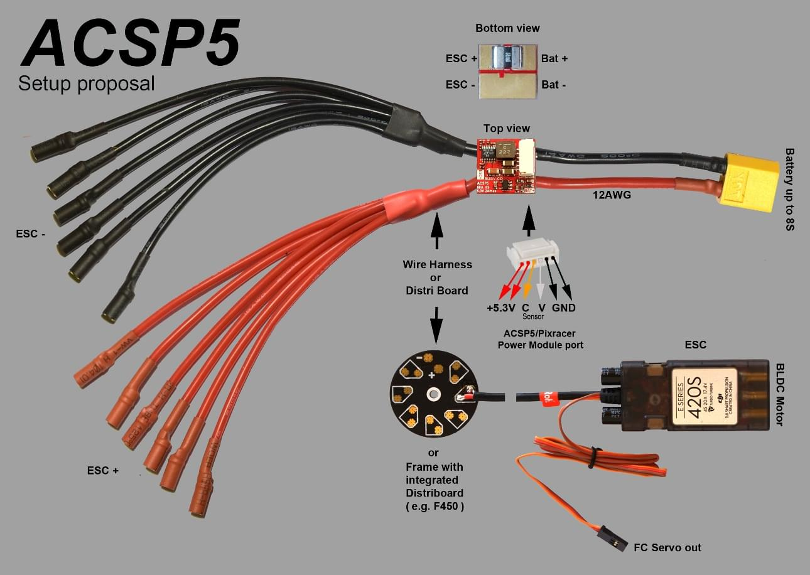

# mRo Pixracer

:::warning PX4 does not manufacture this (or any) autopilot. Contact the [manufacturer](https://store.mrobotics.io/) for hardware support or compliance issues.
:::

The Pixhawk&reg; XRacer board family is optimized for small racing quads and planes. In contrast to [Pixfalcon](../flight_controller/pixfalcon.md) and [Pixhawk](../flight_controller/pixhawk.md) it has in-built Wifi, new sensors, convenient full servo headers, CAN and supports 2M flash.

:::tip
This autopilot is [supported](../flight_controller/autopilot_pixhawk_standard.md) by the PX4 maintenance and test teams.
:::

## 主要特性

* Main System-on-Chip: [STM32F427VIT6 rev.3](http://www.st.com/web/en/catalog/mmc/FM141/SC1169/SS1577/LN1789) 
  * CPU: 180 MHz ARM Cortex&reg; M4 with single-precision FPU
  * RAM: 256 KB SRAM (L1)
* Standard FPV form factor: 36x36 mm with standard 30.5 mm hole pattern
* Invensense&reg; ICM-20608 Accel / Gyro (4 KHz) / MPU9250 Accel / Gyro / Mag (4 KHz)
* HMC5983 magnetometer with temperature compensation
* Measurement Specialties MS5611 barometer
* JST GH connectors
* microSD (logging)
* Futaba S.BUS and S.BUS2 / Spektrum DSM2 and DSMX / Graupner SUMD / PPM input / Yuneec ST24
* FrSky&reg; telemetry port
* OneShot PWM out (configurable)
* Optional: Safety switch and buzzer

## 在哪里买

Pixracer is available from the [mRobotics.io](https://store.mrobotics.io/mRo-PixRacer-R15-Official-p/auav-pxrcr-r15-mr.htm).

Accessories include:

* [数字空速传感器](https://hobbyking.com/en_us/hkpilot-32-digital-air-speed-sensor-and-pitot-tube-set.html)
* [HKPilot Transceiver Telemetry Radio Set V2 (915Mhz - US Telemetry)](https://hobbyking.com/en_us/hkpilot-transceiver-telemetry-radio-set-v2-915mhz.html)
* [Hobbyking&reg; OSD + EU Telemetry (433 MHz)](https://hobbyking.com/en_us/micro-hkpilot-telemetry-radio-module-with-on-screen-display-osd-unit-433mhz.html)

## Kit

The Pixracer is designed to use a separate avionics power supply. This is necessary to avoid current surges from motors or ESCs to flow back to the flight controller and disturb its delicate sensors.

* Power module (with voltage and current sensing)
* I2C splitter (supporting AUAV, Hobbyking and 3DR&reg; peripherals)
* Cable kit for all common peripherals

## Wifi (no USB required)

One of the main features of the board is its ability to use Wifi for flashing new firmware, system setup and in-flight telemetry. This frees it of the need of any desktop system.

::note ToDo Setup and telemetry are already available, firmware upgrade is already supported by the default bootloader but not yet enabled
:::

* [ESP8266 Wifi](../telemetry/esp8266_wifi_module.md)
* [Custom ESP8266 MAVLink firmware](https://github.com/dogmaphobic/mavesp8266)

## Wiring Diagrams

## 连接器

All connectors follow the [Pixhawk connector standard](https://pixhawk.org/pixhawk-connector-standard/). Unless noted otherwise all connectors are JST GH.

## 针脚定义

#### TELEM1, TELEM2+OSD ports

| 针脚   | 信号        | 电压    |
| ---- | --------- | ----- |
| 2    | VCC       | +5V   |
| 2    | TX (OUT)  | +3.3V |
| 3    | RX (IN)   | +3.3V |
| 4（黑） | CTS (IN)  | +3.3V |
| 6    | RTS (OUT) | +3.3V |
| 6    | GND       | GND   |

#### GPS 接口

| 针脚   | 信号       | 电压    |
| ---- | -------- | ----- |
| 1（红） | VCC      | +5V   |
| 2（黑） | TX (OUT) | +3.3V |
| 3    | RX (IN)  | +3.3V |
| 4（黑） | I2C1 SCL | +3.3V |
| 6    | I2C1 SDA | +3.3V |
| 6    | GND      | GND   |

#### FrSky Telemetry / SERIAL4

| 针脚   | 信号       | 电压    |
| ---- | -------- | ----- |
| 2    | VCC      | +5V   |
| 2    | TX (OUT) | +3.3V |
| 3    | RX (IN)  | +3.3V |
| 4（黑） | GND      | GND   |

#### RC Input (accepts PPM / S.BUS / Spektrum / SUMD / ST24)

| 针脚   | 信号      | 电压    |
| ---- | ------- | ----- |
| 2    | VCC     | +5V   |
| 2    | RC IN   | +3.3V |
| 3    | RSSI IN | +3.3V |
| 4（黑） | VDD 3V3 | +3.3V |
| 6    | GND     | GND   |

#### CAN

| 针脚   | 信号    | 电压   |
| ---- | ----- | ---- |
| 2    | VCC   | +5V  |
| 2    | CAN_H | +12V |
| 3    | CAN_L | +12V |
| 4（黑） | GND   | GND  |

#### POWER

| 针脚   | 信号  | 电压    |
| ---- | --- | ----- |
| 2    | VCC | +5V   |
| 2    | VCC | +5V   |
| 3    | 电流  | +3.3V |
| 4（黑） | 电压  | +3.3V |
| 6    | GND | GND   |
| 6    | GND | GND   |

#### SWITCH

| 针脚   | 信号               | 电压    |
| ---- | ---------------- | ----- |
| 2    | SAFETY           | GND   |
| 2    | !IO_LED_SAFETY | GND   |
| 3    | VCC              | +3.3V |
| 4（黑） | BUZZER-          | -     |
| 6    | BUZZER+          | -     |

#### Debug调试端口

This is a [Pixhawk Debug Port](https://pixhawk.org/pixhawk-connector-standard/#dronecode_debug) (JST SM06B connector).

| 针脚   | 信号               | 电压    |
| ---- | ---------------- | ----- |
| 2    | VCC TARGET SHIFT | +3.3V |
| 2    | UART7 Tx         | +3.3V |
| 3    | UART7 Rx         | +3.3V |
| 4（黑） | SWDIO            | +3.3V |
| 6    | SWCLK            | +3.3V |
| 6    | GND              | GND   |

For information about wiring and using this port see:

* [PX4 System Console](../debug/system_console.md#pixhawk_debug_port) (Note, the FMU console maps to UART7).
* [SWD (JTAG) Hardware Debugging Interface](../debug/swd_debug.md#pixhawk_debug_port_6_pin_sh)

## Serial Port Mapping

| UART   | 设备         | Port                  |
| ------ | ---------- | --------------------- |
| UART1  | /dev/ttyS0 | WiFi (ESP8266)        |
| USART2 | /dev/ttyS1 | TELEM1 (flow control) |
| USART3 | /dev/ttyS2 | TELEM2 (flow control) |
| UART4  |            |                       |
| UART7  | CONSOLE    |                       |
| UART8  | SERIAL4    |                       |

<!-- Note: Got ports using https://github.com/PX4/px4_user_guide/pull/672#issuecomment-598198434 -->

## 原理图

The reference is provided as: [Altium Design Files](https://github.com/AUAV-OpenSource/FMUv4-PixRacer)

The following PDF files are provided for *convenience only*:

* [pixracer-rc12-12-06-2015-1330.pdf](https://github.com/PX4/px4_user_guide/raw/master/assets/flight_controller/pixracer/pixracer-rc12-12-06-2015-1330.pdf)
* [pixracer-r14.pdf](https://github.com/PX4/px4_user_guide/raw/master/assets/flight_controller/pixracer/pixracer-r14.pdf) - R14 or RC14 is printed next to the SDCard socket

## 编译固件

:::tip
Most users will not need to build this firmware! It is pre-built and automatically installed by *QGroundControl* when appropriate hardware is connected.
:::

To [build PX4](../dev_setup/building_px4.md) for this target:

    make px4_fmu-v4_default
    

## 鸣谢

This design was created by Nick Arsov and Phillip Kocmoud and architected by Lorenz Meier, David Sidrane and Leonard Hall.