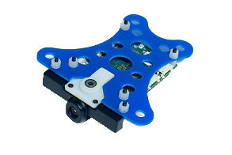

# 骁龙飞控

骁龙Snapdragon Flight平台是高端的自动驾驶仪 / 机载计算机, 其板载的DSP跑QuRT实时操作系统和PX4飞控代码 ，使用[DSPAL API](https://github.com/ATLFlight/dspal)实现POSIX兼容与.与[Pixhawk](../flight_controller/pixhawk.md) 相比,多添加了一个摄像头,WiFi及其更高端的处理能力和不同的IO接口。

关于骁龙平台飞行的更多信息在[Snapdragon-Flight-Details](https://www.intrinsyc.com/qualcomm-snapdragon-flight-details/)



## 摘要

-    片上系统: [骁龙 801](https://www.qualcomm.com/products/snapdragon/processors/801)
            - CPU: Quad-core 2.26 GHz Krait
        - DSP: Hexagon DSP (QDSP6 V5A) – 801 MHz+256KL2 (运行飞控代码)
        - GPU: Qualcomm® Adreno™ 330 GPU
        - RAM: 2GB LPDDR3 PoP @931 MHz
-    内存: 32GB eMMC Flash
            - 摄像头: 索尼 IMX135 on Liteon Module 12P1BAD11
        - 4k@30fps 3840×2160 视频流,H.264编码,100Mbits存储(SD卡)速度 (1080p/60并行FPV), 720p FPV
-    光流: Omnivision OV7251 on Sunny Module MD102A-200
            - 640x480 @ 30/60/90 fps
-    Wifi: Qualcomm® VIVE™ 1-stream 802.11n/ac with MU-MIMO † Integrated digital core
            - BT/WiFi: BT 4.0 and 2G/5G WiFi via QCA6234
        - 802.11n, 2×2 MIMO with 2 uCOAX connectors on-board for connection to external antenna
-    GPS: Telit Jupiter SE868 V2 module (建议使用一个外部的UBLOX模块)
            - uCOAX 连接器用于连接到外部 GPS
        - CSR SiRFstarV @ 5Hz via UART
-    加速度计 / 陀螺仪 /磁力计: Invensense公司的MPU-9250 9-轴传感器, 3x3mmQFN封装, 接在 SPI1
            - 气压计: Bosch公司的 BMP280 气压传感器, 接在 I2C3
        - 电压: 直流5V,通过APM电源模块降到5V,支持2~6S
       - 购买链接: [Intrinsyc商店](http://shop.intrinsyc.com/products/snapdragon-flight-dev-kit)

## 接口

-     一个USB 3.0 高速口 (micro-A/B)
-     SD 卡插槽
     -云台接口 (PWB/GND/BLSP)
      -     电调接口 (2W UART)
      -     I2C
      -     60针高速的Samtec QSH-030-01-L-D-A-K扩展连接器
        - 2x BLSP ([BAM 低速外设](http://www.inforcecomputing.com/public_docs/BLSPs_on_Inforce_6540_6501_Snapdragon_805.pdf))
-     USB

## 引脚接口

> **警告** 尽管晓龙使用 DF13 连接器,引脚还是有别于Pixhawk。


### WiFi

- WLAN0, WLAN1 (+BT 4.0): U.FL connector: [Taoglas 胶粘剂的天线  (DigiKey公司)](http://www.digikey.com/product-detail/en/FXP840.07.0055B/931-1222-ND/3877414)

### 连接器

默认的串口引脚映射如下︰

| 设备               | 描述              |
| ---------------- | --------------- |
| ```/dev/tty-1``` | J15 (靠近USB)     |
| ```/dev/tty-2``` | J13 (靠近电源模块连接口) |
| ```/dev/tty-3``` | J12 (靠近J13)     |
| ```/dev/tty-4``` | J9 (靠近J15)      |

若用户需要自定UART的引脚,可以通过创建一个名为"blsp.config"文件,并通过adb push命令上传到 ```/usr/share/data/adsp```.
例如,"blsp.config"内容如下:

tty-1 bam-9 2-wire 
tty-2 bam-8 2-wire 
tty-3 bam-6 2-wire 
tty-4 bam-2 2-wire 

该文件表明tty-1映射到串口9,即下方的J15连接器.必须确保每行以"2-wire"结尾,如果没有,将默认使用4线的UART,需要额外的CTS,RTS来做硬件流控制.如想使用硬件流控制,则如J9的两个I2C引脚可被配置为CTS,RTS.

#### J9 / GPS

| Pin  | 2-wire UART + I2C | SPI       | Comment       |
| ---- | ----------------- | --------- | ------------- |
| 1    | 3.3V              | 3.3V      | 3.3V          |
| 2    | UART2_TX          | SPI2_MOSI | Output (3.3V) |
| 3    | UART2_RX          | SPI2_MISO | Input (3.3V)  |
| 4    | I2C2_SDA          | SPI2_CS   | (3.3V)        |
| 5    | GND               | GND       |               |
| 6    | I2C2_SCL          | SPI2_CLK  | (3.3V)        |

#### J12 /云台总线

| Pin  | 2-wire UART + GPIO | SPI       | Comment       |
| ---- | ------------------ | --------- | ------------- |
| 1    | 3.3V               | 3.3V      |               |
| 2    | UART8_TX           | SPI8_MOSI | Output (3.3V) |
| 3    | UART8_RX           | SPI8_MISO | Input (3.3V)  |
| 4    | APQ_GPIO_47        | SPI8_CS   | (3.3V)        |
| 5    | GND                | GND       |               |
| 6    | APQ_GPIO_48        | SPI8_CLK  | (3.3V)        |

#### J13 / 电调总线

| Pin  | 2-wire UART + GPIO | SPI       | Comment     |
| ---- | ------------------ | --------- | ----------- |
| 1    | 5V                 | 5V        |             |
| 2    | UART6_TX           | SPI6_MOSI | Output (5V) |
| 3    | UART6_RX           | SPI6_MISO | Input (5V)  |
| 4    | APQ_GPIO_29        | SPI6_CS   | (5V)        |
| 5    | GND                | GND       |             |
| 6    | APQ_GPIO_30        | SPI6_CLK  | (5V)        |

#### J14 / 电源

| Pin  | Signal   | Comment     |
| ---- | -------- | ----------- |
| 1    | 5V DC    | Power input |
| 2    | GND      |             |
| 3    | I2C3_SCL | (5V)        |
| 4    | I2C3_SDA | (5V)        |

#### J15 / 无线接收器/传感器

| Pin  | 2-wire UART + I2C | SPI       | Comment |
| ---- | ----------------- | --------- | ------- |
| 1    | 3.3V              | 3.3V      |         |
| 2    | UART9_TX          | SPI9_MOSI | Output  |
| 3    | UART9_RX          | SPI9_MISO | Input   |
| 4    | I2C9_SDA          | SPI9_CS   |         |
| 5    | GND               | GND       |         |
| 6    | I2C9_SCL          | SPI9_CLK  |         |

## 外设

### GPS 接线

尽管3DR GPS要求5V输入，采用3.3V输入似乎也能很好地工作。 （内置的调节器MIC5205具有2.5V的最小工作电压）。

| Snapdragon J9 Pin | Signal   | Comment       | 3DR GPS 6pin/4pin | Pixfalcon GPS pin |
| ----------------- | -------- | ------------- | ----------------- | ----------------- |
| 1                 | 3.3V     | (3.3V)        | 1                 | 4                 |
| 2                 | UART2_TX | Output (3.3V) | 2/-               | 3                 |
| 3                 | UART2_RX | Input (3.3V)  | 3/-               | 2                 |
| 4                 | I2C2_SDA | (3.3V)        | -/3               | 5                 |
| 5                 | GND      |               | 6/-               | 1                 |
| 6                 | I2C2_SCL | (3.3V)        | -/2               | 6                 |

### PWM ESC Wiring

For controlling the motors, PWM ESCs can be used. Use connector J13 (next to power module connector) and the following wiring. ESC numbers is according to [here](../airframes/airframe_reference.md#quadrotor-x).

| Snapdragon J13 Pin | ESC  | Comment                   |
| ------------------ | ---- | ------------------------- |
| 1                  | -    | They already have voltage |
| 2                  | 1    | Signal (orange)           |
| 3                  | 2    | Signal (orange)           |
| 4                  | 3    | Signal (orange)           |
| 5                  | GND  | GND from all ESCs         |
| 6                  | 4    | Signal (orange)           |

### RC Wiring

| Snapdragon J12 Pin | Spektrum receiver (3 pins) |
| ------------------ | -------------------------- |
| 1                  | 3.3 V                      |
| 2                  | -                          |
| 3                  | Signal                     |
| 4                  | -                          |
| 5                  | GND                        |
| 6                  | -                          |

### Trone Range Finder Wiring

| Snapdragon J15 Pin | Trone (4 pins) |
| ------------------ | -------------- |
| 1                  | 1              |
| 2                  | -              |
| 3                  | -              |
| 4                  | 3              |
| 5                  | 4              |
| 6                  | 2              |

Details can be found [here](../flight_controller/snapdragon_flight_camera.md)

### UART to Pixracer / Pixfalcon Wiring

This interface is used to leverage the Pixracer / Pixfalcon as I/O interface board. Connect to `TELEM1` Pixfalcon and to `TELEM2` on Pixracer.

| Snapdragon J13 Pin | Signal      | Comment              | Pixfalcon / Pixracer Pin |
| ------------------ | ----------- | -------------------- | ------------------------ |
| 1                  | 5V          | Power for autopilot  | 5V                       |
| 2                  | UART6_TX    | Output (5V) TX -> RX | 3                        |
| 3                  | UART6_RX    | Input (5V) RX -> TX  | 2                        |
| 4                  | APQ_GPIO_29 | (5V)                 | Not connected            |
| 5                  | GND         |                      | 6                        |
| 6                  | APQ_GPIO_30 | (5V)                 | Not connected 


##尺寸


