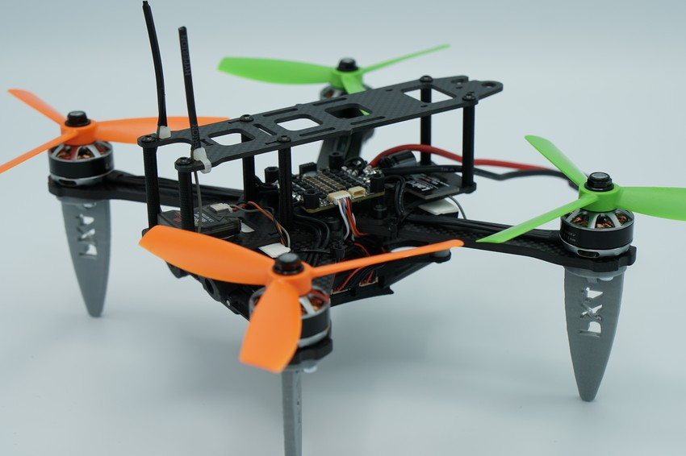
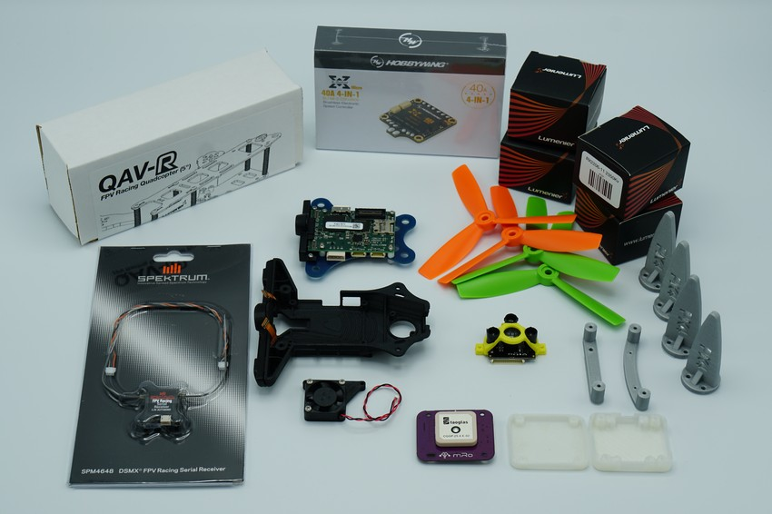
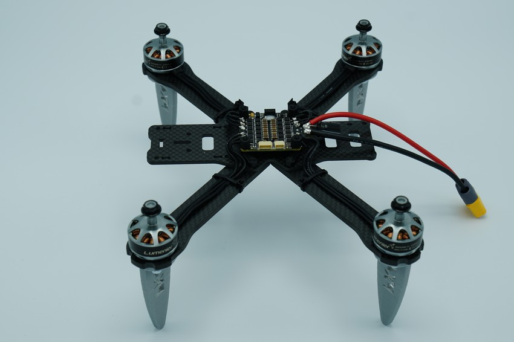
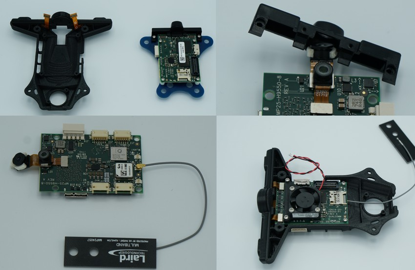
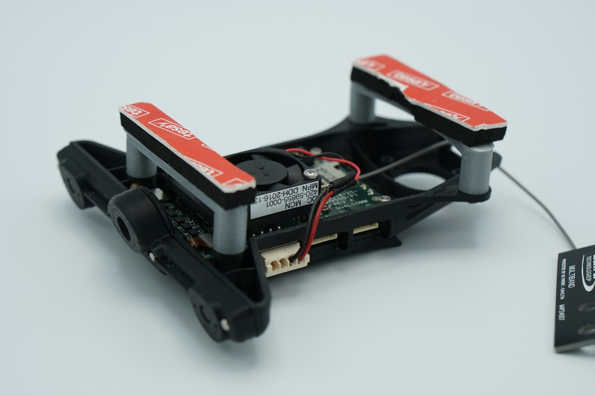
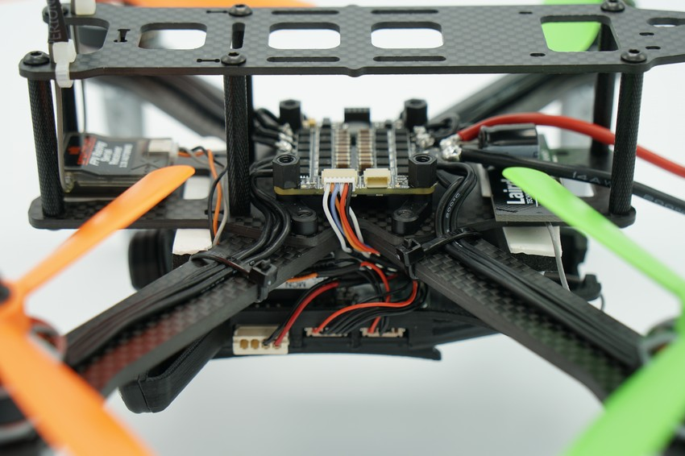

# Snapdragon Hardware Setup Example

> **Note** The *Qualcomm Snapdragon Flight* is discontinued (it has been superseded but PX4 does not yet support the newer version). This documentation is provided for existing users, but will be removed in a future release.

This guide shows a Lumenier QAV-R 250 frame build with *Qualcomm Snapdragon Flight* and custom hardware mounts. The setup uses a conventional PWM ESC board and therefore needs to be built with the `atlflight_eagle_default` make target (see instructions [here](https://dev.px4.io/master/en/setup/building_px4.html#qurt--snapdragon-based-boards)).

> **Tip** The PX4 development team has built, tested and documented this specific setup.

## Components

* Flight Controller: [Snapdragon Flight](https://www.intrinsyc.com/vertical-development-platforms/qualcomm-snapdragon-flight/)
* Stereo-vision add-on kit ([available here](https://www.intrinsyc.com/vertical-development-platforms/qualcomm-snapdragon-flight/))
* Frame: [Lumenier QAV-R 250](https://www.getfpv.com/qav-r-fpv-racing-quadcopter-5.html)
* ESC: [Hobbywing 4in1 40A](https://www.getfpv.com/hobbywing-xrotor-micro-4-in-1-blheli-s-dshot600-esc.html)
* Motors: [Lumenier RX2206 2350KV](https://www.getfpv.com/lumenier-rx2206-11-2350kv-motor.html)
* Receiver: [Spektrum RC FPV Racing Serial Receiver](https://www.spektrumrc.com/Products/Default.aspx?ProdID=SPM4648)
* Wi-Fi Antenna: [Laird Multiband](https://www.lairdtech.com/products/maf95056-nanoblade-internal-embedded-antenna-2400-2500-4900-6000-mhz)
* GPS module (optional): [mRo GPS + Compass module](https://store.mrobotics.io/mRo-GPS-u-Blox-Neo-M8N-HMC5983-Compass-p/gps002-mr.htm)
* Distance sensor (optional): [TeraRanger One](http://www.teraranger.com/product/teraranger-one-distance-sensor-for-drones-and-robotics)
* Distance sensor adapter (required only when using TeraRanger): [I2C Adapter](http://www.teraranger.com/product/adapters-for-oneduo/)
* Custom printed parts: [Legs, Mounting brackets](https://drive.google.com/drive/u/0/folders/1MOunJae4ZLu6-bZ_-JvcPQUc9Aa5fe1U)

## 布线

> **Warning** Although the Snapdragon uses DF13 connectors, the [pinout](../flight_controller/snapdragon_flight.md#pinouts) is different from Pixhawk.

## Building the Frame

The Lumenier QAV-R250 can be assembled normally, ignoring the side-plates intended for the FPV camera mount. In order to mount the motors along with the custom printed legs, you will need longer screws than the ones provided with the motors. Regular M3x10mm screws will do.

> **Warning** Snapdragon is very susceptible to frame vibrations. Make sure to tighten all screws well, but not so much that you damage the windings in the plastic nut on the other end.

The Hobbywing 4in1 ESC fits the frame tidily as seen in the picture below.

To attach the Snapdragon Flight to the frame, first port it over to the stereo-vision add-on kit's mounting plate. This task is quite delicate, make sure not to damage the cameras when taking them out of the old plastic housing. We recommend attaching the WiFi antenna's uFL connector during this step, as it will become incredibly difficult to do so once the Snapdragon is in its new housing.

> **Note** We are using the stereo-vision add-on kit, as it is easier to mount to the QAV-250 and we may be using stereo-vision in the future. However, currently the stereo-functionality is not being enabled.

After the Snapdragon is mounted on the new housing, screw on the two custom printed brackets using the spare M3 screws of the Lumenier frame. Again, since you are putting metal screws into plastic, don't tighten them to the extend that you damage the plastic and the screws no longer have any traction.

Finally, attach the brackets to the frame using double-sided tape. We achieved best performance when using two strips of vibration-dampening foam in between the carbon frame and the custom mounting brackets for the stereo-vision part. Cutting two strips out of the piece provided with the QAV-R frame works well.

You can additionally mount the GPS module and TeraRanger module, but they are not required for normal VIO-based flight. More information about range finders can be found [here](../sensor/rangefinders.md#teraranger-rangefinders). You can now attach the Snapdragon module to the QAV frame and connect the ESC and receiver.

