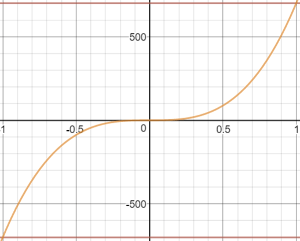

# 特技模式（多旋翼）

&nbsp;&nbsp;

*特技模式*是用于执行特技动作的遥控模式，例如翻转，滚转和环绕。

滚动、俯仰和偏航杆控制围绕相应轴的旋转角速率，并且油门直接传递到输出混合器。 当操纵杆居中时，飞机将停止旋转，但保持其当前朝向（在其侧面，倒置或任何其他方向）并根据当前动量移动。

<!-- image above incorrect: https://github.com/PX4/px4_user_guide/issues/182 -->

## 技术描述

用于执行特技动作的R遥控/手动模式，例如翻转，滚转和环绕。

RPY摇杆输入控制围绕各自轴的角度旋转速率。 当操纵杆居中时，飞机将停止旋转，但保持其当前朝向（不一定是水平）。

## 杆输入映射

特技模式下默认的滚转、俯仰和偏航操纵杆输入映射如下所示。 该曲线使得在最大杆输入处具有大转弯速率能够进行特技动作，在靠近杆回中位置的区域具有较低灵敏度以进行微调。

可以使用[MC_ACRO_EXPO](#MC_ACRO_EXPO)和[MC_ACRO_SUPEXPO](#MC_ACRO_SUPEXPO)“指数”参数调整滚转和俯仰轴杆输入响应，同时使用[MC_ACRO_EXPO_Y](#MC_ACRO_EXPO_Y)和[MC_ACRO_SUPEXPOY](#MC_ACRO_SUPEXPOY)调整偏航轴杆输入响应 。 ` MC_ACRO_EXPO `和` MC_ACRO_EXPO_Y `参数用于调整线性曲线和三次曲线之间的曲线，如下所示。 `MC_ACRO_SUPEXPO`和`MC_ACRO_SUPEXPOY`允许进一步调整曲线形状，修改低灵敏度区域的宽度。

 

:::note
数学关系是：

$$\maintm{y} = r(f\cdot x^3 + x(1-f)) (1-g)/(1-g|x|)$$, 其中 `f = MC_ACRO_EXPO` 或 `MC_ACRO_EXPO_Y`，`g = MC_ACRO_SUPEXPO` 或 `MC_ACRO_SUPEXPOY` 和 `r` 为最大速率。

您可以在[此处](https://www.desmos.com/calculator/yty5kgurmc)进行试验。
:::

## 参数

| 参数                                                                                                        | 描述                                                                                                                       |
| --------------------------------------------------------------------------------------------------------- | ------------------------------------------------------------------------------------------------------------------------ |
| [MC_ACRO_EXPO](../advanced_config/parameter_reference.md#MC_ACRO_EXPO)         | 特技模式“指数”因子，用于调整滚转和俯仰轴的杆输入曲线形状。 值：0表示纯线性输入曲线，1表示纯三次输入曲线。 默认：0.69                                                          |
| [MC_ACRO_EXPO_Y](../advanced_config/parameter_reference.md#MC_ACRO_EXPO_Y)     | 特技模式“指数”因子，用于调整偏航轴的杆输入曲线形状。 值：0表示纯线性输入曲线，1表示纯三次输入曲线。 默认：0.69                                                             |
| [MC_ACRO_SUPEXPO](../advanced_config/parameter_reference.md#MC_ACRO_SUPEXPO)   | 特技模式“超级指数”因子，用于精细调整滚动轴和俯仰轴的杆输入曲线形状（使用`MC_ACRO_EXPO`进行调整）。 值：0——纯指数函数，0.7——合理增强直观操纵感的形状，0.95——非常弯曲的输入曲线，仅在最大值附近有效。 默认：0.7 |
| [MC_ACRO_SUPEXPOY](../advanced_config/parameter_reference.md#MC_ACRO_SUPEXPOY) | 特技模式“超级指数”因子用于精细调整偏航轴的杆输入曲线形状（使用`MC_ACRO_EXPO_Y`进行调整）。 值：0——纯指数函数，0.7——合理增强直观操纵感的形状，0.95——非常弯曲的输入曲线，仅在最大值附近有效。 默认：0.7    |
| [MC_ACRO_P_MAX](../advanced_config/parameter_reference.md#MC_ACRO_P_MAX)       | 最大特技俯仰速率 默认：每秒2转（720度/秒）                                                                                                 |
| [MC_ACRO_R_MAX](../advanced_config/parameter_reference.md#MC_ACRO_R_MAX)       | 最大特技滚转速率 默认：每秒2转（720度/秒）                                                                                                 |
| [MC_ACRO_Y_MAX](../advanced_config/parameter_reference.md#MC_ACRO_Y_MAX)       | 最大特技偏航速率 默认： 1.5转每秒（540度/秒）                                                                                              |